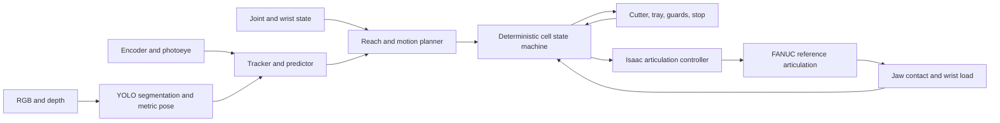

# Scene 2.0 design gate

Status: scene and articulation gate implemented, pipeline integration in progress

Date: 2026-08-26

Interactive engineering report: `SCENE_DESIGN_REPORT.html`

## Decision

Use the FANUC M-10iD/12 Food Grade as the baseline six-axis robot for the rebuilt Isaac Sim cell.

This is the best current balance for the defined task:

- 12 kg wrist payload
- 1441 mm reach
- six controlled axes
- high joint speeds for conveyor interception
- a food-grade commercial variant
- an official FANUC ROS 2 description and mesh package for the `m10_12-14d` model

The official FANUC description has been imported into Isaac Sim and converted to a project-owned USD reference. The imported model retains the official description joint axes and limits, visual and collision meshes, masses, and inertias. Isaac Sim initializes and drives all six joints. The complete scene has passed stage contents, rendered RGBD, controller motion, joint-limit, save, and reload gates. Full perception and task-state integration remains T016.

The imported description is a kinematic and visual reference. It does not prove that the simulated color, surface finish, cabling, food-grade package, controller dynamics, or collision geometry are OEM accurate. Those distinctions must remain visible in the stage metadata and reports.

## Alternative considered

The Stäubli TX2-90L HE is a strong alternative when hygienic design and washdown are the dominant requirements. It offers a 12 kg payload, 1200 mm reach, an HE humid-environment option, IP65 and IP67 protection, and H1 lubricants. It is not the initial choice because the shorter reach gives less layout margin and there is no current validated Isaac Sim asset for this exact model.

The built-in Isaac Sim UR10e is useful as an integration reference, but it is not the selected production-oriented baseline. Substituting it would make the simulator easier to assemble while weakening the connection to the intended food cell.

## Payload budget

The maximum current product mass is 3.2 kg. The provisional wrist budget is:

| Item | Provisional mass |
| --- | ---: |
| Product | 3.2 kg maximum |
| Compliant gripper and fingers | 3.5 kg estimate |
| Flange, cabling, and wrist sensing | 0.5 kg estimate |
| Total working estimate | 7.2 kg |
| Remaining nominal payload margin | 4.8 kg |

The gripper and sensor masses are unresolved physical parameters. The robot choice must be revisited if their measured total exceeds this budget or if the center of gravity and wrist inertia violate the FANUC wrist limits.

## Cell layout

The source conveyor remains the only moving transport at the robot. The cutter entrance is a stationary tray. The cutter owns any motion after the robot releases the product.

Proposed world coordinates, in meters:

| Element | Center or origin | Purpose |
| --- | --- | --- |
| Source conveyor | X from -1.80 to 1.20, Y 0.00, belt Z 0.80 | Moves separated products at the configured speed |
| Valid observation zone | X from -1.20 to -0.35 | Provides enough history for tracking and prediction |
| Nominal pick window | X from -0.10 to 0.60, Y within 0.25 | Bounded line-tracking intercept region |
| Robot base | X 0.40, Y -0.75, pedestal top Z 0.45 | Keeps the base outside the product path |
| Cutter-entry tray | X 1.35, Y 0.00, surface Z 0.85 | Stationary release target |
| `cut_target_frame` | Tray center at the recipe release height | Required product pose before release |
| Reject bin | X 0.25, Y -1.45 | Receives recoverable failed picks |
| Camera crossbar | Above the observation and pick zones | Holds the fixed RGB and depth sensors |

These coordinates fit the nominal pick window and stationary tray inside the 1.441 m reach envelope with at least 0.16 m of simple radial margin at the checked corner and tray points. Radial distance is only a screening check. This is not yet a verified inverse-kinematic or collision-free layout.

## End effector

The current 175 mm opening is too small for the 200 mm maximum pork width. Scene 2.0 uses a clearly labeled specialized compliant gripper reference with:

- at least 240 mm clear opening
- two symmetric driven jaws
- wide removable contact pads
- 20 mm provisional compliant travel per side
- measured jaw position
- commanded force limit
- contact reporting on each jaw
- a grip quality estimate based on closure, contact, and wrist load
- slip detection from product pose change relative to the tool

The fixed grasp joint may remain as a bounded hold approximation after bilateral contact is confirmed. The report must continue to state that this does not reproduce tissue deformation, wet friction, adhesion, pressure distribution, or food-safe physical performance.

## Sensor set

The baseline avoids unnecessary sensors. It uses the minimum set needed to make the control problem observable and testable.

### Fixed overhead vision

- one global-shutter RGB camera model at 60 frames per second
- one registered depth stream at 30 frames per second
- real intrinsics, clipping range, exposure, and mount transforms in configuration
- simulated lens distortion, shot noise, depth noise, missing depth, timestamp jitter, and pipeline latency
- a replaceable YOLO segmentation interface on RGB
- depth back-projection for metric position and planar orientation

The camera mount stays off the robot. This avoids changing the view during interception and removes wrist-camera mass from the baseline payload.

### Motion and contact sensing

- conveyor encoder with timestamped belt position and speed
- entry photoeye for an independent presence event
- six-axis robot joint position and velocity feedback
- jaw position, command, and contact on both fingers
- a six-axis wrist force and torque reference sensor
- simulated guard, emergency-stop, tray-clear, and cutter-ready signals

The wrist force and torque sensor is used for grasp confirmation, collision monitoring, and slip evidence. It is not a safety-rated sensor in this simulation.

## Communication boundary

The camera pipeline publishes observations. It does not command the robot. The deterministic controller owns tracking, prediction, target reservation, trajectory generation, state transitions, and recovery. The simulated PLC owns line permissives and the cutter handshake.

## Implementation gates

Each gate must pass before the next one starts.

1. Import the official FANUC description into Isaac Sim and save a project-owned USD.
2. Verify six revolute joints, joint axes, limits, masses, fixed base, stage save and reload, and deterministic joint sweeps.
3. Place the robot, belt, tray, reject bin, guards, and named frames. Check reach and self-collision at representative poses.
4. Add the compliant gripper reference. Check opening, bilateral contact, force limits, attachment, and release.
5. Add the fixed RGB and depth camera models, encoder, photoeye, wrist sensor, and PLC attributes. Check publication rates, timestamps, calibration, noise, and nonempty outputs.
6. Run a collision-free dry motion from home to pick, tray, reject, and home without a product.
7. Run one contact-confirmed pick and stationary tray release using simulator state.
8. Reconnect YOLO, tracking, prediction, interception, recovery, and the complete test matrix.

## Acceptance criteria for the scene gate

- The saved USD visibly contains the selected robot, gripper, belt, product references, tray, cutter reference, guards, reject bin, sensor mounts, lights, and named frames.
- The robot is controlled through an actual Isaac articulation controller.
- Every robot joint reports and respects its configured position and velocity limits.
- The pick window and tray have verified reachable poses with clearance.
- RGB and depth are rendered from the fixed physical camera prims.
- Encoder, photoeye, wrist load, jaw contact, PLC, and safety states are timestamped on the same simulation clock.
- The stage saves, reloads, and replays deterministically under the documented tolerance.
- No asset is described as more accurate than its source supports.

## Sources

- FANUC M-10iD/12 product page: https://www.fanucamerica.com/products/robot/m-10id-12
- FANUC M-10iD/12 Food Grade data sheet: https://www.fanucamerica.com/docs/default-source/default-document-library/m-10id-12-food-grade-data-sheet.pdf
- Official FANUC robot descriptions: https://github.com/FANUC-CORPORATION/fanuc_description
- Official FANUC supported model mapping: https://fanuc-corporation.github.io/fanuc_driver_doc/v1.3.0/docs/environment/supported_models.html
- Stäubli food robotics brochure: https://www.staubli.com/content/dam/robotics/industries/food/food-brochure-EN.pdf
- NVIDIA Isaac Sim 6.0 robot assets: https://docs.isaacsim.omniverse.nvidia.com/6.0.0/assets/usd_assets_robots.html
