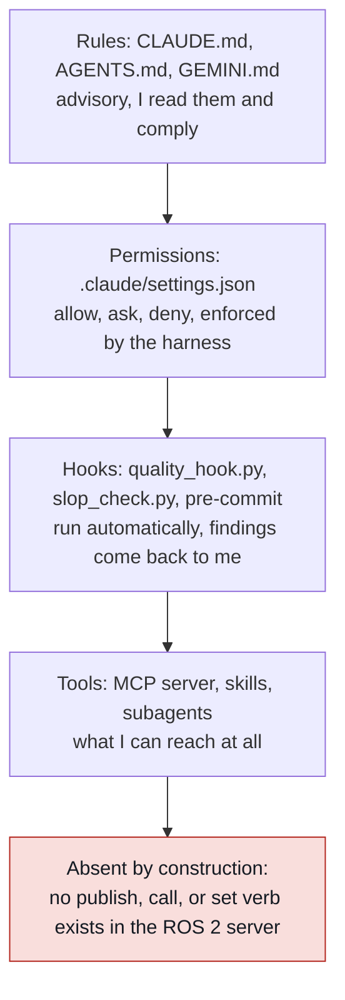

# Our Claude Code setup

What is configured on this machine, why each piece exists, how to check it is
live, and how to extend it. For the product's features in general see
[Claude Code](claude-code.md); for how to work day to day see
[How to work with coding agents](../topics/how-to-work-with-agents.md).

## What it is

Four layers, from advisory to absolute. A rule I can read and choose to follow
is the weakest; a tool that does not exist is the strongest.



The red box is the one that holds when everything else fails. A deny rule can be
edited; a verb that was never written cannot be invoked. This is the same
argument as the deterministic shield in
[Safety for learned policies](../topics/safety-for-learned-policies.md), applied
to the agent rather than to the policy.

## Why it matters in the field

On a customer site the failure that ends an engagement is not a bad suggestion,
it is a command that moved a robot while somebody had a hand in the cell. The
setup below is built so that the agent can see everything about a running robot
and command none of it.

## Layer 1: rules

| File | Scope | Read by |
|------|-------|---------|
| `~/.claude/CLAUDE.md` | every project | Claude Code |
| `CLAUDE.md` | this repository | Claude Code |
| `AGENTS.md` | this repository | Codex CLI and most other agents |
| `GEMINI.md` | this repository, symlink to `AGENTS.md` | Gemini CLI |
| `IDENTITY.md` | this repository | all of them, first |

`CLAUDE.md` is canonical. After editing it run `bin/sync-rules`, which
regenerates `AGENTS.md` so the other harnesses do not drift. `bin/boot` prints
the whole identity for a harness that loads nothing automatically.

## Layer 2: permissions

`.claude/settings.json` is committed, so it binds anyone who clones the repo.
Three lists, checked in order deny, ask, allow.

| List | Holds | Behaviour in bypass mode |
|------|-------|--------------------------|
| `deny` | actuation verbs, `sudo`, force push, writes to `/opt/ros` and `/etc` | still blocks |
| `ask` | `ros2 launch`, `ros2 run`, `bag record`, controller switching, `git push`, installs | prompt is skipped |
| `allow` | read-only inspection, git read and commit, the test and build commands | no prompt |

The distinction matters. Bypass permissions mode skips prompts, so an `ask` rule
protects nothing when that mode is on, while `deny` still holds. Everything that
can move a joint is therefore in `deny`, not `ask`:
`ros2 topic pub`, `ros2 service call`, `ros2 action send_goal`, `ros2 param set`,
`ros2 param load`, `ros2 lifecycle set`.

`ros2 launch` and `ros2 run` sit in `ask` because they are also how you start
rviz, a bag player, or a simulator. **When a real robot is on the network, move
both to `deny`** and start bringup yourself. That is a one-line edit and it is
the right call for a plant.

## Layer 3: hooks

| Hook | Event | What it does |
|------|-------|--------------|
| `tools/slop_check.py` | PostToolUse on Write and Edit, user settings | Flags em-dashes, banned words, emoji, filler openers |
| `tools/quality_hook.py` | PostToolUse on Write and Edit, project settings | Runs ruff format and lint on Python; checks note front matter |
| `.githooks/pre-commit` | `git commit` | Blocks a commit that adds slop to any staged Markdown |
| impeccable | PostToolUse and Stop, `settings.local.json` | Design checks on UI files |

The hooks exit 2 with findings on stderr, which feeds them back to the agent to
fix in the same turn rather than at review time. The front matter check earns its
place because a note without front matter still builds into the manual, titled
from its filename and marked draft, and nobody notices for a week.

The git hook is the one that works in every harness, including a local model on
another machine, because it lives in the repository rather than in any agent's
configuration. `git config core.hooksPath .githooks` is already set here; a fresh
clone needs that line run once.

## Layer 4: tools

### The ROS 2 MCP server

`tools/ros2_mcp_server.py`, registered in `.mcp.json` as `ros2`. It speaks MCP
over stdio as line-delimited JSON-RPC 2.0 with no third-party dependencies, so it
runs under the system Python that ships with the ROS distribution instead of
needing a virtualenv on the robot.

Thirteen tools, all read-only: topic list, info, echo, and hz; node list and
info; param list and get; service and action list; interface show; bag info; and
`ros2 doctor`. Every call goes through an allowlist of `ros2` subcommand
prefixes. There is no publish, call, send_goal, or set verb anywhere in the file,
and a test asserts that each of those is refused.

Two details worth knowing. It unsets `PYTHONPATH` before sourcing the setup
script, because a conda environment on the caller's path otherwise shadows
`rclpy` (the same trap recorded in [ROS 2 Humble](ros2-humble.md)). And it
captures partial output on timeout, because `ros2 topic hz` never exits on its
own and Humble's `ros2 topic echo` has no `--times` flag, so the timeout is the
normal path rather than an error.

Verified against a live graph on 2026-09-08: a `demo_nodes_cpp` talker was
started, `ros2_topic_echo` returned a real message, and `ros2_topic_hz` measured
1.000 Hz, which is that node's publish rate.

### Skills

Procedures, invoked with a slash. `ask`, `brief`, `research-pass`, `retro`,
`inbox`, plus `impeccable` for design work. Each is a `SKILL.md` under
`.claude/skills/`. A skill is the right home for anything done more than twice
the same way.

### Subagents

Fresh contexts with their own brief, under `.claude/agents/`.

| Agent | Use for |
|-------|---------|
| `note-writer` | One library note from primary sources |
| `paper-reader` | One paper entry from full text, with reimplementation detail |
| `ros2-reviewer` | Review robot-facing code, safety findings first |

They exist because the same 400-word brief was being retyped for every research
pass. A subagent also keeps the caller's context clean: the agent reads fifty
pages and returns five lines.

## Checking it is live

```bash
claude mcp list                      # ros2 should be connected, not pending
bin/boot | head -5                   # identity prints
cd tools && env -u PYTHONPATH /home/flux/miniconda3/envs/rll/bin/pytest -q
echo '{"tool_input":{"file_path":"/path/to/file.md"}}' | python3 tools/quality_hook.py
```

A newly written `settings.json` is not picked up by a session that started before
it existed. Restart, or open `/hooks` once, and the hook fires from then on.

## Practical gotchas

- A project MCP server needs approval on first use. `enableAllProjectMcpServers`
  in project settings covers it from the next start.
- `~/.claude/settings.json` pins a model. A `/model` change writes to that file,
  so the pin and the picker agree; if they ever disagree, the file wins on restart.
- The pre-commit hook rejected one of my own commits for em-dashes in
  `memory/MEMORY.md`. That is the hook working, not a bug.
- Hooks that shell out add a process per edit. Keep them under a second, or the
  edit loop drags.

## What a forward-deployed engineer must be able to do

- Say which of the four layers stops a given mistake, and which of them an agent
  can talk its way past.
- Move `ros2 launch` and `ros2 run` to `deny` before a robot is on the network.
- Read `.mcp.json` and know what the agent can and cannot reach.
- Add a skill when a procedure repeats, and a subagent when a brief repeats.
- Run the checks above after cloning onto a new machine.

## Open questions to learn hands-on

- Does the read-only server cover what is actually needed at a bring-up, or does
  a tf lookup and a controller-state reader need adding.
- Whether the same server should run on the robot and be reached over the network,
  or run on the laptop against a shared `ROS_DOMAIN_ID`.
- What a useful bag-triage tool looks like: message gaps, timestamp jumps, dropped
  frames, as a single call rather than five.

## Related entries

- [Claude Code](claude-code.md): the product's features in general.
- [How to work with coding agents](../topics/how-to-work-with-agents.md): the eight-lesson course.
- [Safety for learned policies](../topics/safety-for-learned-policies.md): the shield pattern this copies.
- [ROS 2 in depth](../topics/ros2-in-depth.md): QoS, executors, and the PYTHONPATH trap.

## Sources

- MCP specification, JSON-RPC over stdio: https://modelcontextprotocol.io/specification
- Claude Code settings and permissions: https://code.claude.com/docs/en/settings
- Claude Code hooks: https://code.claude.com/docs/en/hooks
- Claude Code MCP configuration: https://code.claude.com/docs/en/mcp
- Verified in this repository: `tools/ros2_mcp_server.py`, `tools/quality_hook.py`,
  `.claude/settings.json`, `.mcp.json`, `.githooks/pre-commit`, and their tests.
