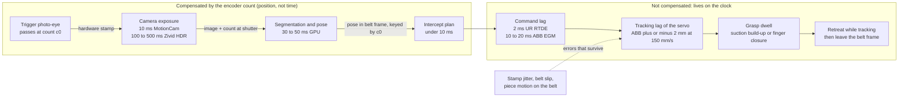

# Conveyor tracking and visual servoing for pick-on-the-fly into a fixture

## What it is

Grasping an object that is moving on a belt and placing it into a fixture whose tolerance is set
by the next machine. Four coupled parts: a sensing chain that produces an object pose with a known
timestamp, a tracker that predicts where the object will be, an intercept planner that puts the
tool there at belt speed with time left to close the gripper, and an alignment stage that measures
the piece in hand and corrects before release. Vendor controllers ship the first three for rigid
parts. The kinematics note gives the belt frame, the constant-speed meeting-time quadratic and the
four phases (predict, meet, match velocity, act)
([kinematics-dynamics-and-rotations](kinematics-dynamics-and-rotations.md)); this note starts
where it stops: latency, uncertainty, vendor implementations, and a wet deformable object.

## Why it matters (the meat cell)

The assignment cell ([meat-cutting-automation](meat-cutting-automation.md)) is judged on the
placement error distribution at the cutter infeed, because millimetres of alignment are yield.
At 300 mm/s, 1 ms of unmodelled delay is 0.3 mm; a 250 ms capture stamped at the wrong instant is
75 mm, and the pick lands behind the piece (snippet check 2). A deformable object adds two errors
a rigid part does not have: it can move relative to the belt after the image (wet belt, air knife,
vibration), and it moves relative to the gripper during the grasp, so the pose that reaches the
cutter is not the pose that was measured. Both are budgeted and both are measured.

## Sensing chain and latency budget



Everything inside the first box is paid for in belt distance, not in time: the encoder count at
the photo-eye is recorded in hardware, and the pose from the image is expressed in the belt frame
using the count at the shutter, not the count when the pose arrives ([ABB Conveyor Tracking manual
3HAC050991-001](https://search.abb.com/library/Download.aspx?DocumentID=3HAC050991-001&LanguageCode=en&DocumentPartId=&Action=Launch),
section 1.4; snippet function `stamp_object`). The camera can take 500 ms if the belt between
camera and pick zone is long enough. What remains on the clock, command lag, servo tracking error
and grasp dwell, sets the pick position uncertainty.

The pick-time position uncertainty combines four terms. Stamp jitter times belt speed: under
0.1 ms with a hardware sync input; up to a frame, 33 ms or 10 mm at 300 mm/s, with a software
timestamp on a 30 Hz camera (the 5 to 30 ms USB skew between cameras on one host is measured by
[Chef Robotics](https://www.chefrobotics.ai/post/latency-aware-vision-language-action-models-vlas-with-system-identification-for-real-time-robot-control)).
Pose estimation error on the piece itself (from the perception bench, product-specific).
Tracking error of the arm: ABB specifies plus or minus 2 mm of the path at 150 mm/s in automatic
mode, "whether the conveyor is in motion or not", degrading above 500 mm/s
([ABB manual](https://search.abb.com/library/Download.aspx?DocumentID=3HAC050991-001&LanguageCode=en&DocumentPartId=&Action=Launch),
section 1.2). Motion of the piece relative to the belt between image and pick, which no encoder
sees and which the verification camera measures after the fact. Add them in quadrature only if
they are independent; the last one is not Gaussian on meat and should be reported as a
distribution, not a sigma. Measure each stage with the QR-code clock and commanded-step methods
in [connecting-to-real-robots](connecting-to-real-robots.md); the per-stage targets are in the
meat note's latency table.

## Tracking

The belt model is one-dimensional along the belt axis: travel s(t) and speed v(t), with the
encoder count the measurement. ABB's recommendation is 1,250 to 2,500 encoder pulses per metre,
which quadrature decoding turns into 5,000 to 10,000 counts per metre; below 5,000 accuracy
drops and above 10,000 robot and cell calibration dominate. At 10,000 counts per metre the
encoder interface reports zero speed below 40 counts per second (4 mm/s) and loses counts above
20,000 per second (2,000 mm/s)
([ABB manual](https://search.abb.com/library/Download.aspx?DocumentID=3HAC050991-001&LanguageCode=en&DocumentPartId=&Action=Launch),
section 3.2). UR decodes up to 40 kHz on digital inputs 0 to 3, quadrature or single-channel edge
modes ([UR wizard guide](https://www.universal-robots.com/articles/ur/application-installation/conveyor-tracking-with-wizard/)).

Slip and stretch. The encoder measures the drive shaft, not the piece. ABB's manual says the belt
"will stretch or flex over the distance from the drive unit to the robot cell" and recommends
mounting the encoder close to the cell, on the conveyor side of any clutch, with a flexible
coupling and never a rubber hose
([ABB manual](https://search.abb.com/library/Download.aspx?DocumentID=3HAC050991-001&LanguageCode=en&DocumentPartId=&Action=Launch),
section 3.2.1). Product slip on a wet belt is quantified by no vendor (unverified; the tracking
bench in the meat note measures it as predicted minus re-observed position).

Kalman filtering. The vendor interfaces low-pass the speed: ABB's encoder speed filter is a
second-order IIR at 10 Hz, raised to 10 to 15 Hz for stop-and-go conveyors
([ABB manual](https://search.abb.com/library/Download.aspx?DocumentID=3HAC050991-001&LanguageCode=en&DocumentPartId=&Action=Launch),
sections 3.6 and 7.2). Building it yourself, the right shape is a two-state Kalman filter on
(s, v) with a constant-velocity process model, acceleration noise set from how hard the belt can
change speed, and one-count quantisation as measurement noise
([Kalman 1960](https://doi.org/10.1115/1.3662552); `BeltEstimator` in the snippet). Its
innovation is the encoder glitch detector: a count jump that the model cannot explain is gated
out and logged rather than integrated. Time is derived from integer counts, never accumulated in
float32 ([numeric hygiene](kinematics-dynamics-and-rotations.md#numeric-hygiene)).

When is vision re-observation worth it. Encoder tracking is look-then-move; one image fixes the
piece in the belt frame and everything after is dead reckoning. Re-observing from a second camera
over the pick zone earns its cost when the piece moves relative to the belt by more than the
placement tolerance between the two views. The test is direct: log predicted versus re-observed
position for 200 pieces; if the 95th percentile of the difference is inside the cutter's window,
dead reckoning is enough and the second camera becomes the verification camera; if not, the
second camera feeds the tracker (a second measurement update in the belt frame) or a servoing
loop. ABB applies the same idea to belt speed: a PLC signal before a ramp lets the controller
predict it instead of filtering it (chapter 11 of the manual).

## Interception planning

Meet point selection. The vendor abstractions are a start window and a maximum distance: objects
are tracked from the sync switch, become available for connection once inside the start window,
are skipped if they pass it before the robot can connect, and the robot drops tracking when the
object reaches the maximum distance or leaves the work area
([ABB manual](https://search.abb.com/library/Download.aspx?DocumentID=3HAC050991-001&LanguageCode=en&DocumentPartId=&Action=Launch),
section 1.4, parameters `StartWinWidth`, `QueueTrckDist`, maximum and minimum distance). Choose
the meet point as early in the window as the arm can reach it, so the rest of the window is
margin for the dwell and for a retry, and keep it away from the stretched-arm region where the
belt direction runs through a singularity
([kinematics note](kinematics-dynamics-and-rotations.md#jacobians-and-singularities)). The
snippet's `plan_intercept` iterates the meet time to a fixed point: the object is where it will
be when the arm arrives, and the arm's travel time depends on where that is.

Velocity matching. On entering tracking the robot has to catch up to belt speed; ABB exposes that
ramp as the "adjustment speed" and "adjustment accel" parameters and limits the servo's external
position adjustment to 0.2 m by default (error 50163 when exceeded)
([ABB manual](https://search.abb.com/library/Download.aspx?DocumentID=3HAC050991-001&LanguageCode=en&DocumentPartId=&Action=Launch),
sections 5.12 and 7.4). KUKA.ConveyorTech does the same "on the fly" between synchronised and
unsynchronised program sections
([KUKA](https://www.kuka.com/en-de/products/robot-systems/software/hub-technologies/kuka-conveyortech)).
In a custom controller the approach is planned in the belt frame, where the piece is stationary,
and the belt velocity is added back at the joint level.

Time-optimal approach. Ruckig computes a jerk-limited, time-optimal trajectory from any state to
a target state with non-zero target velocity and acceleration, for control cycles down to
500 microseconds; the community version enforces velocity, acceleration and jerk limits, the Pro
version adds position limits ([Ruckig](https://github.com/pantor/ruckig)). Set the target
velocity to the belt velocity expressed in the arm's coordinates and the arm arrives already
matched. The snippet's `move_time` uses a rest-to-rest trapezoid plus a ramp to belt speed, which
is slower than Ruckig's answer and therefore safe as a feasibility check.

Dwell. Vacuum build-up or finger closure happens while the arm keeps tracking, so the dwell
consumes window length at belt speed (150 ms at 300 mm/s is 45 mm). No cup vendor publishes a
build-up time for a wet irregular surface; measure it from the vacuum switch on the customer's
product (unverified until measured). `plan_intercept` rejects a meet point whose dwell would end
outside the window.

Retreat. Lift while still in the belt frame so the piece is not dragged across the belt, then
leave tracking: ABB's `DropWObj` (a `WaitWObj` right after it may need a 0.1 s wait, manual
section 1.2), UR's `stop_conveyor_tracking()`
([UR programming guide](https://www.universal-robots.com/articles/ur/programming/new-conveyor-tracking-guide-cb3-38-and-e-series-52/)).

## Vendor tracking features

| Vendor, product | Encoder and trigger | Camera | Queue and multi-robot | Documented accuracy | Source |
|---|---|---|---|---|---|
| ABB Conveyor Tracking, DSQC2000 CTM; PickMaster 3 adds vision and 1 to 6 work areas | 4 encoder inputs, 8 camera or sync channels with 24 V trigger outputs; 1,250 to 2,500 pulses/m; speed filter 10 Hz IIR | Camera trigger from the CTM; pulse width rule in the meat note | 254 objects per queue; several work areas can share one encoder on a DSQC2000 ("two robots picking objects from the same conveyor", sections 3.3 and 5.16); speed and position distributed to all controllers over the network | Plus or minus 2 mm at 150 mm/s; degrades above 500 mm/s | [manual](https://search.abb.com/library/Download.aspx?DocumentID=3HAC050991-001&LanguageCode=en&DocumentPartId=&Action=Launch) |
| Universal Robots, Conveyor Tracking node and URScript | Incremental on DI 0 to 3 at up to 40 kHz (quadrature, or single input rising, falling, or both edges); absolute over Modbus register; `encoder_enable_pulse_decode`, `encoder_get_tick_count`, `track_conveyor_linear(direction, ticks_per_meter)`, `track_conveyor_circular`, `stop_conveyor_tracking` | None built in; a URCap or external vision must write the object position | No object queue in the base function; one tracked frame at a time | None published; CB3 3.8 or e-Series 5.2 minimum | [programming guide](https://www.universal-robots.com/articles/ur/programming/new-conveyor-tracking-guide-cb3-38-and-e-series-52/), [wizard guide](https://www.universal-robots.com/articles/ur/application-installation/conveyor-tracking-with-wizard/) |
| FANUC iRPickTool with Line Tracking | Encoder through the controller's line tracking interface | iRVision integration for vision tracking (from the product family; details unverified) | Linear and circular conveyors, trays and fixed stations, "load balancing across multiple robots" | None published | [FANUC](https://www.fanucamerica.com/products/software/robot/irpicktool) |
| KUKA.ConveyorTech (KR C5) | Encoder per conveyor; linear and circular; six-dimensional sources (AGVs) via PLC | KUKA.VisionTech separately (unverified) | Up to 5 conveyors, 1,024 parts per conveyor; synchronous robot and conveyor stop on a stop request; linear units couple to the belt via the EO driver | None published | [KUKA](https://www.kuka.com/en-de/products/robot-systems/software/hub-technologies/kuka-conveyortech) |
| Yaskawa Conveyor Synchronized function, MotoSight 2D | Encoder to the controller's conveyor tracking board (unverified) | MotoSight 2D is a Cognex-based 2D vision option (unverified) | Not fetched | Not found; vendor pages returned 404 on 2026-09-06 | (unverified) |
| Epson RC+ Conveyor Tracking option | Encoder via a PG board; vision or sensor triggered (unverified) | Vision Guide option (unverified) | Not fetched | Not found; product pages not reachable on 2026-09-06 | (unverified) |
| Stäubli VAL 3 conveyor tracking add-on | Encoder to the CS9 controller (unverified) | Via VAL 3 vision add-ons (unverified) | JBT Marel's DSI Dual Robotic Harvester runs two Stäubli TS2-60 HE at 240 picks/min ([JBT Marel](https://jbtmarel.com/en/products/dsi-dual-robotic-harvester-automated-meat-processing/)) | Not found; staubli.com returned 403 on 2026-09-06 | (unverified) |

Three vendors publish an accuracy number: ABB (above), Mitsubishi CR800 tracking, "approximately
±1 mm" at the handling position at about 300 mm/s
([manual BFP-A3520-B](https://eu-assets.contentstack.com/v3/assets/blt5412ff9af9aef77f/bltd4e63e1a1679c64f/61726c56ca617d08ba764819/9a9dd449-a575-11ea-bd9a-b8ca3a62a094_CR800_Controller_-_Tracking_function_Instruction_Manual_bfp-a3520b.pdf),
table 3-1), and Omron TM conveyor tracking, "average precision ±1 mm" under 300 mm/s, stated as
reference only ([manual I853-E-03](https://files.omron.eu/downloads/latest/manual/en/i853_tm_conveyor_tracking_users_manual_en.pdf?v=2)).
Corrected 2026-09-15; the earlier text said only ABB publishes one. Use the vendor tracker when the
arm is ABB, FANUC or KUKA; fill the Yaskawa, Epson and Stäubli rows from the customer's manuals if
that is the arm.

## Doing it in ROS 2

There is no conveyor tracking package in ROS 2; the pieces exist and the assembly is yours.

Encoder. A `ros2_control` Sensor component exposes state interfaces only and is read in the
controller manager's real-time loop, whose `update_rate` is mandatory and whose main thread asks
for `SCHED_FIFO` priority 50; the docs want an RT-patched or low-latency kernel because the stock
kernel "is not well suited for hardware control"
([hardware components](https://control.ros.org/humble/doc/ros2_control/hardware_interface/doc/hardware_components_userdoc.html),
[controller manager](https://control.ros.org/humble/doc/ros2_control/controller_manager/doc/userdoc.html)).
Expose `belt/position` in metres and `belt/velocity` from the filter above; a broadcaster
controller publishes the `belt` frame as a TF child of the robot base, translated by the travel,
following REP 103 naming ([kinematics note](kinematics-dynamics-and-rotations.md#transforms-and-frames)).
The trigger input must be timestamped in the same loop, or better latched in hardware, because a
trigger read through a topic callback carries the executor's jitter.

Targets. The vision node publishes the object pose once, in the `belt` frame, keyed by the
trigger count; consumers call `lookup_transform` into the base frame at the time they need and
tf2 does the belt travel. Only the broadcaster sees belt speed, which is what lets a dataset
recorded at one speed transfer to another.

Controller. Two options. MoveIt Servo in `PoseStamped` mode drives the tool toward a pose that is
re-published every cycle from the tracked object; its defaults are a 10 ms publish period, a
100 ms incoming command timeout, collision checking at 10 Hz, a Butterworth smoothing plugin,
and singularity scaling between condition numbers 17 and 30
([servo_parameters.yaml](https://github.com/moveit/moveit2/blob/main/moveit_ros/moveit_servo/config/servo_parameters.yaml)).
It was built for jogging and teleoperation, so it adds smoothing and a hop through ROS
transport, and the 10 Hz collision check is a stall risk when the belt moves the target through
the collision margin. The alternative is a custom Cartesian controller inside `ros2_control` that
reads `belt/position` and the joint states in the same cycle, runs the intercept plan in the belt
frame, filters through Ruckig with the belt velocity as target velocity, and writes joint
positions to the vendor driver at the driver rate: 500 Hz over RTDE on UR, 250 Hz EGM on ABB
([connecting-to-real-robots](connecting-to-real-robots.md)). At 300 mm/s a 100 Hz target update
moves the goal 3 mm per tick, so the joint loop interpolates between ticks; the vision update
(10 to 30 Hz) and the tracking loop never share a thread.

## Visual servoing

Closed-loop control from image measurements, as opposed to look-then-move. The classical law is
v_c = -λ L^+ e, with e = s - s* the feature error, L the interaction matrix from camera velocity
to feature velocity (for an image point (x, y) at depth Z the first row is
(-1/Z, 0, x/Z, xy, -(1+x²), y)), and λ a gain giving exponential decoupled error decrease
([Chaumette and Hutchinson 2006](https://doi.org/10.1109/mra.2006.250573),
[ViSP IBVS tutorial](https://visp-doc.inria.fr/doxygen/visp-daily/tutorial-ibvs.html)).
Image-based (IBVS) servos on image features, tolerates calibration error, and can command odd
Cartesian paths; position-based (PBVS) servos on a reconstructed pose, gives straight paths, and
depends on the pose estimate; the 2007 sequel covers hybrids
([Chaumette and Hutchinson 2007](https://doi.org/10.1109/mra.2007.339609)). Eye-in-hand outputs
camera velocity directly (`vpServo::EYEINHAND_CAMERA`); eye-to-hand needs the camera-to-base and
base-to-tool Jacobians (`EYETOHAND_L_cVe_eJe` variants). On the belt, eye-to-hand over the pick
zone plus the encoder is the usual layout; a hand camera sees the piece only in the last 100 mm
and must be washdown rated.

ViSP on ROS 2: `vision_visp` (rolling branch) ships `visp_bridge`, `visp_tracker` (model-based
tracker), `visp_auto_tracker` (AprilTag and QR initialisation with recovery),
`visp_camera_calibration` and `visp_hand2eye_calibration`
([vision_visp](https://github.com/lagadic/vision_visp)); `visp_ros` adds `vpROSGrabber` and
robot interfaces ([visp_ros](https://github.com/lagadic/visp_ros)). The model-based tracker
assumes a rigid CAD model, which a meat piece is not; the useful parts here are the calibration
tooling and `vpServo` as a library, with the lane offset and yaw the cutter cares about as features.

Learned visual servoing. Action-chunking policies handle a moving target by re-planning at the
chunk boundary, not by servoing within it. Diffusion Policy commands at 10 Hz, interpolated to
125 Hz on a UR5, with 0.1 s inference (DDIM, 10 steps, RTX 3080); its ablation keeps peak
performance with up to 4 steps of simulated latency, finds an action horizon of 8 best, notes
that velocity control suffers more from latency than position control, and in the real Push-T
experiment "we moved the T block while the robot was en route" and the policy "immediately
changed course" ([Chi et al. 2023](https://arxiv.org/abs/2303.04137), sections 4.3, 6.1 and
Fig. 8). ACT runs at 50 Hz with chunks of k = 100 actions and a temporal ensemble weighted by
exp(-m i) over overlapping chunks, and shows reaction to a cup being disturbed mid-task
([Zhao et al. 2023](https://arxiv.org/abs/2304.13705), [project page](https://tonyzhaozh.github.io/aloha/)).
Chef Robotics measures 55 to 71 ms inference, 67 ms follower lag and 5 to 30 ms camera skew,
about 3 ± 2 control steps at 30 Hz, and trains the policy to predict the chunk shifted forward by
that delay with lag injection as augmentation, cutting velocity discontinuities at chunk
boundaries by 64.9 percent
([Chef Robotics](https://www.chefrobotics.ai/post/latency-aware-vision-language-action-models-vlas-with-system-identification-for-real-time-robot-control)).
That is a stationary-tray result; a belt at 300 mm/s moves 30 mm per 100 ms chunk, so a policy
without an explicit belt frame would have to learn the belt speed from pixels, and a dataset at
one speed would not transfer. Put the belt frame under the policy (observations and actions in
`belt`) and the policy only sees a stationary piece plus the residual motion.

Evidence on dynamic picking. The classical line uses reachability maps, motion prediction and
continuous grasp re-selection: Akinola et al. combine a signed-distance reachability field, a
motion-aware grasp quality network and an RNN motion predictor on a real arm
([Akinola et al. 2021](https://arxiv.org/abs/2103.10562)); Marturi et al.
re-plan grasps on objects moved by a conveyor or a hand
([Marturi et al. 2019](https://doi.org/10.1007/s10514-018-9799-1), specifics unverified);
catching in flight is the extreme case ([Kim et al. 2014](https://doi.org/10.1109/TRO.2014.2316022),
specifics unverified). No fetched paper reports a learned end-to-end policy grasping from a
running belt at line rate; the best learned result on raw meat is 40.6 percent at 38 s per pick
on a stationary carcass ([ChicGrasp](https://arxiv.org/abs/2505.08986)). The meat note's ranking
holds: classical tracker first, learned segmentation and keypoints, learned grasp scoring, and a
full policy last, with the tracker as fallback.

## Alignment into the fixture

Second-stage vision after grasp. A fixed camera over the transfer path images the held piece
against a dark background while the arm pauses or passes at known speed; the same lane-offset and
yaw estimator as upstream runs on the in-hand view. The difference from the pre-grasp estimate is
the in-hand motion, logged per cycle as the grasp scorer's label
([meat note, placement verification](meat-cutting-automation.md#grasping-and-handling)).

In-hand pose refinement. The place pose is corrected by the measured rotation about the suction
axis and the translation along the long axis; a piece rotated beyond the fixture's guide angle is
re-placed on the belt or sent to a reject lane rather than forced. On meat the correction is
verified again after it is applied, because the piece keeps settling under its own weight (from
field on other soft products, unverified for meat).

Compliant insertion. If the infeed has guides, lead-in chamfers plus a force-limited approach
(vendor force mode, or an admittance controller with a contact force ceiling from the F/T sensor)
lets the guide finish the alignment; the arm holds a low stiffness along the guided axes and full
stiffness along the lane axis ([perception-tactile-and-force](perception-tactile-and-force.md)).
Force limits are production logic and do not replace the safety function
([meat note, interlocks](meat-cutting-automation.md#cutting-technology-and-interlocks)).

Verification before release. The verification camera measures lane offset, yaw, overlap with the
previous piece and side-up, and the PLC gates the cutter's start request on "pose OK". A piece
outside the window is lifted back out before the request; after it the cycle is committed and the
outcome is logged as a placement error, never corrected on the cutter belt.

## Throughput

Arrival rate is belt speed over spacing: at 300 mm/s and 250 mm centre-to-centre, 1.2 pieces per
second, 72 per minute. One arm sustains 60 / T_c picks per minute, where T_c is approach, dwell,
transfer, place, verify and return; at T_c = 1.5 s that is 40 per minute, so this belt needs two
arms or a slower belt. The window gives the other constraint: a 600 mm start-to-maximum window at
300 mm/s is 2 s in which the connect, approach and dwell must all fit, and ABB skips any object
that leaves the start window before the robot connects
([ABB manual](https://search.abb.com/library/Download.aspx?DocumentID=3HAC050991-001&LanguageCode=en&DocumentPartId=&Action=Launch),
section 1.4). Robots needed is the ceiling of arrival rate times T_c divided by the utilisation
you are willing to run (0.8 leaves room for retries).

Multiple robots on one belt. The upstream robot takes what it can and the queue carries the rest
downstream; ABB shares one encoder across work areas and distributes speed and position over the
network, FANUC advertises load balancing, KUKA holds 1,024 parts per conveyor (sources in the
table). Allocation by count (alternating pieces) balances wear; allocation by availability
maximises throughput but starves the downstream robot in bursts, so its window must be sized for
them. JBT Marel's two-arm harvester is rated at 240 picks per minute
([JBT Marel](https://jbtmarel.com/en/products/dsi-dual-robotic-harvester-automated-meat-processing/)),
120 per arm, the cycle time bar for a SCARA on vacuum.

## Failure modes and recovery

| Failure | Detection | Recovery | Source or basis |
|---|---|---|---|
| Missed pick (vacuum never reached set point, or fingers closed on nothing) | Vacuum switch or gripper position at the end of dwell | Abort the place, retreat in the belt frame, let the piece run to the downstream reject or manual station, log with the trigger count | Vacuum switch signal (from field, unverified thresholds) |
| Double pick (two overlapping pieces lifted) | Verification camera area or length outside the product class; payload estimate from joint torques on arms that expose it | Return both to the belt upstream of the reject gate; never place two into one slot | Verification camera design in the meat note |
| Object rotated or shifted after grasp | Second-stage vision disagrees with the pre-grasp pose beyond the fixture tolerance | Correct the place pose if inside the guide angle; otherwise re-place on the belt and re-trigger; count as in-hand motion | Alignment section above |
| Belt stops mid-cycle | Encoder speed below the zero threshold (ABB: 40 counts/s) | Keep tracking at zero speed; ABB maintains the path "whether the conveyor is in motion or not"; complete the grasp if inside the window, else hold and time out after the PLC's restart window | [ABB manual](https://search.abb.com/library/Download.aspx?DocumentID=3HAC050991-001&LanguageCode=en&DocumentPartId=&Action=Launch) sections 1.2, 3.2 |
| Encoder glitch (count jump, lost pulses above 20,000 counts/s, noise on a long cable) | Kalman innovation outside the gate; ABB's error 50163 when the external adjustment exceeds 0.2 m | Hold the last good speed for a bounded time, drop the current object, stop production if the fault persists; check the cable and coupling before restart | [ABB manual](https://search.abb.com/library/Download.aspx?DocumentID=3HAC050991-001&LanguageCode=en&DocumentPartId=&Action=Launch) sections 3.2, 3.2.1, 7.4; snippet |
| Double trigger (one piece fires the photo-eye twice on a ragged edge) | Two stamps closer than the minimum piece length | ABB's sync separation parameter sets a minimum encoder distance between sync pulses and ignores the second; implement the same gate on a custom trigger | [ABB manual](https://search.abb.com/library/Download.aspx?DocumentID=3HAC050991-001&LanguageCode=en&DocumentPartId=&Action=Launch) section 3.6 |
| Protective stop or e-stop during tracking | Safety controller | The tracked object is not lost but leaves the work area while the belt runs; the program restarts from Main or from the next `WaitWObj`, not from the interrupted instruction | [ABB manual](https://search.abb.com/library/Download.aspx?DocumentID=3HAC050991-001&LanguageCode=en&DocumentPartId=&Action=Launch) section 6.12 |
| No pose for a triggered object (segmentation failed, piece folded) | Vision node returns no result within the belt distance to the window | Skip the object in the queue; it runs to the manual station; count as "no pose" in the miss statistics | Meat note evaluation protocol |

## Evaluation protocol

Written before the first trial, per [experiment-protocol](../../sops/experiment-protocol.md);
every number carries trial count, product, belt speed and date. Extends the meat note's protocol.

- **Pick success**: grasps that lift and hold to the place pose, over triggered objects, at 100,
  200 and 300 mm/s, 200 pieces per speed, reported with the trial count ([policy-evaluation](policy-evaluation.md)).
- **Placement error distribution**: lane offset and yaw at the fixture from the verification
  camera; median, 95th percentile, fraction outside the cutter's window. Also the in-hand motion
  distribution (post-grasp minus pre-grasp pose), which separates tracking error from grasp error.
- **Tracking error**: TCP position minus predicted object position at the meet time, on a rigid
  dummy first, compared with ABB's 2 mm at 150 mm/s; then on product.
- **Cycle time**: trigger to release and return, split by phase (approach, dwell, transfer, place,
  verify), sustained over 30 minutes.
- **Misses per 1000**: missed, double, no-pose, rotated-and-rejected, each with the cause from the
  log, over at least 1000 triggered objects.
- **Latency**: per stage, with the method and date; re-measured after any change on the vision host.
- **Recovery**: inject each failure-table fault three times; record detection latency and whether
  the written recovery ran.

## Tested snippet

`snippets/conveyor_tracking.py` (`pytest snippets/conveyor_tracking.py`, 3 passed on
2026-09-06 with numpy 2.4.6, scipy 1.17.1; ruff format and check clean under
`tools/pyproject.toml`; `mypy --strict` clean). One-dimensional along the belt axis, metres and
seconds, belt origin at the trigger line.

```python
class BeltEstimator:  # Kalman filter on (travel s, speed v); measurement = count * m_per_count
    def update(self, count: int, t: float) -> tuple[float, float]: ...
    def travel_at(self, t: float) -> float:
        return self.s + self.v * (t - self.t)  # forwards or backwards in time

def stamp_object(belt, x_img_m, t_exposure):  # the whole of latency compensation
    return x_img_m - belt.travel_at(t_exposure)

def object_position(belt, x_belt_m, t):
    return x_belt_m + belt.travel_at(t)

def move_time(dist_m, v_max, a_max, v_match): ...  # rest-to-rest trapezoid plus ramp to belt speed

def plan_intercept(belt, x_belt_m, x_tcp_m, t_now, window_m, v_max, a_max, dwell_s, latency_s=0.0):
    """Fixed point: the object is where it will be when the arm arrives. The pick must start in
    the window and still be inside it after the dwell; waits at the window entry if early."""
```

Checks that passed:

- `BeltEstimator` on simulated 0.1 mm counts at 500 Hz with 0.2 ms timestamp jitter estimates a
  0.3 m/s belt within 5 mm/s after 2 s and predicts travel 0.5 s ahead within 2 mm.
- Stamping with the travel at exposure time recovers the belt coordinate within 2 mm; stamping
  when the pose arrives 250 ms later is off by more than 70 mm (0.3 m/s times 0.25 s).
- For a piece 1.0 m past the trigger, a TCP at 1.2 m, a window of 1.0 to 1.6 m, an arm at
  1.5 m/s and 5 m/s², and a 150 ms dwell, the plan meets at 1.10 m about 0.34 s later; 50 ms of
  command latency moves the meet later and further downstream; an arm limited to 0.2 m/s and
  0.2 m/s² cannot finish the dwell inside the window and gets `None`.

## Practical gotchas

- **Stamp at the shutter, not at the callback.** A pose stamped when it arrives is off by belt
  speed times processing time; 75 mm at 0.3 m/s and 250 ms (snippet check 2). Hardware sync
  input on the tracking module or a latched count in the driver loop; ABB's camera connectors
  have a dedicated sync input for this
  ([ABB manual](https://search.abb.com/library/Download.aspx?DocumentID=3HAC050991-001&LanguageCode=en&DocumentPartId=&Action=Launch), section 2.1).
- **The encoder measures the drive, not the belt under the piece.** Mount it near the cell, on the
  conveyor side of any clutch, with a flexible coupling; ABB warns the belt "will stretch or flex"
  over a long distance to the drive (same manual, section 3.2.1).
- **Belt stops are a state, not a fault.** ABB keeps tracking at zero speed; a controller that
  treats zero counts as a lost encoder aborts every stop-and-go cycle (sections 1.2 and 3.2).
- **UR input numbering differs between guides.** The wizard guide says incremental encoders go on
  digital inputs 0 to 3; the programming guide's `encoder_enable_pulse_decode` description says
  the pins "must be 8-11". Check the physical wiring against the URScript call before trusting
  the tick count ([wizard](https://www.universal-robots.com/articles/ur/application-installation/conveyor-tracking-with-wizard/),
  [programming guide](https://www.universal-robots.com/articles/ur/programming/new-conveyor-tracking-guide-cb3-38-and-e-series-52/)).
- **Velocity-controlled policies degrade faster with latency than position-controlled ones**
  ([Chi et al. 2023](https://arxiv.org/abs/2303.04137), section 4.3); a learned residual on
  the belt should output positions in the belt frame.

## What a forward-deployed engineer must be able to do

- Draw the timing chain for a customer's cell, mark which stages the encoder compensates and
  which live on the clock, and measure each with a dated method.
- Set up vendor conveyor tracking (ABB CTM, UR wizard, KUKA.ConveyorTech) from the manual,
  calibrate counts per metre and the belt frame, and demonstrate tracking error on a dummy at
  three belt speeds.
- Build the ROS 2 equivalent: encoder Sensor component, belt TF broadcaster, targets in the belt
  frame, a Ruckig-filtered Cartesian loop at the driver rate; and explain why MoveIt Servo alone
  is not it.
- Decide from 200 pieces of predicted-versus-observed data whether re-observation or servoing is
  needed, and choose IBVS or PBVS features that match the cutter's tolerance definition.
- Write the failure table for the cell with a detection signal and a recovery per row, and inject
  each fault before the customer does.

## Open questions

- In-hand motion distribution of a wet meat piece on vacuum during a velocity-matched lift at
  100 to 300 mm/s; no published data.
- Vacuum build-up time on cut faces with leak, per product and cup, versus the window length it
  consumes.
- Whether a second-camera measurement update in the belt frame beats a full IBVS loop on
  placement error, for the same camera.
- Yaskawa, Epson and Stäubli conveyor tracking specifics; every page fetched on 2026-09-06 failed.
- Whether ACT-style temporal ensembling helps or hurts on a moving target (older chunks are stale).

## Related entries

- [meat-cutting-automation](meat-cutting-automation.md) (the cell, sensors, grippers, safety, hygiene)
- [kinematics-dynamics-and-rotations](kinematics-dynamics-and-rotations.md) (belt frame, meeting-time quadratic, singularities, Ruckig)
- [connecting-to-real-robots](connecting-to-real-robots.md) (driver rates, latency measurement, MoveIt Servo)
- [ros2-in-depth](ros2-in-depth.md) (tf2 timing), [deployment-engineering](deployment-engineering.md), [perception-3d-sensing](perception-3d-sensing.md), [perception-tactile-and-force](perception-tactile-and-force.md)
- [imitation-learning](imitation-learning.md), [policy-evaluation](policy-evaluation.md), [safety-for-learned-policies](safety-for-learned-policies.md)
- Code: `snippets/conveyor_tracking.py`, `snippets/kinematics.py`

## Sources

- ABB, Application manual Conveyor tracking, 3HAC050991-001 rev. Y (RobotWare 6): https://search.abb.com/library/Download.aspx?DocumentID=3HAC050991-001&LanguageCode=en&DocumentPartId=&Action=Launch
- Universal Robots, conveyor tracking programming guide (CB3 3.8, e-Series 5.2): https://www.universal-robots.com/articles/ur/programming/new-conveyor-tracking-guide-cb3-38-and-e-series-52/ ; wizard guide: https://www.universal-robots.com/articles/ur/application-installation/conveyor-tracking-with-wizard/ ; Modbus encoder: https://www.universal-robots.com/articles/ur/application-installation/conveyor-tracking-using-encoder-that-outputs-a-modbus-register/
- FANUC iRPickTool: https://www.fanucamerica.com/products/software/robot/irpicktool ; KUKA.ConveyorTech: https://www.kuka.com/en-de/products/robot-systems/software/hub-technologies/kuka-conveyortech ; JBT Marel DSI Dual Robotic Harvester: https://jbtmarel.com/en/products/dsi-dual-robotic-harvester-automated-meat-processing/
- ros2_control hardware components: https://control.ros.org/humble/doc/ros2_control/hardware_interface/doc/hardware_components_userdoc.html ; controller manager: https://control.ros.org/humble/doc/ros2_control/controller_manager/doc/userdoc.html ; MoveIt Servo parameters: https://github.com/moveit/moveit2/blob/main/moveit_ros/moveit_servo/config/servo_parameters.yaml ; Ruckig: https://github.com/pantor/ruckig
- Kalman, A new approach to linear filtering and prediction problems, 1960: https://doi.org/10.1115/1.3662552
- Chaumette and Hutchinson, Visual servo control part I, IEEE RAM 2006: https://doi.org/10.1109/mra.2006.250573 ; part II, 2007: https://doi.org/10.1109/mra.2007.339609 ; ViSP IBVS tutorial: https://visp-doc.inria.fr/doxygen/visp-daily/tutorial-ibvs.html ; vision_visp: https://github.com/lagadic/vision_visp ; visp_ros: https://github.com/lagadic/visp_ros
- Chi et al., Diffusion Policy, 2023: https://arxiv.org/abs/2303.04137 ; Zhao et al., ACT, 2023: https://arxiv.org/abs/2304.13705 and https://tonyzhaozh.github.io/aloha/ ; Chef Robotics, latency-aware VLAs: https://www.chefrobotics.ai/post/latency-aware-vision-language-action-models-vlas-with-system-identification-for-real-time-robot-control
- Akinola et al., Dynamic grasping with reachability and motion awareness, 2021: https://arxiv.org/abs/2103.10562 ; Marturi et al., Dynamic grasp and trajectory planning for moving objects, Autonomous Robots 2019: https://doi.org/10.1007/s10514-018-9799-1 ; Kim, Shukla, Billard, Catching objects in flight, IEEE T-RO 2014: https://doi.org/10.1109/TRO.2014.2316022 ; Davar et al., ChicGrasp, 2025: https://arxiv.org/abs/2505.08986
