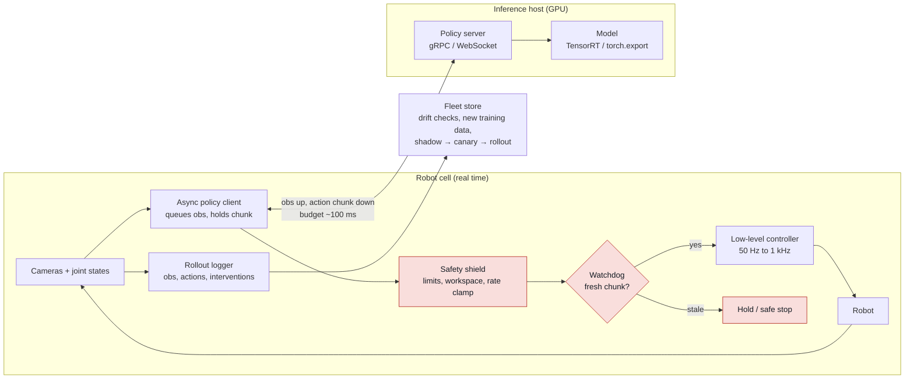

# Deployment engineering

## What it is

Deployment engineering is everything between "the checkpoint evaluates well" and "the robot runs
the policy all day on a customer site without hurting anyone or anything": the control loop that
turns observations into joint commands, its latency budget, how the model is served (on-robot,
laptop GPU, or over the network), the safety layers that bound the policy, the human-in-the-loop
path, logging and monitoring of every rollout, and rolling model versions out and back. The
learned policy is one component; most of the engineering is around it.

## Why it matters in the field

- Policies are slow relative to control rates: Physical Intelligence measures ~97 ms model time
  for pi-0-class VLAs (108 ms end to end on a static arm, 139 ms on a mobile robot) against
  50 Hz control with 50-step (1 s) chunks ([RTC page](https://www.pi.website/research/real_time_chunking),
  [arXiv:2506.07339](https://arxiv.org/abs/2506.07339)). Synchronous inference pauses or jerks
  at chunk boundaries; the fix is architectural.
- Memory decides where the model lives: pi0 ~14 GB at inference vs SmolVLA ~2 GB
  ([LeRobot docs](https://huggingface.co/docs/lerobot/en/async)), i.e. Orin NX vs desktop GPU.
- Safety is regulatory: ISO 10218-1/-2:2025 replaced the 2011 editions and absorbed ISO/TS
  15066's collaborative modes ([summary](https://standardbots.com/blog/collaborative-robot-safety-standards),
  [Robotiq on TS 15066](https://www.automate.org/robotics/tech-papers/iso-ts-15066-explained)).
  The learned policy is never the safety function; the safety function bounds the policy.
- Deployment data is the cheapest training data: Sirius (RSS 2023) improves the policy from
  weighted interventions round over round ([arXiv:2211.08416](https://arxiv.org/abs/2211.08416));
  HIL-SERL puts operator corrections inside real-robot RL ([arXiv:2410.21845](https://arxiv.org/abs/2410.21845)).
- Security: LeRobot's gRPC PolicyServer called `pickle.loads` on unauthenticated network input
  (CVE-2026-25874, CVSS 9.8; unpatched as of 22 Apr 2026 per the
  [disclosure](https://chocapikk.com/posts/2026/lerobot-pickle-rce/), current status unverified).

### Diagram: reference deployment architecture



Red boxes are deterministic and never learned. The policy can be wrong; the
shield and watchdog cannot be bypassed by it.


## Key concepts and methods

### Control loop architecture

```
            REFERENCE ARCHITECTURE (one arm, one inference host)
 ┌──────────────────────────────────────────────────────────────────────┐
 │ ROBOT CELL (real-time domain, 100 Hz - 1 kHz)                        │
 │  cameras / joint enc / F-T ─► observation packet (t_obs, imgs, q, dq) │
 │                                    │                                 │
 │            ┌───────────────────────▼──────────┐   action queue       │
 │            │ ROBOT CLIENT (async)             │◄──┤ chunk merge:     │
 │            │  send obs when queue < threshold │   │ freeze first k,  │
 │            │  pop 1 action per control tick   │   │ blend the rest   │
 │            └───────────────────────┬──────────┘   └────────▲─────────┘
 │                                    ▼ target (q / ee pose, gripper)   │
 │  ┌─────────────────────────────────────────────────────────────────┐ │
 │  │ SAFETY SHIELD (deterministic, no ML)                            │ │
 │  │ workspace box · joint/vel/accel limits · F-T threshold          │ │
 │  │ stale-action watchdog (> T_wd -> hold, then stop) · deadman     │ │
 │  └───────────────────────────────┬─────────────────────────────────┘ │
 │                                  ▼                                   │
 │  low-level controller (ros2_control / vendor SDK): interpolate to    │
 │  1 kHz, joint PD or impedance ── hardware e-stop chain (independent) │
 │  ROLLOUT LOGGER: obs, chunks, clamps, interventions, model version,  │
 │  latency -> LeRobotDataset / mcap on local disk                      │
 └───────────────┬────────────────────────────────────────────▲─────────┘
        obs      │  gRPC / WebSocket / ZeroMQ over wired LAN  │ chunks
                 ▼                                            │
 ┌────────────────────────────────────────────────────────────┴─────────┐
 │ INFERENCE HOST (Jetson Thor / laptop RTX / rack GPU)                 │
 │  policy server: load <model>-<dataset>-<sha>-<step>.pt, warm up      │
 │  keep newest obs only (queue size 1), drop stale, echo t_obs         │
 │  health endpoint: model version, p50/p99 latency, GPU memory         │
 └───────────────┬──────────────────────────────────────────────────────┘
                 ▼ nightly upload of rollouts + interventions
 ┌──────────────────────────────────────────────────────────────────────┐
 │ FLEET SIDE: dataset store, drift dashboards, retrain, eval, model    │
 │ registry, staged rollout (shadow -> canary -> fleet), 1-cmd rollback │
 └──────────────────────────────────────────────────────────────────────┘
```

The policy runs at 1-10 Hz and emits a chunk of future actions; the controller consumes them at
50 Hz or faster and interpolates to the drive rate. The robot side must keep running (and stop
safely) if the inference host disappears.

### Latency budget and asynchronous inference

- Budget end to end: exposure + transfer, resize, network out, model, network back, queue,
  controller tick. RTC's mobile-robot breakdown (97 ms model, 21 ms network, 11 ms resize,
  ~10 ms other) is a realistic template ([RTC page](https://www.pi.website/research/real_time_chunking)).
- **Async inference** (LeRobot): `RobotClient` streams observations to a `PolicyServer` and
  keeps executing the current chunk while the next is computed. Knobs: `actions_per_chunk`
  (default 50, typical 10-50), `chunk_size_threshold` (doc table says 0.7 default, text
  recommends 0.5-0.6), `aggregate_fn_name` for blending overlaps. Server keeps only the newest
  observation (queue size 1) and drops near-duplicates; transport is gRPC
  ([docs](https://huggingface.co/docs/lerobot/en/async),
  [policy_server.py](https://github.com/huggingface/lerobot/blob/main/src/lerobot/async_inference/policy_server.py)).
- **Real-Time Chunking (RTC)**: freeze the first k actions of the new chunk (k = actions that
  execute during inference; 3 at 50 Hz in their setup) and inpaint the rest conditioned on the
  previous chunk. No retraining; throughput stayed flat under +100/+200 ms injected delay while
  synchronous execution degraded ([arXiv:2506.07339](https://arxiv.org/abs/2506.07339)).
- **Training-time RTC**: simulate delay in training and condition on the action prefix, removing
  inference-time inpainting cost; validated on pi-0.6 ([arXiv:2512.05964](https://arxiv.org/abs/2512.05964)).
- pi-0 uses 10 flow-matching integration steps and controls at up to 50 Hz
  ([arXiv:2410.24164](https://arxiv.org/abs/2410.24164)); fewer steps trade quality for latency.

### Model serving

- **Export formats**: TorchScript is in maintenance mode; PyTorch 2.x points to `torch.export` +
  AOTInductor (beta) for non-Python runtimes and a Dynamo-based ONNX exporter
  ([PyTorch tutorial](https://docs.pytorch.org/tutorials/recipes/torch_export_aoti_python.html));
  Torch-TensorRT embeds TensorRT engines in AOTInductor libraries
  ([pytorch/TensorRT](https://github.com/pytorch/tensorrt/releases)). For VLAs with tokenizers and
  flow loops, eager PyTorch/JAX behind a server is the pragmatic default; compile the vision
  encoder first, measure, go further only if the budget demands it.
- **Policy server protocols**: openpi serves over WebSocket (`serve_policy.py`, default port
  8000) with a minimal `openpi-client` package and recommends client-side image resize
  ([openpi remote_inference.md](https://github.com/Physical-Intelligence/openpi/blob/main/docs/remote_inference.md));
  LeRobot uses gRPC; ZeroMQ is common in lab code (from field, unverified). Transport is rarely
  the bottleneck; image serialization is.
- Never accept pickled objects from the network (CVE above). Use protobuf/msgpack/JPEG with
  explicit schemas, bind to a private interface, put TLS or a VPN in front.

### Safety layers (deterministic, outside the model)

- Clamp every target: workspace box, joint limits, per-joint velocity/acceleration, Cartesian
  speed cap; force/torque threshold triggers a hold.
- Stale-action watchdog: no fresh valid action within T_wd (a few ticks) -> hold, then
  decelerate to a stop. Never replay the last action indefinitely.
- ISO speed-and-separation monitoring computes the protective distance from robot stopping
  distance, sensing uncertainty, system latency and control frequency, so inference latency is
  a safety parameter ([Robotiq](https://www.automate.org/robotics/tech-papers/iso-ts-15066-explained)).
- The hardware e-stop chain is independent of all of the above; a wedged policy PC must not matter.

### Human-in-the-loop and interventions as data

- Sirius: operator monitors and takes over via teleop; intervention-weighted BC learns from the
  deployment data round over round ([arXiv:2211.08416](https://arxiv.org/abs/2211.08416)).
- HIL-SERL: actor on the robot, separate learner, demo and online replay buffers; operator
  corrections enter the off-policy update ([arXiv:2410.21845](https://arxiv.org/abs/2410.21845);
  [LeRobot guide](https://huggingface.co/docs/lerobot/en/hilserl)).
- Log per intervention: timestamp, trigger (operator / clamp / watchdog), pre-intervention
  observation window, operator actions, outcome label, in the training dataset format.

### Monitoring and drift

- Log every rollout: observations (downsampled images are fine), commanded actions, executed
  joint states, clamps, per-stage latency, model version, task string, outcome.- Per-shift dashboard: success k/n with Wilson interval (see [[library/topics/policy-evaluation]]),
  interventions per episode, p50/p99 latency, queue-empty events, clamp counts, camera
  exposure/brightness stats, F/T baseline.
- Drift: compare image and proprioceptive statistics to the training set (embedding distance or
  per-channel means) and alert; typical causes are lighting, moved camera, new object SKU,
  gripper wear (from field, unverified).

### Compute placement

| Option | Numbers (official unless noted) | Trade-off |
|---|---|---|
| Jetson Orin Nano / NX | up to 40 / 100 TOPS, 4-8 / 8-16 GB, 7-15 / 10-25 W ([NVIDIA](https://www.nvidia.com/en-us/autonomous-machines/embedded-systems/jetson-orin/)) | ACT/Diffusion-Policy-class models only |
| Jetson AGX Orin 64GB | 275 TOPS (INT8), 64 GB LPDDR5 @ 204.8 GB/s, 15-60 W | Small VLAs (SmolVLA-class); pi-0 at 14 GB fits but is slow (unverified latency) |
| Jetson AGX Thor | 2070 TFLOPS FP4 sparse, 128 GB LPDDR5X @ 273 GB/s, 40-130 W, Blackwell ([NVIDIA](https://www.nvidia.com/en-us/autonomous-machines/embedded-systems/jetson-thor/)) | On-robot VLA inference; precision figures are FP4, not comparable to Orin INT8 |
| Laptop RTX GPU | varies | Fast to set up; thermal throttling and power supply in the cell |
| Remote GPU over LAN | RTC measured 6.9 ms (static) to 21 ms (mobile/Wi-Fi) network overhead | Best model, worst failure mode: design for link loss |

### Containers and ROS 2

- Official images `ros:humble` (core/base) and `osrf/ros:humble-desktop(-full)`; `--net=host`
  for DDS discovery ([Docker Hub](https://hub.docker.com/_/ros), [guide](https://roboticseabass.com/2023/07/09/updated-guide-docker-and-ros2/)).
- Split containers by responsibility: drivers + safety shield (pinned) vs policy client
  (changes per model) vs inference server (GPU image). Pass `/dev` devices explicitly; sensor-data
  QoS for images, reliable QoS for commands and heartbeats, documented in the package README.
- Real-time: `--cap-add=SYS_NICE`, `--ulimit rtprio`, pinned CPUs for the controller container
  (from field, unverified).

### Rollout and rollback of model versions

1. Checkpoint named `<model>-<dataset>-<git-sha>-<step>.pt` (CLAUDE.md) with its `experiments/` record.
2. **Shadow**: new model sees observations and logs actions; the old one drives. Compare offline.
3. **Canary**: one cell, one shift, interventions counted, success rate with trial count.
4. **Fleet**: staged, previous image and checkpoint kept on disk; rollback is a config flip
   and a restart, not a download.
5. Never overwrite a checkpoint; never change the client/server schema without a version field.

## Practical recipe or worked example

Bringing up a policy on a new cell (one day):
1. Measure the budget: server + dummy client for model p50/p99 on the target GPU, then the real
   client for end-to-end latency (echo the observation timestamp in the chunk). Write it down.
2. Set `actions_per_chunk` so a chunk covers >= 2x p99 end-to-end latency at the control rate,
   `chunk_size_threshold` ~0.5, and watch `--debug_visualize_queue_size`; the queue must never
   hit zero ([LeRobot docs](https://huggingface.co/docs/lerobot/en/async)).
3. Test the shield alone with a scripted client: out-of-box target, 10x velocity, then silence.
   Confirm clamp, clamp, watchdog stop; all three logged.
4. First policy runs at 25% speed with an operator on the deadman. Log everything.
5. Twenty scripted-IC trials, blinded if two people are present; report k/n with a Wilson
   interval; file the experiment record. Verify the rollout logs load as a dataset.

## Practical gotchas

- Clock skew between robot PC and inference host breaks stale-observation filtering; use PTP or
  carry a monotonic client timestamp through the request.
- Camera auto-exposure/white-balance drift across the day shifts observations; lock and log them.
- Client-side image resize cost 11 ms on the RTC mobile robot; budget it or move it to the GPU.
- RTC's Wi-Fi mobile-robot network cost was 3x the wired one; wire anything a customer sees.
- `pickle` over the network is remote code execution by design.
- ONNX/TensorRT export can change numerics (fp16, fusion); evaluate the exported artifact.
- A rollback that restores the model but not its normalization stats or camera calibration is
  not a rollback.

## What a forward-deployed engineer must be able to do

- Draw the cell's control loop with rates and latencies filled in from measurement.
- Stand up a policy server and client (LeRobot or openpi), tune chunk size and threshold, prove
  the queue never starves.
- Implement and test a deterministic safety shield and watchdog independent of the model.
- Wire operator intervention (deadman + teleop takeover) so episodes land in the dataset store
  with correct labels.
- Containerize drivers, shield, client, server separately; bring the cell up from images.
- Run shadow -> canary -> fleet; execute a rollback in under a minute.
- Read latency and success dashboards each shift; turn anomalies into field notes.

## Open questions to learn hands-on

- Actual pi-0 / pi-0.5 latency on Jetson AGX Orin and Thor for our camera count and resolution.
- RTC inpainting vs LeRobot weighted-average blending on our arm: measure jerk at chunk boundaries.
- What T_wd and velocity limits the customer's ISO 10218:2025 risk assessment actually requires.
- How much of each shift's rollout log is worth keeping (storage vs value for retraining).

## Related entries

- [Safety for learned policies](safety-for-learned-policies.md): the shield pattern, standards map, runtime monitors.
- [[library/topics/policy-evaluation]] (how to report the numbers this pipeline produces)
- [[library/topics/vision-language-action-models]]
- [[library/topics/teleoperation-and-data-collection]] (intervention data)
- [[library/topics/real-world-rl]] (HIL-SERL)
- [[library/tools/lerobot]]
- [[library/tools/ros2-humble]]
- [[sops/experiment-protocol]]

## Sources

- Black, Galliker, Levine, "Real-Time Execution of Action Chunking Flow Policies" (2025). https://arxiv.org/abs/2506.07339 ; https://www.pi.website/research/real_time_chunking ; Black, Ren, Equi, Levine, "Training-Time Action Conditioning for Efficient Real-Time Chunking" (2025). https://arxiv.org/abs/2512.05964
- Physical Intelligence, "pi-0: A Vision-Language-Action Flow Model for General Robot Control" (2024). https://arxiv.org/abs/2410.24164
- LeRobot async inference docs https://huggingface.co/docs/lerobot/en/async ; policy_server.py https://github.com/huggingface/lerobot/blob/main/src/lerobot/async_inference/policy_server.py ; HIL-SERL guide https://huggingface.co/docs/lerobot/en/hilserl
- CVE-2026-25874 disclosure (third-party blog; patch status unverified). https://chocapikk.com/posts/2026/lerobot-pickle-rce/
- openpi, "Remote inference". https://github.com/Physical-Intelligence/openpi/blob/main/docs/remote_inference.md
- NVIDIA Jetson Orin and AGX Thor specs. https://www.nvidia.com/en-us/autonomous-machines/embedded-systems/jetson-orin/ ; https://www.nvidia.com/en-us/autonomous-machines/embedded-systems/jetson-thor/
- PyTorch, "torch.export AOTInductor Tutorial (Beta)". https://docs.pytorch.org/tutorials/recipes/torch_export_aoti_python.html ; pytorch/TensorRT releases. https://github.com/pytorch/tensorrt/releases
- Liu et al., "Robot Learning on the Job" (Sirius, RSS 2023). https://arxiv.org/abs/2211.08416 ; Luo, Xu, Wu, Levine, "Precise and Dexterous Robotic Manipulation via Human-in-the-Loop RL" (HIL-SERL, 2024). https://arxiv.org/abs/2410.21845
- Robotiq, "ISO/TS 15066 Explained". https://www.automate.org/robotics/tech-papers/iso-ts-15066-explained ; Standard Bots, ISO 10218:2025 summary (secondary). https://standardbots.com/blog/collaborative-robot-safety-standards
- Docker Hub `ros` image. https://hub.docker.com/_/ros ; Robotic Sea Bass, "An Updated Guide to Docker and ROS 2". https://roboticseabass.com/2023/07/09/updated-guide-docker-and-ros2/ ; ros2_control. https://control.ros.org/
