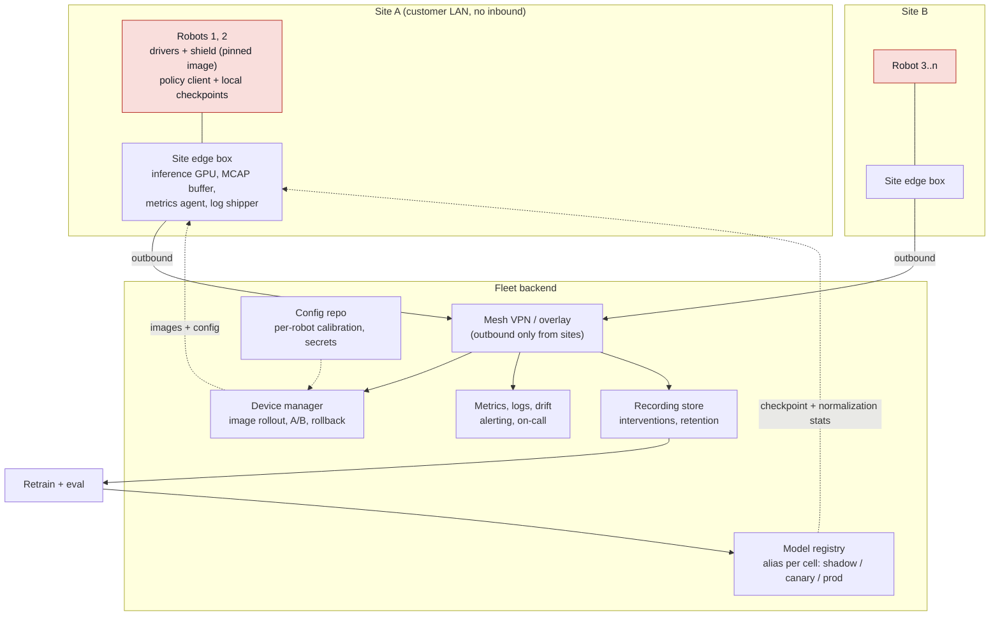

# Fleet operations

## What it is

Everything that changes when there is more than one robot. One robot is a project: stand next to
it, ssh in, copy a checkpoint over, watch it. Ten robots on three sites is an operation: images
rolled out and back without a visit, per-robot calibration that survives a reflash, metrics and
recordings that arrive on their own, a registry that says which checkpoint is where, a way in behind
a customer firewall at 03:00, spares, and someone on call. The policy is the one in
[[library/topics/deployment-engineering]]; this note is about the ten copies of it.

## Why it matters in the field

- The forward-deployed engineer turns robot one into robots two through ten, and the customer
  judges robot two on how little of robot one's bring-up it repeats.
- "Rollback is a config flip and a restart, not a download" only holds if the fleet tooling keeps
  the previous image and checkpoint on every robot ([[library/topics/deployment-engineering]]).
- Interventions are training data (Sirius, [arXiv:2211.08416](https://arxiv.org/abs/2211.08416);
  HIL-SERL, [arXiv:2410.21845](https://arxiv.org/abs/2410.21845)); no upload policy, no flywheel.
- The customer measures uptime. OEE = Availability x Performance x Quality; the quoted world-class
  85 percent is a 1970s automotive figure, not a universal target ([OEE.com](https://www.oee.com/world-class-oee/)).

### Diagram: reference fleet architecture

Robots initiate every connection outward; nothing on the fleet side pushes into a cell unless the
robot's agent asks. The red boxes keep running the last good image and checkpoint if the backend
disappears.

## Fleet management platforms

Checked 2026-09-06. None of these knows what a learned policy is; they give telemetry, teleop,
commands and upload, and the model lifecycle is built on top.

| Platform | What it is | Robot side | Pricing shown | Notes |
|---|---|---|---|---|
| [Open-RMF](https://www.open-rmf.org/) | Apache-2.0 multi-fleet traffic, task allocation, doors and lifts; OSRA-managed since 2024 | Fleet adapters: Full Control, Traffic Light, Easy Full Control C++ API ([guide](https://osrf.github.io/ros2multirobotbook/integration_fleets.html)); [free_fleet](https://github.com/open-rmf/free_fleet) adapter over Zenoh | free | Humble, Jazzy, Kilted, Rolling ([rmf](https://github.com/open-rmf/rmf)). A task dispatcher for mobile robots, not a device manager |
| [Formant](https://formant.ai/) | Telemetry, teleop, commands, data; sold with forward-deployed engineers | Linux agent (amd64, arm64); ROS 1 Melodic/Noetic, ROS 2 Humble/Jazzy; [ROS 2 adapter](https://docs.formant.io/reference/ros-2-adapter.md) maps topics to streams ([agent](https://docs.formant.io/docs/the-formant-agent.md)) | not published | Teleop is a peer-to-peer real-time connection |
| [InOrbit](https://www.inorbit.ai/) | "RobOps" cloud: missions, incidents, connectors | Agent with ROS and ROS 2 republishers; MIT [connectors](https://github.com/inorbit-ai/inorbit-robot-connectors) for OTTO, MiR, Gausium, Omron; VDA 5050 and Open-RMF interop ([docs](https://developer.inorbit.ai/docs)) | not published | RobOps Copilot page 404s (unverified) |
| [Foxglove](https://foxglove.dev/) | Visualization app plus data platform; MCAP stewards | [Foxlet](https://docs.foxglove.dev/docs/foxglove-agent) on-device importer (formerly Foxglove Agent) | Free: 10 GB, 3 users, 5 devices; Pro $20/mo plus $42/user, $20/device ([pricing](https://foxglove.dev/pricing)) | Open-source Studio ended March 2024 ([blog](https://foxglove.dev/blog/foxglove-2-0-unifying-robotics-observability)); [Lichtblick](https://github.com/lichtblick-suite/lichtblick) is the MPL-2.0 fork |
| Freedom Robotics | Formerly a fleet SaaS | | | Site offline since early 2024 (last live Wayback page 2023-12-01); no notice found (unverified). Do not plan on it |
| [Viam](https://www.viam.com/) | `viam-server`, cloud config as source of truth, fragments, provisioning, module and ML model registry | Machines pull config and converge; per-component data capture; ML deploy to TFLite, ONNX, TensorFlow, Triton on Jetson ([fleet](https://docs.viam.com/fleet/overview/), [deploy](https://docs.viam.com/vision/deploy-and-maintain/deploy-from-registry/)) | first $5/mo free; storage $0.05/GB-mo, upload $0.15/GB, egress $0.25/GB ([pricing](https://www.viam.com/product/pricing)) | Nearest to device manager plus model registry in one product; you adopt its runtime |
| Vendor tools | UR Connect via [myUR](https://myur.universal-robots.com/) (login only, unverified); KUKA [iiQoT](https://www.kuka.com/en-us/products/robotics-systems/software/cloud-software/iiqot-robot-condition-monitoring); FANUC [ZDT](https://www.fanucamerica.com/products/robots/zdt-zero-down-time); Boston Dynamics [Orbit](https://bostondynamics.com/products/orbit/) (formerly Scout), cloud, 1U Site Hub or VM | | | ABB Connected Services (site unreachable, unverified). These watch the arm, not your policy PC |

At ten robots, a device manager plus Foxlet or self-hosted MCAP upload on top of Prometheus and a
container registry covers most of this; buy a platform when WAN teleop or a customer console is sold.

## Device management and OTA

The edge box needs a remotely replaceable image, a rollback that works when it does not boot, and state that survives both.

- **balena**: balenaOS (Yocto) plus balenaEngine; the supervisor pulls container deltas and
  restarts services, with update locks ([primer](https://docs.balena.io/learn/introduction/primer.md),
  [deltas](https://docs.balena.io/learn/deploy/delta/)). Jetson AGX Orin, Orin Nano and NX devkits,
  Seeed J3010/J4012 ([devices](https://docs.balena.io/reference/hardware/devices)). Ten devices
  free; $159/month for 30, $329 for 60, $1,439 for 110 ([pricing](https://www.balena.io/pricing)).
  A PREEMPT_RT balenaOS for Jetson (unverified).
- **Mender**: A/B dual rootfs images that "automatically roll back to the previous system version
  on any failure", binary deltas, `meta-mender` or `mender-convert` for an existing image
  ([features](https://mender.io/product/features), [convert](https://docs.mender.io/operating-system-updates-debian-family/convert-a-mender-debian-image));
  Apache-2.0 client ([repo](https://github.com/mendersoftware/mender)); Basic $34/month to 50
  devices, Professional $291 to 250 with deltas ([pricing](https://mender.io/pricing)); Jetson page (unverified).
- **Ubuntu Core**: snaps, "keeps the last working boot", 10 years of security maintenance (15 with
  Pro Legacy), Core 22 certified on Jetson Orin ([features](https://ubuntu.com/core/features),
  [support](https://documentation.ubuntu.com/core/reference/support-duration/), [Jetson](https://ubuntu.com/download/nvidia-jetson));
  ROS 2 via `snapcraft init --profile ros2` ([ROS snaps](https://canonical-robotics.readthedocs-hosted.com/en/latest/how-to-guides/packaging/get-started-with-ros2-snaps/)).
- **Jetson native A/B**: R36.x rootfs redundancy on Orin, flashed with `ROOTFS_AB=1
  ROOTFS_RETRY_COUNT_MAX=3`; after the retries the bootloader "switches the roles of the current
  and unused rootfs slots"; `nvbootctrl -t rootfs dump-slots-info` and `set-active-boot-slot`
  ([rootfs](https://docs.nvidia.com/jetson/archives/r36.4/DeveloperGuide/SD/RootFileSystem.html),
  [bootloader](https://docs.nvidia.com/jetson/archives/r36.4/DeveloperGuide/SD/Bootloader/UpdateAndRedundancy.html)).
  Image-based OTA updates "partition by partition" with or without A/B; Debian OTA is APT
  ([update mechanism](https://docs.nvidia.com/jetson/archives/r36.4/DeveloperGuide/SD/SoftwarePackagesAndTheUpdateMechanism.html)).
  Mender and balena wrap this; bare use means writing the fleet side.
- **Docker rollout**: pin by digest (`image: repo@sha256:...`), set `pull_policy`, and remember
  `latest` is pulled even under `missing` ([compose](https://docs.docker.com/reference/compose-file/services/)).
  Keep the previous digest as a second profile so rollback is an edit and a restart. Watchtower is
  archived, "not recommended" for production ([repo](https://github.com/containrrr/watchtower)).

The OS layer changes rarely and goes through A/B; containers change per model and go through
digest pins, matching the deployment note's container split.

## Configuration management

- **Image versus config.** The image is identical across robots. What differs lives in a config
  repo keyed by serial: network, camera IDs and exposure, hand-eye extrinsics, TCP and payload,
  shield limits, chunking and watchdog values, model alias. Each change is a commit whose hash
  goes into every episode log.
- **Ansible.** Idempotent by definition ("performing it once is exactly the same as ... performing
  it repeatedly"); `ansible-pull` turns push into a cron-driven pull from git, which suits a robot
  behind NAT ([glossary](https://github.com/ansible/ansible-documentation/blob/devel/docs/docsite/rst/reference_appendices/glossary.rst),
  [pull.py](https://github.com/ansible/ansible/blob/devel/lib/ansible/cli/pull.py)). A playbook
  per role, host vars per serial; no vendor Ansible-for-robots guide found (unverified).
- **Per-robot kinematics.** UR: `ur_calibration` extracts the factory calibration into a yaml
  loaded with `kinematics_params_file`; without it positions "might be off in the magnitude of
  centimeters" ([ur_calibration](https://github.com/UniversalRobots/Universal_Robots_ROS2_Driver/blob/main/ur_calibration/README.md)).
  Other vendors keep it in the controller; the per-robot items are hand-eye and TCP.
- **Secrets.** [sops](https://github.com/getsops/sops) (MPL-2.0, CNCF) with [age](https://github.com/FiloSottile/age)
  keys in the config repo, [Ansible Vault](https://github.com/ansible/ansible-documentation/blob/devel/docs/docsite/rst/vault_guide/index.rst),
  or [Vault Agent](https://developer.hashicorp.com/vault/docs/agent-and-proxy/agent) on the
  device. A secret never appears in an image, a compose file or a bag.

## Observability

**Metrics.** Robots behind NAT cannot be scraped. Prometheus says the Pushgateway's "only valid
use case" is a batch job's outcome, since pushed series outlive the instance and lose `up`
([pushing](https://prometheus.io/docs/practices/pushing/)); the edge pattern is Agent mode, no
local TSDB, alerting or rules, everything remote-written
([agent mode](https://prometheus.io/docs/prometheus/latest/prometheus_agent/)). Grafana Alloy is
an OpenTelemetry Collector distribution with Prometheus support, one binary for metrics, logs,
traces and profiles ([Alloy](https://grafana.com/docs/alloy/latest/introduction/)). `jetson-stats`
(`jtop`) reads Jetson CPU, GPU, memory, engines and fan ([repo](https://github.com/rbonghi/jetson_stats));
a Prometheus exporter for it (unverified). Export per robot: success k/n, interventions per
episode, p50/p99 latency, queue-empty events, clamps and holds, camera exposure, F/T baseline,
labelled with model version and image digest ([[library/topics/deployment-engineering]]).

**Recording.** MCAP is chunked and indexed for reading "even over a low-bandwidth internet
connection", self-describing, LZ4 or Zstandard, append-only against unclean shutdown
([mcap.dev](https://mcap.dev/)); rosbag2's default storage is `mcap`
([README](https://github.com/ros2/rosbag2/blob/rolling/README.md); Humble defaulted to sqlite3,
unverified). Foxlet "monitors a local directory for recordings" and imports by glob or on request
([Foxlet](https://docs.foxglove.dev/docs/foxglove-agent)). The policy is three
lists: always recorded (downsampled images, joint states, commands, clamps, model version), full
rate around an event (intervention, hold, fault, plus pre-roll), and retention per class on disk.
Disk fills are a common outage (from field, unverified).

**Logs.** Vector ("a lightweight, ultra-fast tool for building observability pipelines", Rust,
one binary for x86_64 and ARM, [vector.dev](https://vector.dev/)) or Alloy; structured fields
(`run_id`, `robot_id`, `model_version`, `image_digest`) make logs queryable across a fleet.

**Drift.** Evidently (Apache 2.0) has "100+ built-in metrics from data drift detection to LLM
judges" and 20-plus distribution comparisons including embeddings
([repo](https://github.com/evidentlyai/evidently)). Inputs per robot per shift: camera brightness
and contrast, image embedding distance to the training centroid, joint ranges, F/T baseline, gripper
widths, clamp rate. Usual causes: lighting, moved camera, new SKU, gripper wear (from field, unverified).

## Model lifecycle across a fleet

**Registry.** MLflow gives numbered versions, mutable aliases (a "champion" alias moves "without
changing your production URI") and tags; stages are superseded by aliases
([MLflow](https://mlflow.org/docs/latest/ml/model-registry/)). Hugging Face Hub repos are git, so
`revision=` pins a commit ([Hub](https://huggingface.co/docs/hub/repositories-getting-started)).
Either way: `<model>-<dataset>-<git-sha>-<step>.pt`, never overwritten, with its `experiments/`
record, and the entry carries normalization stats, camera set and shield config hash, because a
rollback without them "is not a rollback" ([[library/topics/deployment-engineering]]). One alias
per role per cell (`cellA/prod`, `cellA/canary`, `cellA/shadow`); rollout and rollback are alias
moves, and the client logs the resolved version in every episode.

**Shadow and canary.** SageMaker defines shadow testing as routing "a copy of the inference
requests" to the new variant while only production answers, logging the shadow "for offline
comparison" ([AWS](https://docs.aws.amazon.com/sagemaker/latest/dg/shadow-tests.html)). On a robot
the shadow sees every observation, its chunks are logged beside the executed ones, nothing reaches
the controller; compare action distance, would-be clamps, gripper disagreement. Canary is one cell,
one shift, interventions counted, k/n with a Wilson interval ([[library/topics/policy-evaluation]]).

**One model or per-robot fine-tunes.** RT-X trained on 22 embodiments from 21 institutions (527
skills, 160,266 tasks) with positive transfer ([arXiv:2310.08864](https://arxiv.org/abs/2310.08864));
pi-0 is cross-embodiment ([arXiv:2410.24164](https://arxiv.org/abs/2410.24164)). Start with one base
model per fleet and keep calibration, TCP and shield config in per-robot configuration, not weights;
whether a per-cell fine-tune beats it is an open question below.

**Data flywheel.** Interventions logged in the dataset format with trigger, pre-intervention
window, operator actions and outcome ([[library/topics/deployment-engineering]]) go up nightly and
are weighted as in Sirius; it only turns if upload is automatic and labels are attached on the robot.

**Privacy.** Cameras record workers. GDPR Article 35 requires a DPIA before "a systematic
monitoring of a publicly accessible area on a large scale" or high-risk processing with new
technologies ([Art. 35](https://gdpr-info.eu/art-35-gdpr/)); Illinois BIPA requires written consent
for biometric identifiers (unverified; ILGA page did not load). Mask to the workspace before frames
leave the robot, keep full frames only for event windows, put retention in the contract, and ask
the customer's data protection officer at kickoff.

## Remote access and multi-site ROS 2

- **Tailscale**: WireGuard mesh with NAT traversal, ACLs, MagicDNS, Tailscale SSH; DERP relays
  carry encrypted traffic when no direct path exists ([overview](https://tailscale.com/kb/1151/what-is-tailscale),
  [DERP](https://tailscale.com/kb/1232/derp-servers)). Free for 6 users and 50 tagged resources,
  then $1/month each; Standard $8 per user per month ([pricing](https://tailscale.com/pricing)).
- **Husarnet**: peer-to-peer VPN that "works with ROS and ROS2 out of the box"; `husarnet-dds`
  writes the DDS XML ([site](https://husarnet.com/), [husarnet-dds](https://github.com/husarnet/husarnet-dds));
  free to 5 devices non-commercial, Standard from $10/month ([pricing](https://husarnet.com/pricing)).
- **Zenoh**: `rmw_zenoh_cpp` is Tier 1 from Kilted; Lyrical's default is still `rmw_fastrtps_cpp`
  ([Kilted](https://github.com/ros2/ros2_documentation/blob/rolling/source/Releases/Release-Kilted-Kaiju.rst),
  [Lyrical](https://github.com/ros2/ros2_documentation/blob/rolling/source/Releases/lyrical/supported-platforms.rst)).
  Each host runs `rmw_zenohd`; cross-host means one router's `connect` block points at the other
  ([rmw_zenoh](https://github.com/ros2/rmw_zenoh)). A Humble fleet on DDS bridges with
  `zenoh-bridge-ros2dds` (router mode on 7447, `-e tcp/<ip>:7447` to peers; [plugin](https://github.com/eclipse-zenoh/zenoh-plugin-ros2dds), 1.10.0).
- **Plain DDS**: simple discovery "may not work reliably in some scenarios, e.g. WiFi"; Fast DDS
  Discovery Server (`ROS_DISCOVERY_SERVER=host:11811`) replaces multicast
  ([tutorial](https://github.com/ros2/ros2_documentation/blob/humble/source/Tutorials/Advanced/Discovery-Server/Discovery-Server.rst)). Keep DDS in the cell; cross the WAN with Zenoh.
- Robots dial out; no inbound port on a customer network. WAN teleop is not a policy control path.

## Maintenance

- **Spares per site**: gripper and fingertips, one camera of each type with cable, Ethernet and
  USB spares, an e-stop button, a 24 V supply, and a preconfigured edge box with the image and the
  site's configs on it. Arm joint and controller lead times run to weeks (from field, unverified).
- **Calibration cadence**: extrinsics move when a mount is bumped; the drift dashboard catches it
  and the fix is a hand-eye recalibration committed as a config revision. Re-teach TCP per tool.
- **Gripper wear**: pads polish, jaws develop play; the symptom is grasp failures without image
  drift. Track open and closed widths and closing current per robot (from field, unverified).
- **Cameras in a food plant**: IP69K (ISO 20653) is 80 to 100 bar water at 80 C, 14 to 16 L/min
  from 10 to 15 cm, 30 s per angle ([IP code](https://en.wikipedia.org/wiki/IP_code)). No consumer
  depth camera is rated for it (RealSense page unreachable, unverified): an IP69K enclosure with a
  heated window, a removable camera on a repeatable mount, or an industrial IP67+ unit. Condensation
  after a hot wash fogs lenses and pools on connectors (from field, unverified); check lenses before
  the first shift. Chef Robotics runs "food assembly robots at scale across production sites" but
  publishes nothing on washdown ([Chef](https://www.chefrobotics.ai/post/latency-aware-vision-language-action-models-vlas-with-system-identification-for-real-time-robot-control)).
- **Washdown and electronics**: every unrated connector (USB, HDMI, RJ45, barrel) is a water path:
  glands into a rated enclosure, or the edge box outside the zone on GMSL or fibre; power down and
  cover during washdown.
- **Encoder batteries**: a dead battery loses mastering; symptoms and recovery per vendor are in
  [[library/topics/operating-robot-arms]]. Replacement intervals go on the calendar.

## Uptime metrics and SLAs

- MTBF is "the predicted elapsed time between inherent failures" of a repairable system; MTTF
  for non-repairable; MDT includes logistics, MTTR is the technical repair
  ([MTBF](https://en.wikipedia.org/wiki/Mean_time_between_failures)). Count per robot so a lemon shows.
- OEE for a policy cell: Availability counts protective stops, faults and policy-PC downtime;
  Performance is cycle time against baseline; Quality is task success. Interventions count against
  Availability even when the task succeeded, or the number lies.
- A signable SLA names the metric, the measurement source (your dashboard), exclusions (their
  material, network, scheduled washdown), response time by severity, and the credit. Promise
  availability and an improvement process, not a success rate.

## Incident response and on-call

Borrow the SRE book's roles (commander, operational lead as "the only group modifying the
system", communications, planning) and blameless postmortems "without indicting any individual or
team" ([Managing Incidents](https://sre.google/sre-book/managing-incidents/), [Postmortem Culture](https://sre.google/sre-book/postmortem-culture/)),
and PagerDuty's open-source process ([response.pagerduty.com](https://response.pagerduty.com/)). For robots:

- Sev 1 is anyone hurt or unexpected contact: stop, incident log within 15 minutes
  ([[sops/incident-log-template]]), cell down until a person on site signs it back. Sev 2 is a
  cell down, sev 3 degraded (interventions or drift over threshold). Only 1 and 2 page.
- On call must see the robot's last five minutes of MCAP and metrics without the site's help, and
  have a named site contact who can press buttons.
- Remote restart of the policy container is allowed; remote release of a protective stop or a
  brake never is. A human at the robot clears safety events.
- Every page gets a postmortem in the field note within 24 hours with an owner
  ([[sops/field-deployment-checklist]]).

## Cost models

Per robot per month from the figures above (2026-09-06): device management under $1 to about $5
(Mender Basic $34/50; balena Prototype $159/30); VPN $1 (Tailscale tagged resource) or a $10-plus
Husarnet plan; data platform $20 per device on Foxglove Pro plus storage, or Viam usage rates.
Call it $25 to $40 in tooling before storage and GPU time; spares and on-call cost more (RaaS
prices unverified). Model a site as tooling per robot, recording storage (GB per shift times
retention), inference GPU (per robot or shared), engineer hours per incident and rollout, and
spares. The cheapest lever is recording volume; the dearest event is a site visit.

## Checklist: standing up robot two through ten

- [ ] Robot one's sign-off record ([[sops/robot-bring-up]] section 10) is complete and lists every
      per-robot value: serial, IPs, calibration, TCP, shield, cameras, latencies.
- [ ] One image, one digest, deployed to robot one from the device manager and reflashed once.
- [ ] Per-robot config under the serial in the config repo; nothing robot-specific in the image;
      secrets from the device manager or a vault.
- [ ] The new robot shows every standard dashboard panel before its first policy run.
- [ ] An intervention on robot two appears in the recording store within the agreed delay.
- [ ] Shadow on robot two for one shift with robot one's production checkpoint before it drives.
- [ ] Rollback rehearsed on robot two: alias back, restart, version in the episode log, under a minute.
- [ ] Spares on the shelf, maintenance calendar entries added, on-call rota covers the site's hours.
- [ ] Robot two's bring-up record filed; every difference from robot one is a config diff.

## Practical gotchas

- A robot with no outbound route is not in the fleet, whatever the contract says. Get the
  outbound rule (ports, hosts) in writing before shipping.
- Pushed metrics outlive the robot; a decommissioned unit reports healthy until someone deletes
  the series ([pushing](https://prometheus.io/docs/practices/pushing/)).
- A/B is a rollback only if the other slot still boots; test the fallback slot every release.
- Full-rate recording fills the disk, the logger dies, the next fault has no evidence (from field, unverified).
- Clock skew makes two timelines of one incident; chrony or PTP everywhere ([[library/topics/deployment-engineering]]).

## What a forward-deployed engineer must be able to do

- Bring a robot into the fleet from a blank edge box with only the device manager and config repo.
- Roll a model to one robot, watch it for a shift, roll it back, show the cell's version history.
- Read a robot's last five minutes of MCAP and metrics off site and name the failed component.
- Write and implement the recording and retention policy with the customer's privacy officer.
- Run an incident as commander, file the postmortem, turn action items into config or image changes.

## Open questions to learn hands-on

- Per-cell fine-tune versus shared model on our tasks, with trial counts, against the cost of N
  aligned checkpoints.
- Bandwidth per robot per day for event-windowed recording at our camera count.
- Whether image-based OTA with rootfs A/B on Jetson fits the on-site reflash window.

## Related entries

- [[library/topics/deployment-engineering]] (control loop, shield, shadow/canary/fleet ladder)
- [[library/topics/operating-robot-arms]] (per-arm operation, mastering, backups)
- [[library/topics/safety-for-learned-policies]], [[library/topics/policy-evaluation]],
  [[library/topics/connecting-to-real-robots]], [[library/hardware/compute]]
- [[sops/robot-bring-up]], [[sops/field-deployment-checklist]], [[sops/incident-log-template]]

## Sources

- Open-RMF. https://www.open-rmf.org/ ; https://github.com/open-rmf/rmf ; https://osrf.github.io/ros2multirobotbook/integration_fleets.html ; https://github.com/open-rmf/free_fleet ; Formant. https://docs.formant.io/docs/the-formant-agent.md ; https://docs.formant.io/reference/ros-2-adapter.md ; InOrbit. https://developer.inorbit.ai/docs ; https://github.com/inorbit-ai/inorbit-robot-connectors
- Foxglove. https://foxglove.dev/pricing ; https://docs.foxglove.dev/docs/foxglove-agent ; https://foxglove.dev/blog/foxglove-2-0-unifying-robotics-observability ; Lichtblick. https://github.com/lichtblick-suite/lichtblick ; MCAP. https://mcap.dev/ ; rosbag2. https://github.com/ros2/rosbag2
- Viam. https://docs.viam.com/fleet/overview/ ; https://docs.viam.com/vision/deploy-and-maintain/deploy-from-registry/ ; https://www.viam.com/product/pricing ; KUKA iiQoT, FANUC ZDT, Boston Dynamics Orbit. https://www.kuka.com/en-us/products/robotics-systems/software/cloud-software/iiqot-robot-condition-monitoring ; https://www.fanucamerica.com/products/robots/zdt-zero-down-time ; https://bostondynamics.com/products/orbit/
- balena. https://docs.balena.io/ ; https://www.balena.io/pricing ; Mender. https://mender.io/product/features ; https://docs.mender.io/ ; https://mender.io/pricing ; Ubuntu Core. https://ubuntu.com/core/features ; https://documentation.ubuntu.com/core/ ; https://ubuntu.com/download/nvidia-jetson ; Canonical ROS snaps. https://canonical-robotics.readthedocs-hosted.com/en/latest/
- NVIDIA Jetson Linux R36.4 Developer Guide (root file system, bootloader redundancy, update mechanism). https://docs.nvidia.com/jetson/archives/r36.4/DeveloperGuide/ ; Docker Compose services. https://docs.docker.com/reference/compose-file/services/ ; Watchtower (archived). https://github.com/containrrr/watchtower
- Ansible docs and ansible-pull. https://github.com/ansible/ansible-documentation ; https://github.com/ansible/ansible ; sops. https://github.com/getsops/sops ; age. https://github.com/FiloSottile/age ; Vault Agent. https://developer.hashicorp.com/vault/docs/agent-and-proxy/agent ; ur_calibration. https://github.com/UniversalRobots/Universal_Robots_ROS2_Driver/blob/main/ur_calibration/README.md
- Prometheus. https://prometheus.io/docs/practices/pushing/ ; https://prometheus.io/docs/prometheus/latest/prometheus_agent/ ; Grafana Alloy. https://grafana.com/docs/alloy/latest/introduction/ ; Vector. https://vector.dev/ ; jetson_stats. https://github.com/rbonghi/jetson_stats ; Evidently. https://github.com/evidentlyai/evidently
- MLflow Model Registry. https://mlflow.org/docs/latest/ml/model-registry/ ; Hugging Face Hub. https://huggingface.co/docs/hub/repositories-getting-started ; SageMaker shadow tests. https://docs.aws.amazon.com/sagemaker/latest/dg/shadow-tests.html
- Open X-Embodiment. https://arxiv.org/abs/2310.08864 ; pi-0. https://arxiv.org/abs/2410.24164 ; Sirius. https://arxiv.org/abs/2211.08416 ; HIL-SERL. https://arxiv.org/abs/2410.21845
- GDPR Art. 35. https://gdpr-info.eu/art-35-gdpr/ ; IP code. https://en.wikipedia.org/wiki/IP_code ; MTBF. https://en.wikipedia.org/wiki/Mean_time_between_failures ; OEE. https://www.oee.com/world-class-oee/
- Tailscale. https://tailscale.com/kb/1151/what-is-tailscale ; https://tailscale.com/kb/1232/derp-servers ; https://tailscale.com/pricing ; Husarnet. https://husarnet.com/ ; https://github.com/husarnet/husarnet-dds ; https://husarnet.com/pricing ; rmw_zenoh. https://github.com/ros2/rmw_zenoh ; zenoh-plugin-ros2dds. https://github.com/eclipse-zenoh/zenoh-plugin-ros2dds ; ROS 2 docs (Kilted, Lyrical, Discovery Server). https://github.com/ros2/ros2_documentation
- Google SRE book. https://sre.google/sre-book/managing-incidents/ ; https://sre.google/sre-book/postmortem-culture/ ; PagerDuty. https://response.pagerduty.com/ ; Chef Robotics. https://www.chefrobotics.ai/post/latency-aware-vision-language-action-models-vlas-with-system-identification-for-real-time-robot-control
