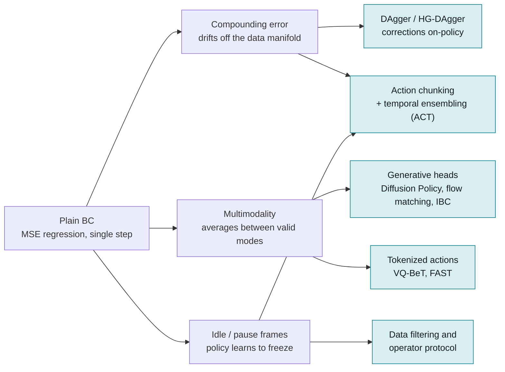

# Imitation learning for real robot manipulation

## What it is

Imitation learning (IL) trains a policy `pi(a | o)` from demonstrations, usually
teleoperated, instead of from a reward. The simplest form, behavior cloning (BC),
is supervised learning on (observation, action) pairs. Everything modern in this
area is a fix for one of three problems that plain BC has on a real robot:

1. **Compounding error.** The policy's own mistakes push it into states the
   demonstrator never visited, where it makes bigger mistakes. Ross and Bagnell
   showed the regret bound of naive supervised BC "grows quadratically in the
   time horizon of the task" ([Ross & Bagnell 2010](https://proceedings.mlr.press/v9/ross10a.html));
   DAgger fixes it by iteratively relabelling the learner's own states with expert
   actions and aggregating the data ([Ross, Gordon, Bagnell 2011](https://arxiv.org/abs/1011.0686)).
   On real hardware the practical variant is human-gated DAgger, where the
   operator takes over when the policy looks unsafe
   ([HG-DAgger, Kelly et al. 2019](https://arxiv.org/abs/1810.02890)).
2. **Multimodality.** Human demos of the same state contain several valid
   actions (go left or right around an obstacle). An MSE regressor averages them
   and outputs the invalid mean. Implicit BC showed energy-based policies
   "often outperform common explicit (Mean Square Error, or Mixture Density)"
   policies, precisely because they can represent "discontinuous and
   multi-valued (set-valued) functions" ([Florence et al. 2021](https://arxiv.org/abs/2109.00137)).
   ACT (CVAE), Diffusion Policy, flow matching, and tokenized actions are all
   different generative answers to the same problem.
3. **Idle and jittery demonstrations.** Pauses are "common during teleoperation
   ... However, single-step policies can easily overfit to this pausing
   behavior" ([Chi et al. 2023](https://ar5iv.labs.arxiv.org/html/2303.04137)).
   Predicting a chunk of future actions instead of one action is the fix.

## Why it matters in the field

- It is the fastest route from "customer shows us the task" to a running policy:
  ACT reached 80-90% success on six fine-manipulation tasks from "only 10 minutes
  worth of demonstrations" per task ([Zhao et al. 2023](https://arxiv.org/abs/2304.13705)).
- It is the foundation of every VLA. π0 is a pre-trained VLM plus a flow-matching
  action expert, trained on demonstrations and fine-tuned with "5 hours" to "100
  or more hours of data" per task ([Black et al. 2024](https://arxiv.org/html/2410.24164v3)).
  Knowing IL is knowing how VLAs are actually trained and deployed.
- Data is the cost driver on a deployment. The scaling-law paper's conclusion,
  that "the diversity of environments and objects is far more important than the
  absolute number of demonstrations" ([Lin et al. 2024](https://arxiv.org/abs/2410.18647)),
  directly changes how you plan a data-collection day at a customer site.
- The tooling is mature. LeRobot ships ACT, Diffusion Policy, VQ-BeT, π0,
  π0-FAST, SmolVLA, GR00T and more behind one dataset format
  ([policies directory](https://github.com/huggingface/lerobot/tree/main/src/lerobot/policies)).

### Diagram: failure modes of plain behaviour cloning and their fixes

## Key methods

| Method | Year | Core idea | When to use | Link |
|---|---|---|---|---|
| BC (MSE / MDN) | classic | Regress action from observation. | Baseline only; unimodal, short-horizon tasks. Expect averaging failures. | [Florence 2021 (as baseline)](https://arxiv.org/abs/2109.00137) |
| DAgger / HG-DAgger | 2011 / 2019 | Roll out learner, expert relabels visited states, aggregate, retrain. HG-DAgger: human takes over when unsafe. | When a policy fails in recoverable states and an operator is on site to correct. Quadratic-to-linear error growth. | [DAgger](https://arxiv.org/abs/1011.0686), [HG-DAgger](https://arxiv.org/abs/1810.02890) |
| Implicit BC (EBM) | 2021 | Policy = argmin over actions of an energy E(o, a); handles multimodal and discontinuous action maps. | Mostly historical now; read it to understand why MSE breaks. | [Florence et al.](https://arxiv.org/abs/2109.00137) |
| ACT (ALOHA) | 2023 | CVAE transformer predicts a chunk of k=100 absolute joint positions at 50 Hz; temporal ensembling of overlapping chunks with weights `w_i = exp(-m*i)`. | First thing to try on a fixed-base arm or bimanual setup with 50 demos and a single well-defined task. Inference ~0.01 s. | [Paper](https://arxiv.org/abs/2304.13705), [site](https://tonyzhaozh.github.io/aloha/), [code](https://github.com/tonyzhaozh/act) |
| Diffusion Policy | 2023 | Denoise an action sequence conditioned on observation features (DDPM training, DDIM inference); receding-horizon execution; CNN (1-D U-Net) or transformer head. Average +46.9% over prior SOTA on 12 tasks. | Multimodal demos, contact-rich or long-horizon tasks, when ACT plateaus. Start with the CNN head. | [Paper](https://arxiv.org/abs/2303.04137), [site](https://diffusion-policy.cs.columbia.edu/) |
| UMI | 2024 | Hand-held gripper for data collection; relative-trajectory action representation; inference-time latency matching. | Collecting in-the-wild data without the robot; whenever policy latency is hurting. | [Paper](https://arxiv.org/abs/2402.10329) |
| VQ-BeT | 2024 | Tokenize action chunks with hierarchical (residual) vector quantization, predict tokens with a GPT-style transformer plus a continuous offset. Claims 5x faster inference than Diffusion Policy. | Need discrete/multimodal actions with fast inference; predecessor BeT used k-means bins. | [VQ-BeT](https://arxiv.org/abs/2403.03181), [BeT](https://arxiv.org/abs/2206.11251) |
| OpenVLA (binned tokens) | 2024 | 7B VLM predicts 7-D delta end-effector actions, each dimension binned into 256 tokens between the 1st and 99th quantile; LoRA fine-tuning. | Language-conditioned tasks with a pretrained base; low control rate. | [Paper](https://arxiv.org/html/2406.09246v3) |
| π0 (flow matching) | 2024 | PaliGemma 3B VLM + 300M action expert trained with flow matching; chunk H=50 at up to 50 Hz; 10 integration steps at inference; pre-trained on ~10k hours across 7 robot configs and 68 tasks. | Multi-task or language-conditioned deployment where fine-tuning a generalist is cheaper than collecting hundreds of demos. | [Paper](https://arxiv.org/html/2410.24164v3) |
| FAST (π0-FAST) | 2025 | DCT-based compression tokenizer for action chunks; naive per-dimension binning "perform[s] poorly ... [on] high-frequency robot data". Up to 5x faster training than diffusion at same performance. | Autoregressive VLAs on high-frequency (50 Hz) data. | [Paper](https://arxiv.org/abs/2501.09747) |
| SmolVLA | 2025 | Small VLA trained on community LeRobot datasets; asynchronous inference stack separating action prediction from execution; runs on consumer GPU or CPU. | Low-cost arms, limited compute, want a pretrained starting point inside LeRobot. | [Paper](https://arxiv.org/abs/2506.01844) |
| GR00T N1 | 2025 | Dual-system VLA: VLM (System 2) + diffusion-transformer action module (System 1), jointly trained on real robot, human video, and synthetic data. | Humanoid / cross-embodiment; heavier compute. | [Paper](https://arxiv.org/abs/2503.14734) |
| Real-Time Chunking (RTC) | 2025 | Generate the next chunk while executing the current one; freeze actions that will execute, inpaint the rest. Fixes "pauses or out-of-distribution jerky movements at chunk boundaries". | Any chunked policy whose inference latency is a visible fraction of the chunk. | [Paper](https://arxiv.org/abs/2506.07339) |

Other flow-matching action heads exist (e.g. GR00T N1's DiT), but the pattern is
the same as π0: a small expert denoises/integrates an action chunk conditioned on
a frozen or co-trained perception backbone.

## A default recipe for a new task

The recipe below is what to do before anyone asks for a VLA. Every number has a
source; change it only with an experiment record.

1. **Write the task and eval protocol first** (`sops/experiment-protocol.md`).
   Fix the initial-state distribution, success criterion, number of trials.
   Diffusion Policy reported "90% success rate over 20 trials" on mug flipping;
   20 trials is the floor, not the ceiling
   ([Chi et al.](https://arxiv.org/html/2303.04137v5)).
2. **Choose the action space.** Default to absolute position control, not
   velocity: "Diffusion Policy with a position-control action space consistently
   outperforms Diffusion Policy with velocity control" ([Chi et al.](https://arxiv.org/html/2303.04137v5)).
   Joint positions if the demos come from a leader arm (ACT "directly predicts
   joint positions at 50Hz", [ALOHA site](https://tonyzhaozh.github.io/aloha/));
   end-effector pose if demos come from a hand-held device or you need
   cross-robot transfer (UMI uses a "relative-trajectory action representation",
   [Chi et al. 2024](https://arxiv.org/abs/2402.10329)). Treat the gripper as one
   more continuous action dimension (ACT, DP) unless you tokenize, in which case
   it is binned like every other dimension (OpenVLA,
   [Kim et al.](https://arxiv.org/html/2406.09246v3)).
3. **Collect 50 demonstrations** at 50 Hz with a leader arm, one operator, one
   scene, as the first milestone. ACT used "50 demonstrations for each task,
   except for Thread Velcro which has 100", episodes of "8-14 seconds"
   ([Zhao et al.](https://ar5iv.labs.arxiv.org/html/2304.13705)). Diffusion
   Policy's real tasks used 90-284 demos (Push-T 136, sauce 90, mug 250)
   ([Chi et al.](https://ar5iv.labs.arxiv.org/html/2303.04137)). Follow
   `sops/data-collection-protocol.md`; write `DATASET.md` before training.
4. **Train ACT first (LeRobot defaults).** `chunk_size=100`,
   `n_action_steps=100`, `n_obs_steps=1`, ResNet-18 ImageNet backbone,
   `dim_model=512`, `n_heads=8`, `dim_feedforward=3200`, 4 encoder layers,
   1 decoder layer, `use_vae=True`, `latent_dim=32`, `kl_weight=10`,
   `dropout=0.1`, `lr=1e-5`, `weight_decay=1e-4`
   ([LeRobot ACTConfig](https://github.com/huggingface/lerobot/blob/main/src/lerobot/policies/act/configuration_act.py)).
   The original code trains with `batch_size 8`, `num_epochs 2000`, `lr 1e-5`
   and its README says for real data "train for at least 5000 epochs or 3-4
   times the length after the loss has plateaued"
   ([tonyzhaozh/act](https://github.com/tonyzhaozh/act)). The 1-decoder-layer
   default is deliberate: LeRobot notes the original has 7 configured but "a bug
   in the code ... means only the first layer is used"
   ([ACTConfig comment](https://github.com/huggingface/lerobot/blob/main/src/lerobot/policies/act/configuration_act.py)).
5. **Decide on temporal ensembling.** Original ACT uses `m=0.01`; LeRobot notes
   "the value used in ACT when temporal ensembling is enabled is 0.01" and
   requires `n_action_steps=1` with it, so inference runs every control step
   ([ACTConfig](https://github.com/huggingface/lerobot/blob/main/src/lerobot/policies/act/configuration_act.py)).
   The paper measured a "3.3% gain for our method" from ensembling
   ([Zhao et al.](https://ar5iv.labs.arxiv.org/html/2304.13705)); it is a
   smoothing tool, not a rescue.
6. **If ACT plateaus, train Diffusion Policy (CNN head).** The authors
   "recommend starting with the CNN-based diffusion policy implementation as the
   first attempt at a new task" and reserve the transformer for "high-rate action
   changes" at "the cost of additional tuning" ([Chi et al.](https://arxiv.org/html/2303.04137v5)).
   Paper settings: `To=2, Ta=8, Tp=16` (Table 8), 100 DDPM training steps, DDIM
   with 10 inference steps for "0.1s inference latency on a Nvidia 3080 GPU",
   EMA of weights, random-crop augmentation
   ([Chi et al.](https://ar5iv.labs.arxiv.org/html/2303.04137)). LeRobot's
   `DiffusionConfig` defaults differ: `n_obs_steps=2`, `horizon=64`,
   `n_action_steps=32`, `num_train_timesteps=100`, `noise_scheduler_type="DDPM"`
   (DDIM supported), `lr=1e-4`, `betas=(0.95, 0.999)`, `weight_decay=1e-6`,
   cosine schedule with 500 warmup steps, `down_dims=(512, 1024, 2048)`,
   `crop_is_random=True`
   ([LeRobot DiffusionConfig](https://github.com/huggingface/lerobot/blob/main/src/lerobot/policies/diffusion/configuration_diffusion.py)).
   Set `num_inference_steps=10` with DDIM before deploying; note that EMA is not
   exposed in that config file, so check the training script if you rely on it.
7. **Scale data only along the axis that is failing.** If the policy fails on
   new object poses or scenes, add environments and objects, not more demos of
   the same scene: performance "plateaus when the number of demonstrations
   reaches 800" per task, and the recommendation is "50 demonstrations per
   environment-object pair" with 32 pairs giving "around 90% success rates
   across all four tasks" ([Lin et al.](https://arxiv.org/html/2410.18647v3)).
8. **Co-train when you have a related corpus.** Mobile ALOHA: "With 50
   demonstrations for each task, co-training can increase success rates by up
   to 90%" using static ALOHA data ([Fu et al. 2024](https://arxiv.org/abs/2401.02117)).
   With a VLA base the same idea is fine-tuning: π0 post-training used 5 to
   100+ hours per task ([Black et al.](https://arxiv.org/html/2410.24164v3)).
9. **Evaluate against the written protocol**, log trials, and only then touch
   hyperparameters. Record everything in `experiments/`.

## Practical gotchas

- **Chunk size is the biggest single knob.** ACT ablation: success "improves
  drastically from 1% at k=1 to 44% at k=100, then slightly tapers down with
  higher k" ([Zhao et al.](https://ar5iv.labs.arxiv.org/html/2304.13705)).
  Chunk length in seconds = k / control Hz; a 100-step chunk at 50 Hz is 2 s of
  open-loop motion. Shorter chunks react faster, longer ones smooth better.
- **The CVAE matters only on human data.** Removing it "makes almost no
  difference" on scripted demos but on human data drops success "from 35.3% to
  2%" ([Zhao et al.](https://ar5iv.labs.arxiv.org/html/2304.13705)). Do not
  disable `use_vae` to save compute on teleop data.
- **Chunk boundaries cause pauses and jerks** when inference is slow relative to
  the chunk ([RTC, Black et al. 2025](https://arxiv.org/abs/2506.07339)).
  Diffusion Policy tolerated "latency up to 4 steps" before degrading
  ([Chi et al.](https://ar5iv.labs.arxiv.org/html/2303.04137)). Measure
  end-to-end latency (camera to command) before blaming the model.
- **Absolute-position policies are brittle to a moved robot base or re-mounted
  camera** because the mapping from pixels to joint targets shifts (from field,
  unverified). Re-collect a few episodes or use relative EE actions.
- **Idle segments in demos** teach the policy to stop; DP calls this out
  explicitly ([Chi et al.](https://ar5iv.labs.arxiv.org/html/2303.04137)).
  Trim leading/trailing idle frames and avoid resting mid-episode.
- **Normalization statistics are part of the model.** LeRobot's DP defaults to
  `clip_sample=True, clip_sample_range=1.0` with min-max normalization, so an
  action outside the training range is clipped silently
  ([DiffusionConfig](https://github.com/huggingface/lerobot/blob/main/src/lerobot/policies/diffusion/configuration_diffusion.py)).
  If the deployment workspace is larger than the demos, the policy cannot reach it.
- **Data quality is not just "clean" demos.** Belkhale et al. define quality via
  "action divergence" and "transition diversity" and note a good dataset
  "encourages the policy to stay in distribution at test time"
  ([Belkhale, Cui, Sadigh 2023](https://arxiv.org/abs/2306.02437)). Mixed
  operators with different styles are a multimodality source, not free diversity.
- **Overfitting is not visible in the loss curve.** ACT's README advice to keep
  training "3-4 times the length after the loss has plateaued"
  ([tonyzhaozh/act](https://github.com/tonyzhaozh/act)) means validation loss is
  a weak proxy; only rollouts count.
- **Camera exposure, lighting and background drift** between collection and
  deployment days is the most common cause of a policy that "worked yesterday"
  (from field, unverified). Random crop is the only augmentation in the default
  DP recipe; add color jitter deliberately and record it.
- **Gripper timing failures** (closing early or late by a few frames) show up as
  drops; they are often a chunk-size or temporal-ensembling smoothing artefact
  rather than a perception failure (from field, unverified).
- **Success rate needs trial counts.** Report `k/N` and the initial-state
  distribution, never a bare percentage (`CLAUDE.md`).

## What a forward-deployed engineer must be able to do

- Explain to a customer in two sentences why 50 demos in one scene will not
  generalize to their second workcell, and quote the diversity finding
  ([Lin et al.](https://arxiv.org/abs/2410.18647)).
- Run the LeRobot pipeline end to end: record dataset, write `DATASET.md`,
  train ACT with defaults, evaluate with a written protocol, in one working day.
- Read an action trace and tell whether it is absolute or delta, joint or EE,
  and what the gripper channel encodes, without asking.
- Measure control-loop latency and chunk timing on the deployed machine and
  decide between temporal ensembling, larger `n_action_steps`, or RTC.
- Diagnose a failure into one of: out-of-distribution observation, multimodal
  averaging, compounding drift, latency, or normalization clipping, and name the
  fix for each.
- Run a human-gated DAgger loop safely: pause the policy, record the correction,
  merge, retrain, re-evaluate on the same protocol.
- Choose between training from scratch (ACT/DP) and fine-tuning a VLA
  (π0/SmolVLA) using the data budget and the compute on site.
- Keep experiment records that a principal engineer could audit.

## Open questions to learn hands-on

- What is the smallest number of demos at which ACT beats a hand-written
  controller on a customer's actual pick task? Set up the trial-count protocol
  and find out per task family.
- How much does temporal ensembling (with the inference cost of running every
  step) buy over `n_action_steps` in the 10-30 range on our hardware?
- Does LeRobot's `horizon=64 / n_action_steps=32` DP default beat the paper's
  `16 / 8` on a 30 Hz arm? Neither is obviously right for every control rate.
- When do delta-EE actions start to drift over a long episode, and does
  UMI-style relative-trajectory parameterization fix it on our arm?
- How does co-training with a public LeRobot dataset from a similar arm compare
  with 2x more of our own demos, for the same collection time?
- Where does the SmolVLA/π0 fine-tuning path overtake ACT from scratch on
  success-per-hour-of-data for single-task deployments?
- What is the cheapest augmentation that closes the day-to-day lighting gap:
  color jitter, collecting across two days, or an auto-exposure lock?

## Related entries

- [teleoperation-and-data-collection](teleoperation-and-data-collection.md)
- [vision-language-action-models](vision-language-action-models.md)
- [policy-evaluation](policy-evaluation.md)
- [real-world-rl](real-world-rl.md)
- [sim-to-real](sim-to-real.md)
- Tools: [LeRobot](../tools/lerobot.md)
- Papers: [reading list](../papers/00-reading-list.md) (ACT, Diffusion Policy,
  Implicit BC, UMI, π0 rows)
- SOPs: `sops/data-collection-protocol.md`, `sops/experiment-protocol.md`,
  `sops/field-deployment-checklist.md`

## Sources

- Ross & Bagnell 2010, Efficient Reductions for Imitation Learning: https://proceedings.mlr.press/v9/ross10a.html
- Ross, Gordon, Bagnell 2011, DAgger: https://arxiv.org/abs/1011.0686
- Kelly et al. 2019, HG-DAgger: https://arxiv.org/abs/1810.02890
- Florence et al. 2021, Implicit Behavioral Cloning: https://arxiv.org/abs/2109.00137
- Mandlekar et al. 2021, What Matters in Learning from Offline Human Demonstrations (robomimic): https://arxiv.org/abs/2108.03298
- Shafiullah et al. 2022, Behavior Transformers (BeT): https://arxiv.org/abs/2206.11251
- Zhao et al. 2023, ACT / ALOHA: https://arxiv.org/abs/2304.13705 , https://tonyzhaozh.github.io/aloha/ , https://github.com/tonyzhaozh/act
- Chi et al. 2023, Diffusion Policy: https://arxiv.org/abs/2303.04137 , https://diffusion-policy.cs.columbia.edu/
- Belkhale, Cui, Sadigh 2023, Data Quality in Imitation Learning: https://arxiv.org/abs/2306.02437
- Fu, Zhao, Finn 2024, Mobile ALOHA (co-training): https://arxiv.org/abs/2401.02117
- Chi et al. 2024, UMI: https://arxiv.org/abs/2402.10329
- Lee et al. 2024, VQ-BeT: https://arxiv.org/abs/2403.03181
- Kim et al. 2024, OpenVLA: https://arxiv.org/abs/2406.09246
- Zhao et al. 2024, ALOHA Unleashed: https://arxiv.org/abs/2410.13126
- Lin et al. 2024, Data Scaling Laws in Imitation Learning for Robotic Manipulation: https://arxiv.org/abs/2410.18647
- Black et al. 2024, π0: https://arxiv.org/abs/2410.24164
- Pertsch et al. 2025, FAST action tokenization: https://arxiv.org/abs/2501.09747
- NVIDIA 2025, GR00T N1: https://arxiv.org/abs/2503.14734
- Shukor et al. 2025, SmolVLA: https://arxiv.org/abs/2506.01844
- Black et al. 2025, Real-Time Chunking: https://arxiv.org/abs/2506.07339
- LeRobot ACT config: https://github.com/huggingface/lerobot/blob/main/src/lerobot/policies/act/configuration_act.py
- LeRobot Diffusion config: https://github.com/huggingface/lerobot/blob/main/src/lerobot/policies/diffusion/configuration_diffusion.py
- LeRobot policies directory: https://github.com/huggingface/lerobot/tree/main/src/lerobot/policies
