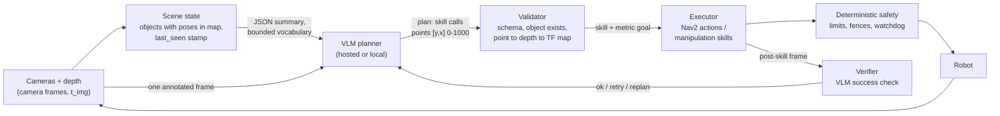

# Language models and VLMs as task planners and perception oracles (as of 2026-09)

Verification convention: every number links a source in **Sources** or carries "(unverified)".
Where a paper reports no number in its abstract or project page, this note says so rather than
quoting one from memory. Model availability and prices are as of the dates given; API models
churn faster than anything else in this library.

## What it is

A pretrained language model or vision-language model sits above the control loop and does one
or more of four jobs:

1. **Task planner**: turn an instruction plus a description of the scene into a sequence of
   skill calls (SayCan, Inner Monologue, SayPlan).
2. **Program synthesizer**: emit code that composes perception and control APIs (Code as
   Policies, VoxPoser, ReKep).
3. **Perception oracle**: answer grounded questions about the image: where is X, which point
   to grasp, did the step succeed (Molmo pointing, MOKA, PIVOT, Gemini Robotics-ER, OpenEQA).
4. **Reward or success signal**: score trajectories or images so an RL loop or an executor
   can proceed without a hand-written reward (RoboCLIP, RL-VLM-F, SuccessVQA).

The model itself never closes a 10 to 50 Hz loop. Something else does: a scripted skill, a
motion planner, Nav2, or a VLA. The design question is where to draw the line between what the
VLM decides and what deterministic code enforces. `library/topics/vision-language-action-models.md`
covers the case where the VLM is fine-tuned into the policy; this note covers the case where it
stays a frozen reasoning service.

## Why it matters in the field

- **Re-tasking without data collection.** A skill library plus a planner handles instructions
  nobody demonstrated. PaLM-SayCan executed 74% of 101 kitchen instructions (84% correct plans)
  with fixed skills [SayCan]. That is the mechanism a customer sees as "it understood me".
- **Explainability a customer can audit.** A plan is a list of skill names; a ReKep constraint is
  a readable Python function [ReKep]; a Gemini Robotics-ER trajectory is a list of points
  [GR-ER-1.5]. A VLA gives you none of that.
- **The reader's own work is this pattern.** GraphEQA (Hydra scene graph plus task-relevant
  images as VLM memory, hierarchical planning over the graph) [GraphEQA] and the Nav2-based
  "From Words to Waypoints" system on the ROBOTIS AI Worker are planner-over-navigator designs.
  The manipulation side (VLM points, skill executes) is the same architecture with a different
  bottom layer.
- **Hosted embodied-reasoning APIs are now a product.** Gemini Robotics-ER 1.5 shipped in the
  Gemini API on 2025-09-25 [GR-ER-1.5]; ER 1.6 followed on 2026-04-14 [GR-ER-1.6]; the API docs
  now list `gemini-robotics-er-2-preview` and a streaming variant, with 1.6 marked deprecated
  [GR-ER-docs]. A team can buy pointing, success detection and task planning per token instead
  of building it.
- **The failure modes are different from a VLA's.** A VLA fails by drifting or ignoring language.
  A planner fails by hallucinating an object, confusing frames, or acting on a stale scene. The
  mitigations (schemas, verification loops, frame discipline) are engineering, not training.

## Key methods

### Lineage table

| System (year) | Model used | Output the robot consumes | Executor | Evidence in primary source |
|---|---|---|---|---|
| SayCan (2022) | PaLM (text only); affordance from value functions | Next skill name, scored by LLM likelihood x affordance | ~Hundreds of learned/scripted skills on a mobile manipulator (count unverified) | 101 instructions, 2 scenes: 84% plan, 74% execution [SayCan] |
| Inner Monologue (2022) | LLM + success detector, scene describer, human feedback in the prompt | Next skill, replanned from textual feedback | Same skill stack; sim and real tabletop, real kitchen | Closed-loop feedback "significantly improves" completion; no headline number in abstract [InnerMonologue] |
| Code as Policies (2022) | Code LLM (Codex-class) | Python "language model programs" calling perception and control APIs | Impedance controller, pick-place, trajectory APIs on real robots | Hierarchical code-gen prompt: 39.8% HumanEval; robot evals qualitative plus custom benchmarks [CaP] |
| VoxPoser (2023) | LLM writes code; VLM grounds object names | 3D voxel value maps (affordance and constraint) | MPC over the value maps, closed loop | "Large-scale study" in sim and real; numbers in paper only [VoxPoser] |
| PIVOT (2024) | GPT-4V / Gemini class (unverified which) | Selected candidate from arrows or points drawn on the image, refined iteratively | Direct low-level commands, zero-shot | Real navigation and manipulation; authors state performance "far from perfect" [PIVOT] |
| MOKA (2024) | GPT-4V | Keypoints and waypoints picked from marks (candidate points, grids, captions) drawn on the image | Motion primitives from points; distilled policy optional | Tool use, deformables, rearrangement on a tabletop; numbers in paper only [MOKA] |
| ReKep (2024) | GPT-4o writes constraints; DINOv2 proposes keypoints | Python cost functions over 3D keypoints, solved by hierarchical optimization to SE(3) EE poses | Two platforms: mobile single arm, stationary bimanual | Multi-stage, bimanual, reactive tasks without task-specific data; success rates in paper only [ReKep] |
| Molmo / MolmoAct (2024/2025) | Open VLM trained on PixMo-Points | 2D points (Molmo); depth tokens, visual trace, actions (MolmoAct) | MolmoAct acts directly; Molmo points feed any skill | MolmoAct-7B-D: 70.5% SimplerEnv visual matching zero-shot, 86.6% LIBERO; 10k+ trajectory dataset released [Molmo], [MolmoAct] |
| Gemini Robotics-ER 1.5 / 1.6 / 2 (2025-2026) | Hosted Gemini variant | JSON points `[y, x]` normalized 0-1000, boxes, trajectories, success verdicts, plans, tool calls | Whatever you wire behind function calling | ER 2 card: success detection 87.7% (image), 82.4% (video), ERQA 78.5%, real VLA control 60.0% (protocols not public) [GR-ER-model] |
| OpenEQA (2024) | Benchmark, not a method | Free-form answer scored by LLM-Match | Episodic memory (EM-EQA) and active exploration (A-EQA) | 1,600+ questions, 180+ environments; GPT-4V "substantially" below human [OpenEQA] |
| GraphEQA (2024) | VLM planner over a 3D scene graph plus task-relevant images | Exploration target or answer | Simulated and real home/office robots | Higher success with fewer planning steps than baselines on HM-EQA and OpenEQA [GraphEQA] |
| SayPlan (2023) | LLM with semantic search over a hierarchical 3D scene graph | Plan validated by a scene-graph simulator, iteratively repaired | Classical path planner plus mobile manipulator | Up to 3 floors, 36 rooms, 140 assets and objects [SayPlan] |
| ConceptGraphs (2023) | LLM over an open-vocabulary object graph built from 2D foundation models | Object targets and relations for planning | Real robots (platform names not in abstract) | Scales "well in larger environments"; planning from language prompts [ConceptGraphs] |
| RoboCLIP (2023) | S3D-class video-text model (unverified) | Scalar reward from video-text or video-video similarity | RL agent | 2 to 3x zero-shot performance of IL baselines from one demo [RoboCLIP] |
| RL-VLM-F (2024) | Hosted VLM gives preferences over image pairs | Learned reward model | RL agent; rigid, articulated, deformable tasks | Outperforms prior VLM-reward methods "under the same assumptions" [RL-VLM-F] |
| SuccessVQA (2023) | Flamingo fine-tuned on human labels | Success / failure verdict | Sim household, real manipulation, egocentric video | Beats bespoke reward models out of distribution; real unseen videos remain hard [SuccessVQA] |

### The composition pattern

Every working system above has the same shape: the VLM produces a small, checkable artifact
(a skill name, a point, a keypoint set, a Python function, a JSON plan), and a deterministic
layer turns it into motion. The artifact is where you put the tests. The pattern in 2026:

- **VLM plans and points, VLA executes.** Gemini Robotics 1.5 is explicitly ER-model-over-VLA
  [GR-1.5]; ER 1.6 lists calling VLAs as a native tool [GR-ER-1.6]. The VLA handles contact-rich
  motion it was trained on; the ER model handles "which drawer, in what order, did it work".
- **VLM points, scripted skill executes.** MOKA and PIVOT: the point becomes a grasp or a
  waypoint; motion comes from IK plus a primitive. Cheapest to build, most brittle to clutter.
- **VLM writes constraints, optimizer executes.** ReKep and VoxPoser: the artifact is a cost
  function; the solver runs at control rate and absorbs perturbations. Best explainability,
  highest engineering cost.
- **LLM plans over a scene graph, Nav2 executes.** SayPlan, GraphEQA, and the reader's Nav2 work:
  the graph gives the LLM a bounded vocabulary of places and objects with poses in `map`, so the
  plan is grounded by construction and the frame problem is solved once, in the mapper.

### Diagram: where frames, staleness and verification live



The two seams that fail in practice are the arrows into VAL (a VLM point is in image
coordinates at time t_img, not a metric pose now) and the SG stamp (an object last seen 40 s
ago may have moved). Everything else is ordinary ROS 2.

### Prompt and tool schemas that work

- **Force structured output.** Gemini accepts a JSON Schema subset (`object`, `array`, `enum`,
  `minimum`/`maximum`, `anyOf`); the docs warn that "very large or deeply nested schemas may be
  rejected" and to "always validate values in your application" [Gemini-JSON]. Keep the plan
  schema flat: `{"steps": [{"skill": enum, "args": {...}}], "preconditions": [...]}`.
- **Points in the model's native convention, converted by you.** Gemini Robotics-ER returns
  `[y, x]` normalized to 0-1000 [GR-ER-docs]; Qwen2.5-VL returns absolute pixels `[x, y]` and
  `[x1, y1, x2, y2]` [Qwen2.5-VL]; Molmo returns points in its own normalized convention
  (unverified which). Wrap each model behind one `Pointer` interface that returns pixel
  coordinates in the frame you sent, and unit-test the conversion with a synthetic image.
- **Marks beat free text for spatial choices.** MOKA draws candidate points and a grid and asks
  the VLM to pick [MOKA]; PIVOT draws numbered arrows and iterates [PIVOT]. Picking from marks
  turns a regression the model is bad at into a classification it is good at.
- **Give the planner a bounded vocabulary.** SayCan scores only skills that exist [SayCan];
  SayPlan collapses the graph and lets the LLM expand nodes by semantic search [SayPlan].
  Never let the model invent an object id; the validator rejects ids not in the scene state.
- **Thinking budget is a latency knob.** ER 1.5 exposes a tunable thinking budget and reports
  accuracy rising with it [GR-ER-1.5]; the ER docs recommend a "medium" thinking level as the
  latency/quality trade [GR-ER-docs]. Use high budget for the plan, low or zero for per-step
  pointing and success checks.
- **Verification is a separate call with a separate prompt.** Inner Monologue's gain came from
  feeding success detection and scene description back into the plan [InnerMonologue]. Ask
  "did the gripper close on the red mug, yes/no, and what do you see" with the post-skill frame,
  not "continue the plan".

### Hosted vs local: latency and cost

| Option | Where it runs | Price / latency evidence | Fits |
|---|---|---|---|
| Gemini Robotics-ER 1.6 preview | Google API | $1.00 / M input tokens (text, image, video), $5.00 / M output; pricing page dated 2026-09-04 [Gemini-pricing]. Docs: complex queries, high-res inputs and high thinking levels raise processing time; no published latency figure [GR-ER-docs] | Plan, point, verify. Not a control-loop model |
| Gemini Robotics-ER 2 preview | Google API | Listed in docs with a streaming variant; price not on the pricing page at the time of writing (unverified) [GR-ER-docs] | Same, plus multi-robot orchestration claims [GR-ER-model] |
| Gemini 2.5 Flash / Pro | Google API | Flash $0.30 in / $2.50 out; Pro $1.25 in / $10 out per M tokens (<=200k prompt) [Gemini-pricing] | Generic VQA and planning without the robotics tuning |
| Qwen3-VL 2B / 4B / 8B / 32B (dense), 30B-A3B, 235B-A22B (MoE) | Local, Apache-2.0 [Qwen3-VL] | 8B in bf16 is ~16 GB of weights (2 bytes/param), so it fits a 24 GB RTX 4090 with headroom for a few images; 32B needs 4-bit quantization to fit (arithmetic, not a benchmark) | Local pointing and grounding; boxes and points supported |
| Molmo 7B-D / MolmoAct-7B-D | Local, open weights, code, data [Molmo], [MolmoAct] | 7B bf16 ~14 GB weights; the perception-foundation-models entry notes 16 GB+ or quantization | Pointing; MolmoAct acts directly |
| Gemma 3 4B / 12B / 27B | Local, open weights [Gemma3] | 4B fits an Orin with room; 27B needs a 4090 at 4-bit or an 80 GB card in bf16 (arithmetic) | General VQA, weaker grounding than Qwen/Molmo (from field, unverified) |
| InternVL 3.x | Local, open weights | Not evaluated here (unverified) | General VQA |
| Jetson AGX Orin 64 GB | Edge | 204.8 GB/s memory bandwidth per NVIDIA spec (unverified); decode is bandwidth-bound, so a 7B bf16 model tops out near 204.8 / 14 = ~15 tokens/s before any overhead, and 4-bit near 50 tokens/s. Prefill of image tokens dominates a pointing call, not decode | 2B to 4B models, or 7B at 4-bit for low-rate calls |

Two rules from this table. First, per-call cost is dominated by image tokens, so send one
downscaled frame per question and re-use the scene-state JSON rather than re-sending video.
Second, a hosted call is seconds, not frames. Code as Policies already noted that pauses between
commands were "mostly caused by OpenAI API query times and rate limiting" [CaP]. Budget the plan
call at 3 to 10 s and per-step verification at 1 to 3 s (from field, unverified), and design the
executor so the robot is never waiting on the network while in motion.

## Practical recipe: wiring a VLM planner to Nav2 and a manipulation skill library

The layout below is one node per responsibility, per `CLAUDE.md`. Package names are
suggestions.

1. **`scene_state` node.** Maintains the object memory: `{id, label, pose in map, covariance,
   last_seen_stamp, source_camera}`. Inputs: detector or ConceptGraphs/Hydra output (see
   `library/topics/state-estimation-and-localization.md`). Publishes a compact JSON summary on a
   latched topic and serves `GetSceneSummary` (filter by room, radius, label). This is the
   planner's only view of the world; the planner never reads raw detections.
2. **`vlm_gateway` node.** One interface, several backends (Gemini ER, Qwen3-VL local, Molmo).
   Services: `Plan(instruction, scene_json) -> plan_json`, `Point(image, query) -> pixels`,
   `Verify(image, expected_outcome) -> {ok, confidence, description}`. Logs every request and
   response with run id, model id, thinking budget, token counts and wall time. Retries with
   backoff; a failed call returns an explicit error, never a default plan.
3. **`plan_validator`.** Pure Python, unit-tested, no ROS dependency. Checks schema; every
   `object_id` exists in the scene summary and was seen within `max_age_s`; every navigation
   goal resolves to a `map` pose inside the free space of the static map; every grasp target has
   depth at the returned pixel. Converts image points to metric: pixel -> depth -> camera frame
   -> `tf2` lookup at the image stamp -> `map`. Rejects a plan with any failing step and returns
   the reason to the planner as text (the Inner Monologue loop).
4. **`task_executor`.** A behavior tree (BehaviorTree.CPP via `nav2_behavior_tree` patterns) or
   a `smach`-style state machine that dispatches steps:
   - Navigation steps call Nav2 through `nav2_simple_commander` (`goToPose`,
     `goThroughPoses`, `followWaypoints`, `isTaskComplete`, `getResult`, `cancelTask`)
     [Nav2-commander], or the `NavigateToPose` action directly from C++.
   - Manipulation steps call skill action servers (`Grasp`, `Place`, `OpenDrawer`, `Push`)
     that take metric goals in `base_link` and own their IK, approach and retreat.
   - After each step, capture one frame and call `Verify`. On failure: retry once with the same
     args, then ask `Plan` again with the failure description appended.
5. **`safety_layer`.** Deterministic, outside the planner: workspace fence, joint and Cartesian
   speed caps, stale-command watchdog, e-stop chain (see
   `library/topics/deployment-engineering.md`). A generated plan can request anything; this
   layer decides what executes.
6. **Code-generating planners (CaP, ReKep style)** get a sandbox: a restricted interpreter with
   an allow-list of API functions, no filesystem or network, wall-clock timeout, and dry-run
   against the scene state before any call reaches a controller. Log the generated source next
   to the run id so a failure can be replayed.

Tool schema the planner sees (abbreviated):

```json
{
  "skills": {
    "navigate_to": {"args": {"place_id": "string"}},
    "look_at": {"args": {"object_id": "string"}},
    "grasp": {"args": {"object_id": "string", "grasp_hint": ["top", "side", "handle"]}},
    "place_on": {"args": {"object_id": "string", "surface_id": "string"}},
    "open": {"args": {"object_id": "string"}},
    "ask_operator": {"args": {"question": "string"}}
  },
  "scene": [{"id": "mug_3", "label": "red mug", "room": "kitchen", "last_seen_s_ago": 12}],
  "output_schema": {"steps": [{"skill": "string", "args": {}, "expected_outcome": "string"}]}
}
```

`ask_operator` is deliberate: a planner that can ask beats one that guesses, and it gives the
evaluation a clean "deferred" outcome.

### Evaluation protocol for a planner-executor system

Write it before the first run (`sops/experiment-protocol.md`). Report, per condition, with trial
counts:

- **Task success** (binary, human judged) and **plan validity** (validator pass on first
  attempt), separately. SayCan reports both and the gap (84% vs 74%) is the executor's share
  [SayCan].
- **Steps and calls**: planning steps, VLM calls, tokens and cost per episode, wall time per
  episode. GraphEQA reports planning steps alongside success [GraphEQA]; a customer pays for both.
- **Blind baseline**: run the planner with no image and no scene state (OpenEQA's blind-LLM
  baseline [OpenEQA]). If it scores nearly the same, the benchmark is measuring priors, not
  perception.
- **Perturbations**: paraphrased instructions, moved objects between plan and execution,
  distractors with the same label, occluded targets, lighting. Report each condition separately.
- **Failure taxonomy** per failed trial: hallucinated object, wrong object among duplicates,
  frame or depth error, stale state, skill failure with a correct plan, verifier false positive,
  verifier false negative, API error or timeout. This table is what you fix from.
- **Determinism check**: repeat the identical episode (same images, same scene JSON) 10 times at
  temperature 0 and report plan agreement. Hosted models are not bit-reproducible.
- **Pin the model id and date** in the experiment record. ER 1.6 was deprecated within a year of
  release [GR-ER-docs]; a result without a model id is not reproducible.

## Practical gotchas

- **Hallucinated affordances.** The VLM will point at a handle that is painted on, or return a
  grasp on an object it inferred from context. ER 1.6's release note claims improvement at
  "correctly identifying absent objects" [GR-ER-1.6], which tells you the failure was common
  enough to advertise fixing. Mitigation: validator requires depth at the point and an object in
  scene state; marks-based prompting (MOKA) limits choices to detected candidates [MOKA].
- **Coordinate frame errors.** Three different point conventions across three vendors
  ([GR-ER-docs], [Qwen2.5-VL], Molmo); `[y, x]` vs `[x, y]` swaps produce plausible-looking
  wrong grasps. Depth lookup at the wrong stamp during motion gives a pose off by the robot's
  travel. Always transform at the image stamp with `tf2`, never "now".
- **Stale scene state.** ConceptGraphs-style maps are built once and go stale
  (`library/topics/state-estimation-and-localization.md`). A plan grounded on a 5-minute-old
  object pose is a plan for a different room. Put `last_seen` in the summary and let the
  validator enforce `max_age_s` per skill (looser for navigation, tight for grasps).
- **Non-determinism.** Same prompt, same image, different plan. Temperature 0 reduces but does
  not remove it on hosted models. Log the full request and response so a bad plan can be
  diffed against a good one.
- **Executing generated code.** Code as Policies runs LLM-written Python against robot APIs
  [CaP]. Without a sandbox this is remote code execution by prompt. Allow-list the API, deny
  imports, time-limit, dry-run, and keep the safety layer outside the interpreter.
- **Verifier bias.** SuccessVQA reports that generalization to unseen real videos "presents a
  substantially more challenging generalization problem" [SuccessVQA]. A VLM verifier tends to
  say "yes" to a plausible-looking scene. Calibrate it on 50 labelled post-skill frames per skill
  before trusting it, and report false-positive rate.
- **Cost creep.** Sending three 1080p frames per verification call at hosted prices adds up over
  a shift. Downscale to the model's effective input resolution (Qwen2.5-VL is dynamic
  resolution, so smaller images mean fewer tokens [Qwen2.5-VL]) and cache the scene summary.
- **Vendor churn.** Model ids in this note: `gemini-robotics-er-1.6-preview` (deprecated),
  `gemini-robotics-er-2-preview`, `gemini-robotics-er-2-streaming-preview` [GR-ER-docs]. Pin
  the id, and keep a local fallback (Qwen3-VL 8B) that can run the same `vlm_gateway` interface
  when the hosted model is retired or the site has no uplink.

## What a forward-deployed engineer must be able to do

1. Stand up `scene_state`, `vlm_gateway`, `plan_validator`, `task_executor` and the safety
   layer as ROS 2 Humble nodes, with the validator fully unit-tested off-robot.
2. Swap the VLM backend (hosted ER vs local Qwen3-VL/Molmo) behind one interface and show the
   accuracy, latency and cost difference on the customer's own scenes with trial counts.
3. Convert a VLM point to a metric grasp or navigation goal with correct stamps and frames, and
   prove it with a synthetic-image test and a tape measure.
4. Run the evaluation protocol above, including the blind baseline and the failure taxonomy,
   and present it in one page.
5. Sandbox a code-generating planner so a prompt cannot move the robot outside the fence.
6. Explain to a customer what the planner decides, what the executor guarantees, and what
   happens on a network outage.

## Open questions to learn hands-on

- On our scenes, how much does a scene-graph summary (GraphEQA style) beat "one wide image plus
  a list of detections" for plan validity, per VLM call spent?
- Pointing accuracy in pixels and in metres: hosted ER 2 vs Qwen3-VL 8B vs Molmo 7B-D on the
  same 100 frames from the AI Worker's cameras. The perception-foundation-models entry lists
  this as open too.
- Where the verifier's false-positive rate sits per skill after 50 calibration frames, and
  whether a two-view check (wrist plus head camera) fixes it.
- Real cost per episode at hosted prices for a 20-step fetch task, and where the local model
  becomes cheaper including the GPU it needs.
- ReKep-style constraints on the AI Worker arm: how long from first prompt to a working
  "put the mug on the shelf" versus scripting the skill directly.
- Whether planning over Nav2's `goThroughPoses` with VLM-emitted intermediate waypoints
  improves on `goToPose` plus the global planner, or just adds a way to fail.

## Related entries

- `library/topics/vision-language-action-models.md` (VLM fine-tuned into the policy; ER-over-VLA)
- `library/topics/perception-foundation-models.md` (detect-segment-track pipeline; Molmo, SAM)
- `library/topics/state-estimation-and-localization.md` (Hydra, ConceptGraphs, GraphEQA as maps)
- `library/topics/deployment-engineering.md` (safety layers, latency budget, serving)
- `library/topics/policy-evaluation.md` (confidence intervals, blinding, reporting template)
- `library/topics/real-world-rl.md` (where VLM rewards would plug in)
- `library/tools/ros2-humble.md`, `sops/experiment-protocol.md`, `sops/field-deployment-checklist.md`

## Sources

- [SayCan] Ahn et al., "Do As I Can, Not As I Say", arXiv 2204.01691: https://arxiv.org/abs/2204.01691 ; results page https://say-can.github.io/
- [InnerMonologue] Huang et al., arXiv 2207.05608: https://arxiv.org/abs/2207.05608
- [CaP] Liang et al., Code as Policies, arXiv 2209.07753: https://arxiv.org/abs/2209.07753 ; https://code-as-policies.github.io/
- [VoxPoser] Huang et al., arXiv 2307.05973: https://arxiv.org/abs/2307.05973 ; https://voxposer.github.io/
- [PIVOT] Nasiriany et al., arXiv 2402.07872: https://arxiv.org/abs/2402.07872 ; https://pivot-prompt.github.io/
- [MOKA] Fang et al., arXiv 2403.03174: https://arxiv.org/abs/2403.03174 ; https://moka-manipulation.github.io/
- [ReKep] Huang et al., arXiv 2409.01652: https://arxiv.org/abs/2409.01652 ; https://rekep-robot.github.io/
- [Molmo] Deitke et al., Molmo and PixMo, arXiv 2409.17146: https://arxiv.org/abs/2409.17146
- [MolmoAct] Lee et al., arXiv 2508.07917: https://arxiv.org/abs/2508.07917 ; https://huggingface.co/allenai/MolmoAct-7B-D-0812
- [GR-1.5] Gemini Robotics 1.5 paper, arXiv 2510.03342: https://arxiv.org/abs/2510.03342
- [GR-ER-1.5] Google developers blog, 2025-09-25: https://developers.googleblog.com/building-the-next-generation-of-physical-agents-with-gemini-robotics-er-15/
- [GR-ER-1.6] DeepMind blog, 2026-04-14: https://deepmind.google/blog/gemini-robotics-er-1-6/
- [GR-ER-docs] Gemini API robotics overview (model ids, `[y, x]` 0-1000, thinking levels): https://ai.google.dev/gemini-api/docs/robotics-overview
- [GR-ER-model] Gemini Robotics-ER model page (ER 2 preview benchmark card): https://deepmind.google/models/gemini-robotics/gemini-robotics-er/
- [Gemini-pricing] Gemini API pricing, last updated 2026-09-04: https://ai.google.dev/gemini-api/docs/pricing
- [Gemini-JSON] Gemini API structured output: https://ai.google.dev/gemini-api/docs/structured-output
- [OpenEQA] Majumdar et al., OpenEQA (CVPR 2024): https://open-eqa.github.io/
- [GraphEQA] Saxena et al., arXiv 2412.14480: https://arxiv.org/abs/2412.14480 ; https://github.com/SaumyaSaxena/GraphEQA
- [SayPlan] Rana et al., arXiv 2307.06135: https://arxiv.org/abs/2307.06135
- [ConceptGraphs] Gu et al., arXiv 2309.16650: https://arxiv.org/abs/2309.16650
- [RoboCLIP] Sontakke et al., arXiv 2310.07899: https://arxiv.org/abs/2310.07899
- [RL-VLM-F] Wang et al., arXiv 2402.03681: https://arxiv.org/abs/2402.03681
- [SuccessVQA] Du et al., Vision-Language Models as Success Detectors, arXiv 2303.07280: https://arxiv.org/abs/2303.07280
- [Qwen3-VL] https://github.com/QwenLM/Qwen3-VL (sizes, dates, Apache-2.0)
- [Qwen2.5-VL] Qwen blog (absolute pixel grounding, dynamic resolution): https://qwenlm.github.io/blog/qwen2.5-vl/
- [Gemma3] Gemma 3 technical report, arXiv 2503.19786: https://arxiv.org/abs/2503.19786
- [Nav2-commander] nav2_simple_commander README: https://github.com/ros-navigation/navigation2/blob/main/nav2_simple_commander/README.md
- Jetson AGX Orin specifications (bandwidth figure not re-verified this session): https://www.nvidia.com/en-us/autonomous-machines/embedded-systems/jetson-orin/
