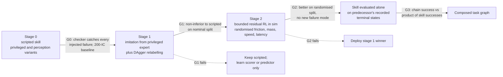

# Learning grasp, lift and orient skills for the pork-leg cell

Papers were read in full from their arXiv PDFs on 2026-09-15 at the versions named in Sources,
except where a line says otherwise. Four exceptions carry their own tag: Hogan and Rodriguez's
IJRR 2020 paper (the ICRA 2018 arXiv version was read instead), Chavan-Dafle and Rodriguez's
IROS 2015 prehensile pushing paper (the ISER 2016 hardware validation was read instead), Manko
et al. 2024 (abstract only) and Allen et al. 1993 (not accessible).

## What it is

The cell has one leg at a time, 655 to 815 mm and 9.0 to 15.5 kg (`leg_population` in
`src/meat_cell_sim/product.py`), arriving on a belt at an assumed 0.30 m/s, and two routes to the
saw: (b1) grasp, lift, place aligned; (b2) grasp and turn the leg on the belt about its centre of
gravity until the hock lies on the blade plane
([alignment record](../../experiments/2026-09-15-alignment-approaches.md)). This note is about
turning each step into a learned skill that keeps a contract
(`src/skill_library/contract.py`: inputs, preconditions, outputs, success checks, declared
failures; recovery lives on the task graph in `graph.py`), is measured alone, and is then
composed. Three skills:

- **intercept_grasp**: close on the shank while the leg moves, prove the grip.
- **lift_place**: carry 9 to 15.5 kg without slip and release inside the saw tolerance.
- **orient_on_belt**: keep the leg on the belt and rotate it to the saw line.

State of the code on 2026-09-15. `SelectShankGrasp` and `AcquireShank`
(`src/meat_cell_sim/skills/grasp.py`) compute a world-frame target once from ground-truth pose
and move to it; the only test runs with `belt_speed_mps=0.0` (`tests/test_grasp_skill.py`, line
25). The intercept is therefore not scripted yet: the belt-frame tracker exists
(`src/meat_cell_sim/tracking.py`) but no skill uses it. No lift-place or orient skill exists, and
nothing is learned.

## Why it matters (the meat cell)

Every published learned result below was measured on a lighter object, a slower target, or both,
and the gaps are large enough to decide what gets learned. The fastest real learned dynamic grasp
read here runs at 8 cm/s; the heaviest real payload under a learned manipulation policy is 1 kg;
the heaviest real object in a pivoting or sliding experiment is 5.5 kg with no trial count; the
only learned grasp of raw meat is 41/101. The cell needs 30 cm/s, 9 to 15.5 kg, and wet tissue at
once. So the plan below keeps the geometry and control that physics already gives (belt-frame
tracking, IK, acceleration caps from payload, the saw's datum) scripted, and learns the parts
where the scripted version has no model: when and where to close on a moving, deformable shank,
whether a grip is about to slip, and how to turn a leg whose belt friction is unknown.

## 1. Intercept-grasp: learned closed-loop grasping of moving objects

### Evidence

| Work | Sim or real | Target motion | Learned part | Data and compute | Result with trials |
|---|---|---|---|---|---|
| QT-Opt ([Kalashnikov et al. 2018](https://arxiv.org/abs/1806.10293), v3) | Real, 7 KUKA IIWA | Static bins; perturbation tests | Q-function over image, gripper state and height; CEM action selection (N=64, M=6, 2 iterations) | 580k off-policy plus 28k on-policy grasps, about 800 robot hours; 10 P100 GPUs, 1000 Bellman updater jobs, up to 15M gradient steps (Sec. 4.3, 5, App. C) | 96% on unseen objects over 714 attempts (7 robots x 102); 87% off-policy only; ball pushed out of the gripper 28/38 against 4/25 for the prior method (Table 1, App. A) |
| [Levine et al. 2016](https://arxiv.org/abs/1603.02199) (v4) | Real, 6 to 14 arms | Static; moving objects only qualitative | Grasp-success CNN, CEM servoing at 2 to 5 Hz | About 800k attempts over two months (QT-Opt's Table 1 says 900k for the same data) | Failure 20% against 43% open loop, N=100 with replacement (Table 1) |
| GG-CNN ([Morrison et al. 2018](https://arxiv.org/abs/1804.05172), v2) | Real, Kinova Mico | Object moved by hand at least 100 mm and 25 degrees during the attempt | 62,420-parameter depth CNN; PBVS at up to 50 Hz, 19 ms pipeline on a GTX 1070 | Cornell set, 885 images augmented to 8,840 | 83% (66/80) adversarial, 88% (106/120) household, 81% (76/94) dynamic clutter; updates stop about 70 mm from the object (depth range) |
| [Akinola et al. 2021](https://arxiv.org/abs/2103.10562) (v1) | Sim (PyBullet) and real UR5 | Conveyor at 4.46 cm/s real; 1 to 5 cm/s sim | Motion-aware grasp-quality MLP, LSTM motion predictor; reachability field and PRM are not learned | 10,000 sim grasp attempts per object; about 5 min training per object | Sim UR5 linear 5 cm/s 0.874 against 0.284 without prediction, 700 trials per cell; real 4/5, 5/5, 3/5 over three objects (Table I) |
| [Jia et al. 2023](https://arxiv.org/abs/2302.08463) (v3) | Sim only | 2 to 10 cm/s | PPO meta-controller choosing look-ahead time and planning budget over a classical planner | About 150,000 episodes, about 24 h, 5 seeds | 0.554 against 0.434 grid search in household clutter, 2,000 to 10,000 trials per cell (Table I) |
| AnyGrasp ([Fang et al. 2023](https://arxiv.org/abs/2212.08333), v2) | Real, Flexiv Rizon, wrist L515 | Robot fish in water, speed not reported | Grasp detector; future pose from a 10-frame momentum buffer | GraspNet-1Billion plus 168 scenes, one 2080 Ti | 75.5% over 5 runs of 8 fish; "nearly half" of failures were the fish slipping away |
| [Marturi et al. 2019](https://doi.org/10.1007/s10514-018-9799-1) | Real | Object moved by a human for about 30 s, speed not reported | None (tracking planner plus global re-grasp planner) | n/a | 57/60 over 6 objects (Table 1) |
| [Cao, Xu, Zhang 2025](https://doi.org/10.3390/machines13100973) | Sim only (PyBullet, Panda) | Belt 0.03 to 0.22 m/s | PPO end to end | About 24M steps per algorithm; PPO 3 h 39 min on CPU | Soda can 80% at 3 to 5 cm/s, 50% at 15 to 18 cm/s, 2% at 18 to 22 cm/s, 100 trials per band (Table 3) |
| GAP-RL ([Xie et al. 2024](https://arxiv.org/abs/2410.03509), v1) | Sim training, real test | Conveyor up to 8 cm/s, turntable, handover | SAC over grasp candidates as points | 20,000 episodes of 100 steps, about 6 h on an RTX 4090 | Conveyor static 53/60, 4 cm/s 49/60, 8 cm/s 34/60 (Table IV); heuristic planner average 42.9% against 76.3% (Table III) |
| [Yamamoto et al. 2023](https://arxiv.org/abs/2309.12547) (v1) | Real, 4-DoF arm | Belt in rpm only (50 to 100) | CNN plus LSTM imitation at 10 Hz | 3 teleop demos time-resampled to 27 | 100% at untaught positions and speeds against 0% for 27 plain demos, 10 trials per condition (Table I) |
| GraspARL ([Wu et al. 2022](https://arxiv.org/abs/2203.02119), v2) | Sim, real toy car | About 5 cm/s real | Adversarial RL (mover against grasper) | Not reported | Real 4/5 and 3/5 |

Classical baseline. No classical visual-servoing-on-conveyor paper with a measured success rate
was obtained: Allen et al. 1993 (IEEE T-RA 9(2):152-165) was not accessible, and the 5 Hz figure
for its 1991 predecessor comes from a search snippet (unverified). The measured non-learned
comparisons available are GG-CNN's open-loop runs (38% worst case under simulated kinematic error
against 68% and 73% closed loop) and Akinola's no-prediction ablation. ABB's tracking accuracy of
plus or minus 2 mm at 150 mm/s is the vendor baseline
([conveyor-tracking-and-visual-servoing](conveyor-tracking-and-visual-servoing.md)).

### What it implies for the cell

1. Nothing learned has been tested at 0.30 m/s on a real arm. Cao et al.'s sim curve falls from
   80% to 2% between 5 and 20 cm/s with a policy that must infer belt motion from pixels; the
   policies that held up (Akinola, Jia, GAP-RL) put a motion model or planner under the learned
   part. Put the encoder-driven belt frame under every learned intercept component, so the policy
   sees a nearly stationary leg ([conveyor note](conveyor-tracking-and-visual-servoing.md), learned
   visual servoing).
2. Learned closed loop beats open loop when the target moves after the last look: GG-CNN, QT-Opt's
   perturbation test, Levine's open-loop comparison. On this belt the leg moves relative to the
   belt only through slip, so the benefit is bounded by measured slip, which `tracking.py` already
   reports as `slip_mps`.
3. Data needed spans four orders of magnitude and depends on what is learned: 3 demos augmented to
   27 (Yamamoto, one task), 20,000 sim episodes (GAP-RL), 580k real grasps (QT-Opt, generalisation
   across objects). The cell has one object class, so the low end applies.

## 2. Lift-place: heavy and deformable objects, slip, regrasp

### Evidence on slip prediction and regrasp

| Work | Sensor and model | Data | Result with trials |
|---|---|---|---|
| [Calandra et al. 2018](https://arxiv.org/abs/1805.11085) (v2), real Sawyer, WSG-50, two GelSight | Grasp-outcome CNN over tactile, vision and action; regrasp by sampling 5,000 actions, lift above predicted 0.9 | 6,450 grasps on 65 objects (18,070 after augmentation) | Offline accuracy 80.28% tactile+vision, 73.03% vision, 62.80% chance (Table I). Unseen easy set 94.0% against 63.2% vision only; hard set 73.6% against 50% after retraining on 25,404 on-policy points (Table II). Minimum-force mode 94/100 at 10 N mean against 20 N |
| [Li, Dong, Adelson 2018](https://arxiv.org/abs/1802.10153) (v1), real UR5, GelSight plus webcam | Pretrained CNN on 8 frames plus LSTM | 1,102 grasps on 84 objects (the abstract says 94 objects and more than 1,200) | 88.03% slip detection on 152 grasps of 10 unseen objects; 71% for the prior threshold method |
| [Veiga et al. 2015](https://users.cs.utah.edu/~thermans/papers/veiga-iros2015-slip-control.pdf), real PA-10, BioTac | Random forest slip predictor driving grip force | 70 trials over 7 objects | Closed-loop stabilisation 74.28% (70 trials per column), 44.28% with single-step features (Table V); per object 10% to 100% |
| Tactile Regrasp ([Hogan et al. 2018](https://arxiv.org/abs/1803.01940), v2), real ABB IRB 1600id, GelSlim | ResNet-50 grasp quality, labelled by shaking | About 2,800 grasps on 12 objects | 85% on known and 75% on novel objects. Regrasp on 8 objects chosen partly for weight, 100 grasps each: the heavy object 38% to 61%; range 17 to 75% before, 49 to 93% after (Table II) |
| RoBUTCHER gripper ([Takacs et al. 2023](https://arxiv.org/abs/2307.05648); [Takacs et al. 2024, Sensors](https://doi.org/10.3390/s24144631)), real pig carcass | Farneback optical flow in an in-finger camera, 640x480 at 30 fps on a Pi Zero W | Not reported | Gripper rated for 30 kg static; held pig legs and organs of 15 to 25 kg. Slip detection "ran smoothly" but was not used in real time; "only a few slippages occurred, and these were all detected", no counts |

### Evidence on payload and heavy objects

| Work | Setting | Result with trials |
|---|---|---|
| TAM ([Son et al. 2026](https://arxiv.org/abs/2606.06218), v2), sim-trained, real Franka | Unknown 1 kg payload | End-effector RMSE 1.29 +/- 0.35 cm carried against 6.04 +/- 0.51 direct and 4.65 online SysID, 10 real trials per condition (Table 2); box push 76.2% against RMA 52.4% over 21 trials (Table 1) |
| RMA² ([Liang et al. 2023](https://arxiv.org/abs/2312.04670), v1), sim only, ManiSkill2 | Density multiplier 0.5 to 5.0 in training | YCB pick-place 73.8% against ADR 1.6% over 5,000 episodes and 3 seeds (numbers from the HTML version, unverified) |
| [Gholampour et al. 2025](https://arxiv.org/abs/2504.16224) (v2), real UR5e, not learned | 1.5 kg payload, F/T accuracy about 407 g | z-RMSE 1.988 mm with mass compensation at k=300 against 20.584 mm without; trials per condition not reported (Table 3) |

No learned lift-and-place of an object over 5 kg with a trial count was found. The heaviest
learned payload with real trials is TAM's 1 kg.

### Evidence on food and meat

- ChicGrasp ([Davar et al. 2025](https://arxiv.org/abs/2505.08986), v1): UR10e, 4 kg pneumatic
  dual jaw, Diffusion Policy from 50 SpaceMouse demos of 25 to 40 s, action (x, y, z, left jaw,
  right jaw), 600 epochs on an 80 GB A100. 41/101 pick-and-rehang (40.6%), per bird 7/15, 20/31,
  14/55; success includes a 50 mm lift without slip. The learned part stops once both jaws read
  closed for three frames, and a scripted seven-waypoint lift takes over
  ([library entry](../papers/davar-2025-chicgrasp.md)). Baseline counts IBC 0/30 and LSTM-GMM
  1/60 are in the library entry's reading of Table I; a second read on 2026-09-15 could not
  confirm them (unverified). Cycle time is 38 s in the abstract and 28 s in Table I.
- [Misimi et al. 2018](https://arxiv.org/abs/2309.12856) (IROS 2018, author version): Denso VS087
  with a ReFlex TakkTile hand, 525 demonstrations on 20 lettuces, one-class SVM filtering of
  inconsistent demos, SVR policy; 75% over 70 grasps. Failures were gripper orientation or low
  finger force, "resulting in a bad grip and consequent slip".
- Sashimi-Bot ([Herland et al. 2025](https://arxiv.org/abs/2511.11223), v1): salmon loin
  shape-servoing policy trained by DRL only in Isaac Gym flex, 96,000 episodes, 40 h on a V100;
  zero-shot validation used a rice-filled cloth, not salmon, 30/30. Knife-contact classifier 95%
  accuracy and 67% recall on 20 held-out trajectories; slice picking 74/75.
- Manko et al. 2024, U-Net gripping-point heatmaps on 25 pig carcasses, 13 mm distance error
  (Smart Agricultural Technology 8:100486, abstract only; gripping success not obtained,
  unverified).

### What it implies for the cell

1. Slip predictors reached 74% to 94% on real objects under 1 kg with 70 to 6,450 labelled grasps.
   The sim can label thousands of lifts, but MuJoCo's flat jaw on a convex hull holds only 0.60 to
   0.70 of its friction rating (measured 2026-09-14, `tests/test_grippers.py`, alignment record
   caveats), so sim slip labels are biased toward slipping and a sim-trained predictor has to be
   relabelled on real lifts.
2. The payload is known physics. Mass comes from the F/T reading at the 5 mm proof lift that
   `AcquireShank` already performs, and the acceleration cap follows from friction and pad force
   ([grasp-selection-for-soft-slabs](grasp-selection-for-soft-slabs.md), section 5). The
   trajectory stays scripted. Learning goes where no model exists: predicting slip from wrench
   history and correcting the place pose from the in-hand view.
3. ChicGrasp's hand-off (learned grasp, scripted lift) is the pattern with the only meat evidence,
   and its failures were at the pick, not in the scripted carry.
4. For the SCARA, lift-place fails on physics before learning matters: 1.78 kg m^2 for a hock
   grasp on a 12.7 kg, 0.9 m leg against the SR-20iA's 0.45 kg m^2 J4 limit
   ([arm-selection](arm-selection-scara-vs-six-axis.md), section 3). Log it per episode as a
   precondition value, never as a learned constraint.

## 3. Orient-on-belt: planar rotation with friction

### Evidence

| Work | Setting | Friction handling | Data and compute | Result with trials |
|---|---|---|---|---|
| [Hogan and Rodriguez 2016](https://arxiv.org/abs/1611.08268) (v1), real ABB IRB 120 | 1.05 kg aluminium block pushed on plywood | Ellipsoidal limit surface, slider-table mu 0.35 (Table 1) | MIQP family-of-modes MPC, N=35, h=0.03 s | Target tracking within 0.01 m; one straight and one three-target run shown, repeats not reported |
| [Hogan and Rodriguez 2018](https://arxiv.org/abs/1710.05724) (v2, ICRA version; IJRR 2020 numbers unverified) | 0.827 kg block, figure-eight track at 0.05 m/s | Same model; learned mode classifier | 117,630 labelled points for the classifier | Convex MPC at 250 Hz against 20 Hz for MIQP; 7 consecutive laps plus one with hand perturbation; tracking error not reported numerically |
| [Hou, Jia, Mason 2018](https://www.ri.cmu.edu/app/uploads/2018/03/ICRA2018_Reorienting_by_Pivoting.pdf), real ABB IRB120 | Pivoting a grasped object against the table | Coulomb mu at the table, fingertips assumed not to slip | 43 ms planning in single-thread Matlab | Sim 1,200 problems per batch, plots only; real one success and one failure shown, the failure "caused by errors in the initial grasp position and an underestimation of the friction coefficient between the object and the table" |
| [Bauza, Hogan, Rodriguez 2018](https://arxiv.org/abs/1807.09904) (v2), real | 0.827 kg block | GP push model learned from data | 5,000 points; about 200 points match the analytical model; 10 points give 14 mm | Mean tracking error 8.50 mm GP against 9.56 mm analytical at 80 mm/s (Table 1); repeats not reported |
| Push-Net ([Li, Hsu, Lee 2018](https://www.roboticsproceedings.org/rss14/p24.pdf)), sim training, real Fetch | Reorientation by pushing, unknown centre of mass | Centre of mass varied; friction randomisation not stated | 4.8x10^5 push sequences, about half a day | Real reorientation 1.00 on all 7 objects, 10 each; history-free variant 0.40 to 0.80 (Table V) |
| [Zhou and Held 2022](https://arxiv.org/abs/2211.01500) (v1), MuJoCo, zero-shot real Franka | Push against a wall, then grasp | ADR, table friction reached 0.1 to 0.5 | 160,000 steps to 100% on one object without randomisation; compute not reported | Real 78% with randomisation against 33% without, 10 objects x 10 (Table 4); 345 g box 4/10 |
| HACMan ([Zhou et al. 2023](https://arxiv.org/abs/2305.03942), v5), zero-shot real | 6D object pose alignment by pushing | Object scale only; no friction randomisation | 200k to 500k steps, compute not reported | Sim unseen category 0.827 at 200k steps (Table 2); real 100/200 overall, planar goals 47/67 (70%) |
| CORN ([Cho et al. 2024](https://arxiv.org/abs/2403.10760), v1), Isaac Gym, real | Non-prehensile 6D pose | Table friction 0.3 to 0.8, mass 0.1 to 0.5 kg | 2 billion steps or 24 h, 4,096 envs | Real 57/80 (71.3%) over 16 objects x 5 (Table 1); gripper gloved to match sim friction |
| [Peng et al. 2018](https://arxiv.org/abs/1710.06537) (v3), real Fetch puck push | 0.2 kg puck | 95 parameters, puck friction 0.1 to 5, latency 0.04 s plus Exp | About 100M samples, 8 h on 100 cores | LSTM with randomisation 0.89 +/- 0.06 real over 28 trials; feedforward without randomisation 0.0 over 10 (Table II); fixing only friction dropped to 0.48 over 27 (Table III) |
| [Kolbert, Chavan-Dafle, Rodriguez 2016](https://arxiv.org/abs/1702.07252) (v2), real IRB120 | Sliding and pivoting inside a force-controlled grasp, 72.5 to 200.5 g | Identified finger mu 0.35 to 0.5, environment 0.2 to 0.3 | 420 runs per object linear, 630 pivoting | Push force predicted 6 N against 6.2 N measured; pivot torque error up to 0.01 N m |
| [Shirai et al. 2025](https://arxiv.org/abs/2508.01082) (v2), MuJoCo SAC, real | Pivoting a 110 g box against a wall | Table and wall mu 0.01 to 0.4, object mu 0.2 to 0.7 | 5,000 trajectory-optimisation demos, 4 h on an RTX 4090, 10 Hz policy | 3/3 at each assumed mass against 0/3 for the kinematic policy at 300 g (Table 1); "significantly more challenging when the range of domain randomization over table and wall coefficients increases" |
| [Fakhari et al. 2020](https://arxiv.org/abs/2012.06022) (v2), sim only | Dual-arm Baxter pivoting a 2 kg object on the ground | Friction and torque limits in grasp-force synthesis | 1.5 s per planning iteration | No hardware |
| [Implicit contact-rich planning, 2023](https://arxiv.org/abs/2302.13212) (v1), real xArm7 on a base | 2.5 kg tatami and 5.5 kg cabinet with the table taking weight | Contact margin | Planner | Planning 90% flipping, 50 to 60% unloading over 10 attempts (Table I); real run counts not reported |

### What it implies for the cell

1. Friction is the variable that fails transfer. Peng lost 0.41 of success by fixing friction
   alone; Zhou's randomisation took real success from 33% to 78%; Hou's hardware failure was a
   friction underestimate. Antonova et al.'s in-grasp pivoting policy, trained with 10% friction
   noise, kept 40% success in sim when friction changed by 250 to 500%, and scored 28/30 and 25/30
   on a Baxter with 26 and 33 g tools ([Antonova et al. 2017](https://arxiv.org/abs/1703.00472),
   Table II). The leg's belt friction is a guess (`LegConfig.friction_slide = 0.45`,
   no measured value exists, [arm-selection](arm-selection-scara-vs-six-axis.md) section 8), so
   train over 0.15 to 0.5 and report success against friction, not one number.
2. A history input matters when a hidden parameter decides the motion: Push-Net with history 1.00
   against 0.40 to 0.80 without; Peng's randomised success was measured with an LSTM. Give the
   orient policy a short history of grasp-point pose and jaw wrench so it can infer friction
   during the turn.
3. The prehensile version is better conditioned than pushing because the gripper fixes the
   rotation centre up to grip slip ([arm-selection](arm-selection-scara-vs-six-axis.md), section
   4). Kolbert et al. showed the in-grasp sliding model predicting force to within 0.2 N on 200 g
   objects; motion cones planned such in-grasp pushes in 0.45 to 0.67 s against 592 to 32,657 s for
   a complementarity solver, on objects of 62 to 202 g, with slip only reported qualitatively over
   2,000 pushes ([Chavan-Dafle et al. 2018](https://arxiv.org/abs/1810.00219), Table II); at 9 to
   15.5 kg nobody has measured it. Widening the friction range made Shirai's
   learning multimodal (stick or slide), which is the case for a diffusion or chunked head once
   the expert shows both.
4. Every learned non-prehensile policy here was trained on objects of 0.5 kg or less. Belt drag
   on a 15.5 kg leg at mu 0.5 is about 76 N at the belt (m g mu), carried as jaw tangential force
   and torque about the grasp. Log jaw slip per step; it is the failure the literature has no
   data on.

## 4. Per-skill design

### Training table

| | intercept_grasp | lift_place (b1) | orient_on_belt (b2) |
|---|---|---|---|
| Stays scripted | Belt-frame tracker (`tracking.py`), IK (`solve_ik`), proof lift and grip checks from `AcquireShank`, shield | Mass estimate from F/T at the proof lift, S-curve transport with acceleration cap from mass and pad friction, IK, release sequence | IK executor, shield (IK residual, joint limits, tilt_drop under 1 degree, SR-20iA annulus), release before the hold-down ramp |
| Learned | Stage 1: chunked tool-target policy in the belt frame plus close logit. Stage 2: bounded residual on the stage 1 winner (scripted or learned) | Slip predictor (classifier) gating slow-down or regrasp; bounded residual on the place pose at release | Planar pose chunk of the grasped point (the `OrientLeg` design in [cross-embodiment](cross-embodiment-skill-transfer.md)), then a bounded residual trained over friction |
| Observation | Leg pose (x, y, yaw) in the belt frame and its age; leg length and mass estimate; tool pose and velocity in the belt frame; gripper opening; encoder belt speed; distance to window end. Depth crop around the shank once perception replaces ground truth | Flange wrench history (6 x 10 steps), gripper opening, commanded tool acceleration, mass estimate, grasp fraction; in-hand leg pose from the verification view at the place pose | Leg pose relative to the saw line; grasp-point planar pose; leg length and mass; belt speed; time since grip; planar jaw wrench (fx, fy, mz) at the grasp point; 5-step history of all of these |
| Action | Absolute tool target (x, y, z, yaw) in the belt frame, chunk of 8 at 20 Hz, plus close logit; residual bounded to 20 mm and 5 degrees (proposal) | Predictor: p(slip within 0.5 s). Residual: (dx, dy, dyaw) on the release pose, bounded to 15 mm and 5 degrees (proposal) | Chunk of 8 absolute (x, y, yaw) grasp-point targets in the belt frame at 10 Hz plus release logit; residual bounded to 10 mm and 3 degrees (proposal) |
| Data source | Privileged scripted expert in sim (true pose), DAgger relabelling by the same expert in sim, then residual RL in sim with the contract success as sparse reward | Scripted sweeps in sim over acceleration scale, grasp fraction, pad friction and leg, labelled by measured in-hand slip; later relabelled on real lifts | Floating-gripper expert with true pose and friction; DAgger relabelling; residual RL with friction 0.15 to 0.5 and belt speed randomised |
| Published sample counts for comparable learning | 27 augmented demos (Yamamoto); 10,000 sim attempts per object (Akinola); 20,000 sim episodes (GAP-RL); 580k real (QT-Opt) | 70 trials (Veiga); about 2,800 (Hogan); 6,450 (Calandra); 50 demos for a learned meat grasp (ChicGrasp) | About 200 real pushes to match an analytical model (Bauza); 5,000 TO demos plus SAC (Shirai); 160k to 500k steps (Zhou, HACMan); 4.8x10^5 sequences (Push-Net); 100M samples (Peng) |
| Published compute | GAP-RL 6 h on one RTX 4090; Cao PPO 3 h 39 min CPU; QT-Opt 10 P100 plus 1000 CPU jobs | Calandra, Hogan: not reported; ChicGrasp 600 epochs on an A100 | Shirai 4 h on one RTX 4090; Peng 8 h on 100 cores; CORN 24 h |
| Our compute | 200 expert episodes and ACT or DP training on a rented RTX 4090, about 6 GPU-hours and under $10 ([learned-vs-scripted record](../../experiments/2026-09-15-meat-cell-learned-vs-scripted.md), estimate). Residual RL step budget unknown until sim throughput is measured | Classifier on CPU; sweep cost is sim throughput times 1,200 lifts (unmeasured) | MLP on CPU; `rll` has no torch and the GPU driver reported a version mismatch on 2026-09-15 ([cross-embodiment](cross-embodiment-skill-transfer.md), build order) |
| Evaluation alone | 200 paired ICs per split (nominal, randomised), belt speeds 0.1, 0.2, 0.3 m/s in training and 0.25, 0.35 held out; McNemar against scripted; per arm | 200 start states from the intercept skill's recorded terminal states; slip-predictor AUROC and false-negative rate on held-out legs; place error distribution | E0 to P2 conditions of the cross-embodiment design, 5 held-out legs x 20 arrivals = 100 per condition; success against friction in 4 bins |

### Contracts

Field names follow `contract.py`. Every check returns the number it measured. Thresholds marked
(proposal) are design choices for the first experiment record; the saw tolerances are the
alignment record's assumptions, not the customer's.

**intercept_grasp**

| Field | Content |
|---|---|
| Inputs | `leg_estimate` (belt-frame pose, length, mass, stamp); `belt_state` (travel, speed); `shank_grasp` from `SelectShankGrasp`; `checkpoint_sha256` for learned variants |
| Preconditions | Leg on belt, origin within 20 mm of the surface (existing `_leg_on_belt`); jaws open 40 mm wider than the widest shank under the pads (existing `_jaws_fit`); meet point reachable inside the window with the dwell (the `plan_intercept` feasibility check in `snippets/conveyor_tracking.py`); belt speed and leg mass inside the training range (value: normalised distance, pass under 1.0); checkpoint hash matches the experiment record |
| Outputs | `grip_opening_m`, `lift_proof` (existing); `grasp_fraction_achieved`; `close_time_s` and belt travel at close |
| Success checks | Opening between half the shank width and 1.05 of the widest shank under the pads (existing); on the proof lift, tool rose at least 0.5 mm and the shank lagged by at most 1 mm (existing); grasp point within 20 mm along the leg of the target (proposal); tool-to-leg speed in the belt frame under 20 mm/s at close (proposal); close completed before the window end, margin at least 0 m |
| Failure modes | `unreachable`, `closed_on_nothing`, `slipped`, `lift_not_achieved` (existing); `missed_window`; `belt_strike` (pad or finger contact with the belt above a force threshold) |
| Recovery (task graph) | `closed_on_nothing` or `slipped`: open, retreat in the belt frame, retry once if the window still fits a dwell, else `let_pass`; `missed_window`, `unreachable`, `belt_strike`: `let_pass` to the manual station; `precondition_failed` on the distribution check: run the scripted variant |

**lift_place**

| Field | Content |
|---|---|
| Inputs | `lift_proof`, `shank_grasp`, `leg_estimate`; saw target line in the belt frame; `mass_estimate_kg` from the proof-lift wrench |
| Preconditions | Grip proven (intercept success); estimated flange load under the arm's payload curve at the planned reach; estimated leg inertia about the tool axis under the arm's allowable figure (SR-20iA J4 0.45 kg m^2); place pose reachable; drop point clear of the previous leg |
| Outputs | Leg pose at release in the belt frame; peak in-hand slip; peak tool acceleration; peak flange wrench; slip-predictor alarms |
| Success checks | Hock offset from the blade plane within 10 mm and trotter axis within 5 degrees of square at release, then the saw's `CutResult` reports `cut`; peak in-hand slip (grasp point in the tool frame) at most 5 mm (proposal); leg back on the belt, origin within 20 mm of the surface; settled, centroid moving under 0.5 mm per frame ([grasp-selection](grasp-selection-for-soft-slabs.md), section 6); arm clear before x = 0.48 m |
| Failure modes | `unreachable`, `slipped_in_transport`, `dropped`, `place_out_of_tolerance`, `released_late` |
| Recovery | `slipped_in_transport` flagged early by the predictor: lower to the belt, regrasp through intercept_grasp once; `dropped`: stop, `let_pass`, log for the floor station; `place_out_of_tolerance` with the arm still holding: re-place once, else hand to orient_on_belt if the leg is on the belt; `released_late`: `let_pass` |

**orient_on_belt**

| Field | Content |
|---|---|
| Inputs | `lift_proof`, `shank_grasp`, `leg_estimate`, saw target line, `checkpoint_sha256` |
| Preconditions | Grip proven; start pose reachable by this arm's IK; friction estimate (if measured) and leg mass inside the training range; checkpoint hash matches |
| Outputs | Leg pose at release; policy steps; peak jaw slip; peak tilt_drop; peak IK residual; centre-of-gravity drift in the belt frame |
| Success checks | Trotter axis within 5 degrees of the saw line and hock offset within 10 mm at release, then `CutResult` reports `cut` ([cross-embodiment](cross-embodiment-skill-transfer.md), contract); centre of gravity moved at most 30 mm in the belt frame during the turn (proposal, defines turning about the centre of gravity); grasp-point yaw within 3 degrees of tool yaw throughout (proposal, jaw slip); released and clear before x = 0.48 m |
| Failure modes | `unreachable`, `shield_rejected`, `slipped`, `leg_slid_not_turned` (drift check failed), `timeout` |
| Recovery | `slipped`: regrasp once through intercept_grasp, else `let_pass`; `leg_slid_not_turned`: release and `let_pass` (a second attempt starts from a pose outside the training distribution); `unreachable`, `shield_rejected`, `timeout`: release, `let_pass` |

## 5. Staged training plan

Each stage has a record in `experiments/` before it runs, with trial counts and the test fixed
([experiment-protocol](../../sops/experiment-protocol.md)). Gates are proposals until a record
adopts them.

**Stage 0, scripted baseline.** Build the privileged expert (true pose, true friction) and the
perception-based scripted skill for each of the three, sharing code with a `pose_source` switch
as the learned-vs-scripted record specifies. For intercept_grasp this means wiring `tracking.py`
into `AcquireShank` so the target moves with the belt; the current skill has never run on a moving
belt. Gate G0: every declared failure mode is produced on purpose (a stalled jaw, a shifted leg, a
target past the window) and the contract reports it; the scripted perception variant's success is
recorded on the frozen 200-IC lists per arm. The expert's own success is the ceiling; imitation
cannot exceed a demonstrator it copies, and T-STAR's programmatic demos
([Lee et al. 2021](https://arxiv.org/abs/2111.07999)) and IBRL's scripted Meta-World demos
([Hu et al. 2023](https://arxiv.org/abs/2311.02198)) both came from such experts. IBRL warns that
scripted demos are "much less noisy and cleaner" than human ones, so the stage 1 policy will not
see recovery states unless the expert is perturbed during collection.

**Stage 1, imitation.** 200 successful expert episodes per skill on the training distribution
(ACT used 50 per task and Diffusion Policy 90 to 284, [imitation-learning](imitation-learning.md)),
diversity in leg, speed and friction rather than repeats ([Lin et al. 2024](https://arxiv.org/abs/2410.18647)).
Because the sim expert can be queried at any state, add DAgger rounds: roll out the learner, label
its states with the privileged expert, aggregate ([Ross et al. 2011](https://arxiv.org/abs/1011.0686)).
MimicGen-style augmentation is the cheap way to widen coverage from few source episodes: 10 source
demos produced 1,000 and took Square from 11.3% to 90.7% in sim, and 10, 50 or 200 source demos
made no significant difference ([Mandlekar et al. 2023](https://arxiv.org/abs/2310.17596), Fig. 4);
SkillMimicGen's nut assembly scored 92% in sim and 35% zero-shot real
([Garrett et al. 2024](https://arxiv.org/abs/2410.18907)), so generated data does not settle
transfer. Gate G1: on the nominal split, the learned skill is within 5 points of the scripted
perception variant (paired McNemar, pre-registered margin, proposal) and produces no failure mode
the scripted skill never produces. If it fails, the skill stays scripted and learning is confined
to the scorer or predictor rows of the table.

**Stage 2, residual RL in sim.** Freeze the base (the G1 winner, which may be scripted) and learn a
bounded correction. Johannink et al. took a hand-designed insertion controller from 2/20 to 15/20
on tilted blocks with about 8,000 real samples, about three hours
([Johannink et al. 2018](https://arxiv.org/abs/1812.03201), Sec. VI-B). ResiP took Diffusion
Policy from 54% to 98% on one_leg and 12% to 94% on round_table, 1,024 sim evaluations each, with a
PPO residual scaled by 0.1 over up to 500M IsaacGym steps at about 4,000 steps per second across
1,024 environments, where scaling BC to 10,000 demos reached only 56%
([Ankile et al. 2024](https://arxiv.org/abs/2407.16677), Table I). Policy Decorator bounds the
residual to (-alpha, alpha) and ramps it in over H steps; StackCube trained in 7 h 23 min against
33 h 52 min for SAC fine-tuning on a 2080 Ti ([Yuan et al. 2024](https://arxiv.org/abs/2412.13630),
Table 15). The friction case has a sim precedent: on SlipperyPush, with friction 5 times lower than the base
controller assumed, a residual starting from about 0.45 converged to perfect success, and on
PickAndPlace with miscalibrated gains it reached 1.0 after about 1M steps, "nearly 10x" fewer than
learning from scratch (5 seeds, [Silver et al. 2018](https://arxiv.org/abs/1812.06298)).
Residuals are not uniformly good: in HIL-SERL's real ablations Residual RL averaged 32%
over three tasks against 100% for HIL-SERL and 57% for IBRL, with 200 demos
([Luo et al. 2024](https://arxiv.org/abs/2410.21845), Table 1b). Reward is the contract: 1 when
every success check passes, 0 otherwise, so the reward and the evaluator cannot disagree.
Randomise what Peng et al. found mattered: friction, mass, controller gains and action latency
([Peng et al. 2018](https://arxiv.org/abs/1710.06537), Table III). Gate G2: significantly better
than the base on the randomised split (McNemar, alpha 0.025 if two comparisons), no increase in
`shield_rejected` or `unreachable`, and the residual's magnitude distribution reported (a residual
pinned at its bound means the base is wrong, not that the residual is working).

Sim throughput decides whether stage 2 is feasible here. The cell steps MuJoCo at 2 ms and a 10 Hz
policy is 50 physics steps per action; ResiP's 500M steps assumed GPU-parallel simulation. Measure
steps per second of `Cell.step` with the leg, arm and saw on the laptop CPU before writing the
stage 2 record (unmeasured on 2026-09-15). If throughput is low, the published low-sample regimes
are the guide: Zhou and Held reached 100% on one object in 160,000 steps, and Johannink's residual
learned from 8,000 real samples.

**Stage 3, real robot (outside the sim plan).** When a real arm exists, the recipe with real trial
counts is HIL-SERL: 20 to 30 demos, a reward classifier from about 200 positives and 1,000
negatives, 1 to 2.5 h of training on one RTX 4090 for most tasks, 100 evaluation trials each
([library entry](../papers/luo-2024-hil-serl.md)). For a frozen diffusion base, DSRL went from 2/10
to 9/10 on a real Franka in 3,500 online steps, about 40 episodes, with RLPD at 0/10
([Wagenmaker et al. 2025](https://arxiv.org/abs/2506.15799), Table 2). Real steps for this cell
cost product, so the reward classifier is the verification camera's pose check, which already
exists as the success definition.

### Evaluating each skill alone, then composing

A skill measured from idealised start states overstates the chain. M3 showed it directly: widening
a stationary skill's initial states dropped Pick from 95% to 45% and the whole chain to 37.7%, and
the navigation radius had a "sweet spot" between achievability and composability
([Gu et al. 2022](https://arxiv.org/abs/2209.02778)). T-STAR's policy-sequencing baseline finished
the first three furniture subtasks and failed the fourth "due to excessively large and shifted
initial state distribution"; pulling each skill's terminal states toward the next skill's initiation
set raised full-task success from 0% to 56% on one model ([Lee et al. 2021](https://arxiv.org/abs/2111.07999)).
So:

1. **Record terminal states.** Every run of intercept_grasp saves the full sim state at its
   success. That bank, not a hand-written distribution, is the start-state list for lift_place and
   orient_on_belt when they are evaluated alone. Rebuild the bank whenever the predecessor changes.
2. **Evaluate alone** on 200 drawn start states per skill per arm, paired across variants, Wilson
   interval per variant, McNemar between variants ([policy-evaluation](policy-evaluation.md)). At
   n = 200 near 80% success the Wilson interval is about 11 points wide (learned-vs-scripted
   record). Success criteria are fixed before the first trial and variants are interleaved
   ([Kress-Gazit et al. 2024](https://arxiv.org/abs/2409.09491)); trials are never appended to a
   batch test after looking, and a sequential test such as STEP, which cut trials by up to 32%, gets
   its own pre-registered stopping rule ([Snyder et al. 2025](https://arxiv.org/abs/2503.10966)).
3. **Compose** through the task graph and run the chain on the same arrivals. Report measured chain
   success next to the product of the per-skill rates. A chain below the product means the skills
   are not independent, and the usual cause is initiation-set mismatch; the per-stage funnel (how
   many arrivals reach and pass each skill, as ResiP's Fig. 22 reports 10, 9, 6, 5 of 10 over four
   stages) localises it.
4. **Mix variants.** Run the chain with each skill swapped between scripted and learned, one at a
   time, so a chain gain can be attributed. HIL-SERL's chained IKEA assembly was 10/10 against 1/10
   for BC, over 10 trials, which is too few to attribute anything at this cell's effect sizes.

## Practical gotchas

- **The scripted grasp has only run on a stopped belt** (`tests/test_grasp_skill.py`, line 25,
  `belt_speed_mps=0.0`). Any learned intercept compared against it at 0.30 m/s is compared against a
  controller that was never built for the belt.
- **Arm servos sag under the leg.** The UR20 raised its tool 1.6 mm of a commanded 5 mm on the
  default leg (measured 2026-09-14, `grasp.py`). A learned policy trained on the floating gripper
  sees none of this; the E1 and E2 conditions measure it.
- **MuJoCo jaws under-hold.** 0.60 to 0.70 of the friction rating on a cylinder
  (`tests/test_grippers.py`, 2026-09-14). Slip labels and slip failures from sim are biased until a
  rounded-pad jaw is compared.
- **A real arm undershoots sim actions.** Zhou and Held halved the policy rate from 2 Hz to 1 Hz and
  raised the action scale for the real Franka ([Zhou and Held 2022](https://arxiv.org/abs/2211.01500),
  App. D). Absolute targets in the belt frame avoid the scale question but not the lag.
- **Long human interventions break the critic.** HIL-SERL: "long sparse interventions" cause "the
  overestimation of the value function" ([Luo et al. 2024](https://arxiv.org/abs/2410.21845), Sec. 3.5).
- **Wide friction randomisation makes the expert multimodal.** Shirai et al. found learning harder
  as the table and wall friction range widened, because the object sticks in some episodes and
  slides in others ([Shirai et al. 2025](https://arxiv.org/abs/2508.01082)). An MLP with L1 loss
  averages the two; check the expert's action spread per friction bin before choosing the head.
- **Friction matching can be physical.** CORN gloved the real gripper to reach the simulated
  friction ([Cho et al. 2024](https://arxiv.org/abs/2403.10760)). Record the pad material in every
  dataset and sim config.
- **Read tables against text.** ChicGrasp's text says 50 trials per method and 38 s per cycle;
  Table I says 101 trials and 28 s. Levine et al. report about 800k grasps; QT-Opt's table cites
  900k for the same data.

## Open questions

- Does any learned grasp hold its success at 0.30 m/s when the belt frame is under the policy, or
  does the sim curve of Cao et al. (80% to 2% between 5 and 20 cm/s, no belt frame) still apply?
- What in-hand slip does a 9 to 15.5 kg leg show on the jaw during an S-curve lift at the
  acceleration cap, and does a wrench-history classifier predict it earlier than the proof-lift lag
  check?
- What is belt friction for skin-on pork on the customer's belting, wet and at end of shift? Every
  orient result depends on it and no value exists.
- How many sim steps per second does the full cell run at, and does that make stage 2 a day or a
  month?
- Is centre-of-gravity drift under 30 mm the right definition of turning about the centre of
  gravity, given the saw tolerance of 10 mm is at the hock and not at the centre of gravity?
- Does chain success on the leg cell equal the product of per-skill rates when each skill is
  evaluated from the predecessor's terminal-state bank?

## Related entries

- [conveyor-tracking-and-visual-servoing](conveyor-tracking-and-visual-servoing.md) (belt frame, latency, learned servoing)
- [cross-embodiment-skill-transfer](cross-embodiment-skill-transfer.md) (`OrientLeg` design, E0 to P2 conditions)
- [arm-selection-scara-vs-six-axis](arm-selection-scara-vs-six-axis.md) (inertia limits, push versus grasp, friction sweep)
- [grasp-selection-for-soft-slabs](grasp-selection-for-soft-slabs.md), [deformable-object-manipulation](deformable-object-manipulation.md), [imitation-learning](imitation-learning.md), [real-world-rl](real-world-rl.md), [policy-evaluation](policy-evaluation.md), [skill-composition-action-outcome-input](skill-composition-action-outcome-input.md)
- Papers: [ChicGrasp](../papers/davar-2025-chicgrasp.md), [HIL-SERL](../papers/luo-2024-hil-serl.md), [SERL](../papers/luo-2024-serl.md), [RLPD](../papers/ball-2023-rlpd.md), [slip gripper](../papers/takacs-2023-optical-flow-slip-gripper.md)
- Experiments: [alignment-approaches](../../experiments/2026-09-15-alignment-approaches.md), [learned-vs-scripted](../../experiments/2026-09-15-meat-cell-learned-vs-scripted.md)
- Code: `src/meat_cell_sim/skills/grasp.py`, `src/meat_cell_sim/tracking.py`, `src/meat_cell_sim/cell.py`, `src/meat_cell_sim/product.py`, `src/skill_library/contract.py`, `src/skill_library/graph.py`

## Sources

- Moving-object grasping: Kalashnikov et al., QT-Opt, CoRL 2018, arXiv 1806.10293 v3: https://arxiv.org/abs/1806.10293 ; Levine et al., hand-eye coordination for grasping, arXiv 1603.02199 v4: https://arxiv.org/abs/1603.02199 ; Morrison, Corke, Leitner, GG-CNN, RSS 2018, arXiv 1804.05172 v2: https://arxiv.org/abs/1804.05172 (IJRR 2020 extension, doi 10.1177/0278364919859066, partial read) ; Akinola et al., dynamic grasping with reachability and motion awareness, IROS 2021, arXiv 2103.10562 v1: https://arxiv.org/abs/2103.10562 ; Jia et al., dynamic grasping with a learned meta-controller, arXiv 2302.08463 v3: https://arxiv.org/abs/2302.08463 ; Fang et al., AnyGrasp, IEEE T-RO, arXiv 2212.08333 v2: https://arxiv.org/abs/2212.08333 ; Marturi et al., Autonomous Robots 43:1241-1256, 2019: https://doi.org/10.1007/s10514-018-9799-1 ; Cao, Xu, Zhang, Machines 13(10):973, 2025: https://doi.org/10.3390/machines13100973 ; Xie et al., GAP-RL, arXiv 2410.03509 v1: https://arxiv.org/abs/2410.03509 ; Yamamoto et al., arXiv 2309.12547 v1: https://arxiv.org/abs/2309.12547 ; Wu et al., GraspARL, arXiv 2203.02119 v2: https://arxiv.org/abs/2203.02119 ; Allen et al., IEEE T-RA 9(2):152-165, 1993 (not accessible)
- Slip, regrasp, payload, food: Davar et al., ChicGrasp, arXiv 2505.08986 v1: https://arxiv.org/abs/2505.08986 ; Takacs et al., arXiv 2307.05648 v1: https://arxiv.org/abs/2307.05648 and Sensors 24(14):4631, 2024: https://doi.org/10.3390/s24144631 ; Misimi et al., IROS 2018, arXiv 2309.12856: https://arxiv.org/abs/2309.12856 ; Calandra et al., More than a feeling, RA-L 2018, arXiv 1805.11085 v2: https://arxiv.org/abs/1805.11085 ; Li, Dong, Adelson, arXiv 1802.10153 v1: https://arxiv.org/abs/1802.10153 ; Veiga, van Hoof, Peters, Hermans, IROS 2015: https://users.cs.utah.edu/~thermans/papers/veiga-iros2015-slip-control.pdf ; Hogan et al., Tactile Regrasp, arXiv 1803.01940 v2: https://arxiv.org/abs/1803.01940 ; Son et al., TAM, arXiv 2606.06218 v2: https://arxiv.org/abs/2606.06218 ; Liang et al., RMA², arXiv 2312.04670 v1: https://arxiv.org/abs/2312.04670 ; Gholampour, Slightam, Beaver, mass-adaptive admittance control, arXiv 2504.16224 v2: https://arxiv.org/abs/2504.16224 ; Herland et al., Sashimi-Bot, arXiv 2511.11223 v1: https://arxiv.org/abs/2511.11223 ; Manko et al., Smart Agricultural Technology 8:100486, 2024: https://doi.org/10.1016/j.atech.2024.100486 (abstract only)
- Reorientation: Hogan and Rodriguez, WAFR 2016, arXiv 1611.08268 v1: https://arxiv.org/abs/1611.08268 ; Hogan and Rodriguez, arXiv 1710.05724 v2 (ICRA 2018 version of the IJRR 2020 paper): https://arxiv.org/abs/1710.05724 ; Hou, Jia, Mason, ICRA 2018: https://www.ri.cmu.edu/app/uploads/2018/03/ICRA2018_Reorienting_by_Pivoting.pdf ; Bauza, Hogan, Rodriguez, CoRL 2018, arXiv 1807.09904 v2: https://arxiv.org/abs/1807.09904 ; Li, Hsu, Lee, Push-Net, RSS 2018: https://www.roboticsproceedings.org/rss14/p24.pdf ; Zhou and Held, CoRL 2022, arXiv 2211.01500 v1: https://arxiv.org/abs/2211.01500 ; Zhou et al., HACMan, CoRL 2023, arXiv 2305.03942 v5: https://arxiv.org/abs/2305.03942 ; Cho et al., CORN, ICLR 2024, arXiv 2403.10760 v1: https://arxiv.org/abs/2403.10760 ; Peng et al., dynamics randomization, ICRA 2018, arXiv 1710.06537 v3: https://arxiv.org/abs/1710.06537 ; Kolbert, Chavan-Dafle, Rodriguez, ISER 2016, arXiv 1702.07252 v2: https://arxiv.org/abs/1702.07252 ; Chavan-Dafle, Holladay, Rodriguez, motion cones, RSS 2018, arXiv 1810.00219 v2: https://arxiv.org/abs/1810.00219 ; Fakhari, Patankar, Chakraborty, arXiv 2012.06022 v2: https://arxiv.org/abs/2012.06022 ; implicit contact-rich planning with insufficient payload, arXiv 2302.13212 v1: https://arxiv.org/abs/2302.13212 ; Shirai et al., arXiv 2508.01082 v2: https://arxiv.org/abs/2508.01082 ; Antonova et al., RL for pivoting, arXiv 1703.00472 v1: https://arxiv.org/abs/1703.00472
- Staged training and composition: Johannink et al., residual RL, arXiv 1812.03201 v2: https://arxiv.org/abs/1812.03201 ; Silver et al., residual policy learning, arXiv 1812.06298 v2: https://arxiv.org/abs/1812.06298 ; Ankile et al., ResiP, arXiv 2407.16677 v4: https://arxiv.org/abs/2407.16677 ; Yuan et al., Policy Decorator, arXiv 2412.13630 v1: https://arxiv.org/abs/2412.13630 ; Luo et al., SERL, arXiv 2401.16013 v4: https://arxiv.org/abs/2401.16013 ; Luo et al., HIL-SERL, arXiv 2410.21845 v3: https://arxiv.org/abs/2410.21845 ; Hu et al., IBRL, arXiv 2311.02198 v6: https://arxiv.org/abs/2311.02198 ; Ball et al., RLPD, arXiv 2302.02948 v4: https://arxiv.org/abs/2302.02948 ; Wagenmaker et al., DSRL, arXiv 2506.15799 v2: https://arxiv.org/abs/2506.15799 ; Mandlekar et al., MimicGen, arXiv 2310.17596 v1: https://arxiv.org/abs/2310.17596 ; Garrett et al., SkillMimicGen, arXiv 2410.18907 v1: https://arxiv.org/abs/2410.18907 ; Lee et al., T-STAR, arXiv 2111.07999 v1: https://arxiv.org/abs/2111.07999 ; Gu et al., M3, arXiv 2209.02778 v1: https://arxiv.org/abs/2209.02778 ; Ross, Gordon, Bagnell, DAgger: https://arxiv.org/abs/1011.0686 ; Lin et al., data scaling laws: https://arxiv.org/abs/2410.18647 ; Kress-Gazit et al., robot learning as an empirical science, arXiv 2409.09491 v2: https://arxiv.org/abs/2409.09491 ; Snyder et al., STEP, arXiv 2503.10966 v4: https://arxiv.org/abs/2503.10966
- Local: `src/meat_cell_sim/skills/grasp.py`, `tracking.py`, `cell.py`, `product.py`, `tests/test_grasp_skill.py`, `tests/test_grippers.py` (via the alignment record); `src/skill_library/contract.py`, `graph.py`; `experiments/2026-09-15-alignment-approaches.md`, `experiments/2026-09-15-meat-cell-learned-vs-scripted.md`; read 2026-09-15
