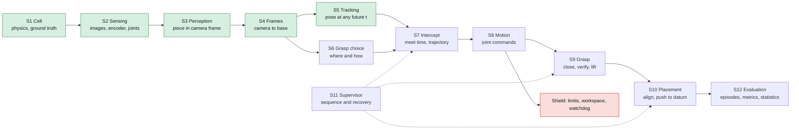

# Meat cell architecture and build order

The decomposition the simulation is built to: twelve subsystems, the typed
contract between each pair, the single number that defines success for each, and
the order they get built in. The point of fixing contracts first is that a
subsystem can then be perfected alone, and a defect at a seam shows up as a
contract violation rather than as a mysterious miss at the cutter.

Background: [meat cutting automation](meat-cutting-automation.md) for the cell,
[conveyor tracking](conveyor-tracking-and-visual-servoing.md) for the control
core, [deformable object manipulation](deformable-object-manipulation.md) for the
product. The runnable cell is `src/meat_cell_sim/`.

## The pipeline

Green is built. Red is deterministic and never learned.

## Why contracts first

Three of the four defects found while building S1 were seam defects: a geometry
overlap between two bodies, a servo fighting a damping term, a camera pointing
the wrong way. None of them threw an error. Each produced plausible numbers that
were wrong. A subsystem boundary with a typed contract and a test at the seam is
the cheapest place to catch that class of defect.

Every contract in this cell carries four things, because these are what actually
get mismatched: the **frame** a quantity is expressed in, its **units**, the
**timestamp** it refers to, and its **rate**. A pose with no frame and no
timestamp is not an observation, it is a rumour.

## The subsystems

| # | Subsystem | Consumes | Produces | Success is one number |
|---|---|---|---|---|
| S1 | Cell and physics | config | stepping world, ground truth | belt speed error under 2 mm/s |
| S2 | Sensing | world | timestamped images, encoder, joint state | timestamp skew under 1 ms |
| S3 | Perception | image | piece mask, centroid, axis, in camera frame | centroid error under 2 mm |
| S4 | Frames and calibration | camera-frame pose | pose in robot base frame | added error under 1 mm |
| S5 | Tracking and prediction | pose plus encoder | pose at any future time | prediction error at meet under 2 mm |
| S6 | Grasp selection | piece geometry | grasp pose, width, approach | fold or slip rate under 5 percent |
| S7 | Intercept planning | grasp pose, prediction, limits | meet time, trajectory | feasible intercepts above 95 percent |
| S8 | Motion execution | trajectory | joint commands, shielded | TCP tracking error under 1 mm |
| S9 | Grasp execution | grasp pose | piece held, verified | grasp success above 95 percent |
| S10 | Placement | held piece | piece in lane against datum | lane offset under bound |
| S11 | Supervisor | all states | sequencing, recovery | no silent failures |
| S12 | Evaluation | episodes | metrics with intervals | reproducible from seed |

The bound in S10 is the pre-registered 2 mm and 2 degrees for the rigid product,
5 mm and 5 degrees for the deformable one, until the customer's cutter infeed
window replaces both.

## The seams, and what breaks at each

| Seam | The failure it invites | The test that catches it |
|---|---|---|
| S2 to S3 | image timestamped at arrival, not at exposure; the piece has moved by the time the pose is used | compare pose against ground truth at the exposure instant, not at the call |
| S3 to S4 | camera-frame pose treated as base-frame; or a transform applied in the wrong direction | round trip a known point through the transform and back |
| S4 to S5 | encoder and camera on different clocks | inject a known clock offset and confirm the predicted error grows as expected |
| S5 to S7 | prediction extrapolated past where it is valid, so a late meet time is silently wrong | assert the meet time falls inside the prediction horizon |
| S6 to S7 | grasp pose in the piece frame, intercept planned in base frame | assert the grasp pose frame tag before planning |
| S7 to S8 | trajectory violates a joint or velocity limit and the controller saturates | the shield rejects it, and the rejection is a test |
| S9 to S10 | the piece shifted in the gripper, so the placement uses a stale pose | re-observe after lift and compare |
| S11 everywhere | a failure is retried forever instead of reported | every failure path terminates an episode with a reason code |

## Build order and the gate for each

Each step is finished when its gate passes and its tests are committed. Nothing
advances early. The order puts calibration before perception on purpose: a
perception module measured through a wrong transform produces a number that
looks fine and is not.

1. **S1 Cell** (done, 2026-09-08). Gate met: belt tracks command to 0.0 mm/s,
   product carried with zero slip, both work points inside arm reach, 86x
   realtime.
2. **S2 Sensing** (done, 2026-09-08). Timestamped observation records with
   exposure window, camera intrinsics, encoder count, joint state. Gate met:
   stamp skew 0.000 ms, and the oracle is a separate type an estimator cannot
   reach. `src/meat_cell_sim/sensing.py`.
3. **S4 Frames** (done, 2026-09-08). Pinhole model checked against MuJoCo's own
   renderer, ray-plane back-projection, world to base. Gate met: round trip
   under 0.001 mm. Hand-eye calibration with a deliberately injected error is
   still to come and is what makes this step real rather than exact.
   `src/meat_cell_sim/frames.py`.
4. **S3 Perception** (geometry done, 2026-09-08; bake-off pending). Pose from a
   mask plus depth. Gate met on an exact mask: centroid 0.22 mm mean and axis
   0.003 degrees. The candidate bake-off from
   [perception technique selection](perception-technique-selection.md) runs on
   top of this and supplies the mask error the numbers above deliberately
   exclude. `src/meat_cell_sim/perception.py`.
5. **S5 Tracking** (done, 2026-09-08). Belt-frame estimator plus prediction.
   Gate met: 1.5 mm at the meet instant, 0.5 s ahead.
   `src/meat_cell_sim/tracking.py`.
6. **S6 Grasp selection**. The rule chosen in
   [grasp selection for soft slabs](grasp-selection-for-soft-slabs.md). Gate on
   the rigid product first, then the deformable one.
7. **S7 Intercept planning**, **S8 Motion**, **S9 Grasp**. The scripted
   architecture from
   [control architecture selection](control-architecture-selection.md).
8. **S10 Placement**. The pre-registered bound.
9. **S11 Supervisor**, **S12 Evaluation**. Then the full baseline in
   `experiments/2026-09-08-meat-cell-sim-baseline.md`.
10. Deformable product, then the learned-versus-scripted comparison in
    `experiments/2026-09-15-meat-cell-learned-vs-scripted.md`.

## What the ingestion chain measured

The first five subsystems are built and measured; the record is
[perception ingestion](perception-ingestion.md) and
`experiments/2026-09-08-perception-ingestion.md`. Two results change later steps.

Depth is required rather than preferred. Every monocular estimator spends the
whole 2 mm placement bound before the arm moves, because the centroid of a thick
product's silhouette is not the projection of any fixed point on it and the
error grows with distance off the optical axis. Both cameras in the cell
therefore need depth.

Six defects were found, all of which produced plausible numbers rather than
errors, and three of which were timestamp defects at a seam. That rate is the
argument for the contracts: the numbers were never obviously wrong.

## A finding that changed the architecture

The control architecture analysis produced a result worth stating plainly. On the
currently assumed numbers, no belt-side control loop meets the placement bound at
any belt speed, because the piece shifts in the gripper as the fingers close by
more than the whole bound allows. Making the tracking better cannot fix that,
because the shift happens after tracking is finished.

What does fix it is a second look after the piece is in hand: a verification
camera over the lane, an estimate of where the piece actually sits in the
gripper, a corrected place, and a push to the datum edge. That loop is
independent of belt speed, which is why it holds where the belt-side loop fails.

Two consequences. The verification camera is required rather than optional, and
it is now in `cell.xml`. And the most valuable number to measure next is how far
the piece moves during gripper closure, because the whole argument rests on an
assumed value for it with no source. The simulator can measure it directly, so
that becomes the gate on the grasp step rather than a question for the field.

## Integration

Subsystems connect through the dataclasses in `src/meat_cell_sim/contracts.py`.
Each carries its frame, its units in the field name, and the simulation time it
refers to. Two rules keep the seams honest:

- A function that changes frame takes the source frame as an argument and returns
  a value tagged with the destination frame. There is no untagged pose anywhere
  in the pipeline.
- Every subsystem has a recorded contract test that feeds it a known input and
  checks the output against ground truth from the simulator, independent of the
  subsystems either side of it.

The integration test runs the whole chain on one episode with every subsystem in
its simplest working form, and asserts the piece ends in the lane. It exists from
step 2 onward and grows as subsystems are replaced, so the chain is never broken
for more than one step at a time.

## What a forward-deployed engineer must be able to do

- Name the twelve subsystems and the one number that defines success for each.
- Say which seam a given field failure lives at, from the symptom.
- Refuse to advance a step whose gate has not passed, and say so plainly.
- Replace one subsystem without touching the two either side of it.

## Open questions

- The cutter infeed window, which replaces the placement bound and may change the
  whole architecture selection if it is tighter than 2 mm.
- Whether S3 and S6 collapse into one learned module once the deformable product
  arrives, or stay separate.
- Whether S5 needs vision re-observation or the encoder alone suffices, which
  the control architecture note frames as an error-budget question.

## Related entries

- [Meat cutting automation](meat-cutting-automation.md)
- [Conveyor tracking and visual servoing](conveyor-tracking-and-visual-servoing.md)
- [Perception technique selection](perception-technique-selection.md)
- [Grasp selection for soft slabs](grasp-selection-for-soft-slabs.md)
- [Control architecture selection](control-architecture-selection.md)
- [Perception ingestion](perception-ingestion.md)
- [Meat piece properties](meat-piece-properties.md)
- [Safety for learned policies](safety-for-learned-policies.md)

## Sources

- The cell, its gate, and the four calibration defects: `experiments/2026-09-08-meat-cell-sim-baseline.md`.
- Contracts and tests: `src/meat_cell_sim/`, `tests/`.
