# Meat cutting automation and the intercept-and-align cell

## What it is

Meat processing turns a carcass into primals, primals into subprimals and boneless muscles, and
those into portions: slaughter, primal breaking (saws through bone), deboning, trimming, portioning
(fixed weight or shape), packing. Poultry lines run at up to 20,000 carcasses per hour, pig at 750,
beef at 300 ([DMRI, Animal Frontiers 2022](https://pmc.ncbi.nlm.nih.gov/articles/PMC9056032/)).
Automation has gone furthest where biological variation is lowest: pork and poultry before beef
([Delmore, Animal Frontiers 2022](https://academic.oup.com/af/article/12/2/3/6576388)), and
portioning before boning and trimming, which "remain largely manual"
([Khodabandehloo, Animal Frontiers 2022](https://academic.oup.com/af/article/12/2/7/6576396)).

The cell this note is written for sits between two of those steps: a piece of meat arrives, moving
on a belt or presented at a station, and a robot arm has to catch it, work out which way it is
facing, and put it into a cutter in the pose the cutter expects. Everything downstream (yield,
portion weight, blade safety) depends on that pose, and everything upstream (line speed, product
variability, wet surfaces) fights it.

## Why it matters

This is the user's first assignment. The cell is small, but it exercises every hard part of the
domain at once: tracking a moving target, 3D perception on a wet specular deformable object,
gripping something that has no fixed shape, placing it to a tolerance set by someone else's
machine, and doing all of it inside a washdown enclosure next to a blade.

The economics are labor and yield. US animal slaughtering and processing employed 542,990
people in May 2023, 101,190 of them cutters and trimmers at a mean $18.02 per hour
([BLS OES](https://www.bls.gov/oes/2023/may/naics4_311600.htm)); the sector's 2024 injury rate
was 3.2 per 100 full-time workers against 2.7 for manufacturing
([BLS 2024](https://www.bls.gov/iif/nonfatal-injuries-and-illnesses-tables/table-1-injury-and-illness-rates-by-industry-2024-national.htm));
NIOSH found 34 percent of participants at one poultry plant meeting the carpal tunnel case
definition ([NIOSH HHE 2014-0040-3232](https://www.cdc.gov/niosh/hhe/reports/pdfs/2014-0040-3232.pdf)).
On yield, a 5 mm improvement in pork primal cut placement was worth about $300k per year per line
in 2003, and Scott's rotary knife on lamb "saves 4 mm of every carcass length"
([Khodabandehloo 2022](https://academic.oup.com/af/article/12/2/7/6576396),
[Scott R&D 2022](https://pmc.ncbi.nlm.nih.gov/articles/PMC9056031/)). Millimetres of alignment
are money, so the placement error distribution, not the success rate, is the number this cell is
judged on. The same Scott author reports the first robotic lamb hindquarter boning system was
out-yielded by manual workers within weeks and that machinery costs 5 to 10 times the yearly
labor saving; DMRI reports uptime under 80 percent "is not uncommon and sometimes even as low as
50%" ([DMRI 2022](https://pmc.ncbi.nlm.nih.gov/articles/PMC9056032/)). The bar is a placement
error and uptime figure that beats the person replaced, measured over shifts.

## Industry map

Who does what in 2026. Throughput figures are vendor claims unless a paper is cited.

| Company | Segment | Products relevant to this cell | Numbers with source |
|---|---|---|---|
| JBT Marel (JBT and Marel combined 2 Jan 2025) | Portioning, X-ray, poultry deboning, robotic packing | I-Cut portion cutters (vision scan then blade), DSI waterjet portioners, SensorX X-ray, RoboBatcher, DSI Dual Robotic Harvester (two Stäubli TS2-60 HE with vacuum end-effectors) | I-Cut 122: 2000 cuts/min per lane; I-Cut 130: 1000 cuts/min, belt 20 to 500 mm/s; I-Cut 610: 1200 cuts/min per lane; DSI scan "sub-millimeter"; SensorX 99 percent of bone over 2 mm; RoboBatcher 240 portions/min; harvester 240/min; FY2025 revenue $3.8B ([I-Cut 122](https://jbtmarel.com/en/products/i-cut-122-portioncutter), [I-Cut 130](https://jbtmarel.com/en/products/i-cut-130/meat/), [I-Cut 610](https://jbtmarel.com/en/products/i-cut-610/), [DSI](https://jbtmarel.com/en/products/dsi-waterjet-portioning-systems/), [SensorX](https://jbtmarel.com/en/products/sensorx-x-ray-bone-inspection-system/), [RoboBatcher](https://jbtmarel.com/en/products/robobatcher-flex), [harvester](https://jbtmarel.com/en/products/dsi-dual-robotic-harvester-automated-meat-processing/), [merger](https://ir.jbtmarel.com/news/press-releases/detail/100/jbt-corporation-completes-settlement-of-its-voluntary-takeover-offer-of-marel-hf-and-commences-trading-as-jbt-marel-corporation), [IR](https://ir.jbtmarel.com/)) |
| Scott Technology (NZ, 53 percent owned by JBS Australia) | Lamb X-ray primal cutting and boning, beef rib scribing, BladeStop band saws, DEXA grading | X-ray (DEXA) bone map plus 2D/3D cameras drives cut paths; robotic beef rib cutting | Lamb boning 12 carcasses/min; JBS Cobram system 600 carcasses/h (contract Jan 2025); over 20 lamb systems installed; hindquarter pelvic bone still manual; BladeStop stops in under 10 ms, over 1600 units; MAC10 grades 360 carcasses/h ([lamb](https://scottautomation.com/en/products/meat/lamb), [NZX Jan 2025](https://www.nzx.com/announcements/445057), [Farmers Weekly Sep 2025](https://www.farmersweekly.co.nz/technology/scott-tech-at-cutting-edge-in-meat-processing/), [Farmers Weekly Apr 2024](https://www.farmersweekly.co.nz/technology/one-giant-leap-for-robo-meatworks/), [BladeStop](https://scottautomation.com/en/products/meat/bladestop-bandsaw), [grading](https://scottautomation.com/en/products/meat/grading), [JBS stake](https://www.tipranks.com/news/company-announcements/jbs-australia-lifts-controlling-stake-in-scott-technology-via-drp)) |
| Frontmatec (DK) | Pork carcass lines, primal cutting, robotic deboning and trimming | Automatic primal cutting (AGOL, ABSA), Robotic Chine Bone Saw with dual-camera 3D cut path, Robotic Belly Trimmer, 3D loin trimmer (ultrasound plus vision) | Lines at 100 to 1,500 hogs/h; chine bone saw up to 1,200 loins/h ([primal cutting](https://www.frontmatec.com/en/pork-solutions/primal-cutting/automatic-primal-cutting/), [chine bone saw](https://www.frontmatec.com/en/pork-solutions/deboning-trimming/automatic-deboning-trimming/robotic-chine-bone-saw/), [trimmers](https://www.frontmatec.com/en/pork-solutions/deboning-trimming/automatic-deboning-trimming/)) |
| Mayekawa (Mycom, JP) | Deboning machines | TORIDAS (chicken leg, since 1994), HAMDAS-RX (pork ham), WANDAS-RX (pork shoulder), YIELDAS (front halves) | TORIDAS 1,000 legs/h; HAMDAS-RX 500 hams/h; WANDAS-RX 600 pieces/h; YIELDAS 3,000 front halves/h with image processing; a 2009 paper claims 70 percent of deboned chicken thigh "in the market" is processed by TORIDAS ([deboning page](https://www.mayekawa.com/products/deboning_machines/), [30 years of TORIDAS](https://meatindustry.online/news/market-news/mayekawa-group-celebrates-30-years-of-toridas-from-refrigeration-to-automated-deboning-excellence/), [Itoh 2009](https://doi.org/10.20965/jrm.2009.p0301)). X-ray sensing in HAMDAS: (unverified) |
| Baader, Meyn (poultry OEMs) | Poultry deboning | Thigh filleting, breast deboners | Baader 632: 7,000 birds/h; Meyn whole-leg deboner 4,200 legs/h, breast deboner up to 7,000 BPH ([Baader 632](https://www.baader.com/product/thigh-filleting-system-632), [Frontiers review 2025](https://www.frontiersin.org/journals/robotics-and-ai/articles/10.3389/frobt.2025.1578318/full)) |
| Tyson Foods | Processor, in-house automation | Tyson Manufacturing Automation Center, Springdale (opened Aug 2019); automated chicken deboning development | $215M on automation in the five years to 2019; $1.3B planned over three years from 2022 ([Tyson 2019](https://www.tysonfoods.com/news/news-releases/2019/8/new-facility-boost-tyson-foods-automation-and-robotics-efforts), [Food Processing Dec 2021](https://www.foodprocessing.com/on-the-plant-floor/automation/news/11291827/tyson-to-spend-500-million-on-automation)) |
| JBS | Processor | Owns Scott; lamb automation at Bordertown, Brooklyn, Cobram; Scott automated rib cutting with MLA | See Scott row; [MLA rib cutting report](https://www.mla.com.au/research-and-development/reports/2019/scott--jbs-automated-rib-cutting---detector-upgrade/) |
| Provisur (Formax, Weiler, Cashin) | Slicing, forming, grinding | Formax SX330/380/550 slicers | No throughput on vendor pages ([Provisur](https://www.provisur.com/en/slicing)) |
| GEA, Weber, Bizerba | High-speed slicers | GEA OptiSlicer 7000: involute blade 1,500 rpm, up to 2,000 kg/h; Bizerba GSP HD 0 to 24 mm slices ([GEA](https://www.gea.com/en/products/slicing-loading/slicing/gea-optislicer-7000-efficient-precise-versatile-slicing-solution/), [Bizerba](https://www.bizerba.com/us/en/lp/slicers-for-almost-any-food)) | |
| TOMRA Food | Sorting and inspection | Protein sorters, wooden breast detection in chicken fillets ([TOMRA](https://www.tomra.com/food/categories/proteins)) | X-ray or hyperspectral specs for meat: not found |
| Schmalz (ex Soft Robotics mGrip) | Grippers | mGrip: IP69K, FDA-compliant POM, silicone, stainless; up to 10 kg, 120 picks/min; Soft Robotics sold the gripper line to Schmalz on 6 Aug 2024 and became Oxipital AI (vision inspection) ([mGrip](https://www.schmalz.com/en-us/products/automation-743270/other-gripping-technologies-746237/finger-grippers-312388), [Oxipital](https://www.oxipitalai.com/oxipital-ai-press-release/)) | |
| Chef Robotics | Learned policies in food assembly (not cutting) | Ingredient placement into trays; 98.6M servings, more than a dozen facilities; Series A $43.1M Mar 2025; NSF/ANSI 169 ([site](https://www.chefrobotics.ai/), [PR](https://www.prnewswire.com/news-releases/chef-robotics-announces-43m-series-a-round-led-by-avataar-ventures-to-scale-the-deployment-of-ai-enabled-robotics-302416039.html)) | Whether the deployed policy is learned end to end is not stated on their pages |
| Humanoid vendors (Apptronik, Figure, Agility) | None in meat found | | No meat deployment or pilot located as of Sep 2026 |

Research programs:

- **Australia, MLA and AMPC.** MLA put $10M into DEXA X-ray installations in May 2017 and $14M more
  in July; a unit cost $1.45M and reads 30 lamb carcasses per minute (Scott with Murdoch University).
  AMPC aims to halve human product handling by 2030
  ([May 2017](https://www.beefcentral.com/news/mla-approves-10m-for-dexa-installations/),
  [Jul 2017](https://www.beefcentral.com/news/mla-to-invest-additional-14m-in-dexa-installations/),
  [DEXA guide](https://www.beefcentral.com/processing/keeping-up-with-dexa-heres-a-guide-to-bring-you-up-to-speed/),
  [AMPC](https://www.ampc.com.au/research-development/advanced-manufacturing/)).
- **Europe, RoBUTCHER (H2020 871631, 2020 to 2023, EUR 7.5M).** NMBU with DMRI, Animalia and Max
  Rubner Institut: a "meat factory cell" with 3D-model-based adaptive cutting and a sensing knife
  with 7.66 mm mean depth error on pork loin ([CORDIS](https://cordis.europa.eu/project/id/871631),
  [Esper 2024](https://doi.org/10.1016/j.atech.2023.100388), [Mason 2022](https://doi.org/10.1109/jsen.2022.3208667),
  [RGB-D dataset](https://doi.org/10.1016/j.dib.2022.107945)).
- **GTRI.** 3D imaging plus a robot arm for the poultry butterfly cut, shown 2012
  ([ATRP](https://www.atrp.gatech.edu/robotics-automation/), [Hu 2012](https://doi.org/10.1109/aim.2012.6265969)).
- **Virginia Tech.** Cobot with an instrumented knife on pork loins; experts rated it adequate and
  preferred the human-collaborative cuts ([Wright 2024](https://arxiv.org/abs/2401.07875),
  [Parekh 2025](https://arxiv.org/abs/2508.14763)).
- **SINTEF.** GRIBBOT chicken fillet harvesting from Kinect v2 RGB-D; learning from demonstration
  for compliant food ([Misimi 2016](https://doi.org/10.1016/j.compag.2015.11.021),
  [Misimi 2018](https://arxiv.org/abs/2309.12856)).
- **DTU, Bristol, Lincoln, Fraunhofer.** No meat-cutting project page confirmed (unverified);
  DTI, not DTU, is the Danish meat institute.

What stays manual and why: deboning and trimming of beef and of lamb hindquarters. Beef has the
most carcass variation ([Delmore 2022](https://academic.oup.com/af/article/12/2/3/6576388)); the
pelvic bone defeats current lamb systems
([Farmers Weekly 2024](https://www.farmersweekly.co.nz/technology/one-giant-leap-for-robo-meatworks/));
and carcass movement and joint twisting "create changing centers of gravity, making carcasses
difficult to grasp, manipulate and cut" ([Trends Food Sci Tech 2021](https://www.sciencedirect.com/science/article/pii/S0924224420306798)).

## The intercept-and-align task in detail

Two variants, and the first design decision is which one the customer has. **Pick-on-the-fly**:
the piece moves on a belt, the arm tracks it, grasps it and places it into the cutter infeed,
matching belt velocity during the grasp. **Presented piece**: a stop, indexer or vision-triggered
belt halt presents it and the arm works on a stationary target; simpler, slower.

Most portion cutters scan the piece themselves once it is on their belt (I-Cut "laser and mirror
vision system", DSI J-Scan height map, Frontmatec dual cameras). The arm's job is to deliver the
piece inside the cutter's lane, non-overlapping, long axis and fat cap where the cutter expects
them. The tolerance window is the cutter vendor's number, from the customer's manual; this note
has no verified figure for it (unverified).

### Conveyor tracking

Every industrial controller ships encoder-synchronised tracking. The pattern is the same: an
encoder on the belt drive, a trigger (photo-eye or camera) that stamps an object with the encoder
count when it passes a known position, a queue of stamped objects, and a robot frame that moves
with the belt so that programmed points are expressed in belt coordinates.

- **ABB** publishes the numbers most vendors do not: at 150 mm/s constant belt speed the TCP stays
  within plus or minus 2 mm of the path; accuracy degrades above 500 mm/s; the encoder should give
  5,000 to 10,000 counts per metre after 4x decoding ("above 10,000 has no significant effect as
  inaccuracies in robot and cell calibration will be the dominating factors"); the speed signal
  passes a 2nd-order IIR filter at 10 Hz; the DSQC2000 module takes 4 encoders and 8 camera or
  sync channels; the object queue holds 254 entries; camera pulse width in ms must be under
  1000 x (trigger distance in mm / max belt speed in mm/s)
  ([ABB Conveyor Tracking manual 3HAC050991-001](https://search.abb.com/library/Download.aspx?DocumentID=3HAC050991-001&LanguageCode=en&DocumentPartId=&Action=Launch)).
- **Universal Robots** decodes incremental encoders on digital inputs 0 to 3 (the UR programming guide says pins 8 to 11 for `encoder_enable_pulse_decode`; the two guides disagree, unverified) at up to 40 kHz,
  reads absolute encoders over Modbus, and exposes `track_conveyor_linear(direction, ticks_per_meter)`
  in URScript. No accuracy or maximum speed is published
  ([UR guide](https://www.universal-robots.com/articles/ur/programming/new-conveyor-tracking-guide-cb3-38-and-e-series-52/),
  [Modbus example](https://www.universal-robots.com/articles/ur/application-installation/conveyor-tracking-using-encoder-that-outputs-a-modbus-register/)).
- **KUKA.ConveyorTech** (5 conveyors, 1024 parts each, synchronous conveyor stop on e-stop) and
  **FANUC iRPickTool** (line tracking, multi-robot load balancing) publish no accuracy
  ([KUKA](https://www.kuka.com/en-de/products/robot-systems/software/hub-technologies/kuka-conveyortech),
  [FANUC](https://www.fanucamerica.com/products/software/robot/irpicktool)).

On ROS 2 you build the belt frame yourself (a TF broadcaster driven by the encoder count) and
stream targets through MoveIt Servo or JTC ([[library/topics/connecting-to-real-robots]]). Use the
vendor's tracking where the arm has it; it has been tuned on more belts than we will see.

Encoder tracking is look-then-move: one image, one pose, dead reckoning on the encoder. Visual
servoing ([Chaumette and Hutchinson 2006](https://doi.org/10.1109/mra.2006.250573), [2007](https://doi.org/10.1109/mra.2007.339609))
corrects from later frames and earns its complexity only if the piece moves relative to the belt
or belt speed is unstable. Start look-then-move with a verification frame; add servoing on drift.

### Latency budget

With an encoder-stamped trigger the object's pick position comes from the count, not the clock,
so mean latency is compensated. What matters is jitter in the stamp, the robot's tracking lag, and
motion of the piece relative to the belt after the image. At 300 mm/s, 1 ms unmodelled is 0.3 mm.
Design targets (proposal, not measurements):

| Stage | Target | Basis |
|---|---|---|
| Trigger to encoder stamp | under 0.1 ms, hardware | ABB DSQC2000 sync input; UR 40 kHz decode |
| Camera exposure | 10 ms (Photoneo MotionCam-3D M) or 100 to 500 ms (Zivid 2+ M130, multi-acquisition HDR) | vendor specs below |
| Segmentation and pose | 30 to 50 ms on a workstation GPU | (unverified until measured) |
| Grasp or intercept plan | under 10 ms | analytic, see Grasping |
| Robot command lag | ABB EGM 10 to 20 ms; UR RTDE 2 ms cycle | [[library/topics/connecting-to-real-robots]] |
| Tracking error at pick | plus or minus 2 mm at 150 mm/s (ABB); scale with speed | ABB manual |
| Total trigger to grasp | 100 to 600 ms of belt travel (30 to 180 mm at 300 mm/s), all compensated by the encoder | camera choice dominates |

Measure every row with the QR-code and alignment methods in
[[library/topics/connecting-to-real-robots]] before believing it.

## Perception on meat

Meat is wet, specular, textureless for stereo, and changes shape when touched. The sensor
choice follows from that.

| Sensor class | Example and spec | Behaviour on meat | Washdown |
|---|---|---|---|
| Structured light, multi-exposure | Zivid 2+ M130: 5 MP, 320 um at 1.3 m, capture 100 to 500 ms, IP65 ([spec](https://www.zivid.com/zivid-2-plus-m130)) | Shiny scenes "typically require 3 HDR acquisitions"; Reflection Filter removes interreflection points; use a dark absorptive background ([Zivid guide](https://support.zivid.com/en/latest/camera/academy/camera/capturing-high-quality-point-clouds/dealing-with-highlights-and-shiny-objects.html), [reflection filter](https://support.zivid.com/en/latest/camera/reference-articles/settings/processing-settings/reflection-filter.html)) | IP65 only; needs an enclosure |
| Parallel structured light for motion | Photoneo MotionCam-3D M: 10 ms acquisition, up to 20 fps, objects up to 40 m/s, under 0.5 mm accuracy in camera mode, blue or red laser ([spec](https://www.photoneo.com/products/motioncam-3d-m/)) | Vendor claims glossy and dark surfaces; no meat-specific data found | IP rating not on fetched page (unverified) |
| Active stereo | RealSense D435: under 2 percent depth error at 2 m; error scales with distance squared; needs projected texture ([spec](https://www.realsenseai.com/products/stereo-depth-camera-d435/), [tuning](https://dev.realsenseai.com/docs/tuning-depth-cameras-for-best-performance)) | Fine for prototyping; specular highlights leave holes (from field on other wet objects, unverified for meat) | None |
| Laser line triangulation | LMI Gocator 2500: 20 kHz profiles, blue laser "for dark and specular targets" ([Gocator](http://web.archive.org/web/20251003155338/https://lmi3d.com/series/gocator-2500-series/)); Keyence LJ-X8000: 405 nm, 16 kHz, IP67 ([spec](https://www.keyence.com/products/measure/laser-2d/lj-x8000/specs/)) | The portioner vendors' choice (I-Cut, DSI scan this way); needs belt motion or encoder to build the 3D map | IP67; stainless housings exist |
| Polarization | Sony IMX250MZR, four-angle on-chip polarizers, 5 MP, 163 fps ([Sony](https://www.sony-semicon.com/en/products/is/industry/polarization.html)) | Specular separation on wet surfaces ([Wen 2021](https://doi.org/10.1109/tip.2021.3104188), [Kadambi 2015](https://doi.org/10.1109/iccv.2015.385)); 2D only | Standard housing |
| Hyperspectral | NIR-HSI for pork grading and fat ([Barbin 2012](https://doi.org/10.1016/j.meatsci.2011.07.011), [Cheng 2017](https://doi.org/10.1016/j.meatsci.2016.09.017)) | Fat versus lean, not geometry; useful if orientation depends on the fat cap | Lab and inline instruments |

Lighting: a diffuse dome is "very effective at lighting curved, specular surfaces" and a
polarizer plus analyzer pair blocks glare ([Advanced Illumination](https://advancedillumination.com/a-practical-guide-to-machine-vision-lighting/));
IP69K lights exist ([Smart Vision Lights](https://smartvisionlights.com/product-category/washdown/)).
Lock exposure, white balance and the light; plant lighting changes between shifts.

Pose estimation on a deformable piece has no ground-truth 6-DoF pose. What the cutter needs is a
lane offset, a yaw of the long axis, and which side is up (fat cap, skin, cut face). Methods in
rising order of cost:

- **Principal axes of the segmented cloud.** Open3D's oriented bounding box is a PCA of the convex
  hull ([Open3D](https://www.open3d.org/docs/release/python_api/open3d.geometry.OrientedBoundingBox.html));
  centroid, yaw and length in one call, ambiguous by 180 degrees, so a side classifier breaks the tie.
- **Rigid registration to a template**: ICP ([Besl and McKay 1992](https://doi.org/10.1109/34.121791)),
  Go-ICP ([Yang 2016](https://arxiv.org/abs/1605.03344)), TEASER++ ([Yang 2020](https://arxiv.org/abs/2001.07715)).
  Works when one template fits the whole cut; fails silently otherwise.
- **Non-rigid registration**: Coherent Point Drift ([Myronenko and Song 2010](https://doi.org/10.1109/tpami.2010.46))
  gives a per-piece correspondence for transferring a cut line from a template.
- **Learned keypoints**: kPAM ([Manuelli 2019](https://arxiv.org/abs/1903.06684)) and Dense Object
  Nets ([Florence 2018](https://arxiv.org/abs/1806.08756)) define pose by semantic points (tip,
  heel, fat edge), the right abstraction for a deformable piece. YOLOv8 reached mIoU 89.1 on pig
  backfat ([Wei 2024](https://doi.org/10.3390/ani14162421)); a 2025 review puts 2D-guided cutting
  at 70 to 80 percent success against 85 to 92 percent for 3D
  ([Frontiers 2025](https://www.frontiersin.org/journals/robotics-and-ai/articles/10.3389/frobt.2025.1578318/full)).

Meat-specific 3D work: pork cut paths from a laser point cloud ([Liu 2024](https://doi.org/10.1108/ir-11-2023-0274)),
salmon tail cut ([Bar 2016](https://doi.org/10.1108/ir-11-2015-0205)), turbot head cut
([Martin-Rodriguez 2022](https://arxiv.org/abs/2212.10091)). No paper on the pose of a loose meat
piece for robotic placement was found; expect to build the dataset yourself.

## Grasping and handling

- **Vacuum.** The DSI Dual Robotic Harvester runs custom vacuum end-effectors on washdown Stäubli
  arms at 240 picks per minute ([JBT Marel](https://jbtmarel.com/en/products/dsi-dual-robotic-harvester-automated-meat-processing/)),
  so vacuum on wet flesh works at line rate. Cups in food-contact silicone: Piab FCM bellows,
  Schmalz SI, SI-HD and SI-MD (metal-detectable, so a lost cup trips the line's metal detector)
  ([Piab](https://www.piab.com/en-us/suction-cups-and-soft-grippers),
  [Schmalz](https://www.schmalz.com/en-us/solutions/industries-and-applications/food)).
  Expect leaks at cut faces; size the pump for flow, not just vacuum level (unverified).
- **Soft fingers.** Schmalz mGrip: IP69K, FDA-compliant POM, silicone and stainless, 10 kg, 120
  picks per minute, listed for "meat, fish and dough pieces"
  ([mGrip](https://www.schmalz.com/en-us/products/automation-743270/other-gripping-technologies-746237/finger-grippers-312388)).
  Piab piSOFTGRIP: one-piece silicone, FDA 21 CFR and EU 1935/2004
  ([Piab](https://www.piab.com/en-us/suction-cups-and-soft-grippers/soft-grippers/pisoftgrip-vacuum-driven-soft-gripper-/sg.x)).
  OnRobot Soft Gripper claims FDA "for non-fatty food items" only
  ([OnRobot](https://onrobot.com/en/products/soft-gripper)); check every claim for that footnote.
- **Needle grippers.** Schmalz SNG (0.8 to 2.0 mm needles, 3 to 25 mm stroke) are sold for porous
  materials; no meat application is listed
  ([Schmalz](https://www.schmalz.com/en-us/products/automation-743270/other-gripping-technologies-746237/needle-grippers-306131)).
  They puncture the product; the customer's QA decides (unverified).
- **Mechanical.** Zimmer's hygienic-design parallel grippers: FDA-compliant materials, NSF H1
  grease, but IP40 to IP65 ([Zimmer](https://www.zimmer-group.com/en/products/components/handling-technology/2-jaw-parallel-grippers/individualizations/hygienic-design)).
  GRIBBOT used a beak plus a pneumatic supporting plate under the fillet ([Misimi 2016](https://doi.org/10.1016/j.compag.2015.11.021)).
- **Printed fingers.** DTI prints Marel's fillet and salmon-side grippers in metal-detectable
  nylon, sealed, no joints in food-contact areas, with migration tests for the declaration of
  conformity ([DTI](https://www.dti.dk/services/salmon-side-gripper-was-3d-printed-in-metal-detectable-nylon/43868)).
- **Freeze grippers** (ice adhesion) for meat: no vendor or institute page confirmed (unverified).
  **Slip**: optical-flow slip detection on tissue ([Takacs 2023](https://arxiv.org/abs/2307.05648));
  tactile options in [[library/topics/perception-tactile-and-force]].

A grasp is not always needed: if the cutter takes the piece from a belt, a compliant paddle that
rotates and shifts it into lane against a fixture edge avoids lifting a wet deformable mass at
all. Decide from the infeed geometry before choosing a gripper. Either way a second camera over
the infeed measures the same lane offset and yaw; its disagreement with the pre-grasp estimate is
the in-hand motion, and its disagreement with the cutter's own scan is the customer's number.

## Cutting technology and interlocks

| Technology | Where used | Numbers | Safety character |
|---|---|---|---|
| Band saw | Primal breaking, bone-in | Scott BladeStop stops the blade in under 10 ms on operator contact, DGUV-certified functional safety, over 1600 units ([BladeStop](https://scottautomation.com/en/bladestop)) | Exposed blade by design; manual use |
| Circular or involute blade | Slicers and portion cutters | GEA OptiSlicer 7000: 470 to 505 mm involute blade, 1,500 rpm, 2,000 kg/h; I-Cut 122 up to 2000 cuts/min per lane ([GEA](https://www.gea.com/en/products/slicing-loading/slicing/gea-optislicer-7000-efficient-precise-versatile-slicing-solution/), [I-Cut 122](https://jbtmarel.com/en/products/i-cut-122-portioncutter)) | Fully enclosed, interlocked guards |
| Ultrasonic | Bakery, cheese, some meat | 20 to 40 kHz generators; titanium blades; IP69K connectors; sonotrodes at 20 to 35 kHz safe for CIP ([Dukane](https://www.dukane.com/products/ultrasonic-welding-products/ultrasonic-cutting-solutions/ultrasonic-food-cutting-products), [Herrmann](https://www.herrmannultraschall.com/en/branch-solutions/food/food-cutting-with-ultrasonics)) | Low contact force; enclosed |
| Waterjet | Portioning to fixed weight and shape | JBT DSI: two jets per cell, height-map scan at sub-millimetre accuracy; one customer went from 20 to 40 t/week manual to 250 t/week ([DSI](https://jbtmarel.com/en/products/dsi-waterjet-portioning-systems/), [DSI news Feb 2026](https://jbtmarel.com/en/news/dsi-waterjet-cutter-complex-cuts-in-one-go/)). Pressure and orifice figures: (unverified) | No blade, but a high-pressure jet; enclosed |

The interlock chain: cutter guards and cell guards are one safety function engineered to
ISO 13849-1:2023 performance levels (PL e at PFHd 1e-8 per hour) or IEC 62061:2021, with
interlocking devices per ISO 14119:2024 ([13849-1](https://www.evs.ee/en/evs-en-iso-13849-1-2023),
[62061](https://www.evs.ee/en/evs-en-iec-62061-2021), [14119](https://www.evs.ee/en/evs-en-iso-14119-2025)).
The robot side is ISO 10218-1 and -2:2025, in force since April 2025
([10218-2](https://www.evs.ee/en/evs-en-iso-10218-2-2025)). OSHA 29 CFR 1910.212 requires
point-of-operation guarding and names power saws and guillotine cutters; 1910.147 lockout covers
servicing, with a "minor servicing" exception that needs alternative effective protection
([1910.212](https://www.law.cornell.edu/cfr/text/29/1910.212), [1910.147](https://www.law.cornell.edu/cfr/text/29/1910.147)).
Jam clearing at the infeed is where that exception gets argued; write the procedure before the
first jam. The verification camera's "pose OK" is not a safety signal: the cutter starts only on a
hardwired permissive (guards closed, arm outside the cutter envelope via the safety controller's
safe-zone output, product present). Vision gates production, never safety.

## Hygiene and regulatory constraints

Washdown filters the parts list. IP69K (ISO 20653) means 80 to 100 bar water at 80 C, 14 to
16 L/min, from 10 to 15 cm, at four angles for 30 s each ([IP code](https://en.wikipedia.org/wiki/IP_code)).
Hygienic design adds no dead spaces, drainable surfaces, sealed joints and chemical-resistant
materials: EHEDG Doc 8 (principles) and Doc 13 (wet-cleaned open equipment)
([EHEDG](https://www.ehedg.org/guidelines-working-groups/guidelines/guidelines/)), 3-A in the US
([3-A](https://www.3-a.org/about-3a)). EHEDG certifies components (EL Class I cleanable in place,
Class II after dismantling); its list has sensors, glands and valves but no robot, gripper or
camera enclosure ([classes](https://www.ehedg.org/certification-testing/useful-information/certification-classes),
[list](https://www.ehedg.org/certification-testing/certified-equipment/list-of-certified-equipment)),
so "hygienic robot" is a vendor claim, not a certificate.

Food contact: EU [1935/2004 Art. 3](https://www.legislation.gov.uk/eur/2004/1935/article/3)
(no transfer that endangers health or changes the food), [10/2011](https://www.legislation.gov.uk/eur/2011/10/article/12)
for plastics (overall migration limit 10 mg/dm2), [2023/2006](https://www.legislation.gov.uk/eur/2006/2023/article/4)
GMP; US FDA [21 CFR 174.5](https://www.law.cornell.edu/cfr/text/21/174.5),
[177.2600](https://www.law.cornell.edu/cfr/text/21/177.2600) (rubber, extraction limits),
[178.3570](https://www.law.cornell.edu/cfr/text/21/178.3570) (incidental-contact lubricants,
10 ppm ceiling, the basis of [NSF H1](https://en.wikipedia.org/wiki/Food-grade_lubricant)).
USDA FSIS: [9 CFR 416.3](https://www.law.cornell.edu/cfr/text/9/416.3) requires equipment "of such
material and construction to facilitate thorough cleaning"; [416.4](https://www.law.cornell.edu/cfr/text/9/416.4)
cleaning of food-contact surfaces; [416.12](https://www.law.cornell.edu/cfr/text/9/416.12) written
Sanitation SOPs with daily pre-operational procedures. The plant's SSOP will name your cell.

Washdown robots (vendor pages, checked Sep 2026):

| Robot | Protection | Food-grade details | Link |
|---|---|---|---|
| FANUC DR-3iB/6 STAINLESS (delta) | IP69K | Stainless, NSF H1 lubricant, 6 kg, 1200 mm | [FANUC](https://www.fanucamerica.com/products/robot/dr-3ib-6-stainless) |
| FANUC M-2iA (delta) | IP69K standard | Food-grade lubrication, white epoxy, to 6 kg | [FANUC](https://www.fanucamerica.com/products/robots/series/m-2ia) |
| FANUC LR Mate 200iD/7WP (6-axis) | IP67, IP69K optional | 7 kg, 717 mm; food grease not stated | [FANUC](https://www.fanucamerica.com/products/robots/series/lr-mate/lr-mate-200id-7wp) |
| KUKA KR DELTA HM | IP67 whole robot, IP69K axis 4 | Stainless body, NSF H1 in all axes, LFGB and FDA, 6 kg | [KUKA](https://www.kuka.com/en-us/products/robotics-systems/industrial-robots/kr-delta) |
| KUKA KR AGILUS HM (6-axis) | IP65 / IP67 | Corrosion-resistant surfaces, food-compatible lubricants, stainless parts | [KUKA](https://www.kuka.com/en-us/products/robotics-systems/industrial-robots/kr-agilus) |
| Stäubli TS2-60 HE (SCARA), TX2 HE (6-axis) | In use in JBT Marel's washdown harvester cell | Specs not fetched (unverified) | [JBT Marel](https://jbtmarel.com/en/products/dsi-dual-robotic-harvester-automated-meat-processing/) |
| ABB IRB 360 stainless, Yaskawa GP7 (IP65 to 67) | ABB (unverified); Yaskawa IP65-67 | Food grease not stated | [Yaskawa](https://www.motoman.com/en-us/products/robots/industrial/assembly-handling/gp-series/gp7) |
| Universal Robots e-Series | IP54 (unverified) | Needs a washdown cover; not a plant-floor washdown arm without one | |

Consequences for the cell: cameras in V4A stainless IP69K housings
([autoVimation Dolphin](https://www.autovimation.com/en/enclosures-en/dolphin-en)) behind a window
that streaks after every wash; glands and sensors from the EHEDG list (ifm Aseptoflex, Baumer
PAD20H, Pflitsch blueglobe CLEAN Plus); the GPU box outside the wet zone; metal-detectable
grippers; a declaration of conformity for every contact material; NSF H1 on every lubricated
part. Camera recalibration after washdown is a daily job until the mounts prove otherwise (unverified).

## What learning adds

What has shipped in meat is rule-based: X-ray or 3D scan, geometric cut path, force or position
control (Mayekawa, Scott, Frontmatec, JBT Marel; [Khodabandehloo 2022](https://academic.oup.com/af/article/12/2/7/6576396)).
No fetched source reports a deep-RL or imitation-learned cutting or handling policy in a
commercial meat plant. Chef Robotics runs learned models in food assembly at scale
([Chef Robotics](https://www.chefrobotics.ai/post/latency-aware-vision-language-action-models-vlas-with-system-identification-for-real-time-robot-control)),
placing ingredients, not aligning meat to a blade. The research record:

- **Cutting dynamics.** DeepMPC learned latent dynamics for MPC from 1,488 cuts over 20
  materials and 450 robot trials ([Lenz 2015](https://www.roboticsproceedings.org/rss11/p12.html));
  KTH's data-driven MPC generalises across foods ([Mitsioni 2020](https://arxiv.org/abs/2003.09179));
  CMU cut over 20 food types on vibration and F/T ([Zhang 2019](https://arxiv.org/abs/1909.12460));
  Iowa State's fracture-mechanics controllers are model-based ([Mu 2024](https://doi.org/10.1109/TASE.2023.3309784)).
- **Sim for cutting.** DiSECt (differentiable FEM) cut knife force by over 40 percent after
  calibration on real data ([Heiden 2021](https://arxiv.org/abs/2105.12244), [2022](https://arxiv.org/abs/2203.10263));
  RoboNinja handles rigid cores ([Xu 2023](https://arxiv.org/abs/2302.11553)); SliceIt! does
  real2sim2real RL ([Beltran-Hernandez 2024](https://arxiv.org/abs/2404.02569)); TopoCut and
  CulinaryCut-VLAP are sim-only ([Wang 2025](https://arxiv.org/abs/2509.19712), [Koh 2026](https://arxiv.org/abs/2601.06451)).
  PhysX 5 FEM soft bodies have no runtime topology change, so cutting is not native there
  ([PhysX](https://nvidia-omniverse.github.io/PhysX/physx/5.1.0/docs/SoftBodies.html)).
- **Learned grasping of meat.** ChicGrasp: diffusion policy from 50 teleop demos, 40.6 percent
  grasp-and-lift on raw broiler carcasses at 38 s per pick; IBC and LSTM-GMM baselines "fail
  entirely" ([Davar 2025](https://arxiv.org/abs/2505.08986)). DefGraspSim gives FEM grasp data on
  34 deformable objects ([Huang 2022](https://arxiv.org/abs/2203.11274)).
- Surveys: [Yin 2021](https://doi.org/10.1126/scirobotics.abd8803), [Zhu 2021](https://arxiv.org/abs/2105.01767),
  [McKenna 2026](https://arxiv.org/abs/2602.22998).

Where a learned component earns its place here, in order of confidence: (1) segmentation and
side classification, where a small supervised model beats colour thresholds under changing product
and lighting; (2) keypoint pose (kPAM-style), a pose definition that survives deformation with a
direct loss on what the cutter needs; (3) a grasp-point scorer trained on the verification
camera's outcome labels, closing the loop on in-hand motion; (4) a full visuomotor intercept
policy, only if the data show the piece moving unpredictably during approach, and only trained on
this cell's own data with the classical tracker as fallback, since the published state of the art
(40.6 percent, 38 s per pick) is two orders of magnitude off line rate. Conveyor tracking plus
PCA pose gets most of the way on a uniform cut; learning is for the residual: folded, overlapping
or wrong-side pieces, and grasp placement so the piece does not swing.

## Proposed cell architecture

```mermaid
flowchart LR
  ENC[Belt encoder<br/>5k to 10k counts/m] --> TRK[Tracking module<br/>ABB DSQC2000 or UR DI0-3<br/>object queue]
  PE[Photo-eye trigger] --> TRK
  TRK -->|hardware trigger| CAM[3D camera<br/>MotionCam-3D or Zivid<br/>in IP69K housing]
  CAM --> SEG[Segmentation and<br/>side classifier<br/>learned]
  SEG --> POSE[Pose: PCA or keypoints<br/>lane offset, yaw, side]
  POSE --> GP[Grasp or intercept planner<br/>candidate scorer]
  GP -->|target in belt frame| ARM[Arm controller<br/>conveyor tracking, EGM or RTDE]
  ARM --> GRIP[Vacuum or soft gripper<br/>FDA silicone, metal detectable]
  GRIP --> INFEED[Cutter infeed lane]
  INFEED --> VER[Verification camera<br/>lane offset, yaw, overlap]
  VER -->|pose OK, production gate| PLC[Cell PLC]
  SAFE[Safety controller<br/>guards, safe zone, e-stop<br/>ISO 13849 PL d or e] -->|hardwired permissive| CUT[Cutter]
  PLC -->|start request| CUT
  ARM -.->|safe zone output| SAFE
  VER -->|outcome label| LOG[(Episode log:<br/>image, pose, grasp, error)]
  LOG -.->|training data| SEG
  LOG -.->|training data| GP
```

The diagram shows two things a paragraph does not: the cutter permissive comes from the safety
controller, not the vision chain; and the verification camera feeds both the production gate and
the training log, so every cycle labels itself. One encoder count travels with the piece from
trigger to verification, so pose, grasp and outcome share a key. The 3D camera sits far enough
upstream that exposure plus pose finishes before the pick zone (Zivid HDR at 500 ms and 300 mm/s
needs 150 mm plus approach; MotionCam at 10 ms needs almost nothing). The GPU box sits in the
dry zone on PREEMPT_RT, one NIC to the robot and one to the cameras, `chrony` between them; the
tracking module runs on the robot controller; the PLC owns the cutter start and production gate.

## Evaluation protocol

Written before the first trial, per [[sops/experiment-protocol]]. Every number below is
reported with its trial count, product, belt speed and date.

- **Placement error distribution.** Lane offset (mm) and yaw (deg) at the infeed from the
  verification camera against a fixture-calibrated reference, 200 pieces minimum per condition;
  report median, 95th percentile and fraction outside the cutter's window. The 95th percentile is
  the number, not the mean. Side correctness by product class alongside it.
- **Throughput.** Pieces per minute sustained over 30 min at target belt speed, cutter running.
- **Miss, drop, double.** Trigger without grasp; grasp without place; two pieces in one slot; each
  classified by cause from the log (no pose, pose rejected, slip, arm timeout).
- **Latency.** Trigger-to-image, image-to-pose, pose-to-command, command-to-motion, measured with
  cameras and inference under load.
- **Uptime.** Over a full shift: stops by cause (jam, reject storm, safety stop, washdown), mean
  time to recover; DMRI's 80 percent is the bar ([DMRI 2022](https://pmc.ncbi.nlm.nih.gov/articles/PMC9056032/)).
- **Contamination.** Pre-operational inspection per the plant's SSOP (9 CFR 416.12); ATP swabs of
  gripper and infeed after washdown with the plant QA's thresholds (unverified until obtained);
  metal-detector pass on a deliberately shed cup fragment; declarations on file.
- **Yield.** Give-away against the manual baseline on matched lots, if the cutter reports weights.

## First two weeks

Days 1 to 2. Read this note, [[sops/field-deployment-checklist]], [[sops/robot-bring-up]] and
the ABB conveyor tracking manual end to end (the only public document with accuracy numbers, even
if the arm is not ABB). Get from the customer: cutter model and infeed tolerance window, belt
speed range and encoder type, product list with weight and size ranges, the plant SSOP and
washdown chemicals, robot vendor and safety controller, photos of the manual station.

Days 3 to 4. Perception bench. A Zivid 2+ and a RealSense, 10 kg of the customer's product, a wet
belt sample, dome lighting. Capture 200 frames at three exposures, both sides up; measure hole
fraction and point noise per camera; run segmentation plus PCA pose on all 200 and record yaw
stability across repeated captures. `DATASET.md` per [[sops/data-collection-protocol]].

Days 5 to 6. Tracking bench. Encoder on a lab belt, photo-eye trigger, vendor tracking (or a
TF-based belt frame on ROS 2). Scripted pick of a rigid dummy at 100, 200, 300 mm/s; TCP error
against the dummy's true position from the verification camera; compare with ABB's 2 mm at
150 mm/s. Repeat with product and a vacuum cup; log slip.

Days 7 to 8. Latency and safety. QR-code camera latency, robot-stamped proprioception latency,
teleoperated execution latency, written into the budget table with dates. Draft the safety
concept (guards, safe zone, cutter permissive, jam clearing under 1910.147, PL target) and send
it to the integrator before any cutter is powered.

Days 9 to 10. First end-to-end bench runs into a mock infeed lane: 200 pieces, placement error
distribution, miss rate by cause. Experiment record with hypothesis first.

Days 11 to 12. Gripper and hygiene. Datasheets and declarations of conformity for every candidate
cup, finger and enclosure, ranked by IP69K, FDA/1935 status and metal detectability; washdown parts list.

Days 13 to 14. Learning baseline. Label 200 frames for segmentation and side, train a small
model, compare pose stability against colour thresholds, decide with data whether keypoints are
needed. Two-week report: numbers, gaps, next experiments.

## Practical gotchas

- **Manual out-yields the robot at first.** Scott's first lamb hindquarter boning was beaten by
  the boning room within weeks ([Animal Frontiers 2022](https://pmc.ncbi.nlm.nih.gov/articles/PMC9056031/)).
  Baseline the humans on the same lot before the pilot.
- **Uptime kills projects.** Under 80 percent "is not uncommon" ([DMRI 2022](https://pmc.ncbi.nlm.nih.gov/articles/PMC9056032/));
  log every stop by cause from day one.
- **Encoder resolution has a ceiling.** ABB: above 10,000 counts/m calibration dominates; below
  5,000 accuracy drops; above 500 mm/s tracking degrades; camera pulse ms must be under 1000 x
  trigger distance / max belt speed ([ABB manual](https://search.abb.com/library/Download.aspx?DocumentID=3HAC050991-001&LanguageCode=en&DocumentPartId=&Action=Launch)).
- **Shiny meat needs three exposures.** Zivid's guidance for hard scenes, up to 500 ms per capture
  ([Zivid](https://support.zivid.com/en/latest/camera/academy/camera/capturing-high-quality-point-clouds/dealing-with-highlights-and-shiny-objects.html));
  budget the upstream distance or pick a faster camera.
- **"Hygienic robot" is not a certificate.** Nothing robotic is on the EHEDG list; the plant's
  QA decides, and IP69K on axis 4 only (KUKA KR DELTA HM) is not IP69K.

## Open questions

- The cutter's acceptance window (lane offset, yaw, overlap), and whether it exposes its own scan
  so the arm's placement can be scored against it.
- Pick-on-the-fly or presented piece, and at what belt speed.
- Whether the piece moves relative to the belt between trigger and pick; this decides servoing.
- Vacuum hold force versus leak rate at the cut face, by product.
- Which washdown 6-axis arm survives the plant's chemicals; Stäubli HE and ABB specs unverified.
- Whether keypoint pose beats PCA plus side classification, measured as placement error.
- The plant QA's ATP thresholds and position on metal-detectable polymers.
- How much infeed misalignment the yield tolerates; the 4 to 5 mm figures are for carcass cuts.

## Related entries

- [[library/topics/connecting-to-real-robots]] (vendor rates, latency measurement, day-one procedure)
- [[library/topics/perception-3d-sensing]] (sensor comparison, calibration and sync)
- [[library/topics/perception-tactile-and-force]] (slip and contact sensing at the gripper)
- [[library/topics/safety-for-learned-policies]] (shield pattern, standards map)
- [[library/topics/deployment-engineering]], [[library/topics/imitation-learning]], [[library/topics/policy-evaluation]]
- [[sops/experiment-protocol]], [[sops/field-deployment-checklist]], [[sops/data-collection-protocol]], [[sops/robot-bring-up]]

## Sources

- Industry overviews: Khodabandehloo, "Achieving robotic meat cutting", Animal Frontiers 12(2), 2022 https://academic.oup.com/af/article/12/2/7/6576396 ; DMRI, Animal Frontiers 2022 https://pmc.ncbi.nlm.nih.gov/articles/PMC9056032/ ; Scott R&D, Animal Frontiers 2022 https://pmc.ncbi.nlm.nih.gov/articles/PMC9056031/ ; Delmore, Animal Frontiers 2022 https://academic.oup.com/af/article/12/2/3/6576388 ; Frontiers in Robotics and AI review 2025 https://www.frontiersin.org/journals/robotics-and-ai/articles/10.3389/frobt.2025.1578318/full ; Trends in Food Science and Technology 2021 https://www.sciencedirect.com/science/article/pii/S0924224420306798
- Labor and injury: BLS OES May 2023 NAICS 3116 https://www.bls.gov/oes/2023/may/naics4_311600.htm ; BLS 2024 injury rates https://www.bls.gov/iif/nonfatal-injuries-and-illnesses-tables/table-1-injury-and-illness-rates-by-industry-2024-national.htm ; NIOSH HHE 2014-0040-3232 https://www.cdc.gov/niosh/hhe/reports/pdfs/2014-0040-3232.pdf ; GAO-16-337 https://www.gao.gov/products/gao-16-337
- JBT Marel: merger https://ir.jbtmarel.com/news/press-releases/detail/100/jbt-corporation-completes-settlement-of-its-voluntary-takeover-offer-of-marel-hf-and-commences-trading-as-jbt-marel-corporation ; IR https://ir.jbtmarel.com/ ; I-Cut 122 https://jbtmarel.com/en/products/i-cut-122-portioncutter ; I-Cut 130 https://jbtmarel.com/en/products/i-cut-130/meat/ ; I-Cut 610 https://jbtmarel.com/en/products/i-cut-610/ ; DSI waterjet https://jbtmarel.com/en/products/dsi-waterjet-portioning-systems/ ; DSI news Feb 2026 https://jbtmarel.com/en/news/dsi-waterjet-cutter-complex-cuts-in-one-go/ ; SensorX https://jbtmarel.com/en/products/sensorx-x-ray-bone-inspection-system/ ; RoboBatcher Flex https://jbtmarel.com/en/products/robobatcher-flex ; DSI Dual Robotic Harvester https://jbtmarel.com/en/products/dsi-dual-robotic-harvester-automated-meat-processing/
- Scott Technology: lamb https://scottautomation.com/en/products/meat/lamb ; meat https://scottautomation.com/en/products/meat ; BladeStop https://scottautomation.com/en/bladestop ; grading https://scottautomation.com/en/products/meat/grading ; NZX Jan 2025 https://www.nzx.com/announcements/445057 ; Farmers Weekly Apr 2024 https://www.farmersweekly.co.nz/technology/one-giant-leap-for-robo-meatworks/ ; Farmers Weekly Sep 2025 https://www.farmersweekly.co.nz/technology/scott-tech-at-cutting-edge-in-meat-processing/ ; JBS stake https://www.tipranks.com/news/company-announcements/jbs-australia-lifts-controlling-stake-in-scott-technology-via-drp ; MLA rib cutting https://www.mla.com.au/research-and-development/reports/2019/scott--jbs-automated-rib-cutting---detector-upgrade/
- Frontmatec: https://www.frontmatec.com/en/pork-solutions/primal-cutting/automatic-primal-cutting/ ; https://www.frontmatec.com/en/pork-solutions/deboning-trimming/automatic-deboning-trimming/robotic-chine-bone-saw/ ; https://www.frontmatec.com/en/pork-solutions/deboning-trimming/automatic-deboning-trimming/
- Mayekawa: https://www.mayekawa.com/products/deboning_machines/ ; https://meatindustry.online/news/market-news/mayekawa-group-celebrates-30-years-of-toridas-from-refrigeration-to-automated-deboning-excellence/ ; Itoh et al. 2009 https://doi.org/10.20965/jrm.2009.p0301
- Baader https://www.baader.com/product/thigh-filleting-system-632 ; Tyson 2019 https://www.tysonfoods.com/news/news-releases/2019/8/new-facility-boost-tyson-foods-automation-and-robotics-efforts ; Tyson 2021 https://www.foodprocessing.com/on-the-plant-floor/automation/news/11291827/tyson-to-spend-500-million-on-automation ; Provisur https://www.provisur.com/en/slicing ; GEA https://www.gea.com/en/products/slicing-loading/slicing/gea-optislicer-7000-efficient-precise-versatile-slicing-solution/ ; Bizerba https://www.bizerba.com/us/en/lp/slicers-for-almost-any-food ; TOMRA https://www.tomra.com/food/categories/proteins ; Oxipital AI https://www.oxipitalai.com/oxipital-ai-press-release/ ; Chef Robotics https://www.chefrobotics.ai/ and https://www.prnewswire.com/news-releases/chef-robotics-announces-43m-series-a-round-led-by-avataar-ventures-to-scale-the-deployment-of-ai-enabled-robotics-302416039.html
- Australia: https://www.beefcentral.com/news/mla-approves-10m-for-dexa-installations/ ; https://www.beefcentral.com/news/mla-to-invest-additional-14m-in-dexa-installations/ ; https://www.beefcentral.com/processing/keeping-up-with-dexa-heres-a-guide-to-bring-you-up-to-speed/ ; https://www.ampc.com.au/research-development/advanced-manufacturing/
- Research programs: RoBUTCHER CORDIS https://cordis.europa.eu/project/id/871631 ; Esper et al. 2024 https://doi.org/10.1016/j.atech.2023.100388 ; Mason et al. 2022 https://doi.org/10.1109/jsen.2022.3208667 ; Pigs dataset https://doi.org/10.1016/j.dib.2022.107945 ; GTRI https://www.atrp.gatech.edu/robotics-automation/ ; Hu et al. 2012 https://doi.org/10.1109/aim.2012.6265969 ; Wright et al. 2024 https://arxiv.org/abs/2401.07875 ; Parekh et al. 2025 https://arxiv.org/abs/2508.14763 ; Misimi et al. 2016 https://doi.org/10.1016/j.compag.2015.11.021 ; Misimi et al. 2018 https://arxiv.org/abs/2309.12856
- Conveyor tracking: ABB Application manual Conveyor tracking 3HAC050991-001 https://search.abb.com/library/Download.aspx?DocumentID=3HAC050991-001&LanguageCode=en&DocumentPartId=&Action=Launch ; UR guide https://www.universal-robots.com/articles/ur/programming/new-conveyor-tracking-guide-cb3-38-and-e-series-52/ ; UR wizard https://www.universal-robots.com/articles/ur/application-installation/conveyor-tracking-with-wizard/ ; UR Modbus encoder https://www.universal-robots.com/articles/ur/application-installation/conveyor-tracking-using-encoder-that-outputs-a-modbus-register/ ; KUKA.ConveyorTech https://www.kuka.com/en-de/products/robot-systems/software/hub-technologies/kuka-conveyortech ; FANUC iRPickTool https://www.fanucamerica.com/products/software/robot/irpicktool ; Chaumette and Hutchinson 2006 https://doi.org/10.1109/mra.2006.250573 and 2007 https://doi.org/10.1109/mra.2007.339609 ; Han et al. 2020 https://arxiv.org/abs/1912.08009
- Sensors: Zivid 2+ M130 https://www.zivid.com/zivid-2-plus-m130 ; Zivid shiny objects https://support.zivid.com/en/latest/camera/academy/camera/capturing-high-quality-point-clouds/dealing-with-highlights-and-shiny-objects.html ; Zivid reflection filter https://support.zivid.com/en/latest/camera/reference-articles/settings/processing-settings/reflection-filter.html ; Photoneo MotionCam-3D M https://www.photoneo.com/products/motioncam-3d-m/ ; RealSense D435 https://www.realsenseai.com/products/stereo-depth-camera-d435/ and tuning https://dev.realsenseai.com/docs/tuning-depth-cameras-for-best-performance ; Gocator 2500 (archived) http://web.archive.org/web/20251003155338/https://lmi3d.com/series/gocator-2500-series/ ; Keyence LJ-X8000 https://www.keyence.com/products/measure/laser-2d/lj-x8000/specs/ ; Sony Polarsens https://www.sony-semicon.com/en/products/is/industry/polarization.html ; Wen et al. 2021 https://doi.org/10.1109/tip.2021.3104188 ; Kadambi et al. 2015 https://doi.org/10.1109/iccv.2015.385 ; Advanced Illumination lighting guide https://advancedillumination.com/a-practical-guide-to-machine-vision-lighting/ ; Smart Vision Lights washdown https://smartvisionlights.com/product-category/washdown/ ; Barbin et al. 2012 https://doi.org/10.1016/j.meatsci.2011.07.011 ; Cheng et al. 2017 https://doi.org/10.1016/j.meatsci.2016.09.017
- Pose estimation: Besl and McKay 1992 https://doi.org/10.1109/34.121791 ; Go-ICP https://arxiv.org/abs/1605.03344 ; TEASER++ https://arxiv.org/abs/2001.07715 ; CPD https://doi.org/10.1109/tpami.2010.46 ; kPAM https://arxiv.org/abs/1903.06684 ; Dense Object Nets https://arxiv.org/abs/1806.08756 ; Open3D OBB https://www.open3d.org/docs/release/python_api/open3d.geometry.OrientedBoundingBox.html ; Wei et al. 2024 https://doi.org/10.3390/ani14162421 ; Liu et al. 2024 https://doi.org/10.1108/ir-11-2023-0274 ; Bar et al. 2016 https://doi.org/10.1108/ir-11-2015-0205 ; Martin-Rodriguez et al. 2022 https://arxiv.org/abs/2212.10091
- Grippers: Piab piSOFTGRIP https://www.piab.com/en-us/suction-cups-and-soft-grippers/soft-grippers/pisoftgrip-vacuum-driven-soft-gripper-/sg.x ; Piab cups https://www.piab.com/en-us/suction-cups-and-soft-grippers ; Schmalz food https://www.schmalz.com/en-us/solutions/industries-and-applications/food ; Schmalz mGrip https://www.schmalz.com/en-us/products/automation-743270/other-gripping-technologies-746237/finger-grippers-312388 ; Schmalz needle grippers https://www.schmalz.com/en-us/products/automation-743270/other-gripping-technologies-746237/needle-grippers-306131 ; OnRobot Soft Gripper https://onrobot.com/en/products/soft-gripper ; Zimmer hygienic https://www.zimmer-group.com/en/products/components/handling-technology/2-jaw-parallel-grippers/individualizations/hygienic-design ; DTI nylon gripper https://www.dti.dk/services/3d-printed-robotic-gripper-in-nylon-8211-approved-for-food-contact/41428 ; DTI salmon gripper https://www.dti.dk/services/salmon-side-gripper-was-3d-printed-in-metal-detectable-nylon/43868 ; Takacs et al. 2023 https://arxiv.org/abs/2307.05648
- Cutting: Dukane https://www.dukane.com/products/ultrasonic-welding-products/ultrasonic-cutting-solutions/ultrasonic-food-cutting-products ; Herrmann https://www.herrmannultraschall.com/en/branch-solutions/food/food-cutting-with-ultrasonics ; Water jet cutter https://en.wikipedia.org/wiki/Water_jet_cutter
- Safety: 29 CFR 1910.212 https://www.law.cornell.edu/cfr/text/29/1910.212 ; 29 CFR 1910.147 https://www.law.cornell.edu/cfr/text/29/1910.147 ; ISO 10218-1:2025 https://www.evs.ee/en/evs-en-iso-10218-1-2025 ; ISO 10218-2:2025 https://www.evs.ee/en/evs-en-iso-10218-2-2025 ; ISO/TS 15066:2016 https://www.evs.ee/en/iso-ts-15066-2016 ; ISO 13849-1:2023 https://www.evs.ee/en/evs-en-iso-13849-1-2023 and https://en.wikipedia.org/wiki/ISO_13849 ; IEC 62061:2021 https://www.evs.ee/en/evs-en-iec-62061-2021 ; ISO 13855:2024 https://www.evs.ee/en/evs-en-iso-13855-2025 ; ISO 14119:2024 https://www.evs.ee/en/evs-en-iso-14119-2025 ; ISO 13857:2019 https://www.evs.ee/en/evs-en-iso-13857-2019 ; ISO 10218:2025 comparison preprint https://arxiv.org/abs/2602.17822
- Hygiene and regulation: IP code https://en.wikipedia.org/wiki/IP_code ; ISO 20653:2013 https://www.evs.ee/en/iso-20653-2013 ; EHEDG guidelines https://www.ehedg.org/guidelines-working-groups/guidelines/guidelines/ ; EHEDG classes https://www.ehedg.org/certification-testing/useful-information/certification-classes ; EHEDG certified list https://www.ehedg.org/certification-testing/certified-equipment/list-of-certified-equipment ; 3-A SSI https://www.3-a.org/about-3a ; EU 1935/2004 Art. 3 https://www.legislation.gov.uk/eur/2004/1935/article/3 ; EU 10/2011 Art. 12 https://www.legislation.gov.uk/eur/2011/10/article/12 ; EU 2023/2006 https://www.legislation.gov.uk/eur/2006/2023/article/4 ; 21 CFR 174.5 https://www.law.cornell.edu/cfr/text/21/174.5 ; 21 CFR 177.2600 https://www.law.cornell.edu/cfr/text/21/177.2600 ; 21 CFR 178.3570 https://www.law.cornell.edu/cfr/text/21/178.3570 ; 9 CFR 416.3 https://www.law.cornell.edu/cfr/text/9/416.3 ; 9 CFR 416.4 https://www.law.cornell.edu/cfr/text/9/416.4 ; 9 CFR 416.12 https://www.law.cornell.edu/cfr/text/9/416.12 ; food-grade lubricants https://en.wikipedia.org/wiki/Food-grade_lubricant
- Washdown robots and enclosures: FANUC DR-3iB/6 STAINLESS https://www.fanucamerica.com/products/robot/dr-3ib-6-stainless ; FANUC M-2iA https://www.fanucamerica.com/products/robots/series/m-2ia ; FANUC LR Mate 200iD/7WP https://www.fanucamerica.com/products/robots/series/lr-mate/lr-mate-200id-7wp ; KUKA KR DELTA https://www.kuka.com/en-us/products/robotics-systems/industrial-robots/kr-delta ; KUKA KR AGILUS https://www.kuka.com/en-us/products/robotics-systems/industrial-robots/kr-agilus ; Yaskawa GP7 https://www.motoman.com/en-us/products/robots/industrial/assembly-handling/gp-series/gp7 ; autoVimation Dolphin https://www.autovimation.com/en/enclosures-en/dolphin-en
- Learning: Lenz et al. 2015 https://www.roboticsproceedings.org/rss11/p12.html ; Mitsioni et al. 2019 https://arxiv.org/abs/1903.03831 and 2020 https://arxiv.org/abs/2003.09179 ; Zhang et al. 2019 https://arxiv.org/abs/1909.12460 ; Mu et al. 2024 https://doi.org/10.1109/TASE.2023.3309784 ; Jamdagni and Jia 2024 https://doi.org/10.1109/TRO.2024.3462943 ; Heiden et al. 2021 https://arxiv.org/abs/2105.12244 and 2022 https://arxiv.org/abs/2203.10263 ; Xu et al. 2023 https://arxiv.org/abs/2302.11553 ; Beltran-Hernandez et al. 2024 https://arxiv.org/abs/2404.02569 ; Wang et al. 2025 https://arxiv.org/abs/2509.19712 ; Koh et al. 2026 https://arxiv.org/abs/2601.06451 ; Hathaway et al. 2023 https://arxiv.org/abs/2311.04096 ; PhysX soft bodies https://nvidia-omniverse.github.io/PhysX/physx/5.1.0/docs/SoftBodies.html ; Davar et al. 2025 (ChicGrasp) https://arxiv.org/abs/2505.08986 ; Huang et al. 2022 (DefGraspSim) https://arxiv.org/abs/2203.11274 ; Yin et al. 2021 https://doi.org/10.1126/scirobotics.abd8803 ; Zhu et al. 2021 https://arxiv.org/abs/2105.01767 ; McKenna et al. 2026 https://arxiv.org/abs/2602.22998 ; Chef Robotics latency https://www.chefrobotics.ai/post/latency-aware-vision-language-action-models-vlas-with-system-identification-for-real-time-robot-control
