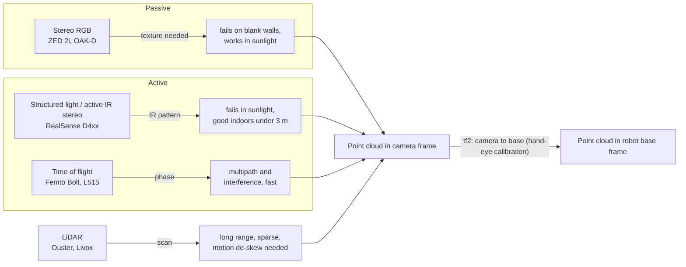

# 3D sensing and geometric perception

Companion hardware entry: `library/hardware/depth-cameras.md`.

## What it is

Turning light (or laser returns) into metric geometry the robot can act on:
depth images, point clouds, surface normals, and the rigid transforms that put
those measurements into the robot's frames. In practice this is three coupled
problems: (1) choosing and configuring a sensor whose physics suits the scene,
(2) calibrating intrinsics, extrinsics, and time so measurements land in the
right place at the right instant, and (3) processing the raw geometry into
something a planner or policy consumes.

Three sensing principles dominate:

- **Passive / active stereo.** Two cameras, triangulate matching pixels.
  Active variants add an IR texture projector so featureless surfaces still
  match. RealSense D4xx, Orbbec Gemini, Luxonis OAK-D Pro are active stereo
  ([RealSense D435i](https://www.realsenseai.com/products/depth-camera-d435i/),
  [Orbbec Gemini 2](https://www.orbbec.com/products/stereo-vision-camera/gemini-2/),
  [OAK-D Pro](https://docs.luxonis.com/hardware/products/OAK-D%20Pro)).
  Stereolabs ZED is passive stereo with a learned matcher ("Neural Depth
  Engine", [depth modes](https://docs.stereolabs.com/docs/depth-sensing/depth-modes.md)).
- **Structured light.** Project a known pattern, decode its deformation. Was
  the Kinect v1 / Orbbec Astra approach; now mostly displaced by active stereo
  in robotics. Orbbec still lists Astra as legacy in its ROS 2 driver
  ([OrbbecSDK_ROS2](https://github.com/orbbec/OrbbecSDK_ROS2)).
- **Time of flight (ToF).** Measure light travel time per pixel (indirect ToF
  via phase, e.g. Orbbec Femto Bolt at 850 nm
  ([Femto Bolt](https://www.orbbec.com/products/tof-camera/femto-bolt/))), or
  scan a laser (LiDAR, e.g. [Ouster OS1](https://static.ouster.dev/sensor-docs/hw_user_manual_OS1/hw_common_sections_OS1/os1-overview.html),
  [Livox Mid-360](https://www.livoxtech.com/mid-360/specs)). The discontinued
  RealSense L515 was a MEMS-scanned LiDAR camera
  ([Intel L515 spec](https://www.intel.com/content/www/us/en/products/sku/201775/intel-realsense-lidar-camera-l515/specifications.html)).

### Diagram: how depth sensing principles trade off

Every branch ends in the same place: geometry only becomes useful once it is
expressed in the robot's frame, so calibration and time sync sit on the
critical path regardless of sensor choice.

## Why it matters in the field

- Most manipulation stacks (grasp planners, collision scenes, point-cloud
  policies) consume depth. Bad depth is the most common silent failure in a
  demo: the policy sees a hole where a glass is.
- Learned policies trained on RGB-D inherit the sensor's failure modes.
  Transparent and specular objects produce "noisy or distorted approximations
  of surfaces behind them" ([ClearGrasp, arXiv:1910.02550](https://arxiv.org/abs/1910.02550)).
- Calibration errors are multiplicative with reach: a 1 deg camera-mount
  error is ~17 mm at 1 m. Hand-eye calibration quality caps grasp precision
  ([MoveIt hand-eye tutorial](https://moveit.picknik.ai/main/doc/examples/hand_eye_calibration/hand_eye_calibration_tutorial.html)).
- Time misalignment between camera frames and joint states is a hidden
  source of action-label noise in teleop datasets (see
  `topics/teleoperation-and-data-collection.md`).
- Mobile robots need a metric map and a drift-free localization frame; the
  REP 105 `map -> odom -> base_link` contract is what lets Nav2, SLAM, and
  perception nodes interoperate ([REP 105](https://raw.githubusercontent.com/ros-infrastructure/rep/master/rep-0105.rst)).
- Vendor landscape is in motion. Intel spun RealSense out as an independent
  company on 2025-07-11 with $50M funding ([RealSense press release](https://www.realsenseai.com/news-insights/news/realsense-completes-spin-out-from-intel-raises-50-million-to-accelerate-ai-powered-vision-for-robotics-and-biometrics/)).
  Orbbec's Femto Bolt is the Microsoft-endorsed Azure Kinect replacement
  ([Orbbec comparison](https://www.orbbec.com/documentation/comparison-with-azure-kinect-dk/)).

## Key concepts and methods

### Depth geometry

- **Pinhole intrinsics** `K = [[fx,0,cx],[0,fy,cy],[0,0,1]]` plus distortion
  `D` (plumb_bob: k1,k2,t1,t2,k3). In ROS these live in `sensor_msgs/CameraInfo`
  together with rectification `R` and projection `P`; for a stereo pair
  `P[0][3] = Tx = -fx' * B` where `B` is the baseline
  ([CameraInfo.msg](https://raw.githubusercontent.com/ros2/common_interfaces/humble/sensor_msgs/msg/CameraInfo.msg)).
- **Stereo depth** `Z = f * B / d` (disparity `d` in pixels). Depth error grows
  with `Z^2 / (f B)`: a wider baseline gives more accurate depth but a larger
  minimum distance (MinZ), which is why short-range cameras (D405, 18 mm
  baseline) and long-range cameras (D455, 95 mm; ZED, 120 mm) exist
  ([Luxonis stereo depth config](https://docs.luxonis.com/hardware/platform/depth/configuring-stereo-depth),
  [D405](https://www.therobotreport.com/intel-adds-short-range-realsense-d405-depth-camera/),
  [D455](https://www.automate.org/products/realsense/realsense-d455-depth-camera)).
- **Back-projection**: `X = (u-cx) Z / fx`, `Y = (v-cy) Z / fy`. Depth-to-color
  alignment reprojects depth into the RGB camera using the depth-to-color
  extrinsic; RealSense exposes it as `align_depth.enable`
  ([realsense-ros](https://github.com/IntelRealSense/realsense-ros)).
- **Optical vs body frames.** REP 103: body frames are x-forward, y-left,
  z-up; camera `*_optical` frames are z-forward, x-right, y-down. Mixing them
  is the classic "point cloud is rotated 90 deg" bug
  ([REP 103](https://raw.githubusercontent.com/ros-infrastructure/rep/master/rep-0103.rst)).

### Depth failure modes

| Failure | Mechanism | Which sensors | Mitigation |
|---|---|---|---|
| Transparent / glass | Refraction and reflection: sensor returns the background or nothing ([TransCG, arXiv:2202.08471](https://arxiv.org/abs/2202.08471)) | All | Depth completion nets (ClearGrasp, TransCG, [ClearDepth arXiv:2409.08926](https://arxiv.org/html/2409.08926)); RGB-only policies; tactile |
| Specular / reflective metal | Mirror reflection of projector pattern or ToF pulse | Active stereo, ToF | Polarizer (ZED 2i option), viewpoint change, learned completion |
| Dark / matte black | Absorbs IR, low SNR | Active stereo, ToF | Longer exposure, external projector ([RealSense external projectors](https://www.intelrealsense.com/external-projectors-for-depth-cameras/)) |
| Direct sunlight | Washes out IR projector; passive stereo keeps working on visible texture | Active stereo loses projector benefit; ToF saturates | IR pass filter: RealSense "f" variants ship a 750 nm filter ([RealSense IR filter](https://www.intelrealsense.com/stereo-depth-with-ir/)); ZED is passive |
| Repetitive texture | Stereo ambiguity in matching | Stereo | IR filter, projector, learned matchers |
| Multipath / flying pixels at edges | ToF phase mixing at depth discontinuities; stereo interpolation at edges | ToF, stereo | Edge-aware filters, drop pixels with high depth gradient (from field, unverified) |
| Too close / too far | Below MinZ (stereo) or beyond unambiguous range (ToF) | All | Pick sensor by working distance; see hardware table |
| Multi-camera IR interference | Overlapping projector patterns | Structured light badly; RealSense D4xx "do not suffer from any significant cross-talk" ([RealSense multi-camera](https://dev.realsenseai.com/docs/multiple-depth-cameras-configuration/)) | Hardware sync/trigger; time-slice projectors |

### Point cloud processing basics (Open3D)

From the [Open3D point cloud tutorial](https://www.open3d.org/docs/release/tutorial/geometry/pointcloud.html):

- **Voxel downsample**: `pcd.voxel_down_sample(voxel_size=0.005)` (5 mm for
  tabletop). Always downsample before normals/ICP; it bounds compute and
  equalizes density.
- **Crop**: `pcd.crop(o3d.geometry.AxisAlignedBoundingBox(min_bound, max_bound))`
  in the robot base frame after transforming the cloud. Crop the workspace
  first; most points are floor and far wall.
- **Normals**: `pcd.estimate_normals(o3d.geometry.KDTreeSearchParamHybrid(radius=0.01, max_nn=30))`,
  then `orient_normals_towards_camera_location(cam_pos)` so normals face the
  sensor consistently.
- **Plane removal**: `segment_plane(distance_threshold=0.01, ransac_n=3, num_iterations=1000)`
  to drop the table, then `cluster_dbscan(eps=0.02, min_points=10)` to
  separate objects (`-1` = noise).
- **Outlier removal**: `remove_statistical_outlier` / `remove_radius_outlier`
  before anything that fits geometry.
- **Depth image -> cloud**: `o3d.geometry.PointCloud.create_from_rgbd_image`
  with `PinholeCameraIntrinsic` built from `CameraInfo.K`. Depth is usually
  `uint16` millimetres (`depth_scale=1000`) from RealSense/Orbbec; ZED
  publishes `float32` metres. Check before converting.
- Keep the dtype/shape convention from `CLAUDE.md`: `# (N, 3) float64` for
  Open3D, `float32` for torch.

### Time synchronization

- Every camera message carries `header.stamp`; `CameraInfo` must be published
  "in lockstep" with its image ([CameraInfo.msg](https://raw.githubusercontent.com/ros2/common_interfaces/humble/sensor_msgs/msg/CameraInfo.msg)).
- Within one device, the driver aligns streams: RealSense `enable_sync`
  "gathers closest frames of different sensors ... to be sent with the same
  timetag" ([realsense-ros](https://github.com/IntelRealSense/realsense-ros)).
- Across devices, use hardware triggering where available: RealSense
  `inter_cam_sync_mode` 1 = master, 2 = slave over pins 5 (SYNC) and 9 (GND)
  ([RealSense multi-camera](https://dev.realsenseai.com/docs/multiple-depth-cameras-configuration/));
  ZED X over GMSL2 syncs "at frame-level within 100 microseconds"
  ([ZED X One stereo](https://docs.stereolabs.com/docs/products/cameras/zedxone/dual-camera-stereo-vision));
  Femto Bolt has SYNC_IN/SYNC_OUT on its 8-pin connector
  ([Femto Bolt](https://www.orbbec.com/products/tof-camera/femto-bolt/));
  Ouster LiDAR uses PTP ([Ouster OS1](https://static.ouster.dev/sensor-docs/hw_user_manual_OS1/hw_common_sections_OS1/os1-overview.html)).
- In software, `message_filters` `ApproximateTime` policy pairs image,
  depth, and `JointState` within a slop ([ros2/message_filters](https://github.com/ros2/message_filters)).
  Log the residual `|t_img - t_joint|` per sample; if the median exceeds half
  a control period, fix the clock, not the policy.
- Camera-to-IMU or camera-to-camera temporal offsets can be estimated
  offline with Kalibr (spatial + temporal calibration, AprilGrid target)
  ([ethz-asl/kalibr](https://github.com/ethz-asl/kalibr)).

### LiDAR for mobile robots

- 2D scanning LiDAR (`sensor_msgs/LaserScan`) is enough for planar
  SLAM/Nav2 on flat floors; 3D LiDAR (`PointCloud2`) is needed for ramps,
  overhangs, and outdoor terrain.
- Range specs are quoted at a reflectivity: Ouster OS1 Rev7 gives 90 m
  at over 90% detection probability on a 10% Lambertian target, 42.4 deg
  vertical FOV, 32/64/128 channels, IP68/IP69K
  ([Ouster OS1 datasheet](https://data.ouster.io/downloads/datasheets/datasheet-rev7-v3p0-os1.pdf)).
  Livox Mid-360: 360 x 59 deg FOV, 40 m at 10% reflectivity, up to 200k
  points/s, 10 Hz, built-in ICM40609 IMU ([Livox Mid-360 specs](https://www.livoxtech.com/mid-360/specs)).
- Motion distortion: a 10 Hz spinning LiDAR sweeps for 100 ms while the robot
  moves; de-skew using per-point timestamps and odometry/IMU before mapping
  (from field, unverified; standard in LiDAR-inertial odometry pipelines).
- LiDAR-camera extrinsics need their own calibration (target-based or
  edge-alignment). Do not assume the CAD transform (from field, unverified).

### ROS 2 integration

- `image_transport` provides pluggable compressed/raw transports and a
  `republish` tool; camera drivers publish `image_raw` + `camera_info` as a
  pair ([ros-perception/image_common](https://github.com/ros-perception/image_common)).
- `image_pipeline` gives `camera_calibration` (checkerboard and ChArUco),
  `image_proc` rectification, `depth_image_proc` for depth -> `PointCloud2`
  and registration ([camera_calibration](https://index.ros.org/p/camera_calibration/)).
- tf2: a camera driver should publish static TFs `camera_link -> *_optical_frame`
  (RealSense does; `camera_link` origin is the left IR sensor
  ([realsense-ros](https://github.com/IntelRealSense/realsense-ros))). The
  hand-eye result is one more static TF `tool0 -> camera_link` (eye-in-hand)
  or `base_link -> camera_link` (eye-to-hand).
- Mobile frames follow REP 105: `odom` is continuous but drifts without
  bound; `map` "should not significantly drift" but may jump; tree is
  `map -> odom -> base_link` ([REP 105](https://raw.githubusercontent.com/ros-infrastructure/rep/master/rep-0105.rst)).
- QoS: sensor streams use `SensorDataQoS` (best effort, small depth);
  `camera_info` and TF static are reliable/transient-local. Document the
  choice per node (see `CLAUDE.md` ROS 2 standards).

## Sensor comparison table (with links)

Verified figures only; see `hardware/depth-cameras.md` for detail and quirks.

| Sensor | Principle | Depth res / fps | Range (vendor) | Baseline | Interface | Notes |
|---|---|---|---|---|---|---|
| [RealSense D435i](https://www.realsenseai.com/products/depth-camera-d435i/) | Active IR stereo, global shutter depth | 1280x720 up to 90 fps | ideal 0.3-3 m, MinZ ~28 cm | (unverified) | USB-C 3.1 Gen1 | IMU; RGB rolling shutter |
| [RealSense D455](https://www.automate.org/products/realsense/realsense-d455-depth-camera) | Active IR stereo, global shutter depth + RGB | (unverified) | ideal 0.6-6 m | 95 mm | USB-C | IMU |
| [RealSense D405](https://www.therobotreport.com/intel-adds-short-range-realsense-d405-depth-camera/) | Stereo, short range | 1280x800 | ideal 7-50 cm, +/-1.4% at 20 cm | 18 mm | USB-C | No IMU; 42x42x23 mm, 60 g |
| [RealSense L515](https://www.intel.com/content/www/us/en/products/sku/201775/intel-realsense-lidar-camera-l515/specifications.html) | MEMS LiDAR, 860 nm | 1024x768 @ 30 | 0.25-9 m, indoor only | n/a | USB-C | EOL: last ship 2022-03-31 ([Robot Report](https://www.therobotreport.com/intel-issues-end-of-life-notice-realsense-lidar/)) |
| [ZED 2i](https://www.stereolabs.com/store/products/zed-2i) | Passive stereo + neural depth, rolling shutter | (unverified) | 0.2-20 m ([Stereolabs help](https://support.stereolabs.com/hc/en-us/articles/1500008533841)) | 120 mm | USB 3.1 | IP66; IMU; needs CUDA GPU |
| [ZED X](https://docs.stereolabs.com/docs/products/cameras/zedx) | Passive stereo + neural, global shutter | 2x 1920x1200 | 0.3-20 m (wide lens), 1-35 m (4 mm) ([Mouser](https://www.mouser.com/en/new/stereolabs/stereolabs-zed-x-stereo-camera/)) | 120 mm | GMSL2 only, Jetson + ZED Link | IP67; not USB |
| [Orbbec Gemini 2](https://www.orbbec.com/products/stereo-vision-camera/gemini-2/) | Active IR stereo | 1280x800 @ 30 | 0.15-10 m | (unverified) | USB 3.0 Type-C | IMU; H91 x V66 deg |
| [Orbbec Gemini 335L](https://www.orbbec.com/products/stereo-vision-camera/gemini-335l/) | Active stereo, global shutter | 1280x800 @ 30 | 0.17-20 m+, optimal 0.25-6 m | 95 mm | USB 3.0 Type-C | IP65; IMU; multi-device HW timestamps |
| [Orbbec Femto Bolt](https://www.orbbec.com/products/tof-camera/femto-bolt/) | iToF 850 nm (Azure Kinect tech) | 1024x1024 @ 15 (WFOV), 640x576 @ 30 (NFOV) | 0.25-5.46 m by mode | n/a | USB 3.2 Gen1 Type-C | 4K RGB HDR; IMU; sync connector |
| [Luxonis OAK-D Pro](https://docs.luxonis.com/hardware/products/OAK-D%20Pro) | Active stereo (940 nm dot projector) + on-device NN | 1280x800 mono pair, global shutter | MinZ ~20-70 cm by mode; ~10-12 m max | 7.5 cm | USB 2/3 | RVC2 4 TOPS; BNO086 IMU |
| [Ouster OS1 Rev7](https://data.ouster.io/downloads/datasheets/datasheet-rev7-v3p0-os1.pdf) | Spinning 3D LiDAR | 32/64/128 ch | 90 m @ 10% refl. | n/a | Ethernet, PTP | IP68/69K; IMU |
| [Livox Mid-360](https://www.livoxtech.com/mid-360/specs) | Non-repetitive scanning LiDAR | 200k pts/s, 10 Hz | 40 m @ 10% refl. | n/a | Ethernet | 360 x 59 deg FOV; IMU |

## Calibration and sync procedure (step by step, practical)

Do this in order; each step depends on the previous one. Record every output
file under `experiments/<date>-calib-<robot>/` with the camera serial.

1. **Fix the camera configuration first.** Resolution, fps, and any
   disparity-shift or depth-preset change the effective intrinsics and MinZ.
   Calibrate the exact profile you will run.
2. **Check factory intrinsics.** All vendors ship factory intrinsics in
   `camera_info`. Print a ChArUco board, hold it at the working distance,
   and check reprojection error with
   `ros2 run camera_calibration cameracalibrator --pattern charuco --size 8x11 --square 0.022 --charuco_marker_size 0.016 --aruco_dict 4x4_100`
   ([camera_calibration](https://index.ros.org/p/camera_calibration/)).
   ChArUco is preferred over a plain checkerboard because partially visible
   boards still detect. Re-calibrate only if the factory result is clearly
   worse; overwriting factory depth-to-color extrinsics on RealSense is a
   separate, firmware-level operation (from field, unverified).
3. **Mount rigidly, then measure the temperature drift.** Log depth of a
   fixed plane for 20 minutes after power-on; many cameras drift by
   millimetres while warming (from field, unverified).
4. **Hand-eye calibration.** Choose eye-in-hand (camera on the tool, target
   fixed) or eye-to-hand / eye-on-base (camera fixed, target on the tool)
   ([easy_handeye](https://github.com/IFL-CAMP/easy_handeye)). With MoveIt's
   hand-eye plugin: default target is a 3x4 ArUco grid (`DICT_5X5_250`);
   five samples suffice to compute, results "typically plateau after about
   12 or 15 samples"; default solver Daniilidis; export a launch file with
   the static transform ([MoveIt tutorial](https://moveit.picknik.ai/main/doc/examples/hand_eye_calibration/hand_eye_calibration_tutorial.html)).
   Pose advice from easy_handeye: maximize rotation between poses, keep the
   target close, minimize translation, and collect redundant poses.
5. **Validate hand-eye physically.** Point the TCP at a marker corner seen by
   the camera; the residual in the base frame is your real error. Repeat at
   three workspace corners. Write the number down; under 3 mm at 0.5 m is
   good for tabletop grasping (from field, unverified).
6. **Frames and tf.** Publish the result as a static TF (`tool0 ->
   camera_link` or `base_link -> camera_link`). Verify `ros2 run tf2_tools
   view_frames` shows one tree, no duplicate parents, optical frames per
   REP 103 ([REP 103](https://raw.githubusercontent.com/ros-infrastructure/rep/master/rep-0103.rst)).
7. **Time sync.** (a) Prefer hardware trigger between cameras (RealSense
   sync cable, GMSL2, Femto sync port). (b) Put the robot controller, sensor
   host, and any Jetson on PTP or at least chrony to one master; check
   offset with `chronyc tracking`. (c) In software use
   `message_filters::sync_policies::ApproximateTime` with a slop of half a
   frame period ([ros2/message_filters](https://github.com/ros2/message_filters)).
   (d) Measure camera latency once: flash an LED wired to a GPIO the robot
   timestamps, find the frame it appears in (from field, unverified).
8. **Depth sanity.** Place a known box at 0.5 m and 1.5 m; compare measured
   Z and edge length against tape. Log the error into the calibration record.
9. **Multi-camera.** Calibrate each camera to the robot independently, then
   check overlap by ICP-ing their clouds of the same object; residual >
   1 cm means one extrinsic is wrong. Watch USB bandwidth: RealSense
   recommends staying "well below" 1200 MB/s total and cables under 1 m
   ([RealSense multi-camera](https://dev.realsenseai.com/docs/multiple-depth-cameras-configuration/)).
10. **Freeze and version.** Commit the yaml/launch files with the camera
    serial and firmware in the name. Re-run steps 5 and 8 after any bump,
    remount, or firmware update.

## Practical gotchas

- ROS `camera_link` on RealSense is the left IR imager, not the RGB lens or
  the housing centre ([realsense-ros](https://github.com/IntelRealSense/realsense-ros)).
  CAD-derived mounts must account for that offset.
- Depth image encodings differ: `16UC1` millimetres vs `32FC1` metres.
  Aligned depth is in the color camera's intrinsics, not the depth camera's.
- RealSense multi-camera validation is counter-intuitive: "If you see NO
  DRIFT, then there is NO HW sync" (timestamps from the same clock drift
  together only when synced) ([RealSense multi-camera](https://dev.realsenseai.com/docs/multiple-depth-cameras-configuration/)).
- ZED needs an NVIDIA GPU; the ROS 2 wrapper has a "CUDA dependency" and
  requires ZED SDK 5.2 for current releases ([zed-ros2-wrapper](https://github.com/stereolabs/zed-ros2-wrapper)).
  Neural depth modes trade accuracy for GPU load: `NEURAL_LIGHT` is the
  "fastest ... best for multi-camera", `NEURAL_PLUS` the slowest
  ([depth modes](https://docs.stereolabs.com/docs/depth-sensing/depth-modes.md)).
- ZED X is GMSL2 only and "not compatible with USB"; budget a Jetson Orin
  and a ZED Link capture card ([ZED X docs](https://docs.stereolabs.com/docs/products/cameras/zedx)).
- Orbbec has two ROS 2 branches: `v2-main` for Gemini 330 series / Gemini 2
  / Femto; legacy `main` (OpenNI) for Astra. Install udev rules or nothing
  enumerates ([OrbbecSDK_ROS2](https://github.com/orbbec/OrbbecSDK_ROS2)).
- Luxonis package names differ by distro: `depthai_ros_driver_v3` on
  Humble/Jazzy, `depthai_ros_driver` on Kilted+ ([Luxonis ROS docs](https://docs.luxonis.com/software-v3/depthai/ros/)).
- L515 is end-of-life (last order 2022-02-28); do not design new systems
  around it ([Robot Report](https://www.therobotreport.com/intel-issues-end-of-life-notice-realsense-lidar/)).
- USB 3 cables and hubs are the top field failure: frame drops, "no device
  detected", or silent resolution fallbacks. Carry known-good short cables.
- Rolling-shutter RGB (D435i, ZED 2i) smears during fast arm motion; if the
  policy conditions on RGB during motion, prefer global-shutter RGB (D455,
  ZED X, Gemini 335L).
- Depth "holes" are usually returned as 0, not NaN. Filter zeros before any
  mean/median or you will bias distances toward the camera.
- Sunlight: active-stereo projector contribution disappears outdoors; passive
  texture still works on stereo cameras but ToF saturates. Test at the real
  site time of day.

## What a forward-deployed engineer must be able to do (skills checklist)

- [ ] Pick a sensor from working distance, object material, lighting, and
      compute; justify it with the table above.
- [ ] Bring up any of RealSense / ZED / Orbbec / OAK in ROS 2 Humble, set
      profile and QoS, and confirm `camera_info` matches the image size.
- [ ] Run intrinsic calibration with ChArUco and judge reprojection error.
- [ ] Run and physically validate hand-eye calibration (both mounting
      configurations); publish it as a static TF; reason about REP 103 frames.
- [ ] Diagnose depth failures live (RealSense Viewer, ZED Depth Viewer,
      `rqt_image_view`) and choose a mitigation.
- [ ] Convert depth + `CameraInfo` to a cloud in the base frame, crop,
      downsample, remove the table plane, cluster objects (Open3D).
- [ ] Set up hardware or PTP time sync across two cameras and the robot;
      measure the residual.
- [ ] Record a synchronized RGB-D + joint-state rosbag with correct
      timestamps, and check it with `ros2 bag info` and a plot of stamps.
- [ ] Bring up a 2D or 3D LiDAR, verify frames, and get a first map with
      slam_toolbox / Nav2.
- [ ] Write the calibration record and `DATASET.md` entries per `CLAUDE.md`.

## Open questions to learn hands-on

- How much does hand-eye error actually move a learned grasp policy's
  success rate on our robot? Run the same policy at 2 mm vs 10 mm calibration
  error and count trials.
- Does neural stereo (ZED) or active stereo (Gemini 335L / D455) give more
  stable depth on the specific objects at the customer site (shiny tools,
  clear packaging)? Needs a side-by-side on the same mount.
- Real latency of each driver from exposure to ROS publish, and its
  variance, under load on the deployment compute.
- Whether depth completion models (TransCG-style) are worth the GPU budget
  versus training policies on RGB only for transparent objects.
- How Femto Bolt (ToF) behaves next to active-stereo cameras in the same
  cell: both emit near-IR at 850 vs 940/850 nm.
- Practical multi-camera limit per USB host controller on the deployment PC.

## Related entries

- `library/hardware/depth-cameras.md` (per-family specs and quirks)
- `library/tools/ros2-humble.md`
- `library/topics/teleoperation-and-data-collection.md` (timestamps for datasets)
- `library/topics/imitation-learning.md` (RGB-D observation encoders)
- `library/topics/sim-to-real.md` (depth noise modelling)
- `sops/field-deployment-checklist.md`

## Sources

All claims above link inline. Primary sources grouped by vendor/topic:

- RealSense: [D435i](https://www.realsenseai.com/products/depth-camera-d435i/), [D455](https://www.automate.org/products/realsense/realsense-d455-depth-camera), [D405](https://www.therobotreport.com/intel-adds-short-range-realsense-d405-depth-camera/), [L515 spec](https://www.intel.com/content/www/us/en/products/sku/201775/intel-realsense-lidar-camera-l515/specifications.html), [L515 EOL](https://www.therobotreport.com/intel-issues-end-of-life-notice-realsense-lidar/), [spin-out](https://www.realsenseai.com/news-insights/news/realsense-completes-spin-out-from-intel-raises-50-million-to-accelerate-ai-powered-vision-for-robotics-and-biometrics/), [multi-camera/HW sync](https://dev.realsenseai.com/docs/multiple-depth-cameras-configuration/), [IR filter](https://www.intelrealsense.com/stereo-depth-with-ir/), [external projectors](https://www.intelrealsense.com/external-projectors-for-depth-cameras/), [realsense-ros](https://github.com/IntelRealSense/realsense-ros)
- Stereolabs: [ZED 2i](https://www.stereolabs.com/store/products/zed-2i), [depth range FAQ](https://support.stereolabs.com/hc/en-us/articles/1500008533841), [ZED X docs](https://docs.stereolabs.com/docs/products/cameras/zedx), [ZED X summary](https://www.mouser.com/en/new/stereolabs/stereolabs-zed-x-stereo-camera/), [GMSL2 sync](https://docs.stereolabs.com/docs/products/cameras/zedxone/dual-camera-stereo-vision), [depth modes](https://docs.stereolabs.com/docs/depth-sensing/depth-modes.md), [zed-ros2-wrapper](https://github.com/stereolabs/zed-ros2-wrapper), [ZED 2i accuracy study](https://www.sciencedirect.com/science/article/pii/S0921889024001374)
- Orbbec: [Gemini 2](https://www.orbbec.com/products/stereo-vision-camera/gemini-2/), [Gemini 335L](https://www.orbbec.com/products/stereo-vision-camera/gemini-335l/), [Femto Bolt](https://www.orbbec.com/products/tof-camera/femto-bolt/), [vs Azure Kinect](https://www.orbbec.com/documentation/comparison-with-azure-kinect-dk/), [OrbbecSDK_ROS2](https://github.com/orbbec/OrbbecSDK_ROS2)
- Luxonis: [OAK-D Pro](https://docs.luxonis.com/hardware/products/OAK-D%20Pro), [stereo depth config](https://docs.luxonis.com/hardware/platform/depth/configuring-stereo-depth), [ROS docs](https://docs.luxonis.com/software-v3/depthai/ros/)
- LiDAR: [Ouster OS1 Rev7 datasheet](https://data.ouster.io/downloads/datasheets/datasheet-rev7-v3p0-os1.pdf), [Livox Mid-360](https://www.livoxtech.com/mid-360/specs)
- ROS: [REP 103](https://raw.githubusercontent.com/ros-infrastructure/rep/master/rep-0103.rst), [REP 105](https://raw.githubusercontent.com/ros-infrastructure/rep/master/rep-0105.rst), [CameraInfo.msg](https://raw.githubusercontent.com/ros2/common_interfaces/humble/sensor_msgs/msg/CameraInfo.msg), [image_common](https://github.com/ros-perception/image_common), [camera_calibration](https://index.ros.org/p/camera_calibration/), [message_filters](https://github.com/ros2/message_filters)
- Calibration: [MoveIt hand-eye](https://moveit.picknik.ai/main/doc/examples/hand_eye_calibration/hand_eye_calibration_tutorial.html), [easy_handeye](https://github.com/IFL-CAMP/easy_handeye), [Kalibr](https://github.com/ethz-asl/kalibr)
- Processing and papers: [Open3D point cloud tutorial](https://www.open3d.org/docs/release/tutorial/geometry/pointcloud.html), [ClearGrasp](https://arxiv.org/abs/1910.02550), [TransCG](https://arxiv.org/abs/2202.08471), [ClearDepth](https://arxiv.org/html/2409.08926)
