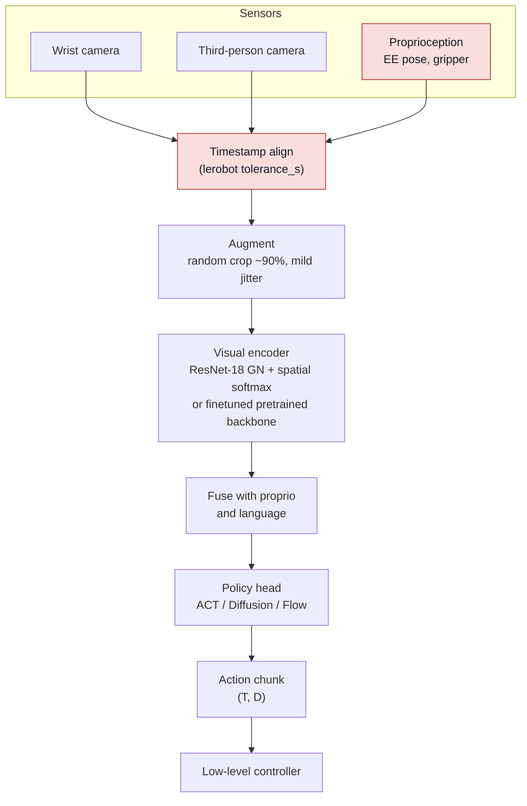

# Perception for policy learning

## What it is

A learned robot policy is a function from observations to actions. "Perception"
here is everything upstream of that function: which sensors exist, where they
are mounted, how their streams are synchronized and timestamped, how images are
resized/cropped/augmented, which network turns pixels (or points) into features,
how proprioception and language are fused in, and how much history the policy
sees. These choices are made once at data-collection time and are then baked
into every episode you record. Most of them cannot be changed without
recollecting data, which is why they matter more than most architecture choices.

## Why it matters in the field

- Camera placement and observation space decisions are made on day one of a
  deployment and are hard to reverse. Wrong choices show up weeks later as
  policies that will not generalize.
- The published ablations are consistent: wrist cameras and random-crop
  augmentation each account for double-digit relative success differences in
  imitation learning ([robomimic](https://arxiv.org/abs/2108.03298)), while the
  choice of pretrained encoder often matters less than whether it is finetuned
  ([Hansen et al. 2022](https://arxiv.org/abs/2212.05749),
  [OpenVLA](https://arxiv.org/abs/2406.09246)).
- Timing bugs (unsynchronized cameras, proprio latency, actions executed late)
  produce jittery or failing policies that look like "model problems" but are
  data-pipeline problems ([UMI](https://arxiv.org/abs/2402.10329)).
- Proprioception is a double-edged input: it helps precision, but policies can
  shortcut through it and ignore vision ([Octo](https://arxiv.org/abs/2405.12213),
  [OpenVLA-OFT](https://arxiv.org/abs/2502.19645)).

### Diagram: the perception to action interface

Red stages are where field failures hide: unsynced timestamps and
proprioception shortcuts both look like "the model is bad" until the data
pipeline is inspected.

## Design choices and evidence table

### Pretrained visual representations (PVRs) for control

| Design choice | Finding | Source |
|---|---|---|
| R3M (ResNet, Ego4D, time-contrastive + video-language + L1 sparsity) | Frozen encoder; >20% higher success than scratch and >10% over CLIP/MoCo across 12 sim manipulation tasks; real Franka tasks from 20 demos. | [Nair et al. 2022](https://arxiv.org/abs/2203.12601) |
| MVP (MAE ViT, 4.5M internet + egocentric images, 307M params) | Frozen encoder; up to 75% better than CLIP and up to 81% better than supervised ImageNet or scratch on real robot tasks. | [Radosavovic et al. 2022](https://arxiv.org/abs/2210.03109) |
| VC-1 (MAE ViT-L, >4000 h egocentric video + ImageNet, CortexBench 17 tasks) | "None are universally dominant." Scaling data does not help universally (does on average). Task-specific adaptation (finetuning) of VC-1 matched or beat best known results on all CortexBench tasks. | [Majumdar et al. 2023](https://arxiv.org/abs/2303.18240) |
| Learning-from-scratch baseline | Shallow ConvNet + data augmentation is "surprisingly competitive" with frozen PVR/MVP/R3M; the domain gap between pretraining data and control benchmarks is "alleviated by finetuning". | [Hansen et al. 2022](https://arxiv.org/abs/2212.05749) |
| Which pretraining dataset | Standard vision datasets (ImageNet, Kinetics, 100DoH) are strong candidates; image distribution matters more than dataset size; sim benchmarks do not reliably predict real performance. | [Dasari et al. 2023](https://arxiv.org/abs/2310.09289) |
| What predicts OOD robustness | Emergent segmentation ability of ViT PVRs predicts generalization under lighting/texture/distractor shifts better than ImageNet accuracy or shape bias; manipulation-specific PVRs were not more robust. | [Burns et al. 2023](https://arxiv.org/abs/2312.12444) |
| PVR evaluation protocol | Effectiveness of a PVR depends on the downstream learner; RL-based evaluation is inconsistent, BC and visual-reward evaluations are more reliable. | [Hu et al. 2023](https://arxiv.org/abs/2304.04591) |
| Theia (distills multiple VFMs into one ViT) | Outperforms teacher models and prior robot representations with less data and smaller size; feature-norm entropy correlates with downstream success. | [Shang et al. 2024](https://arxiv.org/abs/2407.20179) |
| DINOv2 features as backbone | Self-supervised ViT features that work "without fine-tuning" for many vision tasks; fused DINOv2 + SigLIP was the best visual representation in Prismatic VLMs, with 5-10% gains on localization tasks. | [Oquab et al. 2023](https://arxiv.org/abs/2304.07193), [Karamcheti et al. 2024](https://arxiv.org/abs/2402.07865) |
| Frozen vs finetuned encoder in a VLA | OpenVLA: finetuning the vision encoder gave 80.0% average success vs 46.7% frozen on Bridge tasks. 224 px vs 384 px inputs: no difference, 3x training cost. | [Kim et al. 2024](https://arxiv.org/abs/2406.09246) |
| Partially frozen / fused features | SpawnNet fuses multi-layer pretrained features into a separately learned policy stream; better categorical generalization than frozen or fully finetuned. | [Lin et al. 2023](https://arxiv.org/abs/2307.03567) |

Net reading: pretraining helps most when it is finetuned or adapted; frozen
PVRs are not reliably better than an augmented ResNet trained from scratch.
Pick the encoder for robustness properties (segmentation-like features), not
for benchmark averages.

### Camera configuration

| Design choice | Finding | Source |
|---|---|---|
| Eye-in-hand vs third-person | Hand-centric view "consistently improves training efficiency and out-of-distribution generalization"; a third-person camera is needed when the wrist view lacks observability but adding it can hurt OOD unless regularized (variational information bottleneck). | [Hsu et al. 2022](https://arxiv.org/abs/2203.12677) |
| Removing wrist camera (BC) | 9% (Square) and 43% (Transport) relative drop in success; confirmed on real robot. | [robomimic](https://arxiv.org/abs/2108.03298) |
| ACT / ALOHA | 4 Logitech C922x webcams at 480x640: two wrist, one front, one top; ResNet18 per camera; joint positions as proprio; 50 Hz. | [Zhao et al. 2023](https://arxiv.org/abs/2304.13705) |
| Diffusion Policy (real) | 2 fixed RealSense D415 streams at 320x240 (recorded at 720p/30 fps, used at 10 fps), random crop to 288x216; observation horizon 2. | [Chi et al. 2023](https://arxiv.org/abs/2303.04137) |
| DROID | Franka + 2 exterior Zed 2 stereo on adjustable tripods + Zed Mini wrist stereo; 1280x720; 1417 distinct third-person viewpoints, cameras moved per scene. Their policy used the two external cams at 128x128 with an ImageNet ResNet-50. | [Khazatsky et al. 2024](https://arxiv.org/abs/2403.12945) |
| pi0 | 2-3 cameras per robot (wrist + base or over-the-shoulder); missing image slots masked; PaliGemma (SigLIP) backbone; 224x224 inputs in the open-source implementation; H=50 action chunk. | [Black et al. 2024](https://www.pi.website/download/pi0.pdf), [openpi](https://github.com/Physical-Intelligence/openpi/blob/main/src/openpi/models/pi0.py) |
| Wrist + proprio added to a VLA | OpenVLA-OFT on LIBERO: 95.3% (third-person only) to 97.1% (adding wrist image + proprio); throughput stays 71.4 Hz. | [Kim et al. 2025](https://arxiv.org/abs/2502.19645) |
| Wrist camera in a generalist model | Octo finetuning often did better with third-person only; authors attribute this to only 27% of pretraining data having wrist cameras. | [Octo 2024](https://arxiv.org/abs/2405.12213) |
| UMI wrist-only, fisheye + mirrors | 155 deg fisheye GoPro on the gripper, raw (unrectified) fisheye images, side mirrors for implicit stereo; camera motion during collection acts like random cropping. | [Chi et al. 2024](https://arxiv.org/abs/2402.10329) |
| Resolution | robomimic uses 84x84 except ToolHang at 240x240 "due to the need for high-precision control". Octo: 16x16 patches beat 32x32 on fine-grained grasping. OpenVLA: 224 vs 384 no difference. | [robomimic](https://arxiv.org/abs/2108.03298), [Octo](https://arxiv.org/abs/2405.12213), [OpenVLA](https://arxiv.org/abs/2406.09246) |

### Image augmentation

| Design choice | Finding | Source |
|---|---|---|
| Random shift (pad 4 px, crop back) | DrQ: on 84x84 DMControl frames, pad each side by 4 px and randomly crop, i.e. shifts of +-4 px; alone this makes pixel SAC competitive. | [Kostrikov et al. 2020](https://arxiv.org/abs/2004.13649) |
| Random crop for BC | robomimic: crop 76x76 from 84x84 (108 from 120, 216 from 240); removing it drops success 47% (Square) and 35% (Transport). Diffusion Policy follows the same recipe with a center crop at inference. | [robomimic](https://arxiv.org/abs/2108.03298), [Chi et al. 2023](https://arxiv.org/abs/2303.04137) |
| Which augmentations | RAD: random crop/translate, color jitter, cutout, random conv, amplitude scale all help in RL; crop/translate were the standouts. | [Laskin et al. 2020](https://arxiv.org/abs/2004.14990) |
| Strong augmentation instability | Strong augmentations raise Q-target variance and can diverge off-policy RL; SVEA applies augmentation only to the current observation, not the target. Relevant if you do real-world RL. | [Hansen et al. 2021](https://arxiv.org/abs/2107.00644) |
| Large-scale BC recipe | Octo: stochastic crop + resize to 256x256 + color jitter on third-person; wrist camera gets color jitter only (no crop), 128x128. DROID policies: 128x128 + color jitter. | [Octo](https://arxiv.org/abs/2405.12213), [DROID](https://arxiv.org/abs/2403.12945) |
| Augmentation vs shortcut learning | Selected augmentations reduce shortcut learning in OXE-style fragmented datasets. | [Shortcut learning in generalist policies, 2025](https://arxiv.org/abs/2508.06426) |

### Point-cloud and depth-based policies

| Design choice | Finding | Source |
|---|---|---|
| DP3 (sparse colorless point cloud, MLP encoder) | 72 sim tasks, 24.2% relative gain over Diffusion Policy with 10 demos; real: 85% vs 35% (DP) and 20% (DP with depth); 0% safety violations vs 32.5%; 512-1024 points, single camera, no color. | [Ze et al. 2024](https://arxiv.org/abs/2403.03954) |
| iDP3 (egocentric 3D for humanoids) | Camera-frame point clouds (no calibration or segmentation), many more points, pyramid conv encoder, horizon 16; RealSense L515 LiDAR chosen because poorer depth "can result in suboptimal performance". | [Ze et al. 2024](https://arxiv.org/abs/2410.10803) |
| PerAct (RGB-D voxel grid + Perceiver) | Voxel action formulation "significantly outperforms unstructured image-to-action agents"; 18 RLBench tasks, 7 real tasks. | [Shridhar et al. 2022](https://arxiv.org/abs/2209.05451) |
| RVT (re-rendered virtual views) | 26% relative gain over PerAct, 36x faster training, 2.3x faster inference; ~10 demos per real task. | [Goyal et al. 2023](https://arxiv.org/abs/2306.14896) |
| RVT-2 (coarse-to-fine) | RLBench 65% to 82%; 6x faster training, 2x faster inference; plug insertion with 10 demos. | [Goyal et al. 2024](https://arxiv.org/abs/2406.08545) |
| 3D vs 2D systematic comparison | OBSBench (125 sim tasks): even simple point-cloud methods "frequently outperform" RGB and RGB-D, with and without pretraining; appearance + coordinates together is best. Sim only. | [Zhu et al. 2024](https://arxiv.org/abs/2402.02500) |

Caveat: 3D wins are conditional on depth quality and on cropping/segmenting
the workspace (DP3) or a fixed camera-to-robot calibration (RVT/PerAct).
Cheap stereo depth on transparent or reflective objects is a common failure
(from field, unverified).

### Object-centric and keypoint representations

| Design choice | Finding | Source |
|---|---|---|
| ReKep (relational keypoint constraints) | Keypoints = k-means (k=5) centroids of DINOv2 patch features inside SAM masks; GPT-4o writes Python cost functions over keypoints; tracked at 20 Hz; no task-specific data. | [Huang et al. 2024](https://arxiv.org/abs/2409.01652) |
| MOKA (mark-based affordance points) | VLM predicts grasp point, function point, and waypoints on a marked image; zero/few-shot tabletop tasks. | [Liu et al. 2024](https://arxiv.org/abs/2403.03174) |
| KAT (keypoint action tokens) | Keypoints as observation tokens and actions as token sequences for in-context imitation with an LLM; competitive with diffusion policies in low-data regimes. | [Di Palo and Johns 2024](https://arxiv.org/abs/2403.19578) |

### Language-conditioned observation encoders

| Design choice | Finding | Source |
|---|---|---|
| FiLM inside the image encoder | RT-1: Universal Sentence Encoder embedding drives identity-initialized FiLM layers in EfficientNet-B3; 6 images at 300x300; TokenLearner 81 -> 8 tokens per image. | [Brohan et al. 2022](https://arxiv.org/abs/2212.06817) |
| Language as transformer tokens | Octo: frozen T5-base was best; larger or finetuned T5 gave no gain, attributed to sparse language annotations (56% of data). | [Octo](https://arxiv.org/abs/2405.12213) |
| VLM backbone | OpenVLA (Llama-2 + DINOv2/SigLIP), pi0 (PaliGemma) fuse language and vision in the pretrained VLM; OpenVLA-OFT found FiLM had little effect on LIBERO but used it for ALOHA language following. | [OpenVLA](https://arxiv.org/abs/2406.09246), [pi0](https://www.pi.website/download/pi0.pdf), [OFT](https://arxiv.org/abs/2502.19645) |

### Proprioception fusion and the shortcut problem

| Design choice | Finding | Source |
|---|---|---|
| Causal confusion | "Access to more information can yield worse performance": BC picks up spurious correlates under distribution shift. | [de Haan et al. 2019](https://arxiv.org/abs/1905.11979) |
| Copycat problem | With observation history, the imitator "learns to cheat by predicting the expert's previous action" instead of the next one. | [Wen et al. 2020](https://arxiv.org/abs/2010.14876) |
| Extra proprio features | Adding EEF velocity or joint pos/vel hurt low-dim agents by 49-88% relative; image agents 2-29%. "Information hiding can be a powerful paradigm." | [robomimic](https://arxiv.org/abs/2108.03298) |
| Proprio in a generalist | Octo: policies with proprio "seemed generally worse", hypothesized causal confusion between state and target actions. | [Octo](https://arxiv.org/abs/2405.12213) |
| Observed over-reliance | RDT-1B kept pouring into an imaginary bowl after missing, "suggesting over-reliance on proprioceptive state over visual feedback". | [OpenVLA-OFT](https://arxiv.org/abs/2502.19645) |
| Where proprio helps | OpenVLA-OFT (+1.8 points on LIBERO with wrist + proprio); ACT and pi0 both feed joint state. Precision and gripper-state tasks benefit. | [OFT](https://arxiv.org/abs/2502.19645), [ACT](https://arxiv.org/abs/2304.13705) |

### Observation history and frame stacking

| Design choice | Finding | Source |
|---|---|---|
| History in BC from low-dim state | BC-RNN >> BC: "observation history is crucial" for low-dim inputs. | [robomimic](https://arxiv.org/abs/2108.03298) |
| History with images | Diffusion Policy: state-based insensitive to observation horizon; CNN vision variant gets worse as horizon grows; To=2 works for most tasks. | [Chi et al. 2023](https://arxiv.org/abs/2303.04137) |
| Pretraining with history | Octo: one frame of history beat none in zero-shot evals; more did not help. | [Octo](https://arxiv.org/abs/2405.12213) |
| No history | ACT conditions on the current observation only and gets 88-96% on real fine tasks via action chunking (k=100 best in ablation). | [ACT](https://arxiv.org/abs/2304.13705) |

### Latency and observation-action alignment

| Design choice | Finding | Source |
|---|---|---|
| Measure per-stream latency, align to the slowest | UMI measures camera, proprio, gripper, and arm latencies separately; interpolates proprio to image capture timestamps; soft-syncs bimanual cameras to within 1/60 s; sends actions ahead by execution latency (100 ms arm, 120 ms gripper in their setup) and discards outdated chunk steps. | [Chi et al. 2024](https://arxiv.org/abs/2402.10329) |
| Effect of ignoring latency | Same policy with latencies set to 0: jittery motion; tossing success fell to 57.5% (69/120). | [UMI](https://arxiv.org/abs/2402.10329) |
| Inference latency with chunks | Real-time chunking freezes committed actions and inpaints the rest so a slow VLA stays smooth; "uniquely robust to inference delay". | [Black et al. 2025](https://arxiv.org/abs/2506.07339) |
| Dataset-level sync check | LeRobotDataset enforces consecutive timestamps of 1/fps +- `tolerance_s` (default 1e-4 s) and uses `delta_timestamps` for history windows. | [lerobot source](https://github.com/huggingface/lerobot/blob/main/src/lerobot/datasets/lerobot_dataset.py) |
| Chunk boundaries | Octo found receding-horizon chunk execution helpful and temporal ensembling not additionally helpful; ACT found both helpful. Test on your task. | [Octo](https://arxiv.org/abs/2405.12213), [ACT](https://arxiv.org/abs/2304.13705) |

### Sim-to-real visual gap

| Design choice | Finding | Source |
|---|---|---|
| Domain randomization | Random textures/lighting/camera in sim; object localization to 1.5 cm on real images with no real training data. | [Tobin et al. 2017](https://arxiv.org/abs/1703.06907) |
| Canonical-image translation (RCAN) | Translate randomized/real images to a canonical sim look; 70% zero-shot grasp success (about 2x DR), 91% with 5k real grasps vs 580k for the real-only baseline. | [James et al. 2019](https://arxiv.org/abs/1812.07252) |
| Bypass RGB with geometry | Point-cloud policies (DexPoint) transfer sim-to-real dexterous grasping to novel objects; same logic behind DP3/iDP3 appearance generalization. | [Qin et al. 2022](https://arxiv.org/abs/2211.09423), [DP3](https://arxiv.org/abs/2403.03954) |
| Real-to-sim-to-real | RialTo scans a digital twin, runs RL with randomization, reports >67% robustness gains over imitation. | [Torne et al. 2024](https://arxiv.org/abs/2403.03949) |
| Visual matching for evaluation | SIMPLER: system ID + green-screen visual matching gives sim evals that correlate with real success and reproduce distribution-shift sensitivities. | [Li et al. 2024](https://arxiv.org/abs/2405.05941) |

## Recommended default camera and encoder setup for a new manipulation task

Default for a single-arm tabletop task with 50-200 demos, ACT or Diffusion
Policy, before any task-specific evidence:

1. Two cameras minimum: one wrist camera and one fixed third-person camera
   looking down the workspace. Add a second third-person view only when the
   task has occlusion the wrist camera cannot resolve (bimanual, tall objects).
   Reasoning: wrist views drive OOD generalization and grasp alignment
   ([Hsu et al.](https://arxiv.org/abs/2203.12677), [robomimic](https://arxiv.org/abs/2108.03298));
   the fixed view supplies global context that wrist-only setups lack, and
   is what DROID/pi0-style pretraining expects.
2. Record at native resolution (720p or 480x640) at 30 fps; train at 224x224
   (or 240x240 for sub-cm precision). Downsample later, never upsample.
   Store raw video; augment at training time only (as lerobot does).
3. Encoder: ResNet-18 per camera with GroupNorm and spatial softmax, trained
   end-to-end (Diffusion Policy default), or a finetuned pretrained backbone
   (OpenVLA finding). Do not freeze. If using a pretrained ViT, prefer one
   with strong emergent segmentation (DINOv2-class) and finetune or adapt it.
4. Augmentation: random crop of about 90% side length (76/84, 216/240) with a
   center crop at inference; mild color jitter (brightness/contrast 0.8-1.2).
   No crop on the wrist camera if the gripper must stay in a fixed image
   position (Octo convention); test both.
5. Proprioception: include end-effector pose and gripper state; exclude
   velocities and joint states unless the task needs them (robomimic). If the
   policy stops reacting to vision, try proprio dropout or removal.
6. History: observation horizon 1-2 frames, action chunking on (Ta 8-16 at
   10 Hz, k around 50-100 at 50 Hz). Do not stack more frames without an
   ablation; copycat behavior is the default failure.
7. Timing: timestamp every stream at capture, measure camera and proprio
   latency on the deployed machine, align observations to the camera
   timestamp, and log the measured numbers in `DATASET.md`.
8. Depth/3D: only if the task is geometry-dominated (insertion, pouring
   height, cluttered grasps) and you have a sensor with reliable depth
   (L515-class or good stereo). Start with RGB; add DP3-style point clouds as
   an experiment with a written hypothesis.

## Practical gotchas

- Wrist camera exposure and motion blur change with arm speed; fix exposure
  and white balance manually on every camera, and check that the recording
  pipeline is not auto-adjusting mid-episode (from field, unverified).
- Cameras on tripods get bumped. DROID recalibrates per scene with a
  checkerboard; if you cannot, treat camera pose as a randomization factor
  and collect data across several positions.
- Recorded fps is not delivered fps. USB webcams drop frames under load;
  lerobot's `tolerance_s` check will reject the dataset. Check it before
  training, not after.
- Proprio-only shortcut: a policy that reproduces the demo trajectory
  regardless of object position is reading proprio, not pixels. Test by
  moving the object after the episode starts.
- Frozen PVR features often look fine on training loss and fail at
  deployment; the domain gap is in lighting and camera pose, not semantics.
- Depth holes on shiny, dark, or transparent objects propagate into point
  clouds; DP3 relies on workspace cropping, so an object outside the crop box
  is invisible.
- Rectifying fisheye images throws away the peripheral field of view UMI
  depends on; the policy is trained on raw fisheye, so deploy on raw fisheye.
- Action chunks predicted from stale observations are wrong at the start of
  the chunk; discard steps older than observation + inference + execution
  latency (UMI), or use real-time chunking.
- Higher input resolution is not free: OpenVLA saw 3x training time for no
  gain at 384 px. Spend the pixels on the wrist camera, not on the scene.

## What a forward-deployed engineer must be able to do

- Mount, calibrate, and document a two-to-three camera rig (intrinsics,
  extrinsics to robot base, fixed exposure) and record its geometry in
  `DATASET.md`.
- Measure end-to-end camera and proprioception latency on the deployed host
  (UMI Appendix A method: film a timer and compare) and configure the
  observation aligner accordingly.
- Verify timestamp synchronization across streams programmatically (fps
  tolerance check) before training.
- Choose and justify an observation space: which cameras, which proprio
  fields, which resolution, which history length. Write the reasoning down.
- Configure random crop and color jitter in the training pipeline and
  visualize augmented batches before launching a run.
- Swap encoders (ResNet from scratch vs finetuned DINOv2/SigLIP) and run a
  controlled comparison with the number of trials reported.
- Diagnose the proprio shortcut and the copycat problem from rollout
  behavior, and fix them by information hiding or dropout.
- Convert RGB-D to a cropped, downsampled point cloud in the robot base
  frame and train a DP3-style policy when the task warrants it.
- Set up a visually matched sim (SIMPLER-style) or a scanned twin for
  pre-deployment evaluation when real trials are expensive.

## Open questions to learn hands-on

- On our hardware, does a finetuned DINOv2-small beat ResNet-18 from scratch
  at 100 demos, and at what cost in inference latency?
- Which wrist camera field of view and mounting angle keeps the gripper
  fingers visible without occluding the object at grasp time?
- How much does the crop ratio matter on the wrist camera versus the scene
  camera for our tasks?
- At what depth-noise level does a DP3 policy fall below the RGB baseline?
- Does proprio dropout during training recover visual reactivity without
  losing precision on insertion?
- How large is our real camera latency variance across a day of operation,
  and does it exceed the 1/fps window the policy is trained on?
- Do multi-view augmentation strategies (random camera pose at collection)
  transfer from DROID-scale data to a single-site dataset?

## Related entries

- [imitation learning](imitation-learning.md)
- [vision-language-action models](vision-language-action-models.md)
- [sim-to-real](sim-to-real.md)
- [teleoperation and data collection](teleoperation-and-data-collection.md)
- [policy evaluation](policy-evaluation.md)
- [lerobot](../tools/lerobot.md)
- [reading list](../papers/00-reading-list.md) (R3M/VC-1, DINOv2, DP3, ACT, Diffusion Policy, DROID, pi0)

## Sources

- R3M: https://arxiv.org/abs/2203.12601
- MVP (real-world): https://arxiv.org/abs/2210.03109
- VC-1 / CortexBench: https://arxiv.org/abs/2303.18240
- Learning-from-scratch baseline (Hansen et al.): https://arxiv.org/abs/2212.05749
- Unbiased look at pretraining datasets (Dasari et al.): https://arxiv.org/abs/2310.09289
- What makes PVRs robust (Burns et al.): https://arxiv.org/abs/2312.12444
- PVRs and policy learning method (Hu et al.): https://arxiv.org/abs/2304.04591
- Theia: https://arxiv.org/abs/2407.20179
- DINOv2: https://arxiv.org/abs/2304.07193
- Prismatic VLMs: https://arxiv.org/abs/2402.07865
- SpawnNet: https://arxiv.org/abs/2307.03567
- Eye-in-hand cameras (Hsu et al.): https://arxiv.org/abs/2203.12677
- robomimic study: https://arxiv.org/abs/2108.03298
- ACT / ALOHA: https://arxiv.org/abs/2304.13705
- Diffusion Policy: https://arxiv.org/abs/2303.04137
- DROID: https://arxiv.org/abs/2403.12945
- pi0: https://www.pi.website/download/pi0.pdf ; openpi: https://github.com/Physical-Intelligence/openpi
- OpenVLA: https://arxiv.org/abs/2406.09246
- OpenVLA-OFT: https://arxiv.org/abs/2502.19645
- Octo: https://arxiv.org/abs/2405.12213
- UMI: https://arxiv.org/abs/2402.10329
- DrQ: https://arxiv.org/abs/2004.13649
- RAD: https://arxiv.org/abs/2004.14990
- SVEA: https://arxiv.org/abs/2107.00644
- Shortcut learning in generalist policies: https://arxiv.org/abs/2508.06426
- DP3: https://arxiv.org/abs/2403.03954
- iDP3: https://arxiv.org/abs/2410.10803
- PerAct: https://arxiv.org/abs/2209.05451
- RVT: https://arxiv.org/abs/2306.14896
- RVT-2: https://arxiv.org/abs/2406.08545
- Point Cloud Matters (OBSBench): https://arxiv.org/abs/2402.02500
- ReKep: https://arxiv.org/abs/2409.01652
- MOKA: https://arxiv.org/abs/2403.03174
- Keypoint Action Tokens: https://arxiv.org/abs/2403.19578
- RT-1: https://arxiv.org/abs/2212.06817
- Causal confusion (de Haan et al.): https://arxiv.org/abs/1905.11979
- Copycat problem (Wen et al.): https://arxiv.org/abs/2010.14876
- Real-time chunking: https://arxiv.org/abs/2506.07339
- LeRobot dataset timestamps: https://github.com/huggingface/lerobot/blob/main/src/lerobot/datasets/lerobot_dataset.py
- Domain randomization (Tobin et al.): https://arxiv.org/abs/1703.06907
- RCAN: https://arxiv.org/abs/1812.07252
- DexPoint: https://arxiv.org/abs/2211.09423
- RialTo: https://arxiv.org/abs/2403.03949
- SIMPLER: https://arxiv.org/abs/2405.05941
