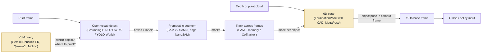

# Foundation vision models for robotics perception (as of 2026-09)

## What it is

Large vision models pretrained on web-scale data that a robot stack calls
*without per-object or per-scene training*: a frozen backbone for features,
a promptable segmenter, an open-vocabulary detector, a point/mask tracker, a
monocular depth net, a novel-object 6D pose estimator, a radiance-field
reconstruction, and a VLM for language-conditioned queries. The engineering
job is to compose them into a pipeline that meets a latency budget on the
compute you actually have (usually a Jetson Orin or a laptop RTX), and to know
where each one breaks.

Two families of interest are distinct and should not be confused:

- **Perception foundation models** (this note): output masks, boxes, depth,
  poses, features. Feed a classical grasp planner or a learned policy.
- **VLA policies** (see `vision-language-action-models.md`): output actions
  directly. Most of them *use* one of the backbones below (SigLIP, DINOv2) as
  their vision encoder, e.g. MolmoAct-7B-D uses SigLIP 2
  ([HF card](https://huggingface.co/allenai/MolmoAct-7B-D-0812)).

## Why it matters in the field

- **Zero per-site labelling.** Open-vocabulary detection plus promptable
  segmentation gets a first demo running at a customer site in hours, not a
  week of annotation. This is the default starting point for any pick task
  now.
- **Novel-object pose without retraining.** FoundationPose ranked #1 on the
  BOP leaderboard for model-based novel-object pose (as of 2024-03) with no
  fine-tuning, given a CAD mesh or a few reference images
  ([repo](https://github.com/NVlabs/FoundationPose)). Any6D drops the CAD
  requirement to a single RGB-D anchor image
  ([arXiv 2503.18673](https://arxiv.org/abs/2503.18673)).
- **Licensing decides what ships.** Half of the best weights are
  non-commercial (CC-BY-NC) or under bespoke Meta/NVIDIA licenses. The
  "which weights can we legally deploy" question comes up in every customer
  engagement and must be answered before an architecture is fixed.
- **Compute is the binding constraint.** The same models that run at 30+ FPS
  on an A100 run at ~1 FPS on a Jetson AGX Orin before TensorRT work
  (SAM 2 on Orin: "almost one frame per second" without TensorRT,
  [NVIDIA forum](https://forums.developer.nvidia.com/t/unable-to-install-sam2-on-orin-nano/302009?page=2);
  FoundationPose estimation node: 0.5 FPS on AGX Orin at 720p,
  [Isaac ROS README](https://github.com/NVIDIA-ISAAC-ROS/isaac_ros_pose_estimation/blob/release-4.6/README.md)).

## Model landscape table

Sizes are parameter counts from the official repos or model cards. "RT" =
realtime feasibility at camera rate (~15-30 FPS) for a single stream.
**Laptop GPU** means a mobile RTX 3000/4000-class part; **Orin** means Jetson
AGX Orin unless stated. Feasibility marks are inferred from published
numbers on the cited hardware and are **(unverified)** where no edge
measurement exists.

| Model | Task | Weights license | Approx size | RT on Orin | RT on laptop GPU | Notes / source |
|---|---|---|---|---|---|---|
| CLIP (OpenAI) | image-text features | MIT | ViT-B/32 to ViT-L/14 | yes for B/32 (unverified) | yes | [repo](https://github.com/openai/CLIP), [arXiv](https://arxiv.org/abs/2103.00020) |
| SigLIP 2 (Google) | image-text features, dense | Apache 2.0 | B 86M, L 303M, So400m 400M, g 1B | B: likely; So400m: marginal (unverified) | yes | [arXiv 2502.14786](https://arxiv.org/abs/2502.14786), [HF blog](https://huggingface.co/blog/siglip2), [big_vision](https://github.com/google-research/big_vision/blob/main/big_vision/configs/proj/image_text/README_siglip2.md) |
| DINOv2 (Meta) | self-supervised features | Apache 2.0 | S 21M, B 86M, L 300M, g 1.1B | S/B yes with TRT (unverified); L marginal | yes | [repo](https://github.com/facebookresearch/dinov2), [arXiv](https://arxiv.org/abs/2304.07193) |
| DINOv3 (Meta, 2025-08) | self-supervised features | DINOv3 License (commercial OK, no military, gated download) | ViT-S 21M, S+ 29M, B 86M, L 300M, H+ 840M, 7B; ConvNeXt T/S/B/L 29-198M | S/B/ConvNeXt-T yes (unverified) | yes up to L | [repo](https://github.com/facebookresearch/dinov3), [arXiv 2508.10104](https://arxiv.org/abs/2508.10104), [license](https://github.com/facebookresearch/dinov3/blob/main/LICENSE.md) |
| SAM (Meta, 2023) | promptable seg (image) | Apache 2.0 | ViT-B / L / H (H encoder ~611M per MobileSAM repo) | no | ViT-B marginal | [repo](https://github.com/facebookresearch/segment-anything) |
| SAM 2 / 2.1 (Meta, 2024) | promptable seg + video tracking | Apache 2.0 | Tiny 38.9M, Small 46M, Base+ 80.8M, Large 224.4M | Tiny/Small with TRT only; ~1 FPS in PyTorch | yes (A100: 91 FPS tiny, 39.5 FPS large) | [repo](https://github.com/facebookresearch/sam2), [arXiv 2408.00714](https://arxiv.org/abs/2408.00714), [TIER IV TRT](https://medium.com/tier-iv-tech-blog/high-performance-sam2-inference-framework-with-tensorrt-9b01dbab4bf7) |
| SAM 3 / 3.1 (Meta, 2025-11 / 2026-03) | concept-prompted detect+seg+track (text or exemplar) | SAM License (commercial OK, no military/nuclear/ITAR) | 848M | no (unverified; no official edge numbers) | marginal (H200: 30 ms/image with 100+ objects; H100: 32 FPS video for 3.1) | [repo](https://github.com/facebookresearch/sam3), [arXiv 2511.16719](https://arxiv.org/abs/2511.16719), [Meta blog](https://ai.meta.com/blog/segment-anything-model-3/) |
| MobileSAM | promptable seg, edge | Apache 2.0 | 5M encoder (Tiny-ViT) | yes (AGX Orin 39 ms full pipeline TRT) | yes (~12 ms/image) | [repo](https://github.com/ChaoningZhang/MobileSAM), [NanoSAM table](https://github.com/NVIDIA-AI-IOT/nanosam) |
| NanoSAM (NVIDIA) | promptable seg, edge | Apache 2.0 | ResNet18 encoder | yes (AGX Orin 8.1 ms, Orin Nano 27 ms full pipeline) | yes | [repo](https://github.com/NVIDIA-AI-IOT/nanosam) |
| EfficientSAM (Meta) | promptable seg, edge | Apache 2.0 | Ti / S (counts not in README, unverified) | likely (unverified) | yes | [repo](https://github.com/yformer/EfficientSAM) |
| EdgeSAM (NTU) | promptable seg, edge | NTU S-Lab License 1.0 (check commercial terms) | 9.6M | yes (38.7 FPS on iPhone 14) | yes (164 FPS on 2080 Ti) | [repo](https://github.com/chongzhou96/EdgeSAM), [arXiv](https://arxiv.org/abs/2312.06660) |
| Grounding DINO (IDEA) | open-vocab detection | Apache 2.0 | Swin-T (48.4 COCO zero-shot AP), Swin-B | no in PyTorch; marginal with TRT (unverified) | ~yes for Swin-T | [repo](https://github.com/IDEA-Research/GroundingDINO), [arXiv](https://arxiv.org/abs/2303.05499) |
| Grounding DINO 1.5 Edge (IDEA) | open-vocab detection, edge | **API-only as of last check (unverified)** | n/a | >10 FPS on Orin NX at 640x640 with TRT (paper claim) | yes | [arXiv 2405.10300](https://arxiv.org/abs/2405.10300), [API repo](https://github.com/IDEA-Research/Grounding-DINO-1.5-API) |
| OWL-ViT / OWLv2 (Google) | open-vocab detection | Apache 2.0 | base-patch16, large-patch14 | yes: NanoOWL ViT-B/32 95 FPS, B/16 25 FPS on AGX Orin | yes | [HF OWLv2](https://huggingface.co/google/owlv2-base-patch16), [arXiv 2306.09683](https://arxiv.org/abs/2306.09683), [NanoOWL](https://github.com/NVIDIA-AI-IOT/nanoowl) |
| YOLO-World (Tencent) | open-vocab detection, real-time | GPL-3.0 (repo says commercial use supported; GPL obligations apply) | S / M / L / X | likely yes with TRT (unverified) | yes (L: 35.4 LVIS AP at 52 FPS on V100) | [repo](https://github.com/AILab-CVC/YOLO-World), [arXiv](https://arxiv.org/abs/2401.17270) |
| CoTracker3 (Meta) | dense point tracking | CC-BY-NC (parts MIT/Apache) | not stated | no (unverified) | offline yes; online variant for streams | [repo](https://github.com/facebookresearch/co-tracker), [arXiv 2410.11831](https://arxiv.org/abs/2410.11831) |
| TAPIR / TAPNext (DeepMind) | point tracking | Apache 2.0 | not stated | unverified | yes (TAPNext is causal/online) | [repo](https://github.com/google-deepmind/tapnet), [TAPIR](https://arxiv.org/abs/2306.08637), [TAPNext](https://arxiv.org/abs/2504.05579) |
| Depth Anything V2 | relative + metric mono depth | Small: Apache 2.0; Base/Large/Giant: CC-BY-NC 4.0 | S 25M, B 97M, L 335M, G 1.3B | Small yes (AGX Orin ~20 FPS TRT BF16, batch 4 at 480x300; Orin Nano ~10 FPS); B/L OOM on Orin per Seeed | yes | [issue #162](https://github.com/DepthAnything/Depth-Anything-V2/issues/162), [Jetson bench](https://arxiv.org/pdf/2603.01999), [Seeed](https://github.com/Seeed-Projects/jetson-examples/blob/main/reComputer/scripts/depth-anything-v2/README.md) |
| Depth Anything 3 (ByteDance, 2025-11) | any-view depth + pose; mono/metric variants | S/B/Metric-L/Mono-L: Apache 2.0; L/G/Nested: CC-BY-NC 4.0 | S 0.08B, B 0.12B, L 0.35B, G 1.15B | S/B likely (unverified) | yes | [repo](https://github.com/ByteDance-Seed/Depth-Anything-3), [arXiv 2511.10647](https://arxiv.org/abs/2511.10647) |
| Metric3D v2 | metric depth + normals | BSD-2 (code); weights license not separately stated (unverified) | ConvNeXt-T/L, ViT-S/L/giant2 | ViT-S maybe (unverified) | yes | [repo](https://github.com/yvanyin/metric3d), [arXiv 2404.15506](https://arxiv.org/abs/2404.15506) |
| UniDepthV2 (ETH) | metric depth + intrinsics | CC-BY-NC 4.0 | ViT-S / B / L | unverified | yes | [repo](https://github.com/lpiccinelli-eth/UniDepth), [arXiv 2502.20110](https://arxiv.org/abs/2502.20110) |
| MegaPose (Inria/NVIDIA, 2022) | novel-object 6D pose, CAD required | Apache 2.0 | not stated | no (render-and-compare) | seconds/object (unverified) | [repo](https://github.com/megapose6d/megapose6d), [arXiv](https://arxiv.org/abs/2212.06870) |
| FoundationPose (NVIDIA, 2024) | novel-object 6D pose + tracking, CAD or ref images | NVIDIA Source Code License (non-commercial; check NGC terms for deployment) | not stated; ~7 GB GPU RAM FP32 pipeline | estimation 0.5 FPS at 720p on AGX Orin; tracking faster | estimation ~1.3 s/object, tracking ~32 Hz on RTX 3090 | [repo](https://github.com/NVlabs/FoundationPose), [arXiv](https://arxiv.org/abs/2312.08344), [Isaac ROS](https://github.com/NVIDIA-ISAAC-ROS/isaac_ros_pose_estimation/blob/release-4.6/README.md) |
| Any6D (KAIST/NVIDIA, CVPR 2025) | 6D pose + size from one RGB-D anchor, no CAD | not confirmed (unverified) | not stated | no | offline-ish (unverified) | [repo](https://github.com/taeyeopl/Any6D), [arXiv 2503.18673](https://arxiv.org/abs/2503.18673) |
| Molmo / MolmoAct (Ai2) | VLM with 2D pointing; robotics variant | Apache 2.0 | 7B (MolmoAct-7B-D) | no | 7B needs 16 GB+ or quantization | [Molmo arXiv](https://arxiv.org/abs/2409.17146), [MolmoAct arXiv](https://arxiv.org/abs/2508.07917) |
| Qwen3-VL (Alibaba, 2025-09..10) | VLM, 2D/3D grounding | Apache 2.0 | 2B, 4B, 8B, 32B, 30B-A3B, 235B-A22B | 2B/4B quantized: plausible, seconds/query (unverified) | 8B yes for offline queries | [repo](https://github.com/qwenlm/qwen3-vl) |
| Gemini Robotics-ER 1.5 / 1.6 (Google) | hosted VLM: pointing, grasp points, trajectories, success detection | API only (no weights) | n/a | cloud round-trip; not a control-loop model | n/a | [dev blog](https://developers.googleblog.com/building-the-next-generation-of-physical-agents-with-gemini-robotics-er-15/), [ER 1.6](https://deepmind.google/blog/gemini-robotics-er-1-6/), [arXiv 2510.03342](https://arxiv.org/abs/2510.03342) |
| GPT-4o class (OpenAI) | hosted VLM for scene QA | API only | n/a | cloud round-trip | n/a | pointing accuracy not benchmarked here (unverified) |

## How they compose into a perception pipeline

The canonical chain is **detect -> segment -> track -> pose -> grasp**, with a
depth source feeding pose and grasp. Each stage narrows the problem for the
next so the expensive models run rarely.

```
RGB-D @ 30 Hz
  |-- [every N frames or on request]  open-vocab detector  (OWLv2 / Grounding DINO / YOLO-World)
  |        text: "blue mug"  ->  boxes + scores
  |-- [on new box]                    promptable segmenter  (NanoSAM / SAM 2 small)
  |        box prompt      ->  instance mask
  |-- [every frame]                   tracker  (SAM 2 memory, or CoTracker/TAPNext points on the mask)
  |        propagate mask/points; re-detect on track loss or every ~2 s
  |-- [on first stable mask]          6D pose init  (FoundationPose w/ mesh, or Any6D w/ anchor)
  |        mask + depth + intrinsics -> T_cam_obj      (~1.3 s once)
  |-- [every frame]                   6D pose tracking  (FoundationPose track mode, ~32 Hz on RTX 3090)
  |-- grasp: pose -> pre-annotated grasps on the mesh, OR mask+depth -> point cloud -> grasp sampler
```

**Concrete example: "pick the blue mug" on a UR5e + RealSense D435 + Jetson AGX Orin.**

1. Operator types "blue mug". NanoOWL (OWL-ViT B/32, TensorRT) runs on the
   RGB stream at ~95 FPS on AGX Orin
   ([NanoOWL table](https://github.com/NVIDIA-AI-IOT/nanoowl)); take the top
   box above 0.3 confidence, debounce over 5 frames.
2. NanoSAM takes the box as a prompt and returns a mask in ~8 ms on AGX Orin
   ([NanoSAM table](https://github.com/NVIDIA-AI-IOT/nanosam)).
3. Mask x aligned depth -> object point cloud in the camera frame. Publish as
   `sensor_msgs/PointCloud2` on a sensor-data QoS topic; TF frame is the
   RealSense colour optical frame (REP 103/105 conventions).
4. If a mesh exists (the customer sent a CAD file): FoundationPose via Isaac
   ROS gives `T_cam_obj`. On AGX Orin expect ~0.5 FPS for the *estimation*
   node at 720p ([Isaac ROS](https://github.com/NVIDIA-ISAAC-ROS/isaac_ros_pose_estimation/blob/release-4.6/README.md)),
   so estimate once and switch to tracking. Grasps are pre-defined in the
   object frame; transform through `T_base_cam` (from extrinsic calibration)
   and `T_cam_obj`.
5. If no mesh: skip pose. Feed the masked point cloud to a geometric grasp
   sampler (antipodal on the cloud) or a learned grasp net; this is what most
   first demos actually do because CAD is rarely available on day one.
6. Track the mask with SAM 2 tiny (TRT) or re-run steps 1-2 at ~5 Hz; cheaper
   and more robust than continuous tracking for a static table scene.

Every stage logs its latency with the run id; the pipeline budget is written
down before the demo (see `sops/field-deployment-checklist.md`).


### Diagram: a typical foundation-model perception pipeline



Shaded stages are the latency hot spots. The standard pattern is to run the
expensive stage once and let the tracker carry the result between frames.


## Practical gotchas

**Latency**

- Published FPS numbers are almost always A100/H100 and batch-friendly.
  Expect 10-30x slowdown on Orin in PyTorch. TensorRT FP16 is not optional;
  the TIER IV SAM 2 work reports ~123 ms/frame after TRT + memory work
  ([TIER IV](https://medium.com/tier-iv-tech-blog/high-performance-sam2-inference-framework-with-tensorrt-9b01dbab4bf7)).
- Render-and-compare pose (MegaPose, FoundationPose estimation) is seconds
  per object. Design for estimate-once-then-track; re-init on track loss.
- VLM queries (Qwen3-VL local, Gemini ER hosted) are seconds, not frames.
  Use them for task-level decisions (which object, where to place, did it
  succeed), never inside the servo loop.
- TRT engine builds are per-GPU and per-JetPack version; a JetPack upgrade
  invalidates all engines. Numerical drift between PyTorch and TRT has been
  reported for SAM 2 on Orin Nano
  ([forum](https://forums.developer.nvidia.com/t/sam2-tensorrt-engine-produces-different-results-from-pytorch-on-jetson-orin-nano-jetpack-6-1/361166));
  validate masks after every export.
- Memory: FoundationPose FP32 pipeline peaks ~7 GB; Depth Anything V2
  Base/Large reportedly do not fit on Orin
  ([Seeed](https://github.com/Seeed-Projects/jetson-examples/blob/main/reComputer/scripts/depth-anything-v2/README.md)).
  On a 16 GB Orin NX you cannot co-host everything; budget it.

**Licensing**

- Fully permissive (Apache/MIT/BSD): CLIP, SigLIP 2, DINOv2, SAM 1/2,
  MobileSAM, NanoSAM, NanoOWL, EfficientSAM, OWLv2, Grounding DINO 1.0,
  MegaPose, TAPIR/TAPNext, Depth Anything V2 **Small only**, DA3
  Small/Base/Metric-L/Mono-L, Metric3D code, Molmo, Qwen3-VL.
- Non-commercial: CoTracker3 (CC-BY-NC), UniDepthV2 (CC-BY-NC), Depth
  Anything V2 Base/Large/Giant and DA3 Large/Giant (CC-BY-NC),
  FoundationPose (NVIDIA Source Code License; NGC redistribution terms are
  separate and were not checked here (unverified)).
- Bespoke: DINOv3 License and SAM License both allow commercial use but
  exclude military/nuclear/ITAR uses and require attribution in publications;
  DINOv3 weights are gated (request-by-email). Read them before a defence or
  aerospace customer. EdgeSAM is NTU S-Lab 1.0 (verify commercial clause).
- Copyleft: YOLO-World is GPL-3.0. Linking it into a closed-source ROS node
  has redistribution consequences; get a legal read before shipping.
- API-only: Grounding DINO 1.5 Pro/Edge (no public weights found, issue
  unanswered as of this note), Gemini Robotics-ER, GPT-4o class.

**Domain shift**

- Web-pretrained detectors fail on industrial parts with no web presence
  (bare metal brackets, custom fixtures). Exemplar prompting (SAM 3 image
  exemplars, OWLv2 image-conditioned queries) beats text here.
- Transparent, specular, and thin objects break both RGB-D sensors and
  monocular depth. Any depth-from-RGB model is trained mostly on opaque
  Lambertian data; check the failure on the actual parts before promising.
- Monocular metric depth (Metric3D, UniDepth, DA3-Metric) is
  camera-conditioned; a wrong focal length gives a wrong scale. Prefer the
  RGB-D sensor's depth for metric use and the network for hole filling.
- Lighting at a customer site differs from the lab; open-vocab confidence
  thresholds tuned in the lab drift. Log detection scores in the field and
  recalibrate the threshold from data, not by eye.

**Calibration dependence**

- Every pose or grasp is only as good as `T_base_cam` (extrinsics) and the
  intrinsics used for back-projection. FoundationPose consumes `CameraInfo`
  directly; a stale calibration after a camera bump silently shifts every
  grasp. Re-verify calibration with a fiducial before each demo block.
- Depth-to-colour alignment on RealSense is a separate transform; masks from
  the colour image applied to unaligned depth produce edge bleed on the
  object point cloud.
- Monocular depth models output relative (affine-invariant) depth unless the
  metric variant is used; never mix relative depth with metric grasp planning.

## What a forward-deployed engineer must be able to do

1. Stand up detect -> segment -> point cloud on a Jetson Orin in a day using
   TensorRT builds (NanoOWL + NanoSAM or equivalents), with logged
   per-stage latency.
2. Export a PyTorch model to ONNX, build a TRT FP16 engine on the target
   JetPack, and validate outputs against the PyTorch reference on a fixed
   frame set. Know the common export failures (dynamic shapes, unsupported
   ops in attention, int64 indices).
3. Choose a model by license for the customer's situation and write down
   the choice with the license link in the experiment record.
4. Run FoundationPose (mesh available) or a mask-plus-depth geometric
   grasp path (no mesh) and explain to a customer why one was chosen.
5. Perform and verify camera intrinsic and hand-eye extrinsic calibration;
   detect a drifted calibration from grasp offsets.
6. Write a `DATASET.md` for field frames captured to tune thresholds, and an
   evaluation protocol (success rate over N trials) before claiming a
   detection or grasp rate.
7. Use a VLM (local Qwen3-VL or hosted Gemini ER) for task-level checks
   (object selection, success detection) and know its latency and failure
   modes well enough not to put it in a control loop.
8. Read a model card and a benchmark table critically: which hardware, which
   resolution, batch size, and whether the number is encoder-only or full
   pipeline.

## Open questions to learn hands-on

- Real per-frame latency of SAM 3 / 3.1 and Depth Anything 3 on AGX Orin
  after TensorRT export. No official edge numbers found; community
  EfficientSAM3 TRT ports exist
  ([repo](https://github.com/dirtyoneweek/EfficientSAM3-TensorRT-Deployment))
  but are WIP.
- Does SAM 3 concept prompting (text + exemplar) remove the need for a
  separate open-vocab detector in the pipeline, and at what compute cost?
- FoundationPose model-free mode (reference images, no CAD) vs Any6D from a
  single anchor: which is more reliable on shiny industrial parts?
- Where does 3D Gaussian splatting earn its place in a manipulation stack:
  real-to-sim evaluation (SplatSim, ICRA 2025), language-grounded grasping
  (GaussianGrasper, RA-L 2024), or not at all for a pick cell? See the
  [3DGS in robotics survey](https://arxiv.org/abs/2410.12262). NeRF-based
  approaches were the 2021-2023 precursor; 3DGS replaced them on speed.
- Hosted VLM pointing (Gemini ER 1.5 reports 52.6% on pointing benchmarks
  per [Emergent Mind summary](https://www.emergentmind.com/topics/gemini-robotics-er-1-5),
  (unverified against the paper)) vs local Molmo/Qwen3-VL pointing: accuracy
  and latency on our own scenes.
- How much does DINOv3 over DINOv2 matter as a frozen backbone for a policy
  head trained on 50 demos? Worth one controlled experiment.

## Related entries

- `library/topics/vision-language-action-models.md` (uses these backbones)
- `library/topics/imitation-learning.md`
- `library/topics/sim-to-real.md` (3DGS real-to-sim)
- `library/topics/policy-evaluation.md`
- `library/tools/ros2-humble.md` (Isaac ROS integration, QoS, TF frames)
- `sops/field-deployment-checklist.md`

## Sources

Backbones
- CLIP: https://github.com/openai/CLIP , https://arxiv.org/abs/2103.00020
- SigLIP 2: https://arxiv.org/abs/2502.14786 , https://huggingface.co/blog/siglip2 , https://github.com/google-research/big_vision/blob/main/big_vision/configs/proj/image_text/README_siglip2.md
- DINOv2: https://github.com/facebookresearch/dinov2 , https://arxiv.org/abs/2304.07193
- DINOv3: https://github.com/facebookresearch/dinov3 , https://arxiv.org/abs/2508.10104 , https://ai.meta.com/research/dinov3/

Segmentation
- SAM: https://github.com/facebookresearch/segment-anything , https://arxiv.org/abs/2304.02643
- SAM 2: https://github.com/facebookresearch/sam2 , https://arxiv.org/abs/2408.00714
- SAM 3 / 3.1: https://github.com/facebookresearch/sam3 , https://arxiv.org/abs/2511.16719 , https://ai.meta.com/blog/segment-anything-model-3/
- MobileSAM: https://github.com/ChaoningZhang/MobileSAM
- EfficientSAM: https://github.com/yformer/EfficientSAM
- EdgeSAM: https://github.com/chongzhou96/EdgeSAM , https://arxiv.org/abs/2312.06660
- NanoSAM: https://github.com/NVIDIA-AI-IOT/nanosam

Detection
- Grounding DINO: https://github.com/IDEA-Research/GroundingDINO , https://arxiv.org/abs/2303.05499
- Grounding DINO 1.5: https://arxiv.org/abs/2405.10300 , https://github.com/IDEA-Research/Grounding-DINO-1.5-API/issues/24
- OWL-ViT / OWLv2: https://arxiv.org/abs/2205.06230 , https://arxiv.org/abs/2306.09683 , https://huggingface.co/google/owlv2-base-patch16
- NanoOWL: https://github.com/NVIDIA-AI-IOT/nanoowl
- YOLO-World: https://github.com/AILab-CVC/YOLO-World , https://arxiv.org/abs/2401.17270

Tracking
- CoTracker3: https://github.com/facebookresearch/co-tracker , https://arxiv.org/abs/2410.11831
- TAPIR / TAPNext: https://github.com/google-deepmind/tapnet , https://arxiv.org/abs/2306.08637 , https://arxiv.org/abs/2504.05579

Depth
- Depth Anything V2: https://arxiv.org/abs/2406.09414 , https://github.com/DepthAnything/Depth-Anything-V2/issues/162
- Depth Anything 3: https://github.com/ByteDance-Seed/Depth-Anything-3 , https://arxiv.org/abs/2511.10647
- Metric3D v2: https://github.com/yvanyin/metric3d , https://arxiv.org/abs/2404.15506
- UniDepthV2: https://github.com/lpiccinelli-eth/UniDepth , https://arxiv.org/abs/2502.20110
- Depth Anything V2 on Jetson (third-party): https://arxiv.org/pdf/2603.01999 , https://github.com/Seeed-Projects/jetson-examples/blob/main/reComputer/scripts/depth-anything-v2/README.md

Pose
- MegaPose: https://github.com/megapose6d/megapose6d , https://arxiv.org/abs/2212.06870
- FoundationPose: https://github.com/NVlabs/FoundationPose , https://arxiv.org/abs/2312.08344 , https://arxiv.org/html/2312.08344
- Isaac ROS FoundationPose: https://github.com/NVIDIA-ISAAC-ROS/isaac_ros_pose_estimation/blob/release-4.6/README.md
- Any6D: https://github.com/taeyeopl/Any6D , https://arxiv.org/abs/2503.18673

Reconstruction
- 3DGS in robotics survey: https://arxiv.org/abs/2410.12262
- GaussianGrasper: https://arxiv.org/abs/2403.09637
- SplatSim: https://arxiv.org/abs/2409.10161 (ICRA 2025)

VLMs
- Molmo: https://arxiv.org/abs/2409.17146
- MolmoAct: https://arxiv.org/abs/2508.07917 , https://huggingface.co/allenai/MolmoAct-7B-D-0812
- Qwen3-VL: https://github.com/qwenlm/qwen3-vl
- Gemini Robotics-ER 1.5: https://developers.googleblog.com/building-the-next-generation-of-physical-agents-with-gemini-robotics-er-15/ , https://arxiv.org/abs/2510.03342
- Gemini Robotics-ER 1.6: https://deepmind.google/blog/gemini-robotics-er-1-6/

Edge deployment
- SAM 2 TensorRT (TIER IV): https://medium.com/tier-iv-tech-blog/high-performance-sam2-inference-framework-with-tensorrt-9b01dbab4bf7
- SAM 2 on Orin forum threads: https://forums.developer.nvidia.com/t/unable-to-install-sam2-on-orin-nano/302009?page=2 , https://forums.developer.nvidia.com/t/sam2-tensorrt-engine-produces-different-results-from-pytorch-on-jetson-orin-nano-jetpack-6-1/361166
- EfficientSAM3 TRT (community, WIP): https://github.com/dirtyoneweek/EfficientSAM3-TensorRT-Deployment
