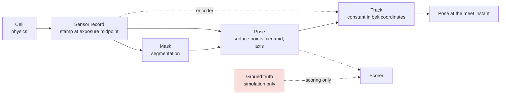

# Ingesting perception, from pixels to a pose the arm can use

The chain that turns a camera into a number the arm can be commanded with:
sensor record, camera geometry, pose from a mask, and prediction forward to the
moment the gripper arrives. This note is the measured account of building it for
the meat cell. The code is `src/meat_cell_sim/{sensing,frames,perception,tracking}.py`
and every number below comes from `scripts/measure_perception.py`.

Technique selection for the mask itself is a separate question, answered in
[perception technique selection](perception-technique-selection.md). This note
assumes a mask exists and deals with everything on either side of it. The
subsystem decomposition and the gate for each step are in
[meat cell architecture](meat-cell-architecture.md).

## The chain

Red is the oracle. `Observation` carries no ground truth and `GroundTruth` is a
separate type, so an estimator that takes an `Observation` cannot read the
answer. This is worth enforcing in the type system rather than by discipline: an
estimator with access to the simulator will be right for the wrong reason, and
the mistake only appears on hardware.

## Four numbers, or it is not an observation

Every quantity crossing a boundary carries the frame it is in, its units, the
time it refers to, and its rate. Three of the defects in the table at the end of
this note were timestamp defects. None of them raised an error.

The timestamp of an image is the **middle of the exposure**, not the moment the
array arrives and not the start of integration. A camera integrates light over a
window; for uniform motion the smeared image describes the pose at the midpoint
of that window. At 300 mm/s a 5 ms exposure spans 1.5 mm of belt travel, which is
most of a 2 mm placement bound.

## The camera model, checked against the renderer

MuJoCo declares only a vertical field of view. Square pixels give one focal
length for both axes:

    f = (H / 2) / tan(fovy / 2)

For the overhead camera at 52 degrees and 1280 x 960 that is 984.15 pixels. The
principal point is the image centre, which for pixel centres at integer indices
is at `(n - 1) / 2`, so 639.5 and 479.5 rather than 640 and 480. Half a pixel is
0.29 mm on the belt at this working distance, which is not free against a 2 mm
bound.

The convention worth writing down once: a MuJoCo camera looks along its own -z
with +y up, while image rows increase downward. The ray through pixel (u, v) in
camera coordinates is therefore

    d = [ (u - cx) / fx , -(v - cy) / fy , -1 ]

with a minus sign on the second component that a test taken at the image centre
cannot catch. `tests/test_frames.py` checks the model against MuJoCo's own
rendered pixels rather than against the algebra, because a self-consistent wrong
convention passes any test written from the same algebra.

Working geometry for this cell: the camera sits 570 mm above the product's upper
surface, giving 0.58 mm per pixel and a footprint of 741 by 556 mm. The product
is in view from x = -0.771 m to x = -0.029 m. The pick zone is downstream of
that, so the arm is working from a prediction and not from a live measurement.
That is the design intent, and it is also why the tracking step has a gate of its
own.

## Getting a position out of a mask

An overhead camera measures a direction, not a position. Turning a pixel into a
point needs one more number: the height of the surface that point lies on. Using
the belt height for a point that is actually on top of a 30 mm product puts the
answer sideways by

    lateral error = height error x horizontal offset / camera height

which is zero directly below the camera and equal to the height error itself
where the ray is at 45 degrees. For this cell a 30 mm height error at 150 mm off
axis is 7.9 mm.

There is a second term that no assumed plane can fix. The centroid of a thick
product's silhouette is not the projection of any fixed point on it: at nadir the
silhouette is the top face, and off-axis it grows to include a side wall, so the
effective height of the centroid slides between the top of the product and the
belt as the product moves across the field. Measured on a 30 mm slab, the plane
that would give a correct answer moves from 23.5 mm above the belt at 150 mm off
axis to 0.2 mm above it at 300 mm off axis. One fixed plane cannot serve both.

Depth removes both terms at once, because the surface height stops being assumed
and becomes measured. Over 3007 frames of the 180 x 90 x 30 mm product crossing
the field at three belt speeds, all fully inside the frame:

| Estimator | Mean | 95th percentile | Worst |
|---|---|---|---|
| Depth, upper-surface centroid | 0.10 mm | 0.24 mm | 0.31 mm |
| Depth, upper-surface principal axis | 0.007 deg | 0.028 deg | 0.146 deg |
| Mask centroid onto the product top plane | 1.14 mm | 3.36 mm | 4.01 mm |
| Mask centroid onto the mid plane | 1.86 mm | 2.68 mm | 2.76 mm |
| Mask centroid onto the belt plane | 4.71 mm | 7.98 mm | 8.27 mm |

The conclusion is not that monocular vision is bad. It is that the error is set
by the product's thickness seen off-axis and not by pixel resolution, so a
better camera does not help and a depth sensor does. Every monocular row above
spends the whole 2 mm bound before the arm has moved.

## Confidence, and the product that has no long axis

The principal axis is the eigenvector of the mask's covariance with the larger
eigenvalue. As the two eigenvalues approach each other the axis stops being
identifiable, and for a square it does not exist: the estimate becomes a coin
flip between two answers 90 degrees apart. For a uniform rectangle of aspect
ratio r the ratio of eigenvalues is exactly `1 / r^2`, so reporting

    anisotropy = 1 - (smaller eigenvalue) / (larger eigenvalue) = 1 - 1 / r^2

gives a confidence that collapses in the right place: 0.75 at an aspect ratio of
2, 0.31 at 1.2, and 0.093 at 1.05. A near-square piece of product will produce a
confident-looking heading that is worthless, and this is the number that says so.
It is reported as `PieceEstimate.confidence`.

The related trap is the finger axis. Jaws close along their own axis, so a
parallel gripper must approach square to the product's long axis. Taking the
product's heading as the finger heading is a grasp that fits, looks reasonable,
and squeezes the product across its narrowest dimension.

## Which points are the upper surface

Selecting the upper surface by height alone is not enough, and the way it fails
is instructive. A band of a given height around the median keeps a strip of the
product's side wall as tall as that band, and because only the camera-facing
wall is visible, the strip always sits on one side. It drags the centroid toward
the camera by an amount proportional to the band width and to how far off the
optical axis the product is. Measured on this cell with a 3 mm band, that is a
spatial ramp of -1.67 mm per metre of travel across the field, peaking at
-0.62 mm.

Rejecting points by their surface normal removes it. Normals come from central
differences of the back-projected point image, the mask is eroded by one pixel
first so every remaining pixel has four neighbours inside the product, and a
point counts as upper surface only if its normal is within 60 degrees of
vertical. That takes the ramp to -0.74 mm per metre and the peak to -0.17 mm.
Eroding also removes the silhouette depth artefacts described in the defect
table, so one step fixes two things.

Ground sampling decides whether this test can work at all. At 0.58 mm per pixel
a surface rising 2 mm over one pixel is at 74 degrees and is rejected cleanly.
At 2.3 mm per pixel the same 2 mm rise is 41 degrees and passes, so a coarse
camera cannot separate a product's top from its cut edge by geometry.

## Getting a velocity

A product carried on a belt is not a free body that a filter has to guess at. It
is stuck to a surface whose displacement is measured directly. Writing the state
in belt coordinates makes that explicit:

    x_belt(t) = x_world(t) - s(t)

with s the encoder's belt travel. Without slip, `x_belt` is a **constant**, so
every observation measures the same number and prediction is bookkeeping:

    x_world(t_meet) = x_belt + s(t_last) + v_belt * (t_meet - t_last)

Slip does not break the model, it becomes a term in it. Fitting a line to
`x_belt` against time gives a slope that is zero for a carried product and
non-zero for a sliding one, so the same fit both predicts and diagnoses. On a wet
belt that slope is the first thing to move.

Differentiating the vision instead costs more than it looks. Two poses subtracted
give a velocity with standard deviation `sqrt(2) * sigma / dt`; at the measured
0.5 mm and 30 frames per second that is 21 mm/s, and over the 0.5 s between the
last usable image and the pick it is 10 mm of prediction error on its own. The
encoder measures the same quantity without differentiating anything. Vision
supplies position, the encoder supplies velocity, and neither substitutes for the
other.

Because the fit reports its value at the most recent stamp rather than at the
centre of the window, its standard error is the least-squares prediction variance
at the end of the window:

    var = sigma^2 * ( 1/n + 3(n - 1) / (n(n + 1)) )

which is 0.48 sigma at n = 16 rather than the 0.25 sigma a plain mean would give.
The difference is what detecting slip costs, and it is worth paying.

### A spatial bias becomes a velocity error

This is the coupling that failed the tracking gate at 0.50 m/s, and it is the
case the typed contracts exist for.

The product sweeps across the field of view at belt speed. So any position bias
that varies with position in the image is differentiated by the tracker into an
apparent velocity, with the belt speed as the conversion factor. The
side-wall ramp above, at -1.67 mm per metre, becomes a phantom slip of
-0.83 mm/s at 0.5 m/s, and the tracker then extrapolates that phantom over the
prediction horizon.

Neither subsystem's own gate could catch it. Perception passed at 0.65 mm worst
against a 2 mm gate. The tracker's model was exact, with a fit residual of
0.013 mm. The defect lived only at the seam. It was also invisible in the error
magnitude: it only appears if you plot the **signed** error against position in
the field rather than taking its absolute value.

The general statement is worth carrying to the field. A perception bias that is
constant is a calibration offset and comes out in the wash. A perception bias
that varies across the sensor's field becomes a velocity error the moment
anything moves through it, and it scales with how fast that thing moves.

Optical flow is implemented alongside both (`optical_flow_velocity`) because it
measures the product rather than the belt, so unlike the encoder it can see slip
directly. It cannot beat the encoder on a carried product, being a difference of
two noisy positions over one frame interval, but it uses the product's surface
texture rather than its silhouette and so it still reports motion on a
near-square piece where the silhouette is ambiguous.

## Seven defects, and the guard for each

Every one of these produced plausible numbers rather than an error. That is the
pattern worth internalising: at this level of the stack, wrong is quiet.

| Defect | Symptom | Size | Guard now in place |
|---|---|---|---|
| Product partly outside the frame | clean mask, confident centroid | 9.8 mm | reject any mask touching the image border |
| Surface selected below the depth maximum | centroid far out, axis turned 90 degrees | 16 mm, 90 deg | select around the median height, never the maximum |
| `sensordata` read straight after `mj_step` | encoder one timestep stale | 0.6 mm at 300 mm/s, grows with speed | `mj_forward` before every sensor read |
| Exposure not a whole number of timesteps | stamp claims a midpoint that was never rendered | up to 1 ms, the whole sensing gate | quantise the window and stamp what was rendered |
| Encoder latched at exposure start, image at midpoint | bias that grows with line speed | 0.9 mm at 300 mm/s | read every sensor at the exposure midpoint |
| Prediction compared against truth at a different instant | tracker looks broken | 51 mm | assert the meet time has not already passed |
| Upper surface selected by height alone, keeping side wall | spatial bias becoming a phantom slip | 2.03 mm at 0.50 m/s, failing the gate | reject points whose surface normal is not near vertical |

The second one deserves a sentence. Depth values at a silhouette edge are
interpolated across the discontinuity, so a handful of pixels read high: 32 out
of 48841 on this cell, by up to 2.1 mm. Selecting the surface as "within 2 mm of
the maximum" then keeps only those 32 outliers. The median is unmoved by them.
Using `max` on a rendered depth image is never right.

The third is a MuJoCo behaviour rather than a mistake in the model. `mj_step`
evaluates sensors in its forward pass and then integrates, so after it returns,
`sensordata` describes the state at the start of the step. `mj_forward` brings it
current without integrating.

## What changes on real hardware

- Intrinsics come from a calibration, not from a field-of-view declaration, and
  carry distortion coefficients this model has none of. Undistort before any of
  the geometry here applies.
- The camera-to-base transform is measured by hand-eye calibration and is the
  dominant error term outdoors of this note. In simulation it is exact, which is
  why the calibration step is built with a deliberately injected error.
- Exposure is a real setting with a real trade against gain and noise. The smear
  computed here is the argument for keeping it short on a fast line.
- The encoder is latched by a hardware trigger. Confirm whether the latch happens
  at the start of exposure or at its midpoint, because the difference is a bias
  that scales with line speed and looks exactly like a calibration error.
- Depth sensors have their own failure modes on wet, specular product that a
  simulated depth buffer does not reproduce. The measured advantage of depth here
  is an upper bound on what real depth will give.

## What a forward-deployed engineer must be able to do

- Derive the focal length from a field of view and a resolution, and say what a
  half-pixel principal-point error is worth in millimetres on the product.
- Say why a mask centroid back-projected onto an assumed plane is biased, and
  which direction the bias points.
- Explain why the belt encoder is the velocity source and vision is the position
  source, with the noise arithmetic.
- Name the guard that catches a product leaving the frame, and say what happens
  without it.

## Open questions

- The customer's cutter infeed window, which replaces the 2 mm bound and may
  change which estimator is admissible.
- Whether a real depth sensor holds its advantage on wet product, which decides
  whether the monocular fallback needs the thickness-aware correction.
- Whether in-hand shift at gripper closure dominates everything measured here,
  which is the next number to take and is the gate on the grasp step.

## Related entries

- [Meat cell architecture](meat-cell-architecture.md)
- [Perception technique selection](perception-technique-selection.md)
- [Conveyor tracking and visual servoing](conveyor-tracking-and-visual-servoing.md)
- [Control architecture selection](control-architecture-selection.md)
- [Meat piece properties](meat-piece-properties.md)
- [Computer vision fundamentals](computer-vision-fundamentals.md)

## Sources

- All measurements: `scripts/measure_perception.py`, recorded in
  `experiments/2026-09-08-perception-ingestion.md`, raw table in
  `experiments/data/2026-09-08-ingestion.json`.
- Camera convention verified against MuJoCo 3.12.0's own renderer in
  `tests/test_frames.py::test_projection_matches_mujocos_renderer`.
- MuJoCo computation pipeline and the ordering of the sensor stage:
  [MuJoCo documentation, computation](https://mujoco.readthedocs.io/en/stable/computation/index.html).
