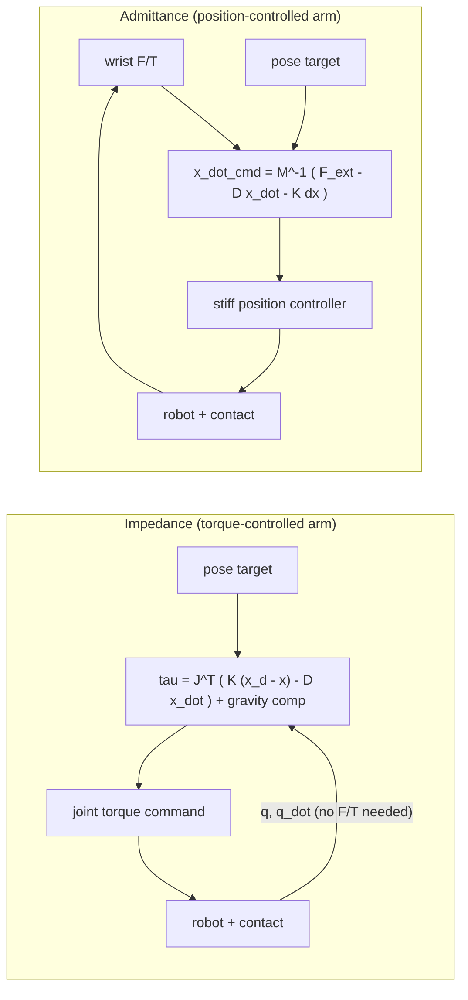

# Tactile and force sensing for learned manipulation

Companion entries: `library/topics/perception-3d-sensing.md` (cameras, calibration,
time sync) and `library/topics/perception-for-policy-learning.md` (observation
encoders). This entry covers what happens after the gripper touches something.

## What it is

Sensing the contact itself: where the object sits in the fingers, how hard it is
squeezed, whether it is slipping, and what wrench the arm is exerting on the
world. Three sensor families cover this in practice.

- **Vision-based tactile (VBT).** A camera looks at the inside of a soft
  elastomer; contact deforms the skin and the camera sees it as an image. High
  spatial resolution, camera-rate bandwidth, cheap, and the output is an image
  that any vision encoder can consume. GelSight Mini, GelSight Svelte, DIGIT,
  Digit 360, TacTip, 9DTact.
- **Taxel arrays.** A grid of discrete sensing elements (magnetic, optical, or
  piezoresistive) each reporting normal force and, in the 3-axis variants,
  shear. Low-dimensional, hundreds of Hz, coverable over a whole hand. Xela
  uSkin, Contactile PapillArray, Tekscan pressure mats, ReSkin/AnySkin.
- **Force-torque (F/T).** A 6-axis strain-gauge sensor at the wrist (ATI,
  Robotiq, Bota, OnRobot), or joint-torque sensors in every axis of a
  torque-controlled arm (Franka, Kinova Gen3, KUKA iiwa). One wrench, kHz
  rates, no information about where on the fingertip the contact is.

VBT gives contact geometry, taxels give fast coverage, F/T gives the total
load on the tool. The strongest insertion results use F/T or tactile plus vision.

## Why it matters in the field

- Insertion, cable routing, and fastening are the tasks customers actually
  pay for, and vision alone does not close the loop: Hogan's original argument
  is that "control of position or force alone is inadequate; control of dynamic
  behavior is also required" when a manipulator contacts its environment
  ([Hogan 1985, Part I](https://doi.org/10.1115/1.3140702)).
- Hand-eye calibration caps vision-only precision at millimetres
  (`perception-3d-sensing.md`: under 3 mm at 0.5 m is a good result). Tight
  fits need contact feedback to absorb the residual.
- Force feedback is already free on most arms and rarely used: FACTR observes
  that "force information, which is readily available in most robot arms, is
  not commonly used in teleoperation and policy learning," and that policies
  without it stay "limited to quasi-static kinematic tasks"
  ([FACTR, arXiv:2502.17432](https://arxiv.org/abs/2502.17432)).
- Tactile generalizes where F/T is sample-efficient: on insertion, "an F/T-based
  policy learns more efficiently, a tactile-based policy provides better
  generalization"; RL + curriculum + tactile flow trained on 4 objects inserted
  4 novel objects with "over 85.0% success rate and within 3~4 attempts"
  ([Tactile-RL for Insertion, arXiv:2104.01167](https://arxiv.org/abs/2104.01167)).
- Skins now generalize across sensor instances: ViSk (magnetic skin tokens in
  a transformer policy) beat vision-only and optical-tactile baselines on
  credit-card swiping, plug and USB insertion, and bookshelf retrieval, with an
  "average improvement of 27.5% across tasks"
  ([ViSk, arXiv:2410.17246](https://arxiv.org/abs/2410.17246)).
- Safety: a policy that cannot feel contact will push through it. Contact-rich
  RL and BC deployments run under an impedance or admittance controller with
  force caps (see `real-world-rl.md`).

## Key methods table

### Sensors (vendor figures; verify on the unit you receive)

| Sensor | Principle | Output | Rate | Interface | Notes |
|---|---|---|---|---|---|
| [GelSight Mini](https://www.gelsight.com/wp-content/uploads/2022/09/GelSight_Datasheet_GSMini_9.20.22b.pdf) | VBT, elastomer + RGB lighting | 320x240 image (SDK default, from 8 MP camera), ~0.0634 mm/px, marker gel option | 25 fps | USB (Micro-B to C) | $510 system, 4 week lead ([store](https://www.gelsight.com/product/gelsight-mini-system/)); gel 4.25 mm, 0-25 C preferred; SDK is GPL-3.0 ([gsrobotics](https://github.com/gelsightinc/gsrobotics)) |
| [GelSight Svelte](https://arxiv.org/abs/2309.10885) | VBT, curved finger, single camera + curved mirrors | Contact over the full finger length plus bending/twisting torque via CNN | (unverified) | research build | IROS 2023; proprioceptive torque from a flexible backbone |
| [DIGIT](https://arxiv.org/abs/2005.14679) | VBT, OVM7692 camera | 640x480; 19x16 mm sensing field | 60 fps sensor; [digit-interface](https://github.com/facebookresearch/digit-interface) defaults to VGA 30 fps | USB (hub on PCB) | 20x27x18 mm, 20 g, ~15 USD at 1000 units (paper Table I); `pip install digit-interface` |
| [Digit 360](https://arxiv.org/abs/2411.02479) | Hemispherical VBT + multimodal | "~8.3 million taxels", 7 um features, normal/shear resolution 1.01 / 1.27 mN, vibration to 10 kHz, heat, odor; on-device NN accelerator | (unverified) | USB; ROS 2 package `d360` ([repo](https://github.com/facebookresearch/digit360)) | Announced 2024-10-31 with GelSight; research access by proposal, "wide availability" promised for 2025 ([GelSight](https://www.gelsight.com/gelsight-and-meta-ai-introduce-digit-360-tactile-sensor/)) |
| [TacTip family](https://research-information.bris.ac.uk/en/publications/the-tactip-family-soft-optical-tactile-sensors-with-3d-printed-bi/) | VBT, camera tracks 3D-printed internal pins | Pin displacement field | camera rate (unverified) | USB camera | Bristol; sub-mm on a rolling cylinder task, ">10-fold super-resolved acuity" (Soft Robotics 2018) |
| [9DTact](https://arxiv.org/abs/2308.14277) | VBT, translucent gel, no markers | 3D shape + 6D force (net trained on ~100k image-force pairs, 175 objects) | (unverified) | USB camera | Open hardware ([repo](https://github.com/linchangyi1/9DTact)) |
| [Xela uSkin uSPa 44](https://www.knoxlabs.com/products/xela-robotics-uskin-uspa-44-tactile-patch) | Magnetic 3-axis taxels | 16 taxels x (x, y shear, z normal), up to 1500 gf/point, 3000 gf overload, 0.1 gf resolution | 500 Hz max | CAN daisy chain to CAN2USB | 22.6x24.6x5.5 mm patch; ROS/ROS 2 drivers; Hand-E fingertips carry 15 taxels each ([Xela](https://xelarobotics.com/products/for-hand-e/)) |
| [Contactile PapillArray v2](https://contactile.com/wp-content/uploads/2021/12/PTS_2.0_SPEC_DEC21.pdf) | Optical pillar displacement | 9 pillars x 3D displacement + 3D force; global wrench, slip onset, friction | 1000 Hz per pillar, 16-bit; 338.8 Hz anti-alias | USB serial (COM port) via Controller | Bias before use each unloaded period; "Some temperature compensation" only; ROS node offered |
| [Tekscan](https://www.tekscan.com/company/technology) | Piezoresistive ink matrix | Normal pressure per sensel, 8-bit, up to 248 sensels/cm2, 0.6 mm pitch | I-Scan up to 250k sensels/s | vendor electronics | 0.1 mm thick; no shear; drift and hysteresis typical of resistive ink (unverified) |
| [AnySkin](https://arxiv.org/abs/2409.08276) | Magnetic skin, ReSkin lineage | Magnetometer flux, uncalibrated | (unverified) | I2C board | Replaceable "like putting on a phone case"; first uncalibrated skin with cross-instance policy transfer ([repo](https://github.com/raunaqbhirangi/anyskin)) |
| [ATI Axia80-M20](https://www.ati-ia.com/products/ft/ft_models.aspx?id=Axia80-M20) | 6-axis strain gauge | SI-200-8: 200 N Fxy, 360 N Fz, 8 Nm; SI-500-20: 500 N, 900 N, 20 Nm; 1/10 N and 1/200 Nm resolution | Axia internal sample 488 to 7912 Hz ([manual](https://www.ati-ia.com/app_content/documents/9610-05-RS422%20Axia130.pdf)) | Ethernet, EtherCAT, RS422/RS485 | 5 to 12.5x single-axis overload |
| [Robotiq FT 300-S](https://robotiq.com/products/ft-300-force-torque-sensor) | 6-axis | +/-300 N, +/-30 Nm | 100 Hz | Modbus RTU (RS485) | 0.44 kg, IP65, 500% overload, "No calibration required during product life" |
| [Bota SensONE T5](https://www.botasys.com/news/bota-systems-new-force-torque-sensor-triples-sensitivity-of-small-payload-cobots/) | 6-axis + IMU | 0.05 N / 0.002 Nm sensitivity, accuracy "exceeding 2.0%" | up to 2000 Hz | USB/RS422 serial, EtherCAT | Cobots to 5 kg payload; 240 g family weight, 6-DoF IMU ([SensONE](https://www.botasys.com/force-torque-sensors/sensone)) |
| [OnRobot HEX-E QC](https://onrobot.com/storage/datasheets/hex/datasheet_hex-e_h_qc_v1.5_en.pdf) | 6-axis | 200 N Fxy/Fz, 10 Nm Txy, 6.5 Nm Tz; noise-free resolution 0.2 N Fxy, 0.8 N Fz, 0.010 / 0.002 Nm | (unverified) | Compute Box, Ethernet | Datasheet v1.5 |
| [Franka FR3](https://frankarobotics.github.io/docs/overview.html) | Joint torque sensors, 7 axes | "link-side torque sensor signals", "estimated externally applied torques and forces" at 1 kHz | 1 kHz FCI | Ethernet, libfranka / pylibfranka / franka_ros2 | Torque commands are "gravity and friction compensated" |
| [Kinova Gen3](https://www.kinovarobotics.com/uploads/Kinova_Onepager_Gen3_2024_EN.pdf) | "Smart actuators with integrated torque sensors" | Torque, position, current, temperature, IMU per actuator | 1 kHz low-level | 2x 100 Mbps Ethernet, Kortex API, ROS 2 Humble | Low-level: position, velocity, current, torque; high-level: Cartesian, joint, wrench |
| [KUKA LBR iiwa](https://www.kuka.com/en-de/products/robot-systems/industrial-robots/lbr-iiwa) | Joint torque sensors in all 7 axes | Torque accuracy "+/-2% of the maximum torque" | (unverified) | FRI (unverified rate) | Position and compliance (impedance) control built in |

### Using touch in policies

| Approach | What it does | Evidence | Source |
|---|---|---|---|
| Tactile-as-image | Feed VBT frames through the same ResNet/ViT as the cameras; ACT and Diffusion Policy accept it as an extra camera stream | Simplest path; works when the sensor is a camera | [DIGIT](https://arxiv.org/abs/2005.14679), [gsrobotics](https://github.com/gelsightinc/gsrobotics) |
| Self-supervised tactile encoders (Sparsh) | DINO / IJEPA-style pretraining on 460k+ tactile images across DIGIT, GelSight Mini, GelSight 2017; frozen features for force, slip, pose | SSL beats task-specific end-to-end by "95.1% on average over TacBench" | [Sparsh, arXiv:2410.24090](https://arxiv.org/abs/2410.24090), [repo](https://github.com/facebookresearch/sparsh) |
| Skin encoders (Sparsh-skin) | Self-distillation over an Allegro hand covered in Xela uSkin, kinematics + tactile history in, latent out | "over 41%" better than prior work, "over 56%" over end-to-end on state estimation and policy tasks | [arXiv:2505.11420](https://arxiv.org/abs/2505.11420) |
| Touch-vision-language (TVL, UniTouch) | Align tactile embeddings to CLIP-style vision-language space; open-vocabulary contact descriptions | 44k in-the-wild touch-vision pairs; +29% classification accuracy from adding touch; +12% over GPT-4V on a touch-vision benchmark | [TVL, arXiv:2402.13232](https://arxiv.org/abs/2402.13232), [UniTouch, arXiv:2401.18084](https://arxiv.org/abs/2401.18084) |
| Skin tokens in a transformer policy (ViSk) | Magnetic skin readings become extra tokens next to image tokens | +27.5% average over vision-only on four insertion-type tasks | [arXiv:2410.17246](https://arxiv.org/abs/2410.17246) |
| Visuo-tactile 3D fusion (3D-ViTac) | Dense flexible taxel pads (3 mm2 per unit) fused with camera point clouds into one 3D representation, then Diffusion Policy | Outperforms vision-only on fragile-object handling and long-horizon in-hand tasks | [arXiv:2410.24091](https://arxiv.org/abs/2410.24091) |
| Self-supervised vision+touch representation for insertion | Learn a joint latent via next-step prediction; RL on top | Peg insertion in the wild; first widely cited vision+F/T fusion for RL | [Lee et al. 2019, arXiv:1810.10191](https://arxiv.org/abs/1810.10191) |
| Force-aware BC with bilateral teleop (FACTR) | Bilateral leader arm relays follower forces; visual corruption curriculum forces attention to force | "improves generalization to unseen objects by 43%" over no-curriculum baselines | [arXiv:2502.17432](https://arxiv.org/abs/2502.17432) |
| Compliance as an action (Adaptive Compliance Policy) | Diffusion policy outputs target stiffness alongside pose | Contact-rich tasks where a fixed stiffness fails | [arXiv:2410.09309](https://arxiv.org/abs/2410.09309) |
| Force in VLAs (ForceVLA) | Force-aware mixture of experts inside a VLA | Contact-rich tasks; 2025 | [arXiv:2505.22159](https://arxiv.org/abs/2505.22159) |
| RL with tactile: insertion | Episodic insert-then-correct policy on tactile flow | 85% on 4 novel objects (see above) | [arXiv:2104.01167](https://arxiv.org/abs/2104.01167) |
| Tactile-reactive cable following | GelSight estimates cable pose and friction; PD grip force + LQR pose controller | Follows 1 m of cable "within 2-3 hand regrasps", inserts a headphone jack | [arXiv:1910.02860](https://arxiv.org/abs/1910.02860) |
| Tactile simulation | TACTO and TacSL render VBT images in sim for sim-to-real | TacSL (Isaac Gym) ships sim-to-real insertion policies | [TACTO](https://github.com/facebookresearch/tacto), [TacSL, arXiv:2408.06506](https://arxiv.org/abs/2408.06506) |

### Force control basics a learning engineer needs

Impedance and admittance control are the same target behaviour (a mass-spring-
damper between the tool and the commanded pose) realized from opposite ends.
Ott, Mukherjee, and Nakamura show they are "two extreme cases of one family of
controllers" and that the choice is about stability against the environment,
not preference ([Ott et al., ICRA 2010](https://fileadmin.cs.lth.se/ai/Proceedings/ICRA2010/MainConference/data/papers/1462.pdf)).

- **Impedance** needs a torque interface (Franka FCI, iiwa, Gen3 low-level).
  Soft contact with stiff environments is stable; low stiffness in free space
  gives tracking error under gravity and friction. Franka's torque mode is
  already gravity and friction compensated ([FCI overview](https://frankarobotics.github.io/docs/overview.html)).
- **Admittance** wraps any position-controlled arm (UR, most industrial arms,
  Gen3 high-level) around a wrist F/T sensor. Stiff environments plus a stiff
  inner loop can oscillate; the fix is more damping or virtual mass, at the
  cost of sluggish response. SERL and its successors run RL through exactly
  this kind of admittance layer with force caps (`real-world-rl.md`).
- **Why position control plus vision fails at insertion.** The camera pose
  error (millimetres after a good hand-eye) exceeds the clearance of most
  fits, and a stiff position controller converts a 2 mm error into a wedge or
  a protective stop. Compliance turns that error into a small lateral force
  that guides the part in; the tactile or F/T signal tells the policy which
  way to correct. This is Hogan's argument in one sentence and the reason
  every insertion benchmark above runs under compliance.
- **What the policy should output.** Options in rising order of contact
  competence: pose targets under a fixed compliant controller (most BC work);
  pose plus per-step stiffness (Adaptive Compliance Policy); direct wrench or
  torque targets (rare in BC, common in RL). Start with the first.

## Practical recipe

1. **Pick the signal by task.** Grasp stability and slip: taxels or VBT on the
   fingertips. Insertion and fastening: wrist F/T or joint torques, VBT if the
   part geometry matters. Cable and cloth: VBT for pose-in-grip. Whole-hand
   coverage: magnetic skins.
2. **Mount and characterize.** For F/T: 30 minute warm-up, then bias with the
   tool attached, in the pose you will start from
   ([ATI manual](https://www.ati-ia.com/app_content/documents/9610-05-RS422%20Axia130.pdf)).
   Log 60 s unloaded at rest and compute per-axis noise; that number sets your
   contact-detection threshold. For VBT: capture a no-contact reference frame
   at start and after each gel change; SDK background subtraction depends on it.
3. **Gravity and payload compensation.** A wrist F/T reads the tool's weight in
   every orientation. Either bias per start pose (fine for fixed-orientation
   tasks) or identify tool mass and centre of mass by moving through several
   orientations, as the ATI calibration procedure does, and subtract
   `R^T m g`. Joint-torque arms do this internally; libfranka exposes the
   result as estimated external wrench ([FCI overview](https://frankarobotics.github.io/docs/overview.html)).
4. **Time-stamp on arrival and sync.** F/T at 1 to 2 kHz, tactile at 25 to
   60 fps, cameras at 30 fps, robot at 1 kHz. Resample to the policy rate
   (10 to 30 Hz for ACT/DP) with an explicit rule: last-sample-hold for F/T
   plus a short window mean or max, latest frame for tactile images. Log the
   residual between tactile and camera stamps; treat it like the
   image-joint residual in `perception-3d-sensing.md`.
5. **Represent.** VBT: image tokens through the same encoder as the cameras,
   or Sparsh features if data is small. Taxels: flatten to a vector and add as
   proprio, or as tokens (ViSk). F/T: 6-vector, normalized per axis, with a
   short history (5 to 10 samples) so the policy sees a slope, not a point.
6. **Choose the controller, then collect data under it.** Demonstrations
   collected under stiff position control teach the policy contact behaviours
   it can never reproduce under compliance, and vice versa. FACTR's bilateral
   teleop exists so the demonstrator feels the forces the policy will see
   ([FACTR](https://arxiv.org/abs/2502.17432)).
7. **Add a force guard outside the policy.** Hard cap on `|F|` and on
   workspace, implemented in the controller, logged when it trips. Tune it on
   deliberate contacts before the first policy rollout.
8. **Evaluate with the sensor in the loop.** Report success rate with trial
   counts per `CLAUDE.md`, and log peak force per episode; a policy that
   succeeds with 40 N peaks on a 5 N task is not done.

ROS 2 wiring: `force_torque_sensor_broadcaster` (ros2_control) publishes
`geometry_msgs/WrenchStamped` from any hardware interface exposing
`<sensor>/force.x` ... `torque.z`
([docs](https://control.ros.org/humble/doc/ros2_controllers/force_torque_sensor_broadcaster/doc/userdoc.html)).
Drivers: Bota ships an official ROS 2 driver for serial and EtherCAT units
([bota_driver](https://gitlab.com/botasys/bota_driver), [ROS 2 docs](https://code.botasys.com/en/gen_a/layer1/driver/driver_ros2.html));
Robotiq FT 300 has community ros2_control drivers
([rq_fts_ros2_driver](https://github.com/panagelak/rq_fts_ros2_driver));
ATI NET/FT and OnRobot HEX use the same RDT/UDP protocol and have community
ROS 2 ports ([ati_netft_ros_driver](https://github.com/ros-drivers/ati_netft_ros_driver),
[discourse](https://discourse.openrobotics.org/t/net-f-t-sensors-ros2-driver/27418));
Franka's `franka_ros2` publishes the robot state including external wrench
([franka_robot_state_broadcaster](https://frankarobotics.github.io/docs/doc/franka_ros2_humble/franka_robot_state_broadcaster/doc/index.html));
DIGIT is a Python library, not a ROS node
([digit-interface](https://github.com/facebookresearch/digit-interface));
Digit 360 ships a ROS 2 launch (`d360_min_launch.py`)
([repo](https://github.com/facebookresearch/digit360)); GelSight's datasheet
lists ROS/ROS 2 support through its viewer but the SDK repo is Python-only
([gsrobotics](https://github.com/gelsightinc/gsrobotics)).

## Practical gotchas

- **F/T drift is thermal and normal.** ATI: "Some drift from a change in
  temperature is normal. Drift is observed more easily in the Z axis"; warm up
  ~30 minutes, bias regularly, insulate the sensor from tooling at a different
  temperature, shield from airflow
  ([ATI manual](https://www.ati-ia.com/app_content/documents/9610-05-RS422%20Axia130.pdf)).
  A bias taken cold is wrong an hour later. Continuous bias estimation is an
  open problem with published Kalman approaches
  ([arXiv:2403.01068](https://arxiv.org/abs/2403.01068)).
- **Sample rate is not data rate.** On the Axia, if the network rate exceeds
  the ADC rate you receive duplicate samples; filters run at the internal rate
  ([ATI manual](https://www.ati-ia.com/app_content/documents/9610-05-RS422%20Axia130.pdf)).
  Robotiq FT 300-S is 100 Hz on Modbus RTU, too slow for admittance inner
  loops at 500 Hz or more ([Robotiq](https://robotiq.com/products/ft-300-force-torque-sensor)).
- **Cables bridge the sensor.** A cable routed rigidly from the robot side to
  the tool side adds a spring across the strain gauges; ATI's calibration
  procedure starts with "Remove cables that form bridges"
  ([ATI manual](https://www.ati-ia.com/app_content/documents/9610-05-RS422%20Axia130.pdf)).
- **Gel wear changes the sensor.** GelSight rates the Mini gel at "1000 coin
  presses" ([datasheet](https://www.gelsight.com/wp-content/uploads/2022/09/GelSight_Datasheet_GSMini_9.20.22b.pdf));
  DIGIT's paper motivates its swappable elastomer with wear of the opaque
  transfer layer ([DIGIT](https://arxiv.org/abs/2005.14679)). Policies trained
  on a fresh gel see a different image after a week; Sparsh-style pretraining
  and AnySkin's instance-invariance exist for this reason.
- **Uncalibrated skins are uncalibrated.** AnySkin and ReSkin return raw
  magnetometer flux; only learned models make it a force. Magnetized tools and
  steel tables shift the baseline (from field, unverified).
- **Contactile needs a fresh bias.** "bias removal in software prior to
  operation is necessary and it is recommended that biasing is performed each
  time the sensor is known to be unloaded"
  ([spec sheet](https://contactile.com/wp-content/uploads/2021/12/PTS_2.0_SPEC_DEC21.pdf)).
- **Joint-torque external wrench is an estimate.** It relies on the arm's
  dynamic model; fast motion and unmodelled payload appear as phantom contact.
  Trust it near static; verify against a wrist sensor before using it as a
  reward or a guard (from field, unverified).
- **Compliance changes the dataset.** Demos collected in one stiffness and
  deployed in another shift the observation distribution; FACTR and ACP both
  make this explicit. Record the controller gains in `DATASET.md`.

## What a forward-deployed engineer must be able to do

- [ ] Choose VBT vs taxel vs F/T from the task and justify it with the table.
- [ ] Mount a wrist F/T, warm it up, bias it, identify tool mass and COM, and
      show a flat zero through a 6-orientation sweep.
- [ ] Bring up one VBT sensor (GelSight Mini or DIGIT) and one F/T sensor in
      ROS 2 Humble, publishing `WrenchStamped` and `Image` with correct stamps.
- [ ] Explain impedance vs admittance to a customer engineer and pick the one
      their arm supports; set stiffness and damping and demonstrate a safe
      collision with logged peak force.
- [ ] Add tactile and F/T streams to a LeRobot-format dataset with a written
      resampling rule; check stamp residuals.
- [ ] Train an ACT or Diffusion Policy variant with the extra modality and run
      the ablation (with vs without touch) at equal trial counts.
- [ ] Set force and workspace guards for RL fine-tuning and prove they trip.

## Open questions to learn hands-on

- On our arm and gripper, how much does a wrist F/T history (5 samples) add to
  an ACT insertion policy versus the arm's own external-wrench estimate? Same
  demos, same trials.
- Do Sparsh features from a GelSight Mini survive our gel replacement without
  fine-tuning, and how many episodes does end-to-end need to catch up?
- Whether a 100 Hz FT 300-S is adequate when the policy runs at 10 Hz and the
  admittance loop is in the robot controller, or whether the loop needs the
  kHz sensor.
- Real drift of the specific F/T unit over a shift in the customer's
  environment (log unloaded bias every 10 minutes for 8 hours).

## Related entries

- `library/topics/perception-3d-sensing.md` (calibration, time sync, USB limits)
- `library/topics/perception-for-policy-learning.md` (encoders, latency)
- `library/topics/imitation-learning.md` (ACT, Diffusion Policy variants)
- `library/topics/real-world-rl.md` (admittance guards for RL, SERL)
- `library/topics/teleoperation-and-data-collection.md` (bilateral teleop, stamps)
- `sops/data-collection-protocol.md`

## Sources

- Sensors: [GelSight Mini datasheet](https://www.gelsight.com/wp-content/uploads/2022/09/GelSight_Datasheet_GSMini_9.20.22b.pdf), [GelSight Mini store](https://www.gelsight.com/product/gelsight-mini-system/), [gsrobotics SDK](https://github.com/gelsightinc/gsrobotics), [GelSight Svelte](https://arxiv.org/abs/2309.10885), [DIGIT paper](https://arxiv.org/abs/2005.14679), [digit-interface](https://github.com/facebookresearch/digit-interface), [Digit 360 paper](https://arxiv.org/abs/2411.02479), [Digit 360 repo](https://github.com/facebookresearch/digit360), [Digit 360 announcement](https://www.gelsight.com/gelsight-and-meta-ai-introduce-digit-360-tactile-sensor/), [TacTip family](https://research-information.bris.ac.uk/en/publications/the-tactip-family-soft-optical-tactile-sensors-with-3d-printed-bi/), [9DTact](https://arxiv.org/abs/2308.14277), [Xela uSPa 44](https://www.knoxlabs.com/products/xela-robotics-uskin-uspa-44-tactile-patch), [Xela Hand-E](https://xelarobotics.com/products/for-hand-e/), [Contactile spec](https://contactile.com/wp-content/uploads/2021/12/PTS_2.0_SPEC_DEC21.pdf), [Tekscan technology](https://www.tekscan.com/company/technology), [AnySkin](https://arxiv.org/abs/2409.08276), [eFlesh](https://arxiv.org/abs/2506.09994)
- F/T and arms: [ATI Axia80](https://www.ati-ia.com/products/ft/ft_models.aspx?id=Axia80-M20), [ATI Axia manual](https://www.ati-ia.com/app_content/documents/9610-05-RS422%20Axia130.pdf), [Robotiq FT 300-S](https://robotiq.com/products/ft-300-force-torque-sensor), [Bota SensONE T5](https://www.botasys.com/news/bota-systems-new-force-torque-sensor-triples-sensitivity-of-small-payload-cobots/), [Bota SensONE](https://www.botasys.com/force-torque-sensors/sensone), [OnRobot HEX datasheet](https://onrobot.com/storage/datasheets/hex/datasheet_hex-e_h_qc_v1.5_en.pdf), [Franka FCI overview](https://frankarobotics.github.io/docs/overview.html), [Kinova Gen3 one-pager](https://www.kinovarobotics.com/uploads/Kinova_Onepager_Gen3_2024_EN.pdf), [KUKA LBR iiwa](https://www.kuka.com/en-de/products/robot-systems/industrial-robots/lbr-iiwa), [F/T bias estimation](https://arxiv.org/abs/2403.01068)
- Control: [Hogan 1985](https://doi.org/10.1115/1.3140702), [Ott et al. 2010](https://fileadmin.cs.lth.se/ai/Proceedings/ICRA2010/MainConference/data/papers/1462.pdf)
- Learning: [Sparsh](https://arxiv.org/abs/2410.24090), [Sparsh-skin](https://arxiv.org/abs/2505.11420), [TVL](https://arxiv.org/abs/2402.13232), [UniTouch](https://arxiv.org/abs/2401.18084), [ViSk](https://arxiv.org/abs/2410.17246), [3D-ViTac](https://arxiv.org/abs/2410.24091), [See Hear Feel](https://arxiv.org/abs/2212.03858), [Lee et al. 2019](https://arxiv.org/abs/1810.10191), [FACTR](https://arxiv.org/abs/2502.17432), [Adaptive Compliance Policy](https://arxiv.org/abs/2410.09309), [ForceVLA](https://arxiv.org/abs/2505.22159), [HATO](https://arxiv.org/abs/2404.16823), [Tactile-RL insertion](https://arxiv.org/abs/2104.01167), [Cable manipulation](https://arxiv.org/abs/1910.02860), [TACTO](https://github.com/facebookresearch/tacto), [TacSL](https://arxiv.org/abs/2408.06506), [Robot Synesthesia](https://arxiv.org/abs/2312.01853)
- ROS 2: [force_torque_sensor_broadcaster](https://control.ros.org/humble/doc/ros2_controllers/force_torque_sensor_broadcaster/doc/userdoc.html), [bota_driver](https://gitlab.com/botasys/bota_driver), [Bota ROS 2 docs](https://code.botasys.com/en/gen_a/layer1/driver/driver_ros2.html), [rq_fts_ros2_driver](https://github.com/panagelak/rq_fts_ros2_driver), [ati_netft_ros_driver](https://github.com/ros-drivers/ati_netft_ros_driver), [NET F/T ROS 2 discourse](https://discourse.openrobotics.org/t/net-f-t-sensors-ros2-driver/27418), [franka_robot_state_broadcaster](https://frankarobotics.github.io/docs/doc/franka_ros2_humble/franka_robot_state_broadcaster/doc/index.html)
