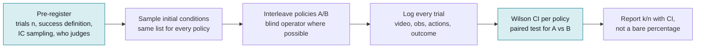

# Policy evaluation

## What it is

Policy evaluation is the process of measuring how well a learned robot policy performs, and of
stating that measurement with honest uncertainty. On a real robot it almost always reduces to a
small number of binary trials (success/failure) over sampled initial conditions, which makes it a
problem in small-sample binomial statistics as much as in robotics. The field's default, "we ran
20 trials and got 85%", is a point estimate with a 95% interval roughly 0.64 to 0.95 wide (see the
worked example below), so most reported differences between policies are not statistically
resolvable. Kress-Gazit et al. argue that robot learning should be treated as an empirical science
and that success rate alone, without trial counts, intervals, controlled initial conditions, and
failure-mode descriptions, is not rigorous ([arXiv:2409.09491](https://arxiv.org/abs/2409.09491)).

## Why it matters in the field

- Customer decisions ("ship policy v3?") ride on numbers a forward-deployed engineer produces
  with 10 to 50 trials. Overclaiming a 2-point win destroys trust when it does not reproduce.
- Real-robot evaluation is expensive: TRI's LBM study needed 1,800 real rollouts and >47,000
  simulation rollouts to make statistically confident claims
  ([arXiv:2507.05331](https://arxiv.org/abs/2507.05331)). Field budgets are 1-2 orders of
  magnitude smaller, so you must know what you can and cannot conclude.
- Reproducibility is a known crisis: real-world evaluation "is not scalable and faces
  reproducibility challenges" ([SIMPLER, arXiv:2405.05941](https://arxiv.org/abs/2405.05941)),
  and centralized benchmarks rank policies worse than distributed double-blind comparisons
  ([RoboArena, arXiv:2506.18123](https://arxiv.org/abs/2506.18123)).
- Sim benchmark saturation misleads: LIBERO-PRO reports that policies above 90% on standard
  LIBERO collapse to 0% under reasonable perturbations of objects, initial states, instructions,
  and environments ([arXiv:2510.03827](https://arxiv.org/abs/2510.03827)); LIBERO-Plus reports
  drops from 95% to below 30% under modest camera/initial-state perturbations
  ([arXiv:2510.13626](https://arxiv.org/abs/2510.13626)).
- Repo rule (CLAUDE.md): "Evaluation protocols are written down before evaluation. Report
  success rate with the number of trials." This note is the how.

### Diagram: an evaluation protocol that produces defensible numbers



Rule of thumb from the worked example below: 20 trials per arm cannot
separate 85% from 65%. Decide the trial count from the effect you need to
detect before running anything.


## Key concepts and methods

### Confidence intervals for a success rate

- **Wald interval** (p +/- 1.96 sqrt(p(1-p)/n)) is what most people compute; Brown, Cai and
  DasGupta show its coverage is erratic and can be far below nominal even for large n, and it
  produces nonsense like 17/20 -> upper bound 1.006
  ([Statistical Science 2001](https://projecteuclid.org/journals/statistical-science/volume-16/issue-2/Interval-Estimation-for-a-Binomial-Proportion/10.1214/ss/1009213286.full)).
- **Wilson score interval**: centre (p + z^2/2n)/(1 + z^2/n), half-width
  z sqrt(p(1-p)/n + z^2/4n^2)/(1 + z^2/n). Brown et al. recommend Wilson or Jeffreys for
  small n, Agresti-Coull for large n. Default choice for this lab.
- **Clopper-Pearson ("exact")**: Beta quantiles, Beta(a/2; k, n-k+1) to Beta(1-a/2; k+1, n-k).
  Guaranteed coverage >= nominal but conservative (wider). Use when a customer contract
  or safety case needs a guaranteed bound.
- **Bayesian credible interval** with uniform (Beta(1,1)) prior: posterior Beta(k+1, n-k+1).
  TRI's LBM paper plots the full posterior as violin plots rather than a CI, with 50 real
  rollouts per task per policy per condition and 200 in simulation
  ([arXiv:2507.05331](https://arxiv.org/html/2507.05331v1)).
- **Rule of three**: 0/n successes gives an approximate 95% upper bound of 3/n
  (0/20 -> 0.15; exact Clopper-Pearson upper bound 0.168). Useful for "how many failures-free
  trials to claim a failure rate below X".

Wilson 95% widths at p ~ 0.8 (computed with the script in this note's history): n=10 -> 0.45,
n=20 -> 0.34, n=30 -> 0.28, n=50 -> 0.22, n=100 -> 0.16, n=200 -> 0.11, n=400 -> 0.08.
Width shrinks as 1/sqrt(n): halving the interval costs 4x the trials.

### Comparing two policies (A/B)

- **Unpaired**: two-proportion z-test (pooled SE), Fisher's exact test (conservative for small
  n), Barnard's or Boschloo's exact tests (more powerful than Fisher). Report the difference with
  its CI, not just a p-value.
- **Paired**: if both policies see the *same* sampled initial conditions, use McNemar's test on
  the discordant pairs (A-only vs B-only successes). Pairing removes initial-condition variance
  and is the recommended design when the IC can be reproduced (marked positions, image overlays).
- **Bayesian**: P(p_A > p_B) from posterior samples; interpretable for non-statisticians
  ("92% chance A is better") but must be reported alongside the interval on the difference.
- **Sequential / early stopping**: Snyder et al. (RSS 2025) give a sequential test with
  near-optimal stopping that keeps Type-I error control while cutting trials by up to 32% vs
  prior sequential methods ([arXiv:2503.10966](https://arxiv.org/abs/2503.10966)); TRI uses this
  family of tests in the LBM paper. Do *not* peek at results and stop ad hoc without such a
  procedure; that is p-hacking.
- **Power**: per-arm n for 80% power, two-sided alpha 0.05 (normal approximation):
  0.85 vs 0.65 -> 73; 0.70 vs 0.50 -> 93; 0.90 vs 0.80 -> 199; 0.90 vs 0.85 -> 686;
  0.92 vs 0.90 -> 3,213. A 20-vs-20 design has ~21-30% power to detect 0.85 vs 0.65
  (Fisher exact by simulation: 21%). Small-n A/B tests mostly detect nothing.

### Initial conditions (ICs), blinding, and protocol

- Sample ICs from a *written* distribution (object pose ranges, distractor sets, lighting), log
  each one, and reuse the same IC list for every policy in the comparison. Kress-Gazit et al.
  recommend image overlays or scene markings, evaluating all policies in the same session, a
  clear pre-registered success definition, separating demonstrator and evaluator, and
  blinding the evaluator to which policy is running
  ([arXiv:2409.09491](https://arxiv.org/html/2409.09491)).
- Randomize policy order (interleave A/B trials rather than all A then all B) so battery drain,
  lighting drift, and operator fatigue are shared. TRI: "policy ordering was randomized" and
  "the evaluator had no knowledge of which policy was being evaluated"
  ([arXiv:2507.05331](https://arxiv.org/html/2507.05331v1)).
- RoboArena scales this with double-blind *pairwise* preference judgments crowd-sourced across
  7 institutions on DROID robots (600+ pairwise episodes, 7 generalist policies) and aggregates
  into a ranking ([arXiv:2506.18123](https://arxiv.org/abs/2506.18123)).

### Metrics beyond binary success

- **Partial credit / subgoal rubrics**: task-specific stage completion (e.g. grasped, lifted,
  placed). Kress-Gazit et al. suggest Signal Temporal Logic specs for computable semantic
  metrics and robustness scores, plus SPARC for trajectory smoothness
  ([arXiv:2409.09491](https://arxiv.org/html/2409.09491)).
- **Time-to-completion** (only over successes, or with censoring at timeout) and **throughput**
  (tasks/hour) matter for production; RTC's headline result is throughput under latency
  ([arXiv:2506.07339](https://arxiv.org/abs/2506.07339)).
- **Interventions per episode / autonomous run length** for human-in-the-loop deployments.
- **Long-horizon evaluation**: CALVIN reports the success rate of chains of 5 consecutive
  language instructions and the average completed chain length
  ([arXiv:2112.03227](https://arxiv.org/abs/2112.03227)); LIBERO-Long has 10 long-horizon
  tasks ([arXiv:2306.03310](https://arxiv.org/abs/2306.03310)). For a k-stage task with
  independent per-stage success s, the end-to-end rate is ~s^k; report per-stage and end-to-end.

### Simulation benchmarks and sim-real correlation

| Benchmark | What it is | Source |
|---|---|---|
| LIBERO | 130 tasks in 4 suites (Spatial, Object, Goal, Long), lifelong learning, teleop demos | [arXiv:2306.03310](https://arxiv.org/abs/2306.03310) |
| RoboCasa | 120 kitchen scenes, 2,500+ objects, 100 tasks, 100K+ trajectories | [arXiv:2406.02523](https://arxiv.org/abs/2406.02523) |
| SimplerEnv (SIMPLER) | Digital twins of Google Robot and WidowX/Bridge setups for evaluating *real* policies (RT-1, Octo, ...) | [arXiv:2405.05941](https://arxiv.org/abs/2405.05941) |
| CALVIN | Language-conditioned long-horizon chains, 4 environments | [arXiv:2112.03227](https://arxiv.org/abs/2112.03227) |
| RLBench | 100 hand-designed tasks with motion-planner demos | [arXiv:1909.12271](https://arxiv.org/abs/1909.12271) |
| ManiSkill3 | GPU-parallel simulation, 12 domains, up to 30,000+ FPS | [arXiv:2410.00425](https://arxiv.org/abs/2410.00425) |

- SIMPLER validated sim-real correlation with >1,500 paired sim/real evaluations across two
  embodiments and eight task families using Pearson r and *Mean Maximum Rank Violation*
  (MMRV), a metric for how badly the sim ranking violates the real ranking
  ([project page](https://simpler-env.github.io/)). Only SIMPLER-style twins of *your* setup
  have this property; LIBERO/RoboCasa scores for a policy do not predict your real robot.
- Yang et al. (RSS 2025 workshop) frame sim evaluation for real deployment as: high-fidelity
  visuals, perturbation ladders, and explicit measurement of sim-real alignment
  ([arXiv:2508.11117](https://arxiv.org/abs/2508.11117)).
- Practical stance: use sim to *rank and screen* checkpoints cheaply, use real trials to
  *confirm*, and check the sim ranking against real at least once per project.

### Reporting template (minimum)

```
Policy: <checkpoint name per CLAUDE.md>        Eval date/session: <one session? yes/no>
Task + success definition (pre-registered):    Timeout: <s>
IC distribution + list file:                   Evaluator blinded: yes/no   Order: interleaved
Trials: k/n = 17/20 = 85%  Wilson 95% CI [0.64, 0.95]   (Clopper-Pearson [0.62, 0.97])
Subgoal rates: grasp 20/20, lift 19/20, place 17/20    Median time (successes): <s>
Failure modes (count + one line each):
Comparison vs baseline: diff +0.20, 95% CI [-0.06, 0.46], Fisher p=0.27 -> not significant
```

## Practical recipe or worked example

**"Policy A 17/20 vs policy B 13/20, is it significant?"** (all numbers below computed with
scipy 1.8; script kept in the session scratchpad, re-derivable from the formulas above)

1. Point estimates and intervals. A: 0.85, Wilson 95% [0.640, 0.948], Clopper-Pearson
   [0.621, 0.968]. B: 0.65, Wilson [0.433, 0.819], Clopper-Pearson [0.408, 0.846].
   The intervals overlap heavily.
2. Difference. d = 0.20, unpooled SE = sqrt(0.85*0.15/20 + 0.65*0.35/20) = 0.133,
   95% CI on d: [-0.061, 0.461]. The CI includes 0.
3. Pooled z-test. p_pool = 30/40 = 0.75, SE = sqrt(0.75*0.25*(1/20+1/20)) = 0.137,
   z = 0.20/0.137 = 1.46, two-sided p = 0.144.
4. Exact tests on the 2x2 table [[17,3],[13,7]]. Fisher two-sided p = 0.273 (one-sided 0.137);
   Barnard p = 0.161; Boschloo p = 0.173.
5. Bayesian view (uniform priors, Beta(18,4) vs Beta(14,8)): P(p_A > p_B) = 0.92, 95% credible
   interval on the difference [-0.074, 0.431].
6. Conclusion: **not significant at alpha = 0.05 by any test**. Honest statement: "A looks
   better (85% vs 65%, 20 trials each) but the evidence is weak (Fisher p = 0.27; 92%
   posterior probability A is better). Need more trials before switching."
7. How many more? At the same observed rates, 42/50 vs 32/50 gives Fisher p = 0.039 and
   85/100 vs 65/100 gives p = 0.0017. Planned power: 73 trials per arm for 80% power to detect
   0.85 vs 0.65. If the ICs are reproducible, run *paired* trials and use McNemar; discordant
   pairs carry all the information, so pairing typically needs fewer trials.
8. Cheaper alternative: pre-register a sequential test (Snyder et al.) so you can stop early
   if A wins decisively, without inflating false positives.

## Practical gotchas

- Wald intervals on small n overshoot 1.0 or undershoot 0; never report them.
- "Same session" matters more than people think: lighting, battery voltage, cable wear, and
  operator resets drift within a day. Interleave A/B, do not block.
- Unblinded evaluators nudge ICs and judge borderline outcomes in favor of the new policy.
  If only one person is available, fix ICs by marker and define success by a checklist before
  the run, and record video so a second person can re-score.
- Resets are ICs too. A reset that leaves the object 2 cm off the marker changes the trial.
- Timeout choice changes success rate; report it and keep it fixed across policies.
- Sim leaderboard numbers (LIBERO 95%+) are near-saturated and brittle under perturbation
  ([arXiv:2510.03827](https://arxiv.org/abs/2510.03827)); treat them as smoke tests.
- Stopping when the result "looks good" is p-hacking unless a sequential procedure was
  pre-registered.
- Do not average success rates across tasks with different n without weighting; report per-task.
- Fewer than ~10 trials per condition gives intervals wider than 0.5; report as "pilot", not
  as a result.

## What a forward-deployed engineer must be able to do

- Write the evaluation protocol (task, success definition, IC distribution, n, timeout, judge,
  blinding) *before* the eval, per `sops/experiment-protocol.md`.
- Compute Wilson and Clopper-Pearson intervals and a two-proportion / Fisher / McNemar test
  by hand or with a 10-line script, and explain the result in one plain sentence to a customer.
- Size an evaluation: given a target CI width or a minimum detectable difference, state n.
- Run interleaved, blinded A/B trials with logged ICs and video, and produce the report template.
- Distinguish "sim ranking" from "real performance" and say which one a number is.
- Categorize failures (perception, grasp, planning/policy, hardware, operator) with counts.
- Push back, politely and with numbers, when someone wants to ship on 5 trials.

## Open questions to learn hands-on

- How reproducible are our own ICs? Measure IC placement error with the overhead camera and
  see whether it correlates with failures.
- Does a SimplerEnv-style twin of our cell rank our checkpoints the same way real trials do?
  (Compute MMRV on 3-4 checkpoints.)
- What is the real per-trial cost (reset time, operator time) and therefore the realistic n
  per day? That fixes what differences we can ever detect on site.
- Does partial credit (subgoal rubric) reduce the number of trials needed to rank checkpoints
  compared with binary success? (TRI uses Welch's t-test on continuous task-completion
  metrics; compare power on our tasks.)
- How stable is a checkpoint's success rate across days? Run the same policy on three days.

## Related entries

- [[sops/experiment-protocol]] (the SOP this note supports)
- [[library/topics/imitation-learning]]
- [[library/topics/sim-to-real]]
- [[library/topics/vision-language-action-models]]
- [[library/topics/deployment-engineering]] (monitoring and logging rollouts as evaluation data)
- [[library/tools/lerobot]]

## Sources

- Kress-Gazit et al., "Robot Learning as an Empirical Science: Best Practices for Policy Evaluation" (2024). https://arxiv.org/abs/2409.09491
- TRI LBM Team, "A Careful Examination of Large Behavior Models for Multitask Dexterous Manipulation" (2025; Science Robotics 2026). https://arxiv.org/abs/2507.05331 , https://www.science.org/doi/10.1126/scirobotics.aea6201
- Atreya, Pertsch, Lee et al., "RoboArena: Distributed Real-World Evaluation of Generalist Robot Policies" (2025). https://arxiv.org/abs/2506.18123
- Li, Hsu, Gu et al., "Evaluating Real-World Robot Manipulation Policies in Simulation" (SIMPLER, CoRL 2024). https://arxiv.org/abs/2405.05941 , https://simpler-env.github.io/
- Snyder et al., "Is Your Imitation Learning Policy Better than Mine? Policy Comparison with Near-Optimal Stopping" (RSS 2025). https://arxiv.org/abs/2503.10966
- Brown, Cai, DasGupta, "Interval Estimation for a Binomial Proportion", Statistical Science 16(2), 2001. https://projecteuclid.org/journals/statistical-science/volume-16/issue-2/Interval-Estimation-for-a-Binomial-Proportion/10.1214/ss/1009213286.full
- Liu et al., "LIBERO: Benchmarking Knowledge Transfer for Lifelong Robot Learning" (NeurIPS 2023). https://arxiv.org/abs/2306.03310
- LIBERO-PRO (2025). https://arxiv.org/abs/2510.03827 ; LIBERO-Plus (2025). https://arxiv.org/abs/2510.13626
- Nasiriany et al., "RoboCasa" (2024). https://arxiv.org/abs/2406.02523
- Mees et al., "CALVIN" (2021/2022). https://arxiv.org/abs/2112.03227
- James et al., "RLBench" (2019). https://arxiv.org/abs/1909.12271
- Tao, Xiang et al., "ManiSkill3" (2024). https://arxiv.org/abs/2410.00425
- Yang et al., "Robot Policy Evaluation for Sim-to-Real Transfer: A Benchmarking Perspective" (RSS 2025 workshop). https://arxiv.org/abs/2508.11117
- Black, Galliker, Levine, "Real-Time Execution of Action Chunking Flow Policies" (2025), for throughput-under-latency as a metric. https://arxiv.org/abs/2506.07339
- Unverified: TRI Medium post "Statistical Thinking for Robot Policy Evaluation" (fetch returned HTTP 403; not used for any claim here).
