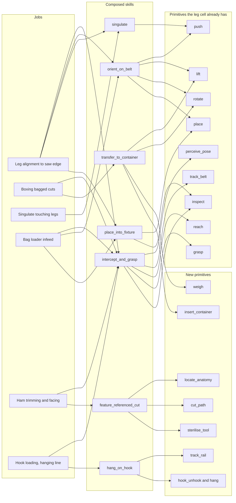

# The pork plant as a skill tree: jobs, reusable skills, and which cell comes after leg alignment

## What it is

A breakdown of the human jobs on a pork line into robot skills, in three layers. Primitive skills
are the verbs a cell executes (perceive pose, track on belt, grasp, cut along a path). Composed
skills are primitives wired together with a contract (intercept-and-grasp, orient-on-belt).
Jobs are what a worker on the line does for a shift. The note counts how often each primitive
recurs across jobs, ranks jobs as next cells for a company whose product is the skill library, and
proposes an order that adds the fewest new skills per cell.

It builds on, and does not repeat, the process and vendor detail in
[pork-processing-line](pork-processing-line.md), the cell and hygiene detail in
[meat-cutting-automation](meat-cutting-automation.md), and the push-versus-grasp and arm argument in
[arm-selection-scara-vs-six-axis](arm-selection-scara-vs-six-axis.md). Customer context is in
`field-notes/customer/line-videos.md` and
`field-notes/customer/neil-requirements.md`.

## Why it matters in the field

Neil wants a skill architecture where every skill has a contract (inputs, preconditions, outputs,
success, failure, recovery), and a new application "should reuse most of the graph and change only
what is novel" (`field-notes/customer/neil-requirements.md`). He also wants
to sell to Wholestone's downstream customers, so the second cell has to reuse the first. The test he
wants to run on any new problem is the same test this note runs on each job: which existing skills
solve part of it, and which new skills it needs.

Three facts from primary sources set the frame.

- **Piece rate matters more than line speed.** The FSIS-commissioned UCSF study enrolled 574 workers
  in six plants between July 2024 and January 2025. It found "the number of hog parts handled per
  minute by a worker ('piece rate') was more closely associated with MSD risk" than line speed, and
  that plants can "maintain or even reduce piece rate ... by adding staff or redistributing tasks"
  ([Federal Register 2026-03228](https://public-inspection.federalregister.gov/2026-03228.pdf),
  study findings section and footnote 9). A cell that takes over the pieces handled per minute at one
  station reduces the exposure the study measured. Line speed alone does not.
- **Labour is added per line per shift when lines speed up.** FSIS's regulatory impact analysis
  assumes plants running faster add 3 to 5 production workers per line per shift, or 6 to 11 for
  plants converting to NSIS. It costs them at $38.62 per hour: the BLS May 2024 wage of $19.31 for
  slaughterers and meat packers, doubled for benefits and overhead, over 269 production days
  (same document, PRIA section and footnotes 54 to 56).
- **The money is in yield more than labour.** The companion note has the MLA figure: automation
  benefits were about 15 percent labour and 80 percent carcass value yield
  ([pork-processing-line section 8.4](pork-processing-line.md)). A presentation cell earns its keep by
  protecting cut position downstream. Headcount alone will not pay for it.

## Line speed and the plants in the footage

US swine plants under NSIS: in February 2025 there were 17 market hog establishments on NSIS, each
slaughtering at least one million market hogs a year. The six on a line speed waiver averaged
1,276 head per hour (hph), within granted maxima of 1,206 to 1,450 hph. The other 11 are capped at
1,106 hph. Ten large plants under traditional inspection run at 850 to 1,106 hph
([Federal Register 2026-03228](https://public-inspection.federalregister.gov/2026-03228.pdf), PRIA
section). The cutting floor runs off that rate: 1,000 hph is 2,000 legs per hour
([pork-processing-line section 4.3](pork-processing-line.md)).

The customer plants:

- **Wholestone Farms, Fremont, Nebraska.** 1,300 team members and 235 farmer-owners
  ([Wholestone](https://wholestonefarms.com/)). It formed a joint venture with Prestage Foods of Iowa
  with "approximately 21,000 head per day" of combined single-shift harvest capacity across two plants
  ([press release, 22 Feb 2023](https://www.globenewswire.com/en/news-release/2023/02/22/2613661/0/en/Wholestone-Farms-of-Nebraska-and-Prestage-Foods-of-Iowa-Announce-a-New-Joint-Venture.html)).
  Fremont's own figure of about 3 million head a year on one shift appears only in a search snippet of
  a Pork Business article that returned 403 (unverified).
- **Prestage Foods of Iowa, near Eagle Grove, Wright County.** Opened 4 March 2019; target of
  10,000 head per day on a single shift with 920 employees. Harvest floor of "Marel design", primary
  cut floor equipment from Frontmatec, "automatic openers, automatic neck droppers, robotic splitting
  saws, automatic rib pullers and water jet belly cutters", and the claim that automation lets "920
  employees ... accomplish what would have taken 1,200 just 20 years ago"
  ([Food Engineering, 9 Dec 2019](https://www.foodengineeringmag.com/articles/98612-prestage-farms-built-a-state-of-the-art-pork-processing-plant-in-northwest-iowa),
  trade press quoting the company). A February 2020 local report gives 8,500 head per day at about
  800 employees, a 100,000 sq ft cutting floor, "10 unique robots", and 45 percent of product sold to
  processors such as Hormel
  ([Messenger News, 16 Feb 2020](https://www.messengernews.net/z_old_categories/progress2020/progress-2020-business-and-industry/2020/02/prestage-foods-of-iowa-fulfilling-its-promise/)).

The GPS in all four clips places them in north-central Iowa
(`field-notes/customer/line-videos.md`), and Eagle Grove is in north-central Iowa. Lakshya
confirmed on 2026-09-15 that the footage is from Prestage Foods of Iowa and that the first cell
will be set up there.

## Job inventory

Stunning to boxing. "Workers" gives a number only where a primary source gives one. Headcount per
station is not published by any regulator, vendor or study found, so most cells say "not public".
Vendor rates and automation claims are the vendors' own. The Stations column uses the process order
in [pork-processing-line section 3](pork-processing-line.md).

| Station | Job | Workers | What they handle | Line or machine rate | Injury or ergonomic data | Existing automation | Sources |
|---|---|---|---|---|---|---|---|
| Lairage and stunning | Drive pigs, load CO2 gondola or electrically stun | Not public | Live animals | Plant hph (850 to 1,450 in large US plants) | No job-specific study found | Group CO2 stunners and automatic runways (Frontmatec, JBT Marel, Butina) | [FR 2026-03228](https://public-inspection.federalregister.gov/2026-03228.pdf); [Frontmatec runway](https://www.frontmatec.com/en/pork-solutions/unclean-line/stunning/automatic-runway); [pork-processing-line 3.1](pork-processing-line.md) |
| Shackle and stick | Shackle hind leg, stick and bleed with a knife | Not public | Stunned carcass, knife | Plant hph | No job-specific study found | Sticking mostly manual; Frontmatec Autoline APB7 does "stick wound opening" with bunging at up to 750 pigs/h | [Frontmatec Autoline](https://www.frontmatec.com/en/pork-solutions/clean-line-chill-room/autoline-machines); [pork-processing-line 3.1](pork-processing-line.md) |
| Gambrel table | "Operators insert gambrels to the hind legs" after dehairing, then the elevator lifts the carcass to the rail | Not public | Hot, wet carcass off a 58 to 65 C scald, hind leg tendons | Plant hph | Vendor claims its table minimises "work injuries"; no study | Ergonomic table only (Frontmatec); insertion is manual | [Frontmatec gambrelling](https://www.frontmatec.com/en/pork-solutions/unclean-line/scalding-dehairing/gambrelling); scald temperature in [pork-processing-line 3.2](pork-processing-line.md) |
| Head and neck | Drop head, clean jowl, harvest cheek meat, historically brains | Not public | Head on carcass or on a head table, knife | Jowl Cleaner APT4 450 head/h; M-Line and AiRA neck cutters 650 to 750/h | 18 cases of progressive inflammatory neuropathy at one Minnesota plant, 5 in Indiana, 1 in Nebraska, from brain removal with compressed air; plants had replaced saws with air devices "to reduce the risk of amputation"; line speed cited as a factor; no new cases after the task stopped | JBT Marel M-Line Neck Cutter, Frontmatec AiRA RNC, Jowl Cleaner, JBT Marel pig head deboner | [DeAngelis and Shen 2009](https://doi.org/10.1002/msj.20132); [GAO-16-337 p.25](https://www.gao.gov/assets/gao-16-337.pdf); [Bae et al. 2023](https://pmc.ncbi.nlm.nih.gov/articles/PMC9951719/); [M-Line](https://jbtmarel.com/en/meat/pig-pork/dressing-cutting-and-evisceration/m-line-robots/) |
| Bung, aitch bone, belly opening | Drop bung, cut aitch bone, open belly and breast | Jarvis ABC-1: "a single operator" for 1,200 hogs/h | Hanging carcass, hydraulic cutter or knife | Autoline APB7 750/h; Bae et al. give 350 to 650 head/h for abdomen systems | No job-specific study found | Largely automated in large plants: AiRA RBD, RBDH, RHC, RBO; M-Line MBR, MPB; Autoline APB7 | [Frontmatec AiRA](https://www.frontmatec.com/en/pork-solutions/clean-line-chill-room/aira-robots/); [M-Line](https://jbtmarel.com/en/meat/pig-pork/dressing-cutting-and-evisceration/m-line-robots/); Jarvis in [pork-processing-line 4.2](pork-processing-line.md) |
| Evisceration | Pull viscera onto a pan or tray | Not public | Hanging carcass, organs, knife | Plant hph | USDA inspectors in meat plants report more cuts than in poultry "because they make several cuts during hog and cattle inspections" | Manual everywhere; no vendor claims an eviscerator for pigs | [GAO-16-337 p.19](https://www.gao.gov/assets/gao-16-337.pdf); [pork-processing-line 8.3](pork-processing-line.md) |
| Split and leaf lard | Split down the spine, remove leaf lard | Not public | Hanging carcass, saw | M-Line MSS-TT "900 pigs per hour with a single robot"; Jarvis JCK-1 650/h | Saws are an amputation hazard (GAO p.25 context above) | Automated: M-Line MSS-TT, MLR; AiRA RPS-S/H/D, RLR | [M-Line](https://jbtmarel.com/en/meat/pig-pork/dressing-cutting-and-evisceration/m-line-robots/); [AiRA](https://www.frontmatec.com/en/pork-solutions/clean-line-chill-room/aira-robots/) |
| Carcass trim and NSIS sorting | Plant employees "sort and remove unfit animals", "trim and identify defects", and identify what they removed | Converting plants: 6 to 11 extra per line per shift (FSIS estimate, covers more than this job) | Hanging carcass, knife | Plant hph | No job-specific study found | Manual; regulated task | [FR 2026-03228](https://public-inspection.federalregister.gov/2026-03228.pdf), PRIA |
| Grading and marking | Ultrasound grade, stamp carcass | 0 where installed | Hanging carcass | Plant hph | None | AutoFom III, AiRA RMP, Autoline API8 | [pork-processing-line 3.7](pork-processing-line.md); [AiRA](https://www.frontmatec.com/en/pork-solutions/clean-line-chill-room/aira-robots/) |
| Laydown | Pull sides off the rail with hand hooks onto a belt (IMG_1003) | Not public | Half carcass, hand hook | Plant hph | Overexertion was the leading event for days-away cases in meat and poultry, 40.1 per 10,000 full-time workers (2013); no job-specific figure | Frontmatec automatic laydown and de-gambrel | `field-notes/customer/line-videos.md`; [GAO-16-337 table 2](https://www.gao.gov/assets/gao-16-337.pdf); [Frontmatec laydown](https://www.frontmatec.com/en/pork-solutions/primal-cutting/laydown/) |
| Foot removal | Cut feet off with a hand-held circular saw on a balancer (IMG_1004) | Not public | Side on belt, powered saw | Plant hph | Days-away cuts and lacerations 10 per 10,000 full-time workers, industry-wide (2013) | Frontmatec ABSA-800 automatic hind feet cutting | `field-notes/customer/line-videos.md`; [GAO-16-337 table 1](https://www.gao.gov/assets/gao-16-337.pdf); [pork-processing-line 4.2](pork-processing-line.md) |
| Primal cutting | Push sides through saws into leg, middle, shoulder | Not public | Half carcass | AGOL-800 up to 800/h; JBT Marel Primal Cutter up to 600/h | No job-specific study found | Automated in large plants; Prestage lists Frontmatec primal cut floor equipment | [pork-processing-line 4.2 and 4.3](pork-processing-line.md); [Food Engineering 2019](https://www.foodengineeringmag.com/articles/98612-prestage-farms-built-a-state-of-the-art-pork-processing-plant-in-northwest-iowa) |
| **Leg presentation (the first cell)** | **Place and turn legs so the trotter reaches the open belt edge; push touching legs apart (IMG_1005, IMG_1008)** | **Not public** | **9 to 13 kg bone-in leg with trotter** | **Takt about 2 to 4 s per lane at 1,000 hph (derived)** | **No job-specific study found** | **Manual everywhere found** | `field-notes/customer/line-videos.md`; [pork-processing-line 4.3 and 9](pork-processing-line.md) |
| Ham skinning | Feed leg into a skinner | Not public | Leg | DeboFlex Inline Skinner up to 900 pieces/h | No job-specific study found | Belt skinners hand-fed (Cretel video); inline skinner on hanging line | [pork-processing-line 2.7 and 4.2](pork-processing-line.md) |
| Ham trim and aitch bone | Face the leg, trim fat to spec, remove hip bone | Not public | Leg, knife | Not public | Moore and Garg studied 32 jobs at one pork plant and recorded 104 upper-extremity disorders in 15 job categories over 20 months; 96 percent of morbidity was in jobs rated hazardous for force and repetition. The abstract does not name the jobs | Manual; HAMDAS-RX requires the hipbone removed beforehand | [Moore and Garg 1994](https://doi.org/10.1080/15428119491018592); [pork-processing-line 5.1 and 8.2](pork-processing-line.md) |
| Ham boning | Debone the leg, shank first, then hip, then femur | HAMDAS 1999 prototype: 7 preparation workers including 1 loader for 300 legs/h | Leg, knife | HAMDAS-RX 500 hams/h maximum | Ham boners took microbreaks of 0.88 to 4 percent of survey time | Mayekawa HAMDAS-RX; JBT Marel StreamLine, PaceLine, DeboFlex are operator lines | [pork-processing-line 4.3, 5.2 and 8.2](pork-processing-line.md) |
| Loin | Saw chine bone, pull loin, bone and trim | Not public | Middle or loin | Chine bone saw up to 1,200 loins/h; Frontmatec middle systems up to 1,000/h | No job-specific study found | Robotic chine bone saw, loin pullers (Frontmatec) | [meat-cutting-automation industry map](meat-cutting-automation.md); [Bae et al. 2023](https://pmc.ncbi.nlm.nih.gov/articles/PMC9951719/) |
| Belly | Pull ribs, skin, trim | Not public | Belly | Rib puller 1,500/h; belly boning 1,400/h | No job-specific study found | Rib pullers, robotic belly trimmer (Frontmatec), water jet belly cutters (Prestage) | [Bae et al. 2023](https://pmc.ncbi.nlm.nih.gov/articles/PMC9951719/); [Food Engineering 2019](https://www.foodengineeringmag.com/articles/98612-prestage-farms-built-a-state-of-the-art-pork-processing-plant-in-northwest-iowa) |
| Shoulder | Remove blade bone, bone and trim | WANDAS-RX needs manual scapula slitting first | Shoulder, knife | WANDAS-RX 600/h | No job-specific study found | JBT Marel Blade Bone Remover, Mayekawa WANDAS-RX | [pork-processing-line 4.2](pork-processing-line.md) |
| Grade and batch | Weigh cuts, divert to weight bands | Not public | Any cut | Not public | No job-specific study found | JBT Marel grading and batching; pushers and Intralox ARB transfers | [pork-processing-line 5.1 and 9](pork-processing-line.md) |
| Bagging | Load primals into vacuum bags | Not public | Primal, shrink bag | Not verified (Sealed Air pages returned 403) | See packing row | Sealed Air CRYOVAC automated and robotic (ALR2) bag loaders, per search listing only (unverified) | [Sealed Air](https://www.sealedair.com/products/food-equipment/bag-dispensers-and-loaders/automated-bag-loaders) |
| Packing and boxing | Lift bagged cuts into boxes or combo bins | Not public | Bagged primals, boxes | Not public | 595 workers in two Danish slaughterhouses: meat packers had higher odds than cutters of neck pain (OR 2.10) and shoulder pain (OR 2.19); overall shoulder pain 60 percent, hand and wrist 52 percent | Robotic case packing for meat is sold (KUKA); adoption in US pork plants not found (unverified) | [Sundstrup et al. 2014](https://pmc.ncbi.nlm.nih.gov/articles/PMC3910536/); [KUKA meat](https://www.kuka.com/en-us/industries/consumer-goods-industry/meat-processing-automation) |
| Palletising | Stack boxes on pallets | Not public | Boxes | Not public | Overexertion as above | Commodity palletising robots; pork-plant adoption not measured (unverified) | [GAO-16-337 table 2](https://www.gao.gov/assets/gao-16-337.pdf) |
| Sanitation (night shift) | Clean every surface and machine | Not countable: contract sanitation workers "may not be classified in the meat and poultry industry" | Saws, splitters, hot chemicals | Once per production day | DOL found one contractor employing at least 102 children aged 13 to 17 at 13 plants in 8 states, cleaning "back saws, brisket saws and head splitters" | None; the robot cell is a sanitation load | [GAO-16-337 summary](https://www.gao.gov/assets/gao-16-337.pdf); [DOL WHD 2023-02-17](https://www.dol.gov/newsroom/releases/whd/whd20230217-1) (page 403, content read through search index) |

Industry-wide rates for context: meat slaughter recorded 7.8 cases per 100 full-time workers in 2013
against 5.0 for all manufacturing ([GAO-16-337 pp.13 to 14](https://www.gao.gov/assets/gao-16-337.pdf));
the 2024 BLS rates for NAICS 311612 and the 21 percent carpal tunnel prevalence from Gorsche et al.
are in [pork-processing-line sources](pork-processing-line.md). Food Safety Magazine reports the UCSF
study found MSD in 46 percent of swine workers
([Food Safety, 2025](https://www.food-safety.com/articles/10059-poultry-swine-line-speed-studies-suggest-need-for-best-practices-to-protect-employee-health));
the report itself returned 403, so the figure is not checked against it (unverified), and neither
are its per-job results.

## Skill tree

### Primitive skills

Eighteen primitives cover every manipulation job in the inventory. Stunning, grading, chilling
conveyance and FSIS inspection are left out: they are either live-animal work, already automated as
dedicated machines, or regulated human judgement.

| Primitive | Contract in one line (input to output; success; failure and recovery) |
|---|---|
| perceive_pose | Image and depth to piece mask, lane offset, yaw, side up; success when the mask is single and the pose is stable over repeated frames; failure on touching pieces or no mask, recovery by singulate or skip to manual |
| locate_anatomy | Image, depth, X-ray or 3D scan to named features (hock joint, aitch bone, femur head); failure when a feature is missing, recovery by reject. HAMDAS re-measures twice because a bad first reference cascades ([pork-processing-line 5.2](pork-processing-line.md)) |
| track_belt | Encoder count and trigger stamp to piece pose in the belt frame; failure on encoder glitch or belt stop, recovery per [conveyor-tracking](conveyor-tracking-and-visual-servoing.md) |
| track_rail | Rail position and carcass pose to a moving, swinging target frame; AiRA and M-Line solve it on hanging carcasses |
| reach | Target pose to a collision-free approach at matched velocity; failure when the target leaves the window, recovery by skip |
| grasp | Pre-grasp pose to a held piece; success on vacuum level or finger position; failure is a miss or a double pick |
| lift | Held piece to a clear height; failure is slip, detected as payload change or in-hand camera disagreement |
| rotate | Held piece to target yaw; bounded by wrist inertia ([arm-selection section 3](arm-selection-scara-vs-six-axis.md)) |
| place | Held piece to released pose on belt, fixture or infeed |
| push | Line contact against a datum to a new pose; indeterminate without the datum ([arm-selection section 4](arm-selection-scara-vs-six-axis.md)) |
| pull_strip | Grasp plus force along a seam to separated tissue; pullers exploit natural seams ([pork-processing-line 8.2](pork-processing-line.md)) |
| cut_path | Tool path referenced to anatomy, with force limits, to a cut; failure is a bone strike, where "strong and irregular torques are exerted on the drivetrain" ([Stäubli CELLDAS](https://www.staubli.com/global/en/robotics/industries/food/protein-processing/deboning-of-pork.html)) |
| hook_unhook | Piece and hook pose to engaged or released hook |
| hang | Hooked piece to a stable hanging pose on a moving line |
| weigh | Piece on scale or in hand to mass with uncertainty |
| inspect | Image to a verdict (pose OK, side, defect, count); gates production, never safety ([meat-cutting-automation interlocks](meat-cutting-automation.md)) |
| sterilise_tool | Tool to a sterilised tool between pieces; JBT Marel TwinTool and AiRA do it automatically ([pork-processing-line 8.2](pork-processing-line.md)) |
| insert_container | Held piece to a piece inside a bag, box or bin opening |

### Composed skills

| Composed skill | Primitives | Used by jobs |
|---|---|---|
| intercept_and_grasp | perceive_pose, track_belt, reach, grasp, inspect | Leg cell, boxing, bag infeed, skinner infeed, loin infeed, hook loading, weight sort, ham trimming |
| orient_on_belt | perceive_pose, track_belt, and either push against a datum or grasp, lift, rotate, place; then inspect | Leg cell, skinner infeed, loin infeed, side presentation |
| singulate | perceive_pose, track_belt, reach, push, inspect | Leg cell infeed, any belt with touching pieces |
| place_into_fixture | reach, place, inspect (verify pose before the machine's start request) | Leg cell, bag infeed, skinner infeed, loin infeed, HAMDAS loader |
| transfer_to_container | intercept_and_grasp, lift, rotate, insert_container, weigh | Boxing, combo bin loading |
| hang_on_hook | intercept_and_grasp, lift, rotate, track_rail, hook_unhook, hang | Hanging-line loading, gambrelling |
| feature_referenced_cut | perceive_pose, locate_anatomy, track_belt or track_rail, cut_path, sterilise_tool, inspect | Foot removal, ham trim, aitch bone, belly trim, head table |
| seam_pull | grasp, locate_anatomy, pull_strip | Aitch bone, ham boning, evisceration |

### Tree for the leg cell and the top jobs

The diagram shows what the tables do not: every one of the five highest-ranked next jobs enters
through intercept_and_grasp or singulate, which the leg cell already owns, and the new primitives
cluster by composed skill: weigh and insert_container under transfer_to_container (boxing),
track_rail and the hook pair under hang_on_hook (hook loading), and the three cutting primitives
under feature_referenced_cut (ham trimming).

## Reuse table

Counts of the 21 jobs in the scoring set that use each primitive. The job-to-primitive mapping and
the counts come from `skill_tree_scores.py` in the session scratchpad, and are reproduced in the
ranking table below. The mapping is design judgment. What each job physically involves is sourced
in the inventory.

| Primitive | Jobs using it (of 21) | In the leg cell |
|---|---|---|
| perceive_pose | 21 | yes |
| reach | 21 | yes |
| inspect | 21 | yes |
| track_belt | 16 | yes |
| grasp | 16 | yes |
| lift | 12 | yes |
| rotate | 11 | yes |
| place | 11 | yes |
| locate_anatomy | 9 | no |
| cut_path | 9 | no |
| sterilise_tool | 8 | no |
| push | 5 | yes |
| track_rail | 5 | no |
| pull_strip | 5 | no |
| hook_unhook | 4 | no |
| hang | 2 | no |
| weigh | 2 | no |
| insert_container | 1 | no |

The leg cell's nine primitives account for 134 of the 179 primitive uses across the 21 jobs
(75 percent). The three cutting primitives (locate_anatomy, cut_path, sterilise_tool) travel
together: every job that needs one needs all three, except gambrelling, which does not need tool
sterilisation in this mapping. That makes "first cutting cell" a single, expensive step. It cannot
be taken one primitive at a time.

## Candidate ranking

Design judgment, not measurement. The rules are fixed so that anyone can disagree with an input
and recompute.

- **Value, 0 to 12**: sum of four 0 to 3 scores. Labour: 3 where a source shows many workers or
  whole teams at the job, 1 where it is one or two people per line. Injury: 3 where a job-specific
  primary source shows harm (head table, packing, boning), 2 for industry-level evidence that matches
  the task (overexertion, cuts), 1 otherwise. Throughput or yield: 3 where the job sets downstream cut
  position or pace. Gap: 3 where no vendor automates it, 0 where commodity automation exists.
- **Technical risk, 0 to 12**: sum of four 0 to 3 scores for deformable handling (payload and
  floppiness), cutting, hygiene (open product and blades score high; bagged product scores 0), and
  contact richness.
- **Reuse, 0 to 6**: 6 times primitives shared with the leg cell divided by primitives the job needs.
- **Score** = Value + Reuse minus 0.5 times Risk. The column at risk weight 1.0 shows how the order
  moves for a more risk-averse company.

| Rank (w 0.5) | Job | Shared with leg cell | New primitives | Value | Risk | Score w 0.5 | Score w 1.0 |
|---|---|---|---|---|---|---|---|
| ref | Leg alignment to saw edge | 9/9 | none | 10 | 5 | 13.5 | 11.0 |
| 1 | Boxing bagged cuts | 8/10 | insert_container, weigh | 9 | 2 | 12.8 | 11.8 |
| 2 | Singulate touching legs | 5/5 | none | 7 | 3 | 11.5 | 10.0 |
| 3 | Bag loader infeed | 8/8 | none | 6 | 3 | 10.5 | 9.0 |
| 4 | Ham trimming and facing | 5/8 | cut_path, locate_anatomy, sterilise_tool | 12 | 11 | 10.2 | 4.8 |
| 5 | Hook loading, hanging line | 7/10 | hang, hook_unhook, track_rail | 8 | 5 | 9.7 | 7.2 |
| 6 | Skinner infeed | 9/9 | none | 7 | 7 | 9.5 | 6.0 |
| 7 | Loin puller infeed | 9/9 | none | 6 | 5 | 9.5 | 7.0 |
| 8 | Side presentation to primal saw | 9/9 | none | 6 | 6 | 9.0 | 6.0 |
| 9 | Palletising boxes | 7/7 | none | 3 | 0 | 9.0 | 9.0 |
| 10 | Ham deboner loader | 8/9 | hook_unhook | 6 | 5 | 8.8 | 6.3 |
| 11 | Ham boning | 6/10 | cut_path, locate_anatomy, pull_strip, sterilise_tool | 11 | 12 | 8.6 | 2.6 |
| 12 | Evisceration | 6/11 | cut_path, locate_anatomy, pull_strip, sterilise_tool, track_rail | 11 | 12 | 8.3 | 2.3 |
| 13 | Weight sort and divert | 7/8 | weigh | 4 | 2 | 8.2 | 7.2 |
| 14 | Aitch bone removal | 6/10 | cut_path, locate_anatomy, pull_strip, sterilise_tool | 10 | 12 | 7.6 | 1.6 |
| 15 | Pull sides off rail onto belt | 5/8 | hook_unhook, pull_strip, track_rail | 6 | 5 | 7.2 | 4.8 |
| 16 | NSIS sorting and defect trim | 3/7 | cut_path, locate_anatomy, sterilise_tool, track_rail | 8 | 9 | 6.1 | 1.6 |
| 17 | Foot removal saw | 4/7 | cut_path, locate_anatomy, sterilise_tool | 6 | 7 | 5.9 | 2.4 |
| 18 | Gambrelling | 5/9 | cut_path, hang, hook_unhook, locate_anatomy | 7 | 9 | 5.8 | 1.3 |
| 19 | Belly trimming | 4/7 | cut_path, locate_anatomy, sterilise_tool | 6 | 8 | 5.4 | 1.4 |
| 20 | Head table | 4/9 | cut_path, locate_anatomy, pull_strip, sterilise_tool, track_rail | 7 | 11 | 4.2 | -1.3 |

What the ranking says, and where it is weak:

- Boxing ranks first on the strength of one job-specific injury source (Sundstrup et al. 2014, packers
  versus cutters) and a hygiene score of 0 because the product is bagged. If the plant boxes
  unbagged combo trim, hygiene rises to 2 and the score drops to 11.8. Packing headcount, the input
  that most moves labour value, is not public.
- Ham trimming is fourth at risk weight 0.5 and 13th at 1.0. It carries the highest value in the set
  and the whole cutting risk. The ranking cannot settle it. The customer's yield data can.
- Bag loader, skinner and loin puller infeeds share all their primitives with the leg cell. Their
  scores depend on whether those machines are hand-fed in the customer's plant, which the videos do
  not show (unverified).
- Palletising reuses everything and risks nothing, and scores low on value because commodity
  palletisers exist. It is a poor showcase for a skill library.
- Head table and evisceration have strong injury cases and the lowest reuse. They belong to the
  slaughter floor's rail-mounted vendors (AiRA, M-Line), not to a belt-first library.

## Roadmap

Proposal. The order follows reuse first, then value, so each cell adds as few new primitives as
possible and every contract gets exercised on a second product before a blade enters the cell.

| Stage | Cell | New primitives | New composed skills | What it proves |
|---|---|---|---|---|
| 0 | Leg alignment to saw edge (in progress) | perceive_pose, track_belt, reach, grasp, lift, rotate, place, push, inspect | intercept_and_grasp, orient_on_belt, place_into_fixture | The contracts, the recovery table and the verification camera on one product |
| 1 | Singulation on the same infeed | none | singulate | Touching legs are the normal state in IMG_1008 (`field-notes/customer/line-videos.md`); same hardware, new composed skill only |
| 2 | A second infeed on a different product: skinner, loin puller or bag loader, whichever the plant hand-feeds | none | none; new product perception config only | The claim that a new application changes "only what is novel" (`field-notes/customer/neil-requirements.md`). Perception and grasp configs change; skill code does not |
| 3 | Boxing bagged cuts at the packing end | weigh, insert_container | transfer_to_container | The library leaves the wet zone; value on the job with a job-specific injury source |
| 4 | Hanging-line hook loading | track_rail, hook_unhook, hang | hang_on_hook | Moving-rail targets; a prerequisite for gambrelling and other rail work later |
| 5 | First cutting cell: trotter cut with a fixed saw fed by the leg cell, then ham facing and trim | locate_anatomy, cut_path, sterilise_tool | feature_referenced_cut | Cutting safety case, tool sterilisation, yield measured against people on matched lots |
| 6 | Aitch bone removal ahead of a HAMDAS-type deboner, and HAMDAS loading | pull_strip | seam_pull | The pre-deboner preparation that still takes people ([pork-processing-line 8.2](pork-processing-line.md)) |

Stage 5 starts with the trotter because the customer's saw already exists at the leg station
(`field-notes/customer/line-videos.md`), so the first cut can be made by a fixed
blade with the robot only presenting. That keeps the blade out of the arm's tool until the cutting
primitives have their own evaluation protocol.

## Gotchas

- **A job's injury record can come from the tool that replaced a worse hazard.** Plants replaced
  saws with compressed-air brain removal to reduce amputation risk and caused a neurological
  outbreak; line speed made workers trigger the air before skulls were seated
  ([GAO-16-337 p.25](https://www.gao.gov/assets/gao-16-337.pdf),
  [DeAngelis and Shen 2009](https://doi.org/10.1002/msj.20132)). Every new skill's failure table
  needs the exposure it creates, not only the one it removes.
- **Faster lines do not have to mean more strain, and fewer workers can mean more.** The UCSF study
  tied MSD risk to piece rate, and plants held piece rate by adding 3 to 5 workers per line per shift
  ([FR 2026-03228](https://public-inspection.federalregister.gov/2026-03228.pdf)). A cell that takes
  pieces from a station and lets the plant cut staff there can leave the remaining workers at a
  higher piece rate. Measure piece rate per remaining worker before and after.
- **Sanitation workers are missing from the injury data.** Contract sanitation workers "may not be
  classified in the meat and poultry industry" ([GAO-16-337](https://www.gao.gov/assets/gao-16-337.pdf)),
  and one contractor had children cleaning head splitters and back saws
  ([DOL 2023](https://www.dol.gov/newsroom/releases/whd/whd20230217-1)). The cleaning crew for a robot
  cell may be the least supervised people in the plant; the cleaning procedure has to be safe for them.
- **Vendor automation stops at the operator.** HAMDAS-RX still needs the hip bone removed and
  preparation workers, and WANDAS-RX needs manual scapula slitting
  ([pork-processing-line 4.2 and 8.2](pork-processing-line.md)). The gap a skill library can fill is
  often the loading and preparation around a dedicated machine, not the machine's own task.
- **Hindquarter deboning machines were installed and then removed** when the workers beside them out-
  yielded them ([Seaton 2022, via pork-processing-line 8.3](pork-processing-line.md)). Any cutting cell
  in stage 5 or later is judged on yield against people on matched lots.

## Open questions for the customer

Not public; these must come from Wholestone, Prestage Wholestone, or the Iowa plant in the footage.

1. Answered 2026-09-15: the clips are from Prestage Foods of Iowa near Eagle Grove, where the
   cell will go.
2. Headcount per station per shift on the cutting floor, boning lines, packing and palletising, and
   the number of shifts. No public source gives it.
3. Line speed in head per hour, and legs per hour per lane at the leg station.
4. Piece rate per worker at the leg station, packing and ham trim. This is the exposure measure the
   UCSF study used.
5. OSHA 300 log entries or internal ergonomic assessments by job, for the ranking's injury inputs.
6. Which machines are hand-fed today: skinners, loin pullers, bag loaders, case packers,
   palletisers.
7. What happens to the leg after the trotter saw: fresh, cooked ham route to a processor (45 percent
   of Prestage product went to processors in 2020), or export bone-in.
8. Whether packing handles bagged product or open combo trim, which sets boxing's hygiene score.
9. Ham trim yield per worker and give-away, to put a number on stage 5.
10. Sanitation: in-house or contractor, chemicals, and who will clean the cell.
11. Which vendor lines are installed (the 2019 report lists Marel harvest floor and Frontmatec primal
    cutting at Prestage), since they bound what a Synphony cell may touch mechanically and contractually.

## Related

- [pork-processing-line](pork-processing-line.md) (process, vendors, yields, videos)
- [meat-cutting-automation](meat-cutting-automation.md) (the cell, sensors, grippers, safety, hygiene)
- [arm-selection-scara-vs-six-axis](arm-selection-scara-vs-six-axis.md) (push versus grasp, wrist inertia)
- [conveyor-tracking-and-visual-servoing](conveyor-tracking-and-visual-servoing.md) (track_belt, failure table)
- [meat-cell-architecture](meat-cell-architecture.md) (subsystem contracts)
- `field-notes/customer/line-videos.md`, `field-notes/customer/neil-requirements.md`

## Sources

**Regulation and government**

- FSIS, "Maximum Line Speed Under the New Swine Slaughter Inspection System (NSIS)", proposed rule,
  Federal Register 2026-03228, 19 Feb 2026. NSIS establishment counts and speeds, UCSF study findings,
  workers per line per shift, wage and production days. Read from the public inspection PDF on
  2026-09-14: https://public-inspection.federalregister.gov/2026-03228.pdf
- UCSF, Swine Processing Line Speed Evaluation Study (PULSE), 9 Jan 2025. Returned 403; cited only
  through the Federal Register summary:
  https://www.fsis.usda.gov/sites/default/files/media_file/documents/PULSE_SwineStudy_250109_Final.pdf
- GAO-16-337, Workplace Safety and Health: Additional Data Needed to Address Continued Hazards in the
  Meat and Poultry Industry, April 2016. Injury rates 2004 to 2013, days-away tables, inspectors'
  cuts, brain removal outbreak, sanitation data gap: https://www.gao.gov/assets/gao-16-337.pdf
- US DOL Wage and Hour Division, release WHD 2023-02-17 on Packers Sanitation Services. Page returned
  403; content from the search index of that page: https://www.dol.gov/newsroom/releases/whd/whd20230217-1

**Peer-reviewed**

- Moore and Garg (1994), "Upper extremity disorders in a pork processing plant: relationships between
  job risk factors and morbidity", Am Ind Hyg Assoc J, doi:10.1080/15428119491018592. Abstract read
  through Europe PMC: https://doi.org/10.1080/15428119491018592
- Sundstrup et al. (2014), "High intensity physical exercise and pain in the neck and upper limb among
  slaughterhouse workers", BioMed Research International, doi:10.1155/2014/218546:
  https://pmc.ncbi.nlm.nih.gov/articles/PMC3910536/
- DeAngelis and Shen (2009), "Outbreak of progressive inflammatory neuropathy following exposure to
  aerosolized porcine neural tissue", Mount Sinai J Med, doi:10.1002/msj.20132:
  https://doi.org/10.1002/msj.20132
- Bae et al. (2023), "Robot technology for pork and beef meat slaughtering process: a review", Animals
  13(4):651: https://pmc.ncbi.nlm.nih.gov/articles/PMC9951719/

**Plants and trade press**

- Wholestone Farms home page: https://wholestonefarms.com/
- Wholestone Farms and Prestage Foods of Iowa joint venture release, 22 Feb 2023:
  https://www.globenewswire.com/en/news-release/2023/02/22/2613661/0/en/Wholestone-Farms-of-Nebraska-and-Prestage-Foods-of-Iowa-Announce-a-New-Joint-Venture.html
- Food Engineering, Prestage Foods of Iowa plant, 9 Dec 2019:
  https://www.foodengineeringmag.com/articles/98612-prestage-farms-built-a-state-of-the-art-pork-processing-plant-in-northwest-iowa
- Messenger News, "Prestage Foods of Iowa: Fulfilling its promise", 16 Feb 2020:
  https://www.messengernews.net/z_old_categories/progress2020/progress-2020-business-and-industry/2020/02/prestage-foods-of-iowa-fulfilling-its-promise/
- Food Safety Magazine on the line speed studies:
  https://www.food-safety.com/articles/10059-poultry-swine-line-speed-studies-suggest-need-for-best-practices-to-protect-employee-health

**Vendors**

- Frontmatec AiRA robots: https://www.frontmatec.com/en/pork-solutions/clean-line-chill-room/aira-robots/ ;
  Autoline machines: https://www.frontmatec.com/en/pork-solutions/clean-line-chill-room/autoline-machines ;
  gambrelling: https://www.frontmatec.com/en/pork-solutions/unclean-line/scalding-dehairing/gambrelling ;
  automatic runway: https://www.frontmatec.com/en/pork-solutions/unclean-line/stunning/automatic-runway ;
  laydown: https://www.frontmatec.com/en/pork-solutions/primal-cutting/laydown/
- JBT Marel M-Line robots: https://jbtmarel.com/en/meat/pig-pork/dressing-cutting-and-evisceration/m-line-robots/
- Stäubli, Mayekawa CELLDAS pork deboning: https://www.staubli.com/global/en/robotics/industries/food/protein-processing/deboning-of-pork.html
- Sealed Air CRYOVAC bag loaders (listing only; product pages returned 403):
  https://www.sealedair.com/products/food-equipment/bag-dispensers-and-loaders/automated-bag-loaders
- KUKA meat processing: https://www.kuka.com/en-us/industries/consumer-goods-industry/meat-processing-automation
- Jarvis, Mayekawa HAMDAS-RX and WANDAS-RX, JBT Marel Primal Cutter, DeboFlex, Blade Bone Remover and
  grading and batching, Frontmatec AGOL and ABSA-800: links in [pork-processing-line](pork-processing-line.md) Sources.

Scoring script: `skill_tree_scores.py` in the session scratchpad, run with Python 3 on 2026-09-14.
It is not in the repository; the tables above are its full output.
