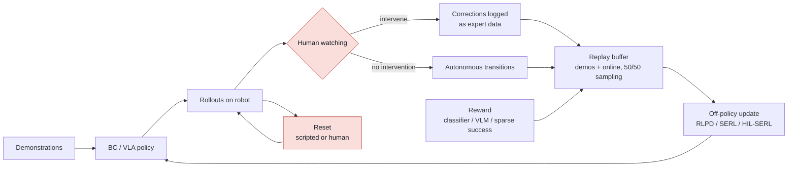

# Real-world reinforcement learning

## What it is

Real-world RL means improving a robot policy from experience gathered on the
physical robot, with a reward signal, rather than only from human
demonstrations. In 2024-2026 the practical form is almost never "RL from
scratch": it is (a) off-policy RL seeded with a few demonstrations and human
corrections (SERL / HIL-SERL, RLPD), (b) offline RL on logged data (IQL, CQL,
Cal-QL), or (c) RL fine-tuning of an imitation-learned or VLA policy
(DPPO, ReinFlow, DSRL, ConRFT, RECAP, LWD).

## Why it matters in the field

- Imitation learning plateaus. Compounding errors and coverage gaps cap BC
  policies well below the 99%+ reliability customers need; RL is the tool that
  optimises the actual success metric on the actual robot.
- The numbers are now practical. HIL-SERL reports near-perfect success on
  dynamic, precision-assembly and dual-arm tasks after 1 to 2.5 hours of
  real-robot training, with 2x the success rate and 1.8x faster execution than
  imitation baselines ([Luo et al. 2024](https://arxiv.org/abs/2410.21845)).
  SERL trained PCB assembly, cable routing and object relocation in 25-50
  minutes per policy ([Luo et al. 2024](https://arxiv.org/abs/2401.16013)).
- Foundation-policy vendors have adopted it. Physical Intelligence's π*0.6 uses
  RECAP (RL with Experience and Corrections via Advantage-conditioned
  Policies) and reports more than 2x throughput and roughly half the failure
  rate on its hardest tasks, running espresso, laundry and box assembly for
  hours ([Physical Intelligence 2025](https://arxiv.org/abs/2511.14759)).
  Learning While Deploying reports a single generalist VLA reaching 95%
  average success across eight tasks on a fleet of 16 dual-arm robots
  ([Wang et al. 2026](https://arxiv.org/abs/2605.00416)).
- Why it is hard, in three words: samples, resets, safety.
  - *Sample efficiency*: a real robot yields maybe 1-3k transitions per hour;
    every algorithmic trick (high update-to-data ratio, demonstrations in the
    buffer, pretrained encoders) exists to make that enough.
  - *Resets*: episodic RL assumes the scene returns to a start state; on
    hardware that is a human, a second policy, or clever task design.
  - *Safety*: exploration means unusual actions near hardware, fixtures and
    people; constraints, impedance limits and interventions are the answer.

## Key methods

| Method | Type | Core idea | Evidence on real robots | Source |
|---|---|---|---|---|
| RLPD | Online off-policy with offline data | SAC with symmetric 50/50 sampling of offline and online data, layer-norm critics, critic ensembles, high UTD; no pretraining phase | Primarily sim benchmarks; the engine inside SERL/HIL-SERL | [Ball et al. 2023](https://arxiv.org/abs/2302.02948) |
| SERL | Software suite | RLPD + demos, learned reward classifier, forward/backward reset policies, compliant impedance controller for Franka, image encoders | 25-50 min per task; PCB insertion, cable routing, relocation; near-perfect success | [Luo et al. 2024](https://arxiv.org/abs/2401.16013), [code](https://github.com/rail-berkeley/serl) |
| HIL-SERL | Human-in-the-loop RL | SERL plus teleop interventions during rollouts; intervention actions go into the buffer as demonstrations | 1-2.5 h; near-perfect success; 2x success and 1.8x speed vs IL; published in Science Robotics | [Luo et al. 2024](https://arxiv.org/abs/2410.21845), [LeRobot port](https://huggingface.co/docs/lerobot/hilserl) |
| CQL | Offline RL | Conservative Q-values that lower-bound the policy value; penalises OOD actions | 2-5x return vs prior offline RL in the paper (sim); basis of PTR on WidowX | [Kumar et al. 2020](https://arxiv.org/abs/2006.04779) |
| IQL | Offline RL | Expectile regression on in-dataset actions; never queries Q at unseen actions; advantage-weighted extraction | Widely used as the stable default; TriFinger real-robot benchmark includes it | [Kostrikov et al. 2021](https://arxiv.org/abs/2110.06169) |
| Cal-QL | Offline-to-online | Calibrates conservative Q-values so online fine-tuning does not dip | Sim plus real fine-tuning demos in the paper (details unverified) | [Nakamoto et al. 2023](https://arxiv.org/abs/2303.05479) |
| PTR | Offline RL pretraining | CQL pretraining on Bridge data; new task from 10-15 demos | Real WidowX, new domain, 10 demos | [Kumar et al. 2022](https://arxiv.org/abs/2210.05178) |
| Q-Transformer | Offline RL at scale | Autoregressive per-dimension Q over discretised actions with a transformer | Large real-world multi-task suite; beats IL and prior offline RL in the paper | [Chebotar et al. 2023](https://arxiv.org/abs/2309.10150) |
| Real-robot offline RL benchmark | Benchmark | TriFinger datasets and remote evaluation | Highlights noise, delays, quantisation as the real gap | [Gürtler et al. 2023](https://arxiv.org/pdf/2307.15690) |
| DPPO | RL fine-tuning of diffusion policies | PPO through the denoising chain as a two-layer MDP; on-manifold exploration | Sim benchmarks plus zero-shot sim-to-real deployment of fine-tuned policies | [Ren et al. 2024](https://arxiv.org/abs/2409.00588) |
| ReinFlow | RL fine-tuning of flow policies | Inject learnable noise into the flow path to get exact likelihoods at 1-4 denoising steps | Sim (locomotion, manipulation); supports π0, π0.5, GR00T N1.5 per repo; saves 82.6% wall time vs DPPO in the paper | [Zhang et al. 2025](https://arxiv.org/abs/2505.22094), [code](https://github.com/ReinFlow/ReinFlow) |
| DSRL | Latent-noise steering | Freeze the diffusion/flow policy; run SAC over its input noise; black-box access suffices | Real-world improvement of π0 with a small SAC head (~500K params per repo) | [Wagenmaker et al. 2025](https://arxiv.org/abs/2506.15799), [code](https://github.com/nakamotoo/dsrl_pi0) |
| ConRFT | Offline+online fine-tuning of VLA | Consistency-policy objective unifying BC and Q-learning; online stage uses HIL interventions (built on HIL-SERL, fine-tunes Octo) | 8 real tasks, 96.3% average success after 45-90 min online; +144% success vs supervised fine-tuning | [Chen et al. 2025](https://arxiv.org/abs/2502.05450) |
| RLDG | RL as data generator | Train specialist RL policies (HIL-SERL), distil their rollouts into OpenVLA/Octo | Up to 40% higher success than fine-tuning on human demos on insertion/assembly | [Xu et al. 2024](https://arxiv.org/abs/2412.09858) |
| RECAP (π*0.6) | Advantage-conditioned offline RL for VLA | Value function on demos + autonomous rollouts + expert corrections; condition the policy on advantage, no on-policy PG | >2x throughput, ~half the failures on hardest tasks; hours-long autonomous runs | [Physical Intelligence 2025](https://arxiv.org/abs/2511.14759) |
| LWD | Fleet-scale offline-to-online for VLA | Distributional implicit value learning + Q-learning via adjoint matching for flow policies | 16 dual-arm robots, 8 tasks, 95% average success | [Wang et al. 2026](https://arxiv.org/abs/2605.00416) |
| Sim-to-online design study | Empirical | 100 real training runs, 3 platforms; some common defaults harmful | Practitioner recommendations (specific findings not extracted, see full paper) | [As et al. 2026](https://arxiv.org/abs/2602.20220) |

### Reward specification

- **Sparse success from a classifier.** SERL trains a binary success classifier
  on a few hundred positive/negative images and uses it as the reward
  ([Luo et al. 2024](https://arxiv.org/abs/2401.16013)). Cheap, task-specific,
  and prone to false positives that the policy will exploit; HIL-SERL mitigates
  this with human-labelled negatives during training.
- **Sparse success from a human button.** Most robust; costs operator attention.
- **VLM preference rewards.** RL-VLM-F queries a VLM for preferences over image
  pairs given a text goal and fits a reward model; shown on rigid, articulated
  and deformable manipulation in sim ([Wang et al. 2024](https://arxiv.org/abs/2402.03681)).
- **VLM value estimates.** GVL asks a long-context VLM to order shuffled frames
  by task progress, giving zero-shot values over 300+ real tasks
  ([Ma et al. 2024](https://arxiv.org/abs/2411.04549)). Useful for dense
  shaping and for filtering data; not yet the reward of record for a
  deployment.
- **Task-level outcomes for VLA fine-tuning.** RECAP and LWD use sparse episode
  success plus interventions, with a learned value function doing the credit
  assignment ([π*0.6](https://arxiv.org/abs/2511.14759), [LWD](https://arxiv.org/abs/2605.00416)).

### Autonomous resets

- Forward/backward policies: train a second policy whose reward is "return to
  the start distribution" (SERL includes this pattern; the idea goes back to
  reset-free RL work such as [Gupta et al. 2021](https://arxiv.org/abs/2104.11203)).
- Multi-task sequencing: choose tasks whose end states are other tasks' start
  states, so the robot always has something useful to do
  ([Gupta et al. 2021](https://arxiv.org/abs/2104.11203)).
- Benchmark and formalism for non-episodic learning: EARL
  ([Sharma et al. 2021](https://arxiv.org/abs/2112.09605)); standard SAC fails
  in that setting.
- Mechanical resets: bowls, ramps, tethers, and fixtures that funnel objects
  back (the TriFinger arena is the canonical example,
  [Gürtler et al. 2023](https://arxiv.org/pdf/2307.15690)).

### Safety during exploration

- Compliant low-level control: run the RL action through an impedance or
  admittance controller with force and workspace limits; SERL ships one for the
  Franka ([Luo et al. 2024](https://arxiv.org/abs/2401.16013)).
- Human interventions as the safety layer: HIL-SERL lets the operator take
  over at any time; the takeover is both a safety stop and a training signal
  ([Luo et al. 2024](https://arxiv.org/abs/2410.21845)).
- Learned recovery: Recovery RL trains a separate recovery policy from offline
  constraint-violation data and hands control to it when a violation is
  likely; evaluated on an image-based physical obstacle-avoidance task
  ([Thananjeyan et al. 2021](https://arxiv.org/abs/2010.15920)).
- Constraint-aware exploration: model-based methods such as ActSafe plan
  optimistically for reward and pessimistically for constraints
  ([As et al. 2024](https://arxiv.org/abs/2410.09486)); ATACOM-style
  projection removes the action component that moves toward a constraint
  boundary ([Liu et al. 2022](https://arxiv.org/pdf/2209.13308)).
- Non-learned guards always stay on: joint/velocity/torque limits in firmware,
  a workspace box, an e-stop in the operator's hand, and a watchdog on the
  policy process.

### Diagram: human-in-the-loop RL on top of a BC policy

Red nodes are where safety and throughput are decided: intervention policy
and reset design usually matter more than the RL algorithm.

## Practical recipe: improving a BC policy with real-world RL

Assumes a working teleop setup, a BC or VLA policy with 40-80% success, and a
task with a checkable success condition. Order matters.

1. **Write the evaluation protocol first** (CLAUDE.md rule). Fixed N (at least
   20, preferably 50) trials, fixed initial-state distribution, success
   criterion, and cycle time. Run it on the BC policy and record the number.
2. **Make the low-level controller compliant and bounded.** Cartesian impedance
   or admittance with force caps and a workspace box. Verify a deliberate
   collision is harmless before any RL.
3. **Choose the reward.** Default: binary success classifier on wrist and
   scene images trained from 200-500 labelled frames, plus operator-labelled
   negatives (SERL recipe). If the success is checkable by a sensor (force
   spike, switch, pose), use the sensor instead.
4. **Solve resets.** Pick one: fixture that funnels the object back, a scripted
   reset motion, a backward policy, or accept human resets for the first hours.
5. **Seed the buffer.** 20-50 demonstrations from the BC dataset or fresh
   teleop. With RLPD-style symmetric sampling these are half of every batch
   ([Ball et al. 2023](https://arxiv.org/abs/2302.02948)).
6. **Pick the algorithm by policy class.**
   - Small task-specific policy: HIL-SERL as-is (Franka reference stack, or the
     [LeRobot port](https://huggingface.co/docs/lerobot/hilserl)). Expect 1-3
     hours of robot time.
   - Diffusion or flow BC policy you can retrain: ReinFlow / DPPO if you have a
     sim of the task; otherwise DSRL over the latent noise, which needs only
     black-box rollouts ([Wagenmaker et al. 2025](https://arxiv.org/abs/2506.15799)).
   - Frozen or expensive VLA (π0 class): DSRL for a quick win; ConRFT-style
     offline+online fine-tuning if you can update weights; RECAP-style
     advantage-conditioned fine-tuning if you can log at scale.
7. **Run with a human in the loop for the first hour.** Intervene on impending
   damage and on stalls; every intervention is training data. Taper
   interventions as the success rate climbs.
8. **Watch for reward hacking.** Review the classifier's positives every 15-20
   minutes of training; relabel and retrain the classifier when the policy
   finds a false positive.
9. **Re-run the evaluation protocol** with the same N. Report BC vs RL success
   with N, cycle time, and intervention count. Save the checkpoint under the
   naming rule; never overwrite.
10. **Optionally distil back.** If a generalist policy is the deployment
    target, roll out the RL specialist and fine-tune the generalist on its data
    (RLDG, [Xu et al. 2024](https://arxiv.org/abs/2412.09858)).

## Practical gotchas (from the field and the literature)

- **Real data is delayed, noisy and quantised.** Sensor delays, differing
  sampling rates and action quantisation are the concrete differences from sim
  that the TriFinger benchmark documents ([Gürtler et al. 2023](https://arxiv.org/pdf/2307.15690)).
  Timestamp everything and align before training.
- **Implementation details dominate.** SERL's authors note practitioners agree
  that implementation choices often matter more than the algorithm
  ([Luo et al. 2024](https://arxiv.org/abs/2401.16013)); As et al. found some
  widely used defaults harmful across 100 real runs
  ([As et al. 2026](https://arxiv.org/abs/2602.20220)). Start from a
  reference stack, change one thing at a time.
- **Classifier rewards get hacked.** Occluding the camera, hovering near the
  goal, or knocking the object into a lucky pose are all real failure modes
  (from field, unverified). Always keep a human-verified success count.
- **Offline RL on a small dataset can underperform BC.** Conservative methods
  need coverage; with 50 demos and no failures, IQL/CQL often just recover the
  BC policy. Their value is on mixed-quality data with failures.
- **Naive online fine-tuning of an offline-RL policy dips first.** This is the
  problem Cal-QL is designed to fix ([Nakamoto et al. 2023](https://arxiv.org/abs/2303.05479)).
  Budget for the dip or use RLPD-style fresh critics.
- **Diffusion/flow policies are not Gaussian.** Off-the-shelf SAC/PPO cannot
  compute their likelihoods; use DPPO, ReinFlow, or steer the noise (DSRL).
- **Hardware and fixtures wear.** Connectors fail after thousands of
  insertions and fixtures loosen; track cycle counts and diff a reference
  image at each reset. Log who intervened and why, since intervention timing
  biases the data.

## What a forward-deployed engineer must be able to do

- Bring up a compliant Cartesian impedance controller on the customer arm with
  force and workspace limits and demonstrate a safe collision.
- Stand up HIL-SERL (or the LeRobot port) end to end on a new task in one day:
  reward classifier, resets, demos, intervention device, training loop.
- Design a success criterion that a sensor or classifier can check, and a
  labelling procedure for false positives.
- Choose between offline RL, online RL with demos, and RL fine-tuning of a
  VLA based on data available, policy class, and robot-hours budget, and
  justify the choice in the experiment record.
- Run DSRL against a frozen π0-class policy and report the delta with N trials.
- Write the safety case: what stops the robot, who holds the e-stop, what the
  workspace limits are, and what happens on a policy-process crash.
- Explain to the customer why 2 hours of RL on their cell can lift a demo from
  70% to near 100% on one task, and why that does not generalise for free.

## Open questions to learn hands-on

- How many demonstrations and how many hours of RL does *our* typical insertion
  task need before HIL-SERL beats the best BC checkpoint at N=50?
- Does DSRL on a frozen π0 beat retraining a small diffusion policy with
  HIL-SERL for the same robot-hours?
- What intervention policy (when to take over) produces the best final policy
  for the fewest operator-minutes?
- Can a GVL-style VLM value replace the hand-trained success classifier for
  our tasks without being hacked?
- Which of the "harmful defaults" from As et al. 2026 apply to our stack
  (read the full paper and test)?
- Does an RL specialist distilled into a VLA (RLDG) keep its gain when the
  scene changes, or does it regress to the VLA's prior?

## Related entries

- [sim-to-real](sim-to-real.md): pretraining and evaluation in sim before real RL
- [imitation-learning](imitation-learning.md): the starting policy
- [vision-language-action-models](vision-language-action-models.md): RL fine-tuning targets
- [policy-evaluation](policy-evaluation.md): the protocol that must exist first
- [teleoperation-and-data-collection](teleoperation-and-data-collection.md): demos and interventions
- [tools/lerobot](../tools/lerobot.md): HIL-SERL port
- [sops/experiment-protocol](../../sops/experiment-protocol.md), [sops/field-deployment-checklist](../../sops/field-deployment-checklist.md)

## Sources

- RLPD: Ball et al. 2023, https://arxiv.org/abs/2302.02948
- SERL: Luo et al. 2024, https://arxiv.org/abs/2401.16013 ; code https://github.com/rail-berkeley/serl
- HIL-SERL: Luo et al. 2024, https://arxiv.org/abs/2410.21845 ; Science Robotics https://www.science.org/doi/10.1126/scirobotics.ads5033 ; LeRobot port https://huggingface.co/docs/lerobot/hilserl
- Offline RL: CQL https://arxiv.org/abs/2006.04779 ; IQL https://arxiv.org/abs/2110.06169 ; Cal-QL https://arxiv.org/abs/2303.05479 ; PTR https://arxiv.org/abs/2210.05178 ; Q-Transformer https://arxiv.org/abs/2309.10150 ; TriFinger benchmark https://arxiv.org/pdf/2307.15690
- RL fine-tuning of generative policies: DPPO https://arxiv.org/abs/2409.00588 ; ReinFlow https://arxiv.org/abs/2505.22094 ; DSRL https://arxiv.org/abs/2506.15799 ; ConRFT https://arxiv.org/abs/2502.05450 ; RLDG https://arxiv.org/abs/2412.09858
- VLA-scale RL: pi*0.6 / RECAP https://arxiv.org/abs/2511.14759 ; Learning While Deploying https://arxiv.org/abs/2605.00416 ; As et al. 2026 design study https://arxiv.org/abs/2602.20220
- Rewards: RL-VLM-F https://arxiv.org/abs/2402.03681 ; GVL https://arxiv.org/abs/2411.04549
- Resets: Gupta et al. 2021 https://arxiv.org/abs/2104.11203 ; EARL https://arxiv.org/abs/2112.09605
- Safety: Recovery RL https://arxiv.org/abs/2010.15920 ; ActSafe https://arxiv.org/abs/2410.09486 ; ATACOM https://arxiv.org/pdf/2209.13308
