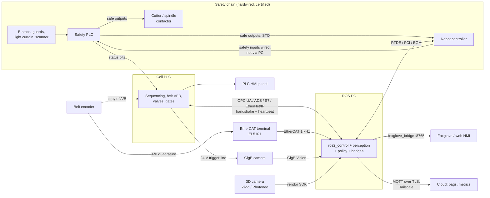

# ROS 2 field integrations: the plant wiring diagram

Companion notes: [ros2-in-depth](ros2-in-depth.md) (DDS, QoS, executors, rosbag2 flags, multi-machine networking), [connecting-to-real-robots](connecting-to-real-robots.md) (`ros2_control`, arm drivers, real-time kernel, the day-one bring-up), [sensors-and-actuators](sensors-and-actuators.md) (fieldbus basics, encoders, PLC/PC split, PTP). This note is what sits around those: how the ROS PC is wired to the PLC, the safety chain, the cameras, the belt, the operator and the cloud, and how it comes up from power-on without anyone typing.

## What it is

A robot cell in a plant is five computers that do not share a language. The safety PLC decides whether power may flow. The cell PLC sequences the line (belt, gates, air, the cutter's spindle). The robot controller runs the servo loop. The ROS PC runs perception and the policy. The HMI shows the operator what is happening. Integration is the set of links between them, the contract each link carries, and the boot order that makes the whole thing come up after a power cut at 04:00 with nobody watching.



The rule the diagram encodes: nothing that can hurt anyone passes through the ROS PC. Safety outputs go from the safety PLC to the robot controller and the cutter contactor by wire. The ROS PC only reads status.

## Why it matters in the field

The policy is the least of the integration work. A pick cell that runs in the lab still needs, on site, a PLC tag map agreed with the integrator, a camera that triggers off the belt and not off a timer, a safety input the policy node cannot ignore, and a boot sequence that survives a power cut. Each of these is a day if prepared and a week if discovered. The customer's integrator knows PLCs and knows nothing about DDS; the tag map and the heartbeat are the shared vocabulary. When the cell stops at 02:00 the maintenance tech looks at the PLC HMI, not at a terminal, so the ROS side has to report state into PLC tags the HMI already shows.

## PLC bridges

Status of the libraries and ROS 2 packages, checked 2026-09-06 against the linked repos.

| Link | Library | ROS 2 package | Status | Rate and latency to expect |
|---|---|---|---|---|
| OPC UA (IEC 62541) | [open62541](https://github.com/open62541/open62541): C, MPLv2, client and server, PubSub; an example server on 1.4 passed the "Standard Server 2017 Profile" certification. [asyncua](https://github.com/FreeOpcUa/opcua-asyncio): PyPI `asyncua`, Python >= 3.10, LGPL-3.0, client, server, subscriptions, "synchronous wrapper over the async API" | None maintained. [Mariunil/ros2-opcua](https://github.com/Mariunil/ros2-opcua) is a 2019 open62541 PubSub experiment; [sequenceplanner/opcua_ros2_bridge](https://github.com/sequenceplanner/opcua_ros2_bridge) is 7 commits of Rust from 2023 that maps node ids like `ns=4;i=45` to a topic pair | Write your own node on `asyncua` | Subscription publishing interval is set on the server, often 100 ms by default ([sensors-and-actuators](sensors-and-actuators.md)); 10 to 100 ms end to end (from field, unverified) |
| Modbus TCP | [pymodbus](https://github.com/pymodbus-dev/pymodbus) 3.15.0: Python >= 3.10, BSD, sync and async clients, `tcp`, `rtu`, `tls`, `udp`; "2.5.4 -> 3.0.0: Major changes in the application might be needed" | [openvmp/modbus](https://github.com/openvmp/modbus) (C++): "The only supported object type is 'Holding register'", writes "not yet", and its `modbus_tcp` README reads "Not yet". [Capacites/ros2_modbus](https://github.com/Capacites/ros2_modbus) last pushed 2022. [OnRobot_ROS2_Driver](https://github.com/tonydle/OnRobot_ROS2_Driver) is a readable Modbus TCP node to copy from | Write your own node on `pymodbus` | Polling; 10 to 50 ms per cycle (from field, unverified). Registers are 16-bit, so a 32-bit encoder count tears unless the PLC latches it |
| Siemens S7 | [python-snap7](https://github.com/gijzelaerr/python-snap7): 3.x is "a ground-up rewrite" in pure Python, Python 3.10+, `client.db_read(1, 0, 4)`; S7-300/400 over classic S7; the unreleased 4.0 adds S7CommPlus for "S7-1200 and S7-1500 PLCs that have PUT/GET disabled" | None | Own node | 1 to 10 ms per read (from field, unverified). On 1200/1500 with 3.x the integrator must enable PUT/GET and turn off optimized block access on the shared DB (unverified against Siemens docs) |
| Beckhoff ADS | [pyads](https://github.com/stlehmann/pyads): MIT, wraps `TcAdsDll.dll` or `AdsLib.so`, TwinCAT 2 and 3, `add_route`, `read_by_name`, device notifications with callbacks | None | Own node; notifications instead of polling | 1 to 10 ms (from field, unverified) |
| Rockwell EtherNet/IP | [pycomm3](https://github.com/ottowayi/pycomm3): `LogixDriver` for ControlLogix, CompactLogix, Micro800; `CIPDriver` for any EtherNet/IP device; Python "3.6.1 up to 3.10"; README: "`pycomm3` is no longer actively developed" | None | Own node, pinned Python 3.10; plan a replacement | Explicit messaging, tens of ms (from field, unverified) |
| EtherCAT I/O terminals | [ethercat_driver_ros2](https://github.com/ICube-Robotics/ethercat_driver_ros2) `ethercat_generic_plugins/GenericEcSlave`; the [examples repo](https://github.com/ICube-Robotics/ethercat_driver_ros2_examples) ships YAML for Beckhoff EL1008, EL2008, EL3104, EL5101 and others | This is the ROS 2 package | Use it for anything that must be sampled with the joints | 1 kHz cyclic, one stamp with the arm |

Which to use when. If the PLC is Siemens, Beckhoff or B&R and the integrator offers OPC UA, take it: the tag names are self-describing, the IT department already allows the port, and subscriptions push changes. Use the vendor protocol (ADS, S7, EtherNet/IP) only when a measured OPC UA round trip is too slow for the handshake, which for a pick-and-place sequence it rarely is. Use Modbus TCP when the PLC is small or the device is a drive or a checkweigher; it is the lowest common denominator and every vendor speaks it. Use an EtherCAT terminal for anything that needs a timestamp aligned with the joint states: the belt encoder, a strobe output, a part-present sensor on the pick line. One master owns an EtherCAT segment, so the ROS PC's terminals sit on their own segment, not the PLC's ([sensors-and-actuators](sensors-and-actuators.md)).

The handshake pattern. The PLC owns safety and sequencing; ROS owns perception and motion. The contract is a small tag block in both directions plus a heartbeat each way:

| Direction | Tag | Meaning |
|---|---|---|
| PLC to ROS | `cell_state` (int) | 0 idle, 1 ready, 2 pick_requested, 3 fault, 4 maintenance |
| PLC to ROS | `safety_ok` (bool) | Mirror of the safety PLC output, informational only |
| PLC to ROS | `belt_speed_mm_s` (real), `job_id` (int) | Context for the pick |
| PLC to ROS | `plc_heartbeat` (int) | Increments every PLC scan or every 100 ms |
| ROS to PLC | `ros_state` (int) | 0 booting, 1 ready, 2 busy, 3 done, 4 fault |
| ROS to PLC | `ros_heartbeat` (int) | Increments at 10 Hz from the bridge node |
| ROS to PLC | `fault_code` (int), `last_pick_ms` (int) | For the HMI and the shift log |

The state machine on the ROS side lives in one node (a `smach`-free hand-written enum; no library needed): boot until drivers and cameras report healthy, then ready; on `cell_state == 2` run the perception and motion action, write `ros_state = 3` when the arm is clear, and go back to ready when the PLC returns to 1. The PLC treats a stale `ros_heartbeat` (no change for 500 ms) as `ros_state = 4` and holds the line. The ROS node treats a stale `plc_heartbeat` the same way and stops publishing commands, which the deadline QoS on the command topic turns into a controller-visible event ([ros2-in-depth](ros2-in-depth.md)). Both sides log the tag block on every transition. Agree the tag names, types and the "done" semantics (arm clear of the belt, not gripper closed) in writing with the integrator before day one; it is the item most often renegotiated on site (from field).

## Vision systems

| Camera | Protocol | ROS 2 driver | Notes |
|---|---|---|---|
| Basler | GigE Vision, USB3 Vision, pylon SDK | [pylon-ros-camera](https://github.com/basler/pylon-ros-camera): branches `humble`, `jazzy`, `kilted`; packages `pylon_ros2_camera_component`, `pylon_ros2_camera_wrapper`, `pylon_ros2_camera_interfaces`; needs "pylon Camera Software Suite version 7.5.0 or newer" | "This project is offered with no technical support by Basler AG" |
| FLIR (Blackfly S, Grasshopper) | Spinnaker SDK | [flir_camera_driver](https://github.com/ros-drivers/flir_camera_driver) `humble-devel`: `spinnaker_camera_driver` and `spinnaker_synchronized_camera_driver`, where "Images triggered by the same external pulse will have identical ROS header time stamps"; CI on Humble, Jazzy, Kilted, Rolling | Use the synchronized driver for a multi-camera rig on one trigger line |
| Zivid 2, 2+ | Zivid SDK over GigE | [zivid-ros](https://github.com/zivid/zivid-ros): `main` is ROS 2, package `zivid_camera`, "Zivid SDK versions 2.15 to 2.18 are supported"; services `capture`, `capture_2d`, `capture_assistant/suggest_settings`; topics `points/xyz`, `points/xyzrgba`; settings as `settings_yaml` or `settings_file_path` | Service-triggered, not free-running; 100 to 500 ms per HDR capture ([meat-cutting-automation](meat-cutting-automation.md)) |
| Photoneo PhoXi, MotionCam-3D | PhoXi Control API | Official [phoxi_camera](https://github.com/photoneo/phoxi_camera) is ROS 1 ("we are using Kinetic"), PhoXi Control 1.2+. ROS 2 only from the community: [zyadan/phoxi_camera_ros2](https://github.com/zyadan/phoxi_camera_ros2), 6 stars, last push 2023 | Whether Photoneo ships a ROS 2 driver inside a PhoXi Control release is unverified; ask the vendor before quoting |
| Cognex In-Sight, Keyence CV-X smart cameras | Vendor pages blocked this pass; commonly EtherNet/IP, PROFINET, Modbus TCP and a raw TCP "native mode" string output (unverified) | None. Treat them as PLC-side devices: results land in PLC tags or arrive as an ASCII line on a TCP socket; a 40-line node parses the line and publishes a custom message | Do not try to get the image out; get the result and the trigger count |
| Any GenICam camera | GigE Vision, USB3 Vision | [camera_aravis2](https://github.com/FraunhoferIOSB/camera_aravis2) (Fraunhofer IOSB, BSD-3): nodes `camera_driver_gv` and `camera_driver_uv`, `camera_finder`, `camera_xml_exporter`; GenICam features as parameters (`ExposureTime`, `Gain`, `PixelFormat`, `PtpEnable`); needs Aravis >= 0.8; CI on Humble, Iron, Jazzy | [Aravis](https://github.com/AravisProject/aravis) is LGPL-2.1-or-later and ships `arv-tool`, `arv-viewer`, `arv-camera-test` and a GStreamer source; the vendor-neutral path when the SDK license or the Jetson build is the problem |

GigE bandwidth and multicast. One Gbit/s link carries at most 125 MB/s before protocol overhead; a 1920x1200 8-bit mono stream at 30 fps is 69 MB/s, so two such cameras do not fit on one link and 5 MP color at 30 fps does not fit alone. Basler's network guidance: the switch "must be able to handle large packets (known as 'jumbo packets' or 'jumbo frames')", set the Linux MTU to 9000, set the NIC receive ring buffer to its maximum, and expect that behind a switch "the cameras must share the bandwidth available on this single path" ([Basler network configuration](https://docs.baslerweb.com/network-configuration-(gige-cameras))). One NIC per camera, or a 10 GigE NIC and switch, is the fix. GigE Vision multicast lets a second host (a QA station, the PLC-side smart camera controller) receive the same stream without a second camera; a "controller" application owns the camera and "monitor" applications join the multicast group (Basler multicast page not reachable this pass; mechanism unverified against it). Set an explicit inter-packet delay or device link throughput limit when several cameras share a link so they interleave instead of overrunning the switch buffers (parameter names `GevSCPD`, `DeviceLinkThroughputLimit`, unverified this pass).

Triggering and time. Free-running cameras are for demos. On a belt the trigger comes from the PLC (a 24 V output on a photo-eye event) or from the encoder (every N counts, for line-scan and profile sensors, see [computer-vision-fundamentals](computer-vision-fundamentals.md)). Camera opto-isolated inputs accept a range of voltages that varies by model; check the camera's I/O spec before wiring a PLC output straight in (unverified per model). For multi-camera rigs on GigE, Basler action commands "execute actions on multiple GigE cameras at roughly the same time by using a single broadcast protocol message", and scheduled action commands use PTP for "exactly the same time" ([action commands](https://docs.baslerweb.com/action-commands)). Enable PTP with `GevIEEE1588=true` (or `PtpEnable` on ace 2 and dart M); "The network device with the lowest Priority 1 setting is the master clock" ([Basler PTP](https://docs.baslerweb.com/precision-time-protocol)). The ROS PC runs `ptp4l` on the camera NIC and `phc2sys` to the system clock ([linuxptp](https://linuxptp.sourceforge.net/)); if the NIC lacks hardware timestamping, `ptp4l` needs `-S` or `time_stamping software` and the sync is worse by an amount this note has not measured.

## Conveyor integration

The belt is a joint. Declare it as a prismatic joint in the URDF `<ros2_control>` block with a `position` state interface and no command interface, sampled in the same `read()` as the arm so both share one stamp ([sensors-and-actuators](sensors-and-actuators.md)). With an EL5101 on `ethercat_driver_ros2` the counter arrives as a 32-bit `position` state interface and the terminal exposes a `reset` command interface ([beckhoff_el5101.yaml](https://github.com/ICube-Robotics/ethercat_driver_ros2_examples/blob/main/ethercat_slave_description/config/beckhoff/beckhoff_el5101.yaml)); when the counter comes over a PLC bridge instead, wrap the bridge as a `SystemInterface` so the value still enters through `read()`. A stub for the second case, Humble signatures from [system_interface.hpp](https://github.com/ros-controls/ros2_control/blob/humble/hardware_interface/include/hardware_interface/system_interface.hpp) (Jazzy and later add `on_export_state_interfaces` returning shared handles; the pure virtual `export_state_interfaces` shown here is what Humble compiles):

```cpp
// belt_encoder_system.hpp: the belt as a read-only prismatic joint.
class BeltEncoderSystem : public hardware_interface::SystemInterface {
 public:
  CallbackReturn on_init(const hardware_interface::HardwareInfo& info) override {
    if (SystemInterface::on_init(info) != CallbackReturn::SUCCESS) return CallbackReturn::ERROR;
    counts_per_m_ = std::stod(info_.hardware_parameters.at("counts_per_m"));
    return CallbackReturn::SUCCESS;
  }
  std::vector<hardware_interface::StateInterface> export_state_interfaces() override {
    std::vector<hardware_interface::StateInterface> s;
    s.emplace_back(info_.joints[0].name, hardware_interface::HW_IF_POSITION, &belt_pos_m_);
    s.emplace_back(info_.joints[0].name, hardware_interface::HW_IF_VELOCITY, &belt_vel_m_s_);
    return s;
  }
  std::vector<hardware_interface::CommandInterface> export_command_interfaces() override { return {}; }
  hardware_interface::return_type read(const rclcpp::Time&, const rclcpp::Duration& period) override {
    const int32_t raw = source_->latest_count();  // lock-free snapshot filled by the bridge thread
    const double pos = static_cast<double>(raw) / counts_per_m_;
    belt_vel_m_s_ = (pos - belt_pos_m_) / period.seconds();
    belt_pos_m_ = pos;
    return hardware_interface::return_type::OK;  // a stale source sets a flag; N misses return ERROR
  }
  hardware_interface::return_type write(const rclcpp::Time&, const rclcpp::Duration&) override {
    return hardware_interface::return_type::OK;
  }
 private:
  double counts_per_m_{1000.0}, belt_pos_m_{0.0}, belt_vel_m_s_{0.0};
  std::shared_ptr<CountSource> source_;  // EtherCAT PDO, ADS notification, or Modbus poller
};
```

`joint_state_broadcaster` then publishes the belt alongside the arm joints, and a 30-line TF node integrates `belt_joint` position into `belt_origin -> belt_moving`. A detection stamped at capture time in `belt_moving` is transformed to `base_link` at execution time with the six-argument `lookup_transform` (fixed frame `belt_origin`), which is the tf2 time-travel case in [ros2-in-depth](ros2-in-depth.md). The interpolation is exact if the encoder is sampled faster than the belt moves one tolerance width: at 300 mm/s and 1 kHz that is 0.3 mm per sample.

Moving target with MoveIt. MoveIt Servo's pose tracking exists on Humble ([pose_tracking.cpp](https://github.com/moveit/moveit2/blob/humble/moveit_ros/moveit_servo/src/pose_tracking.cpp); on `main` the equivalent is the `demo_pose.cpp` C++ interface) and is the right tool for "approach a point that keeps moving": republish the target pose in `base_link` from the belt frame at Servo's `publish_period` and let Servo apply joint limits and singularity scaling ([connecting-to-real-robots](connecting-to-real-robots.md)). Planning with `MoveGroup` to a moving target does not work: the plan is stale by the time it executes. Plan to a point ahead of the object in the belt frame, then hand the last 100 mm to Servo or to a JTC trajectory whose points are already advanced by the predicted encoder delta.

UR: URScript or ROS. UR's controller decodes an incremental encoder "at up to 40kHz" on digital inputs 8 to 11 and exposes `encoder_enable_pulse_decode(encoder_index, decoder_type, A, B)`, `track_conveyor_linear(direction, ticks_per_meter)`, `stop_conveyor_tracking()`, and `encoder_set_tick_count(encoder_index, count)` for a count fed from outside ([UR conveyor tracking guide](https://www.universal-robots.com/articles/ur/programming/new-conveyor-tracking-guide-cb3-38-and-e-series-52/)). URScript tracking runs on the controller at its servo rate with no network in the loop, which is why the meat-cutting note recommends vendor tracking wherever the arm offers it ([meat-cutting-automation](meat-cutting-automation.md)). The cost: the External Control program that `ur_robot_driver` needs owns motion while ROS commands, so a URScript tracking segment has to run as its own program section (ROS hands back control with `~/hand_back_control`, the program tracks and returns, the driver's `resend_robot_program` reconnects), and the arm is invisible to `ros2_control` during that section. Whether this handoff can be made fast enough for a cycle time under 2 s is unverified. Doing it in ROS keeps one control path and one log but puts the belt-to-arm latency of the whole chain (encoder read, TF, Servo, RTDE at 500 Hz) in the tracking error; measure it with a marker on the belt before choosing.

## Safety PLC handshake

The safety-rated stop stays in the safety PLC and the robot controller's safety inputs, wired, with the stop category chosen per input by the integrator ([connecting-to-real-robots](connecting-to-real-robots.md), [safety-for-learned-policies](safety-for-learned-policies.md)). ROS gets status. Two inputs carry it: the mirrored `safety_ok` tag over the PLC bridge, and the robot driver's own report. On UR that is `~/safety_mode [ur_dashboard_msgs/msg/SafetyMode]` with values such as `PROTECTIVE_STOP`, `ROBOT_EMERGENCY_STOP`, `NORMAL`, plus `~/robot_program_running [std_msgs/msg/Bool]` and `~/io_states [ur_msgs/msg/IOStates]` from `io_and_status_controller` ([ur_controllers](https://docs.universal-robots.com/Universal_Robots_ROS2_Documentation/doc/ur_robot_driver/ur_controllers/doc/index.html)). `ethercat_driver_ros2` also ships an FSoE example (EK1914 and EL1918 in a `safety_net` with a `safety_master`, [estop_ethercat_safety.yaml](https://github.com/ICube-Robotics/ethercat_driver_ros2/blob/main/ethercat_driver/examples/configurations/estop_ethercat_safety.yaml)); that is a way to read safety terminals from the PC, not a way to make the PC a safety controller.

How a protective stop propagates. On the controller side the arm stops on its own and, on UR, the External Control program halts, so the reverse interface drops and the controllers stay "active" while nothing moves ([connecting-to-real-robots](connecting-to-real-robots.md)). Inside `ros2_control` there are two designs. Letting `read()` return `ERROR` sends the hardware component to UNCONFIGURED through `on_error`, drops every controller's interfaces, and needs the spawners re-run; that is a reboot of the control stack for every guard opening, and a shift has dozens. The design that survives a shift keeps the hardware component ACTIVE, has the hardware interface hold its last position command while the stop bit is set, and has the cell state node deactivate the trajectory controller with `switch_controllers --strict` and reactivate it after the PLC returns to ready and the program is resent. The policy node subscribes to `/cell/state` (a latched `transient_local` topic from the state node) and to `safety_mode`, and on anything but ready it stops publishing, which the command topic's deadline QoS reports downstream; the watchdog in the reference node of [ros2-in-depth](ros2-in-depth.md) already does this for stale observations, so a stop is one more condition in `_tick`. The recovery is explicit and logged: PLC ready, program running, controllers active, then a fresh observation, then commands. Never auto-resume motion on the safety bit alone; the PLC's reset button is the operator's acknowledgement.

## Boot to running

```mermaid
sequenceDiagram
  participant PWR as Power
  participant SYS as systemd
  participant NET as Network + time
  participant DEV as udev
  participant DKR as Docker
  participant DRV as drivers + ros2_control
  participant BR as PLC bridge
  participant POL as policy
  participant PLC as Cell PLC
  PWR->>SYS: kernel up
  SYS->>NET: network-online, chrony or ptp4l + phc2sys
  SYS->>DEV: rules create /dev/cam_left, /dev/belt_serial
  SYS->>DKR: docker.service
  DKR->>DRV: robot-drivers (healthcheck: joint_states at rate)
  DRV-->>DKR: healthy
  DKR->>BR: plc-bridge (depends_on service_healthy)
  BR->>PLC: ros_state = booting, heartbeat starts
  DKR->>POL: policy (depends_on drivers + bridge)
  POL->>BR: /cell/state ready request
  BR->>PLC: ros_state = ready
  PLC-->>BR: cell_state = ready
  Note over DRV,POL: watchdog node checks hz on every driver topic; restart on miss
```

systemd. One unit per container stack or per launch file, not per node. `Restart=` decides when a dead process comes back, `RestartSec=` "Defaults to 100ms", and `StartLimitIntervalSec=` with `StartLimitBurst=` stop a crash loop from restarting forever ([systemd.service](https://www.freedesktop.org/software/systemd/man/latest/systemd.service.html), [systemd.unit](https://www.freedesktop.org/software/systemd/man/latest/systemd.unit.html)). `WatchdogSec=` makes systemd kill the service unless it "call[s] sd_notify(3) regularly with WATCHDOG=1"; the launch process does not do that, so a cyclic watchdog node (below) is the practical equivalent. `robot_upstart` has a `jazzy` branch and generates a unit from a launch file ([repo](https://github.com/clearpathrobotics/robot_upstart)), but its docs still read as ROS 1 and a hand-written unit is shorter to debug:

```ini
# /etc/systemd/system/cell.service
[Unit]
Description=Robot cell (drivers, bridge, policy) via compose
After=network-online.target docker.service chrony.service
Wants=network-online.target
Requires=docker.service
StartLimitIntervalSec=600
StartLimitBurst=5

[Service]
Type=oneshot
RemainAfterExit=yes
WorkingDirectory=/opt/cell
EnvironmentFile=/opt/cell/cell.env
ExecStart=/usr/bin/docker compose --env-file /opt/cell/cell.env up -d --remove-orphans
ExecStop=/usr/bin/docker compose down --timeout 20
TimeoutStopSec=40

[Install]
WantedBy=multi-user.target
```

`cell.env` holds `ROS_DOMAIN_ID`, `RMW_IMPLEMENTATION`, `ROBOT_IP`, `PLC_IP`, `CELL_ID`, and the image tags; it is the one file that differs between robots and it is versioned with the calibration (next section).

udev. Camera and serial device names change across reboots; a rule keyed on the serial number gives a stable symlink ([udev](https://www.freedesktop.org/software/systemd/man/latest/udev.html): `ATTRS{}` "Search the devpath upwards for a device with matching sysfs attribute values", `SYMLINK` "Every matching rule adds this value to the list of symlinks to be created"). Rules live in `/etc/udev/rules.d/`; reload with `sudo udevadm control --reload && sudo udevadm trigger`.

```
# /etc/udev/rules.d/80-cell-devices.rules
# Left wrist camera: UVC device keyed on its USB serial. Find it with `udevadm info -a -n /dev/video0`.
SUBSYSTEM=="video4linux", ATTRS{idVendor}=="0c45", ATTRS{serial}=="CAM-L-00123", ATTR{index}=="0", SYMLINK+="cam_left", MODE="0660", GROUP="video"
# Belt encoder counter on an FTDI RS-485 adapter; latency_timer set here so no one forgets.
SUBSYSTEM=="tty", ATTRS{idVendor}=="0403", ATTRS{serial}=="FT6ABC12", SYMLINK+="belt_serial", MODE="0660", GROUP="dialout", RUN+="/bin/sh -c 'echo 1 > /sys/bus/usb-serial/devices/%k/latency_timer'"
```

Docker Compose. Same file on Jetson and x86, with the GPU and the base image behind variables. `network_mode: host` "Gives the container raw access to the host's network interface", `ipc: host` is required with it for Fast DDS shared memory between containers ([ros2-in-depth](ros2-in-depth.md)), `devices` are `HOST_PATH:CONTAINER_PATH[:CGROUP_PERMISSIONS]`, `healthcheck` runs `test` every `interval` and marks unhealthy after `retries`, `restart: unless-stopped` "Restarts irrespective of exit code but stops when service is stopped or removed", and `depends_on` with `condition: service_healthy` waits for the dependency's healthcheck ([Compose services reference](https://docs.docker.com/reference/compose-file/services/)). The GPU enters through the NVIDIA runtime, with `NVIDIA_VISIBLE_DEVICES` controlling "which GPUs are accessible inside the container" ([NVIDIA container toolkit](https://docs.nvidia.com/datacenter/cloud-native/container-toolkit/latest/docker-specialized.html)); on Jetson the base image must match the JetPack release on the host ([compute](../hardware/compute.md)).

```yaml
services:
  drivers:
    image: ${REGISTRY}/cell-drivers:${DRIVERS_TAG}
    network_mode: host
    ipc: host
    cap_add: [SYS_NICE]
    ulimits: { rtprio: 99, memlock: -1 }
    devices:
      - /dev/cam_left:/dev/cam_left:rw
      - /dev/belt_serial:/dev/belt_serial:rw
    env_file: cell.env
    volumes:
      - /opt/cell/config/${CELL_ID}:/config:ro
      - /data/bags:/data/bags
    command: ros2 launch cell_bringup drivers.launch.py config_dir:=/config
    healthcheck:
      test: ["CMD", "bash", "-lc", "ros2 topic hz -w 20 /joint_states --once 2>&1 | grep -q 'average rate'"]
      interval: 10s
      timeout: 8s
      retries: 3
      start_period: 60s
    restart: unless-stopped
  policy:
    image: ${REGISTRY}/cell-policy:${POLICY_TAG}
    runtime: ${GPU_RUNTIME:-nvidia}
    environment: [NVIDIA_VISIBLE_DEVICES=all]
    network_mode: host
    ipc: host
    env_file: cell.env
    depends_on:
      drivers: { condition: service_healthy }
    restart: unless-stopped
```

The `ros2 topic hz --once` flag is not on Humble's CLI (checked locally, 2026-09-06); on Humble the healthcheck is a 20-line Python script that subscribes with `SENSOR_DATA` QoS and exits 0 after N messages inside a timeout. Health checks catch a dead process; the cyclic watchdog node catches a live process that stopped producing. It subscribes to every driver topic with the driver's QoS, publishes a `diagnostic_msgs/DiagnosticArray` at 1 Hz with per-topic rate and age, and calls a `restart` service or exits non-zero (letting `restart:` do the work) when a topic misses its rate for longer than the configured window. Time comes up before ROS: `chrony` for wall time, `ptp4l` and `phc2sys` on the camera and EtherCAT NICs, and every ordering above waits for `network-online.target` because DDS binds to the interface that exists at start.

## Config and calibration layout

One directory per robot, versioned in git, mounted read-only into the containers, referenced by `CELL_ID`:

```
config/
  cell-07/
    cell.env                 # ids, ips, image tags; the only file compose reads directly
    params/
      drivers.yaml           # ros2_control update_rate, controller list, camera params
      policy.yaml            # control_rate_hz, obs_timeout_s, checkpoint name
      bridge.yaml            # PLC ip, tag map, heartbeat period, stale thresholds
    calibration/
      cam_left.yaml          # intrinsics + hand-eye, with date, operator, method, reprojection error
      belt.yaml              # counts_per_m, belt_origin pose in base_link, measured date
      tool.yaml              # TCP offset, payload
    urdf/
      cell.urdf.xacro        # includes vendor arm xacro + belt joint + camera links + cell geometry
      overlays/
        limits.yaml          # tighter joint limits agreed with the integrator
    CHANGELOG.md             # what changed, when, who, why; the field note is linked
```

Rules. Calibration files carry the date, the operator, the method and the residual so a bad calibration can be found by grep. The URDF overlay never edits the vendor xacro; it includes it and adds the belt joint and cell geometry, so a vendor driver update is a tag bump. Every launch takes `config_dir` and nothing hardcodes `/opt/cell` inside a package (CLAUDE.md). A change to `config/cell-07/` is a commit with the field-note path in the body; the checkpoint name in `policy.yaml` follows the `<model>-<dataset>-<git-sha>-<step>.pt` rule. Fleet-level configuration management (which robot runs which tag) is in [fleet-operations](fleet-operations.md).

## Recording and observability

Recording policy. Humble's `ros2 bag record` offers topic selection (`--topics` list, `-e` regex, `-x` exclude on top), splitting (`-b` bytes, `-d` seconds), `--snapshot-mode` (nothing written until `/rosbag2_recorder/snapshot` is called), and `--max-cache-size`, and nothing for deleting old bags or capping total disk use (checked locally against `ros2 bag record --help`, 2026-09-06; MCAP flags in [ros2-in-depth](ros2-in-depth.md)). Rotation is therefore a timer unit that deletes the oldest split once `/data/bags` passes a quota, and the quota lives in `cell.env`. The policy has three tiers: always (joint states, commands, cell state, PLC tags, diagnostics, throttled 5 Hz images via `topic_tools throttle` ([topic_tools](https://github.com/ros-tooling/topic_tools))), on event (a second recorder in `--snapshot-mode` holding the last 30 s of full-rate images and point clouds, triggered by the state node on fault, intervention or clamp), and never (raw point clouds at rate, unless an experiment record asks for them). Upload is Foxlet, which "Monitors a local directory for recordings" and "Automatically imports recordings matching a specified glob pattern" ([Foxlet](https://docs.foxglove.dev/docs/agent)); the alternative is an [rclone](https://rclone.org/) timer to the customer's bucket. Disk fills are the most common self-inflicted outage ([fleet-operations](fleet-operations.md)); the diagnostics below include free space.

Observability. `foxglove_bridge` installs as `ros-$ROS_DISTRO-foxglove-bridge`, launches with `ros2 launch foxglove_bridge foxglove_bridge_launch.xml`, listens on 8765, and the ROS 2 source now lives in the `foxglove-sdk` repo for `humble`, `jazzy`, `kilted`, `rolling` ([Foxglove ROS 2 docs](https://docs.foxglove.dev/docs/connecting-to-data/frameworks/ros2), [foxglove-sdk/ros](https://github.com/foxglove/foxglove-sdk/tree/main/ros)). Set `topic_whitelist` to the throttled topics and keep `send_buffer_limit` at its 10 MB default (documented in the ROS 1 [README](https://github.com/foxglove/ros-foxglove-bridge); the ROS 2 default is unverified) so a slow WiFi laptop cannot back-pressure the graph. `rosbridge_server` (JSON over WebSocket, port 9090 in the shipped launch file, `humble` branch for Humble and `ros2` for Jazzy and later, [rosbridge_suite](https://github.com/RobotWebTools/rosbridge_suite)) stays for web UIs that use `roslibjs`; Foxglove itself says "we recommend always using the Foxglove Bridge". Diagnostics: `diagnostic_updater` on branch `ros2-humble` of [ros/diagnostics](https://github.com/ros/diagnostics) is installed here; `diagnostic_aggregator` (analyzers turn `/diagnostics` into `/diagnostics_agg`) is not and needs `ros-humble-diagnostic-aggregator`. Every driver wrapper and the bridge publish a `DiagnosticStatus` with level, rate, age and, for the bridge, the PLC heartbeat delta; the aggregator's tree (`cell/drivers/*`, `cell/plc`, `cell/disk`) is what the HMI and the watchdog read. Prometheus: no maintained ROS 2 exporter was found this pass (GitHub search 2026-09-06); a 60-line node with [prometheus_client](https://github.com/prometheus/client_python) that turns `/diagnostics_agg` and `/policy/metrics` into a `/metrics` endpoint is the working answer, scraped by the agent-mode setup in [fleet-operations](fleet-operations.md).

## HMI and remote

Operators use the PLC HMI panel. The ROS side writes `ros_state`, `fault_code`, `last_pick_ms` and a short fault text into PLC tags and the integrator adds one screen; that is the entire HMI integration and it is worth more than any web page because it is where the tech already looks. For engineers, a Foxglove layout per cell (camera with detections, belt position, cell state, diagnostics tree, a button panel calling `~/set_speed_slider` and the `snapshot` service) is versioned in `config/<cell>/foxglove_layout.json`. A dedicated web UI is a single static page on `roslibjs` over `rosbridge_server` with three controls (pause, resume, record event) and a status strip; anything larger is a product, not an integration.

Remote. Tailscale carries unicast only, so DDS discovery does not cross it without a discovery server or Zenoh router ([ros2-in-depth](ros2-in-depth.md), [tailscale#11972](https://github.com/tailscale/tailscale/issues/11972)); for the plant network a subnet router (`tailscale set --advertise-routes=...`, "IP forwarding is required to use a Linux device as a subnet router", [Tailscale subnets](https://tailscale.com/kb/1019/subnets)) reaches the PLC and cameras for support. MQTT is the cloud link that survives NAT: [mqtt_client](https://github.com/ika-rwth-aachen/mqtt_client) (RWTH ika, `humble` through `lyrical`) maps `ros2mqtt` and `mqtt2ros` topic pairs, sends primitives as strings or full serialized messages or JSON, supports TLS with CA and client certificates, runs as a component, and can inject a timestamp for latency measurement. Bridge only the throttled state and metrics topics; bags go through Foxlet or `rclone`, never through MQTT.

## Testing

`launch_testing` ([README](https://github.com/ros2/launch/blob/humble/launch_testing/README.md)): `generate_test_description` returns the launch plus a `ReadyToTest` action; test classes run "concurrently with the process under test", and classes "decorated with the `post_shutdown_test` descriptor will be run after the launched processes have been shut down" with `proc_info` and `assertExitCodes`; run with `launch_test file.py` or `add_launch_test()` in CMake. `launch_testing_ros` adds a node-aware fixture and is installed here. Three integration tests earn their place: the state machine against a fake PLC (an `asyncua` server in the test with the same tag map, driving `cell_state` and asserting `ros_state` transitions and heartbeat timeout), the bridge against a stale heartbeat (assert the command topic goes silent within the window), and the boot order (launch drivers with mock hardware, assert the policy waits for ready).

Hardware in the loop without hardware: `mock_components/GenericSystem` mirrors commands to states, with `calculate_dynamics` for "Euler-forward integration or finite differences", `disable_commands` to simulate a dead link, and `mock_sensor_commands` and `mock_gpio_commands` so a test node can set the belt encoder and the safety bit from outside ([mock_components](https://control.ros.org/humble/doc/ros2_control/hardware_interface/doc/mock_components_userdoc.html)). For UR the driver ships `start_ursim.sh`, which runs the vendor simulator in Docker so the real driver and the External Control handshake are under test ([ur_robot_driver](https://github.com/UniversalRobots/Universal_Robots_ROS2_Driver/blob/main/ur_robot_driver/scripts/start_ursim.sh)). Replaying a recorded fault into the perception and policy pipeline follows the recipe in [ros2-in-depth](ros2-in-depth.md): `ros2 bag play --clock`, every consumer on `use_sim_time`, QoS overrides so the replayed sensor topics reach reliable subscribers; the assertion is that the policy's commands match the recorded ones within tolerance, which catches a changed preprocessing step before it reaches the arm.

## Deployment checklist

Extends `sops/field-deployment-checklist.md` and the day-one procedure in [connecting-to-real-robots](connecting-to-real-robots.md).

1. Tag map signed off by the integrator: names, types, semantics of ready and done, heartbeat period, stale threshold. Fake-PLC test green against that map.
2. Safety walk: every stop shows up as `safety_ok` false on the bridge and as the driver's safety mode; the policy node stops publishing within one control period; recovery needs the PLC reset.
3. Network: one NIC per camera or a 10 GigE segment, MTU 9000 end to end, `ptp4l` locked (`pmc -u -b 0 'GET CURRENT_DATA_SET'` offset under 100 us, threshold from field, unverified), chrony offset logged.
4. Trigger: camera on the PLC or encoder line, frame count equals trigger count over 1000 triggers, stamp jitter measured.
5. Belt: `counts_per_m` measured with a tape over 5 m, direction sign checked, `belt_origin` pose calibrated and its residual in `belt.yaml`.
6. Boot: power-cycle the PC twice; the cell reaches ready without a keyboard; `journalctl -u cell` and `docker compose ps` clean; udev symlinks present.
7. Watchdog: unplug a camera, expect a diagnostics error within the window and a driver restart; unplug the PLC link, expect `ros_state` fault on the HMI within 500 ms.
8. Recording: quota timer tested by filling the disk; snapshot recorder produces a bag on a forced fault; Foxlet or `rclone` uploads it.
9. Remote: Tailscale reaches the PC and, through the subnet router, the PLC and cameras; Foxglove connects over it with the whitelist only.
10. Config: `config/<cell>/` committed with calibration dates and residuals; image tags in `cell.env` match the ones running (`docker compose images`).

## Practical gotchas

- A 32-bit encoder count read over Modbus as two 16-bit registers tears between polls unless the PLC copies it under a lock or exposes a change counter alongside ([sensors-and-actuators](sensors-and-actuators.md)).
- OPC UA subscriptions default to the server's publishing interval, often 100 ms; the handshake looks slow until the integrator lowers it ([sensors-and-actuators](sensors-and-actuators.md)).
- `pycomm3` is pinned to Python 3.10 and "no longer actively developed"; a Jazzy system Python (3.12) will not install it ([pycomm3](https://github.com/ottowayi/pycomm3)).
- Two GigE cameras behind one switch on a 1 Gbit uplink drop frames silently; the symptom is a frame rate that is fine with either camera alone ([Basler network configuration](https://docs.baslerweb.com/network-configuration-(gige-cameras))).
- `network_mode: host` without `ipc: host` gives two containers that discover each other and exchange nothing over Fast DDS shared memory ([ros2-in-depth](ros2-in-depth.md)).
- `Restart=always` with the default `RestartSec` of 100 ms and no start limit turns a missing camera into a log flood and a CPU at 100 percent; set `StartLimitBurst` ([systemd.service](https://www.freedesktop.org/software/systemd/man/latest/systemd.service.html)).
- A `read()` that returns `ERROR` on a protective stop unloads every controller; recovery is a spawner rerun, not a reset button ([connecting-to-real-robots](connecting-to-real-robots.md)).
- Humble's recorder has no disk quota; a cell recording images at rate fills a 1 TB disk in a shift, then the drivers die on a full `/var` (from field, unverified on the exact duration).
- A UVC camera that enumerates as `/dev/video0` on Monday is `/dev/video2` after a hub reset; the launch file that hardcoded it starts the wrong camera without an error.
- Photoneo's ROS 2 path is a community driver; check the PhoXi Control version pairing before the trip.

## What a forward-deployed engineer must be able to do

- Write the tag map and state machine with the integrator in one sitting and test it against a fake PLC before the flight.
- Stand up an OPC UA, Modbus TCP, ADS or S7 bridge node from the libraries above in an afternoon, with heartbeat, stale detection and diagnostics.
- Bring a GigE camera up on `camera_aravis2` or the vendor driver, trigger it from the PLC line, verify frame count equals trigger count, and put it on PTP.
- Expose a belt encoder as a `ros2_control` state interface, build the belt frame, and pick a moving object with Servo pose tracking or vendor tracking, having measured the tracking error.
- Explain to the safety engineer, in their vocabulary, what the ROS PC does and does not do during a protective stop, and demonstrate it.
- Make a cell boot to ready from power-on with systemd, udev and Compose, and prove it with two power cycles.
- Set the recording tiers, the quota and the upload, and show a fault snapshot arriving in Foxglove.
- Write the three `launch_testing` tests and run them in CI against mock hardware.

## Open questions

- Measured OPC UA round trip from a Siemens S7-1500 to an `asyncua` node at a 10 ms publishing interval, against ADS on a Beckhoff CX with notifications, on the same handshake.
- Whether a UR External Control program can hand off to a URScript tracking section and back inside a 2 s cycle without the driver losing the reverse interface.
- Servo pose tracking error on the UR at 300 mm/s belt speed through the EtherCAT encoder path, versus `track_conveyor_linear`.
- Software-timestamp PTP accuracy on a Jetson AGX Orin NIC against a Basler ace 2 grandmaster.
- The cheapest reliable event-snapshot recorder: `--snapshot-mode` buffer size versus RAM on a 32 GB Jetson with two cameras.

## Related entries

- [ros2-in-depth](ros2-in-depth.md), [connecting-to-real-robots](connecting-to-real-robots.md), [sensors-and-actuators](sensors-and-actuators.md)
- [deployment-engineering](deployment-engineering.md), [fleet-operations](fleet-operations.md), [safety-for-learned-policies](safety-for-learned-policies.md)
- [meat-cutting-automation](meat-cutting-automation.md) (vendor conveyor tracking numbers), [computer-vision-fundamentals](computer-vision-fundamentals.md) (encoder-triggered acquisition), [perception-3d-sensing](perception-3d-sensing.md)
- Tools: [ros2-humble](../tools/ros2-humble.md), [moveit2](../tools/moveit2.md); hardware: [compute](../hardware/compute.md), [depth-cameras](../hardware/depth-cameras.md)
- SOPs: `sops/field-deployment-checklist.md`, `sops/robot-bring-up.md`, `sops/incident-log-template.md`; template: `templates/site-survey.md`

## Sources

- PLC libraries: open62541 https://github.com/open62541/open62541 ; opcua-asyncio https://github.com/FreeOpcUa/opcua-asyncio ; pymodbus https://github.com/pymodbus-dev/pymodbus ; python-snap7 https://github.com/gijzelaerr/python-snap7 ; pyads https://github.com/stlehmann/pyads ; pycomm3 https://github.com/ottowayi/pycomm3
- ROS 2 bridge packages: ros2-opcua https://github.com/Mariunil/ros2-opcua ; opcua_ros2_bridge https://github.com/sequenceplanner/opcua_ros2_bridge ; openvmp modbus https://github.com/openvmp/modbus and modbus_tcp https://github.com/openvmp/modbus_tcp ; ros2_modbus https://github.com/Capacites/ros2_modbus ; OnRobot_ROS2_Driver https://github.com/tonydle/OnRobot_ROS2_Driver
- EtherCAT: ethercat_driver_ros2 https://github.com/ICube-Robotics/ethercat_driver_ros2 ; generic slave guide https://icube-robotics.github.io/ethercat_driver_ros2/user_guide/config_generic_slave.html ; examples (EL1008, EL2008, EL5101) https://github.com/ICube-Robotics/ethercat_driver_ros2_examples ; FSoE example https://github.com/ICube-Robotics/ethercat_driver_ros2/blob/main/ethercat_driver/examples/configurations/estop_ethercat_safety.yaml
- Cameras: pylon-ros-camera https://github.com/basler/pylon-ros-camera ; flir_camera_driver https://github.com/ros-drivers/flir_camera_driver ; zivid-ros https://github.com/zivid/zivid-ros ; phoxi_camera https://github.com/photoneo/phoxi_camera ; phoxi_camera_ros2 https://github.com/zyadan/phoxi_camera_ros2 ; camera_aravis2 https://github.com/FraunhoferIOSB/camera_aravis2 ; Aravis https://github.com/AravisProject/aravis ; Basler network configuration https://docs.baslerweb.com/network-configuration-(gige-cameras) ; action commands https://docs.baslerweb.com/action-commands ; PTP https://docs.baslerweb.com/precision-time-protocol ; linuxptp https://linuxptp.sourceforge.net/
- ros2_control and MoveIt: system_interface.hpp (Humble) https://github.com/ros-controls/ros2_control/blob/humble/hardware_interface/include/hardware_interface/system_interface.hpp ; writing a hardware component https://control.ros.org/humble/doc/ros2_control/hardware_interface/doc/writing_new_hardware_component.html ; mock_components https://control.ros.org/humble/doc/ros2_control/hardware_interface/doc/mock_components_userdoc.html ; gpio_command_controller https://control.ros.org/humble/doc/ros2_controllers/gpio_controllers/doc/userdoc.html ; Servo pose tracking https://github.com/moveit/moveit2/blob/humble/moveit_ros/moveit_servo/src/pose_tracking.cpp
- Universal Robots: conveyor tracking guide https://www.universal-robots.com/articles/ur/programming/new-conveyor-tracking-guide-cb3-38-and-e-series-52/ ; ur_controllers https://docs.universal-robots.com/Universal_Robots_ROS2_Documentation/doc/ur_robot_driver/ur_controllers/doc/index.html ; start_ursim.sh https://github.com/UniversalRobots/Universal_Robots_ROS2_Driver/blob/main/ur_robot_driver/scripts/start_ursim.sh
- Boot: systemd.service https://www.freedesktop.org/software/systemd/man/latest/systemd.service.html ; systemd.unit https://www.freedesktop.org/software/systemd/man/latest/systemd.unit.html ; udev https://www.freedesktop.org/software/systemd/man/latest/udev.html ; robot_upstart https://github.com/clearpathrobotics/robot_upstart ; Compose services https://docs.docker.com/reference/compose-file/services/ ; NVIDIA container toolkit https://docs.nvidia.com/datacenter/cloud-native/container-toolkit/latest/docker-specialized.html
- Recording and observability: topic_tools https://github.com/ros-tooling/topic_tools ; Foxlet https://docs.foxglove.dev/docs/agent ; Foxglove ROS 2 https://docs.foxglove.dev/docs/connecting-to-data/frameworks/ros2 ; foxglove-sdk ros https://github.com/foxglove/foxglove-sdk/tree/main/ros ; rosbridge_suite https://github.com/RobotWebTools/rosbridge_suite ; diagnostics https://github.com/ros/diagnostics
- Remote: mqtt_client https://github.com/ika-rwth-aachen/mqtt_client ; Tailscale subnets https://tailscale.com/kb/1019/subnets ; tailscale#11972 https://github.com/tailscale/tailscale/issues/11972
- Testing: launch_testing https://github.com/ros2/launch/blob/humble/launch_testing/README.md ; launch_testing_ros https://github.com/ros2/launch_ros/tree/humble/launch_testing_ros
