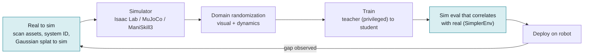

# Sim-to-real transfer

## What it is

Sim-to-real is the practice of training a policy (or a perception module) in a
physics simulator and deploying it on a physical robot, ideally with no or
little real-world fine-tuning ("zero-shot transfer"). The gap between simulator
and reality (the "reality gap") has three components that need separate
treatment:

- **Dynamics gap**: masses, friction, actuator response, latency, compliance,
  contact behaviour differ from the model.
- **Perception gap**: rendered images do not match real camera images
  (lighting, textures, sensor noise, lens effects).
- **Task/scene gap**: the sim scene does not contain the objects, clutter and
  variations the robot will meet.

The toolbox is: pick a simulator that matches the problem, make the sim
*accurate* where it cheaply can be (system identification, digital twins), make
the policy *robust* where it cannot (domain randomization, adaptation modules),
and *measure* transfer with a protocol that correlates with real results
(SimplerEnv-style paired evaluation).

## Why it matters in the field

- Real robot time is the scarcest resource on a deployment. A GPU simulator can
  produce years of experience per hour: Rudin et al. trained ANYmal flat-terrain
  walking in under four minutes and rough terrain in twenty minutes with
  thousands of parallel robots ([Rudin et al. 2022](https://arxiv.org/abs/2109.11978)).
- Legged locomotion is now a solved sim-to-real story: essentially every
  commercial quadruped and humanoid controller shipped since ~2020 is trained in
  sim with teacher-student distillation and domain randomization
  ([Lee et al. 2020, Science Robotics](https://pubmed.ncbi.nlm.nih.gov/33087482/),
  [Kumar et al. 2021, RMA](https://arxiv.org/abs/2107.04034)).
- Manipulation is not yet solved, but 2024-2025 showed that with real-to-sim
  tuning and careful reward/observation design, vision-based dexterous
  manipulation on humanoid hands can transfer zero-shot
  ([Lin et al. 2025](https://arxiv.org/abs/2502.20396)).
- Sim is also the cheapest *evaluation* tool. SimplerEnv showed that with
  visual matching, sim success rates rank real-world VLA checkpoints in a way
  that correlates with ~1500 paired real evaluations
  ([Li et al. 2024](https://arxiv.org/abs/2405.05941)).
- For a forward-deployed engineer the question is rarely "sim or real?" but
  "which parts of this customer's problem do I simulate, and how do I know the
  sim is telling me the truth?"

## Key methods

### Simulator comparison

| Simulator | Physics | Rendering | GPU parallelism | License | ROS 2 bridge |
|---|---|---|---|---|---|
| [Isaac Sim](https://github.com/isaac-sim/IsaacSim) / [Isaac Lab](https://github.com/isaac-sim/IsaacLab) | PhysX 5 (GPU rigid body, articulations, some deformables) | RTX ray-traced/path-traced, multi-sensor (RGB, depth, lidar) | Thousands of envs per GPU (Isaac Lab / legged_gym lineage) | Isaac Sim: Apache 2.0 (repo badge); Isaac Lab: BSD-3 ([license page](https://isaac-sim.github.io/IsaacLab/main/source/refs/license.html)). Omniverse runtime terms apply (unverified detail) | Yes, official [`isaacsim.ros2.bridge`](https://docs.isaacsim.omniverse.nvidia.com/5.0.0/py/source/extensions/isaacsim.ros2.bridge/docs/index.html), Humble supported |
| [MuJoCo](https://mujoco.readthedocs.io/) / [MJX](https://mujoco.readthedocs.io/en/stable/mjx.html) / [MJWarp](https://github.com/google-deepmind/mujoco_warp) | MuJoCo soft-contact rigid body; MJX is a JAX port, MJWarp is a Warp GPU port (>100x faster than MJX on complex scenes per the [MJWarp docs](https://mujoco.readthedocs.io/en/latest/mjwarp/)) | Basic OpenGL; Madrona batch renderer in MuJoCo Playground (unverified) | MJX/MJWarp: thousands of envs on one GPU | Apache 2.0 | Community: [`mujoco_ros2_control`](https://github.com/ros-controls/mujoco_ros2_control) (ros-controls org) |
| [Genesis](https://github.com/Genesis-Embodied-AI/Genesis) | Unified: rigid, MPM, SPH, FEM, PBD, IPC couplers | Rasterizer (pyrender), ray tracer (Luisa), in-house Nyx | GPU-native (Taichi); README claims 43M FPS for a single Franka on an RTX 4090 (vendor claim, not independently verified) | Apache 2.0 | None documented |
| [ManiSkill3](https://github.com/haosulab/ManiSkill) on [SAPIEN](https://github.com/haosulab/SAPIEN) | PhysX 5 GPU via SAPIEN 3 | SAPIEN Vulkan rasterizer + ray tracing; parallel RGBD+seg at 30k+ FPS on a 4090 ([Tao et al. 2024](https://arxiv.org/abs/2410.00425)) | Yes, GPU sim + GPU render | ManiSkill code Apache 2.0, assets CC BY-NC 4.0; SAPIEN license (unverified, believed MIT) | None documented |
| [Gazebo](https://gazebosim.org/) (Harmonic/Jetty) | DART default; ODE, Bullet pluggable | OGRE2 rasterizer | CPU only, one world per process | Apache 2.0 | Native: [`ros_gz`](https://github.com/gazebosim/ros_gz) bridge; the reference sim for ROS 2 |
| [Habitat](https://github.com/facebookresearch/habitat-sim) 2.0/3.0 | Bullet (rigid, articulated) | Fast rasterizer on scanned meshes (HM3D, ReplicaCAD), Gaussian-splat variants appearing ([Habitat-GS](https://arxiv.org/pdf/2604.12626)) | Very high FPS for navigation on CPU/GPU; not physics-parallel like Isaac | MIT | Community only (unverified) |

Rules of thumb: legged/humanoid RL -> Isaac Lab or MJX/MJWarp; contact-rich
manipulation with vision -> ManiSkill3 or Isaac Lab; ROS 2 integration
testing and customer demos -> Gazebo; indoor navigation -> Habitat; soft or
fluid interaction -> Genesis (young, APIs move fast).

### Techniques

| Method | What it does | Canonical source | When to use |
|---|---|---|---|
| Visual domain randomization | Randomize textures, lighting, camera pose, distractors so real images look like "one more variation" | [Tobin et al. 2017](https://arxiv.org/abs/1703.06907) | Any RGB policy; cheap first step |
| Dynamics randomization | Randomize mass, friction, damping, latency, motor gains during training | [Peng et al. 2018](https://arxiv.org/abs/1710.06537) | Whenever you cannot identify parameters exactly |
| Automatic domain randomization (ADR) | Grow randomization ranges as the policy meets a performance threshold | [OpenAI 2019](https://arxiv.org/abs/1910.07113) | Long training budgets; avoids hand-tuning ranges |
| System identification / actuator nets | Fit sim parameters or a learned actuator model to logged real data; simulate latency | [Tan et al. 2018](https://arxiv.org/abs/1804.10332), [Hwangbo et al. 2019](https://www.science.org/doi/10.1126/scirobotics.aau5872) | Series-elastic or geared actuators; anything with noticeable latency |
| Teacher-student (privileged) distillation | Train a teacher with privileged state (terrain, friction), distil to a student using only onboard history | [Lee et al. 2020](https://pubmed.ncbi.nlm.nih.gov/33087482/) | Locomotion; any partially observed task |
| Rapid Motor Adaptation (RMA) | Base policy conditioned on a latent "extrinsics" vector; an adaptation module regresses it from the last ~50 state-action steps | [Kumar et al. 2021](https://arxiv.org/abs/2107.04034) | Payload, terrain and wear changes at test time |
| Massively parallel RL + curriculum | Thousands of envs per GPU with a terrain curriculum | [Rudin et al. 2022](https://arxiv.org/abs/2109.11978) | Default recipe for legged robots |
| Sim-to-real dexterous manipulation | GPU sim + heavy randomization + robust pose estimation | [DeXtreme, Handa et al. 2023](https://arxiv.org/abs/2210.13702); [Lin et al. 2025](https://arxiv.org/abs/2502.20396) | In-hand and multi-finger tasks where real RL is unsafe |
| Real-to-sim digital twins | Scan the real scene, build an articulated sim copy, robustify a BC policy with RL in the twin | [RialTo, Torne et al. 2024](https://arxiv.org/abs/2403.03949) | Fixed workcell; need robustness to perturbations |
| Digital cousins | Retrieve similar, not identical, assets to get a distribution of scenes | [ACDC, Dai et al. 2024](https://arxiv.org/abs/2410.07408) | Homes, unstructured scenes where exact twins are brittle |
| Gaussian splatting renderers | Replace mesh rendering with splats of the real scene for photoreal RGB training data | [SplatSim, Qureshi et al. 2024](https://arxiv.org/abs/2409.10161) | RGB policies where visual gap dominates |
| Sim evaluation with visual matching | Match sim appearance to real, then use sim success to rank checkpoints | [SimplerEnv, Li et al. 2024](https://arxiv.org/abs/2405.05941) | Checkpoint selection, regression testing of VLA policies |

### Why manipulation is harder than locomotion

- Contact is the whole task, not a disturbance. Locomotion tolerates a few
  centimetres of foot-placement error; a peg insertion does not. Rigid-body
  contact models (penetration-based, soft constraints) diverge from reality at
  exactly the moments that matter.
- Deformables, cables, liquids and thin shells are poorly modelled or slow.
- The observation is usually RGB of a cluttered scene, so the perception gap is
  large; locomotion mostly uses proprioception, which transfers almost for free.
- Object-centric variation: the same task needs hundreds of assets with plausible
  mass and friction. Locomotion needs one robot model plus terrains.
- Rewards are harder to write. Lin et al. address this with contact-goal and
  object-goal rewards plus an automated real-to-sim tuning module
  ([Lin et al. 2025](https://arxiv.org/abs/2502.20396)). A 2025 survey of
  reality-gap practice is [arXiv 2510.20808](https://arxiv.org/pdf/2510.20808).

### Diagram: the sim-to-real loop

Locomotion closes this loop routinely. Manipulation usually breaks at
contact dynamics and perception, which is why the decision guide below
leans toward real data for contact-rich tasks.

## Decision guide: invest in sim or collect real data?

Answer these in order; stop at the first decisive answer.

1. **Is the policy proprioceptive with a rigid robot (locomotion, whole-body,
   reaching)?** Sim. Use Isaac Lab or MJX, actuator identification, DR,
   teacher-student. Real data only for validation.
2. **Is the failure mode dangerous or destructive (falls, high-speed contact,
   fragile parts)?** Sim first, even for manipulation; real fine-tuning later
   ([DeXtreme](https://arxiv.org/abs/2210.13702) is the pattern).
3. **Is it a fixed workcell with rigid objects and a repeatable scene?** Build a
   digital twin (scan + articulate), train or robustify in sim
   ([RialTo](https://arxiv.org/abs/2403.03949)), then a short real evaluation.
   Break-even is roughly: twin-building days vs. teleop days; a twin pays off
   when you will iterate on the policy more than a few times.
4. **Does the task hinge on deformables, liquids, transparent or reflective
   objects, or fine tactile cues?** Collect real data (imitation learning) and
   use sim only for perception pretraining or for evaluation. Do not promise
   zero-shot transfer.
5. **Do you need to evaluate many checkpoints of a VLA or BC policy?** Invest
   in a SimplerEnv-style visually matched sim of your scene. Even if you never
   train in it, it removes most real evaluation trials
   ([Li et al. 2024](https://arxiv.org/abs/2405.05941)).
6. **Is the customer scene unstructured (homes, varied retail)?** Digital
   cousins beat twins ([ACDC](https://arxiv.org/abs/2410.07408): 90% vs 25%
   zero-shot in the paper's setting) and complement, not replace, real
   demonstrations.
7. **Do you have less than a week?** Real data. Sim tooling has a fixed setup
   cost (asset conversion, controller matching, bridge) that rarely fits.

Whatever the branch, budget for a paired sim/real evaluation before trusting sim
numbers on this task.

## Practical gotchas (from the field and the literature)

- **Match the control interface, not just the robot model.** If the real robot
  runs a 1 kHz joint PD loop with gains X and the policy runs at 50 Hz, the sim
  must use the same decimation, gains and torque limits. Most "the policy
  shakes on hardware" reports trace back to this (from field, unverified).
- **Latency is a first-class parameter.** Tan et al. found simulating latency
  necessary for Minitaur transfer ([Tan et al. 2018](https://arxiv.org/abs/1804.10332)).
  Measure your observation-to-torque delay and randomize around it.
- **URDF/MJCF conversion loses information**: inertia tensors, joint damping,
  collision geometry simplifications. Check the inertias against the CAD or
  datasheet before training.
- **Over-randomization makes a conservative policy.** ADR exists because fixed
  wide ranges slow learning ([OpenAI 2019](https://arxiv.org/abs/1910.07113)).
  Start narrow, widen on plateaus.
- **Sim success != real success without visual matching.** SimplerEnv reports
  that naive scenes rank policies wrongly; the MMRV metric exists to catch
  this ([Li et al. 2024](https://arxiv.org/abs/2405.05941)).
- **GPU sims are not deterministic across batch sizes and drivers.** Log seeds,
  simulator version, PhysX/MJX version and driver in every experiment record.
- **Vendor FPS numbers are for trivial scenes.** Genesis's 43M FPS is one arm
  on a plane; ManiSkill's 30k FPS is a specific benchmark. Measure your own
  scene before planning a training budget.
- **Gaussian-splat scenes are static.** Splats capture appearance; physics
  still needs meshes and articulations. SplatSim and follow-ups attach splats to
  simulated rigid bodies ([Qureshi et al. 2024](https://arxiv.org/abs/2409.10161)).
- **Gazebo is for integration, not learning.** Single-process CPU physics; use
  it to test the ROS 2 stack, not to train.

## What a forward-deployed engineer must be able to do

- Convert a customer robot (URDF, meshes, actuator specs) into Isaac Lab and
  MuJoCo and verify masses, joint limits, and a gravity-compensation sanity test.
- Run a system-identification session on hardware: chirp/step joint commands,
  log, fit friction/damping/latency, and write the result into the sim config.
- Set up domain-randomization ranges from measured uncertainty, not guesses,
  and document them in the experiment record.
- Train a teacher-student locomotion policy end to end (legged_gym / Isaac Lab
  workflow) and deploy over ROS 2 with the same control rate.
- Scan a workcell (phone photogrammetry or RGB-D) into a twin, articulate the
  drawers/doors, and run a policy in it.
- Build a paired sim/real evaluation protocol: same tasks, same N trials, report
  success with N, compute rank correlation between sim and real.
- Explain to a customer, in one slide, why the locomotion demo transferred and
  why their bin-picking task needs real data too.

## Open questions to learn hands-on

- How wide can dynamics randomization go on *this* actuator before the policy
  becomes too conservative to hit cycle-time targets?
- Does the actuator-net approach (Hwangbo 2019) beat a tuned PD model on
  low-cost geared motors the customer uses?
- How many paired trials does a SimplerEnv-style setup need before its ranking
  of checkpoints is stable for our tasks?
- Do digital cousins beat a single twin in a structured factory scene, or only
  in homes?
- Can a splat-rendered twin close the RGB gap enough that a diffusion policy
  trained in sim runs zero-shot on the customer cell?
- Which MJWarp/Isaac Lab contact settings matter most for insertion tasks, and
  how much wall-clock do they cost?

## Related entries

- [real-world-rl](real-world-rl.md): what to do when sim is not enough
- [imitation-learning](imitation-learning.md): the real-data alternative
- [policy-evaluation](policy-evaluation.md): SimplerEnv-style protocols
- [vision-language-action-models](vision-language-action-models.md)
- [tools/ros2-humble](../tools/ros2-humble.md): bridges and control rates
- [tools/lerobot](../tools/lerobot.md)

## Sources

- Rudin et al. 2022, Learning to Walk in Minutes. https://arxiv.org/abs/2109.11978
- Lee et al. 2020, Learning quadrupedal locomotion over challenging terrain, Science Robotics. https://pubmed.ncbi.nlm.nih.gov/33087482/
- Kumar et al. 2021, RMA. https://arxiv.org/abs/2107.04034
- Hwangbo et al. 2019, Learning agile and dynamic motor skills for legged robots. https://www.science.org/doi/10.1126/scirobotics.aau5872
- Tan et al. 2018, Sim-to-Real: Learning Agile Locomotion for Quadruped Robots. https://arxiv.org/abs/1804.10332
- Tobin et al. 2017, Domain Randomization. https://arxiv.org/abs/1703.06907
- Peng et al. 2018, Dynamics Randomization. https://arxiv.org/abs/1710.06537
- OpenAI 2019, Solving Rubik's Cube with a Robot Hand (ADR). https://arxiv.org/abs/1910.07113
- Handa et al. 2023, DeXtreme. https://arxiv.org/abs/2210.13702
- Lin et al. 2025, Sim-to-Real RL for Vision-Based Dexterous Manipulation on Humanoids. https://arxiv.org/abs/2502.20396
- Torne et al. 2024, RialTo. https://arxiv.org/abs/2403.03949
- Dai et al. 2024, ACDC digital cousins. https://arxiv.org/abs/2410.07408
- Qureshi et al. 2024, SplatSim. https://arxiv.org/abs/2409.10161
- Li et al. 2024, SimplerEnv. https://arxiv.org/abs/2405.05941 ; https://simpler-env.github.io/
- Tao et al. 2024, ManiSkill3. https://arxiv.org/abs/2410.00425 ; https://github.com/haosulab/ManiSkill
- Isaac Sim repo. https://github.com/isaac-sim/IsaacSim ; Isaac Lab license. https://isaac-sim.github.io/IsaacLab/main/source/refs/license.html
- Isaac Sim ROS 2 bridge. https://docs.isaacsim.omniverse.nvidia.com/5.0.0/py/source/extensions/isaacsim.ros2.bridge/docs/index.html
- MuJoCo MJX. https://mujoco.readthedocs.io/en/stable/mjx.html ; MJWarp. https://mujoco.readthedocs.io/en/latest/mjwarp/
- mujoco_ros2_control. https://github.com/ros-controls/mujoco_ros2_control
- Genesis. https://github.com/Genesis-Embodied-AI/Genesis
- SAPIEN. https://github.com/haosulab/SAPIEN
- Gazebo ROS 2 integration. https://gazebosim.org/docs/latest/ros2_integration/ ; ros_gz. https://github.com/gazebosim/ros_gz
- Habitat-Sim. https://github.com/facebookresearch/habitat-sim ; Habitat 3.0. https://arxiv.org/pdf/2310.13724
- Reality-gap survey 2025. https://arxiv.org/pdf/2510.20808
