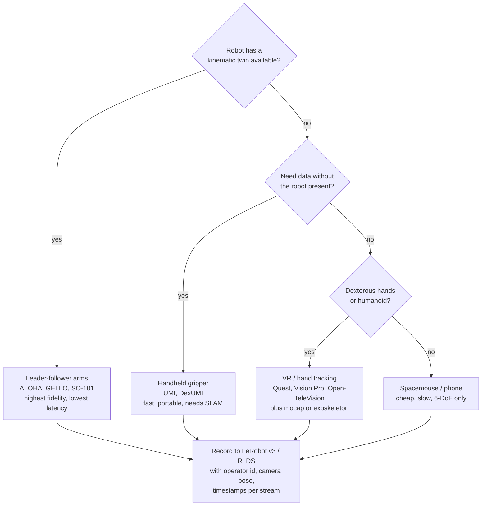

# Teleoperation and demonstration data collection

## What it is

Demonstration data collection is the process of producing paired (observation, action)
trajectories that an imitation-learning or VLA policy can be trained on. Three families
exist, differing in whether a robot is in the loop:

1. **Robot-in-the-loop teleoperation**: a human drives the real robot; the recorder logs
   the robot's own sensors and commanded actions. Interfaces: leader-follower arms,
   VR/AR headsets, spacemouse, keyboard, phone, exoskeletons.
2. **Robot-free handheld or wearable devices**: a human holds a gripper or wears an
   exoskeleton hand with a camera; poses come from visual-inertial SLAM; the robot is
   only used at deployment (UMI, DexUMI).
3. **Human video** (egocentric or third-person) with hand tracking, used as pretraining
   or co-training data; the embodiment gap is bridged by the model (EgoMimic, HumanPlus).

The output is stored in a dataset format (LeRobot v2/v3, RLDS, robomimic HDF5) with
episode boundaries, timestamps, camera video, proprioception, actions, and annotations
(language, success, sub-task segments).

## Why it matters in the field

- Policy quality is bounded by the data. ALOHA showed 80-90% success on fine bimanual
  tasks from "only 10 minutes worth of demonstrations" per task
  ([Zhao et al. 2023](https://arxiv.org/abs/2304.13705)); large models still spend most
  of their budget on data: π0 pre-trains on "over 10,000 hours of robot data" across
  7 robot configurations and 68 tasks, with open datasets (OXE, Bridge v2, DROID) only
  9.1% of the mixture ([Black et al. 2024](https://arxiv.org/html/2410.24164v1)).
- On a customer site the engineer usually cannot change the model; they can change how
  many demos are collected, by whom, with what interface, and how varied. That is the
  lever this note is about.
- Interface choice sets throughput and quality. UMI reports its handheld gripper is
  "more than 3x faster than teleoperation" on cup arrangement, and that a teleop
  baseline "failed to produce a single successful demonstration in 15 minutes" on
  dynamic tossing ([Chi et al. 2024](https://arxiv.org/html/2402.10329v3)).
- Diversity beats volume past a threshold: "the diversity of environments and objects
  is far more important than the absolute number of demonstrations; once the number of
  demonstrations per environment or object reaches a certain threshold, additional
  demonstrations have minimal effect" ([Lin et al. 2024](https://arxiv.org/abs/2410.18647)).

### Diagram: choosing a teleoperation interface

## Teleop interfaces comparison table

Costs are as reported by the linked source at publication time; treat as order of magnitude.

| Interface | Cost (reported) | Robots | Pros | Cons | Link |
|---|---|---|---|---|---|
| ALOHA / ALOHA 2 leader-follower (WidowX 250 leaders, ViperX 300 followers) | Whole system "within a 20k USD budget"; leader $3300, follower $5600 each | Bimanual Trossen arms; Mobile ALOHA adds a base for "under $32k" | Joint-space mapping gives precision and low latency near singularities; 50 Hz teleop and recording; 4 webcams | Leader must be kinematically matched to follower; no force feedback; operator fatigue | [ALOHA](https://arxiv.org/abs/2304.13705), [ALOHA 2](https://arxiv.org/abs/2405.02292), [Mobile ALOHA](https://arxiv.org/abs/2401.02117) |
| GELLO (3D-printed kinematic-twin leader with Dynamixels) | "Bill of materials ... less than $300" per device | Franka, UR5, xArm (open designs) | User study found it "more reliable and efficient" than VR controllers and 3D spacemouse; works for bimanual and contact-rich tasks | One leader per robot geometry; joint-space only; no haptics | [GELLO](https://arxiv.org/abs/2309.13037) |
| Koch v1.1 (LeRobot) | Follower "about $250", leader "about $180" (Alexander Koch repo) | Its own 6-DoF arm (Dynamixel XL430/XL330) | Cheapest full leader-follower pair with LeRobot drivers | Payload and repeatability are hobby grade | [low_cost_robot](https://github.com/AlexanderKoch-Koch/low_cost_robot), [LeRobot Koch docs](https://huggingface-lerobot.mintlify.app/robots/koch) |
| SO-100 / SO-101 (LeRobot, STS3215 bus servos) | Vendor reviews quote roughly $120 per arm BOM, $200-400 assembled (unverified against official BOM) | Its own arm; leader uses differently geared servos so it can be moved freely | Officially supported by `lerobot-record`; large community; single-cable bus servos | Same hobby-grade limits as Koch; calibration per arm | [SO-101 docs](https://huggingface.co/docs/lerobot/so101), [SO-ARM101 repo](https://github.com/horndeer/SO-ARM101-LeRobot) |
| Meta Quest 2/3 controllers (DROID setup) | Consumer headset | Franka Panda + Robotiq in DROID at 15 Hz | Cheap, portable, 6-DoF end-effector control, used by 50 collectors across 13 institutions | Task-space IK, no proprioceptive match, controller drift, headset fatigue | [DROID](https://arxiv.org/html/2403.12945v2) |
| VR controller (BridgeData V2) | Consumer headset | WidowX 250 at 5 Hz | Enabled 50k demos on a low-cost arm | Low control rate; jerky end-effector trajectories | [BridgeData V2](https://rail-berkeley.github.io/bridgedata/) |
| Open-TeleVision (Vision Pro or Quest 3, WebXR, stereo video) | Headset + ZED Mini | Unitree H1, Fourier GR-1 humanoids; active neck | Immersive stereo at 480x640 per eye, 60 Hz loop; head, wrist, hand poses streamed to a Vuer server; hand retargeting | Needs low-latency Wi-Fi; hand retargeting error; no haptics | [Open-TeleVision](https://arxiv.org/abs/2407.01512), [code](https://github.com/AaronYang1223/opentv) |
| Bunny-VisionPro (Vision Pro + low-cost haptics) | Headset + custom haptic devices | Bimanual dexterous hands | Higher success and shorter completion times than prior VR systems; demos improved downstream IL | Vision Pro price; app development in visionOS | [Bunny-VisionPro](https://arxiv.org/abs/2407.03162) |
| Apple Vision Pro Tracking Streamer (VisionProTeleop) | Headset | Any, via streamed wrist and finger poses | visionOS 2 hand tracking at ~90 Hz, no markers | Same as above | [Humanoid-Teleoperation repo](https://github.com/YanjieZe/Humanoid-Teleoperation) |
| 3Dconnexion SpaceMouse | ~$100-300 retail | UR5, Franka (Diffusion Policy real tasks at 10 Hz) | Cheap, robust, precise for slow 6-DoF Cartesian motion | Slow: RoboTurk user study mean 112.6 s vs 79.4 s VR; one axis at a time in practice | [Diffusion Policy](https://arxiv.org/abs/2303.04137), [RoboTurk](https://arxiv.org/pdf/1811.02790) |
| Keyboard | Free | Anything with a Cartesian controller | Zero setup, fine for debugging | Slowest interface in RoboTurk study (mean 151.5 s); unnatural demos | [RoboTurk](https://arxiv.org/pdf/1811.02790) |
| Phone (RoboTurk) | Consumer phone | Sawyer/Panda via cloud | 137.5 h of data from remote crowd workers; completion time on par with VR | Needs server infra; 6-DoF from phone IMU only | [RoboTurk](https://proceedings.mlr.press/v87/mandlekar18a.html) |
| UMI handheld gripper (robot-free) | "3D printed gripper $73", GoPro and accessories $298 | Deploys to UR5e, Franka, ARX (policy is hardware-agnostic) | 3 demonstrators collected 1400 demos in 12 person-hours across 30 locations; no robot needed on site | Pose from ORB-SLAM3 (6.1 mm / 3.5 deg ATE); SLAM fails on textureless scenes; kinematic feasibility not guaranteed; parallel-jaw only | [UMI](https://arxiv.org/html/2402.10329v3) |
| DexUMI wearable hand exoskeleton (robot-free) | Not stated in abstract | Two dexterous hand platforms | Human hand as interface; 86% average success | Per-hand exoskeleton design; visual inpainting needed for the wearer's hand | [DexUMI](https://arxiv.org/abs/2505.21864) |
| EgoMimic (Project Aria glasses, human video) | Aria glasses | Low-cost bimanual manipulator | "1 hour of additional hand data is significantly more valuable than 1 hour of additional robot data" in their tasks | Requires Aria glasses and alignment; embodiment gap | [EgoMimic](https://arxiv.org/abs/2410.24221) |
| HOMIE exoskeleton cockpit (humanoid) | "$500" | Humanoid arms + dexterous hands; RL lower body via pedal | Half the completion time of prior systems; Hall-sensor gloves 15+ DoF | Isomorphic arm per robot; lower body is autonomous, not teleoperated | [HOMIE](https://arxiv.org/abs/2502.13013) |
| HumanPlus shadowing (single RGB camera pose estimation) | Camera only | 33-DoF humanoid | Whole-body teleop with no wearable | Pose-estimation noise; RL low-level controller required | [HumanPlus](https://arxiv.org/abs/2406.10454) |
| TWIST2 (PICO 4U VR, mocap-free whole body) | Custom neck ~$250 plus headset | Humanoid | "100 demonstrations in 15 minutes with an almost 100% success rate" | Whole-body control stack is nontrivial | [TWIST2](https://arxiv.org/abs/2511.02832) |
| Motion-capture suit + VR (Tesla Optimus operators) | Not disclosed | Optimus | Whole-body human motion at scale | Press reports only: 50+ operators, 7+ hours moving per shift, height 1.70-1.80 m required, $25-48/h (unverified beyond press) | [heise](https://www.heise.de/en/news/Tesla-hires-over-50-people-for-Optimus-training-in-motion-capture-suits-9841052.html) |

Rule of thumb from the evidence: joint-space leader-follower for fine bimanual work;
VR for cheap, portable Cartesian control on a single arm; handheld UMI-style devices when
the robot is not available or in-the-wild diversity is the goal; spacemouse and keyboard
only for debugging or slow quasi-static tasks.

## Dataset formats and public datasets table

### Formats

| Format | Layout | Where used | Notes | Link |
|---|---|---|---|---|
| LeRobot v2.x | `meta/{info.json, stats.json, tasks.jsonl, episodes.jsonl}`, `data/chunk-XXX/episode_XXXXXX.parquet`, `videos/.../episode_XXXXXX.mp4` (one file per episode) | LeRobot < 0.4, most Hub datasets 2024-2025 | Simple to inspect; many small files hurt at scale | [v2.0 PR](https://github.com/huggingface/lerobot/pull/461) |
| LeRobot v3.0 | Same meta plus `meta/episodes/` chunked Parquet; `data/` and `videos/` shards hold many episodes; episode boundaries resolved via metadata | LeRobot >= 0.4; `StreamingLeRobotDataset` streams from the Hub | Must call `dataset.finalize()` before `push_to_hub()` or Parquet footers are missing; converter `convert_dataset_v21_to_v30` | [v3 docs](https://huggingface.co/docs/lerobot/en/lerobot-dataset-v3), [blog](https://huggingface.co/blog/lerobot-datasets-v3) |
| RLDS (TFDS) | TFRecord shards; dataset of episodes, each a `tf.data.Dataset` of steps with `observation`, `action`, `reward`, `discount`, `is_first/is_last/is_terminal` | Open X-Embodiment, RT-1/RT-2/RT-X, Octo, OpenVLA | Heavy TF dependency; excellent for streaming from GCS | [RLDS](https://github.com/google-research/rlds), [OXE repo](https://github.com/google-deepmind/open_x_embodiment) |
| robomimic HDF5 | One file; `data/demo_N/{obs/*, actions, states, dones, rewards}`, `env_args` attribute, `mask/` for splits | robomimic, MimicGen, robosuite | Random access is easy; large image datasets get big; single-writer | [robomimic docs](https://robomimic.github.io/docs/datasets/overview.html) |

### Public datasets

| Dataset | Size | Robots / collection | License | Format | Link |
|---|---|---|---|---|---|
| Open X-Embodiment (2023) | "1M+ real robot trajectories", 22 embodiments, 60 datasets from 34 labs, 527 skills; total TB size not stated on site (unverified) | Pooled existing datasets | Code Apache 2.0; other materials CC BY 4.0; per-dataset licenses in the spreadsheet | RLDS on `gs://gdm-robotics-open-x-embodiment/` | [site](https://robotics-transformer-x.github.io/), [repo](https://github.com/google-deepmind/open_x_embodiment) |
| DROID (2024) | 76k successful episodes, 350 h, 564 scenes, 86 tasks; ~16k additional episodes labeled not successful | Franka Panda + Robotiq, Quest 2 controllers, 15 Hz, 2x ZED 2 + wrist ZED Mini; 50 collectors, 13 institutions, 12 months | CC BY 4.0 | RLDS | [paper](https://arxiv.org/html/2403.12945v2), [site](https://droid-dataset.github.io/) |
| BridgeData V2 (2023) | 60,096 trajectories (50,365 teleop + 9,731 scripted), 24 environments, 13 skills | WidowX 250, VR controller, 5 Hz, mean 38 steps | CC BY 4.0 | JPEG zips; RLDS mirror in OXE | [site](https://rail-berkeley.github.io/bridgedata/), [paper](https://arxiv.org/abs/2308.12952) |
| RH20T (2023) | 110k+ sequences, 147 tasks, 42 skills; raw ~40 TB, resized ~5 TB RGB / ~10 TB RGBD | 7 robot configurations, F/T at 100 Hz, 8-10 global RGBD cameras, audio, paired human video | RH20T-C subset CC BY-SA 4.0; rest CC BY-NC 4.0 | Custom per-config archives (Gdrive/Baidu) | [site](https://rh20t.github.io/), [paper](https://arxiv.org/abs/2307.00595) |
| AgiBot World (2025) | 1,001,552 trajectories, 2976.4 h, 217 tasks, 87 skills, 106 scenes | 100+ robots in a 4000 m^2 facility; VR controller and motion-capture teleop | CC BY-NC-SA 4.0 | LeRobot-compatible on HF | [paper](https://arxiv.org/html/2503.06669v2), [HF](https://huggingface.co/datasets/agibot-world/AgiBotWorld-Beta) |
| ALOHA Unleashed (2024, not public) | 26k+ demos, 35 operators, 10 robots, 2 buildings, 8 months | ALOHA 2 | Not released | Internal | [paper](https://arxiv.org/html/2410.13126v1) |

## Data quality: what the evidence says

- **Operator skill mixes badly.** robomimic's Proficient-Human (200 demos, one operator)
  vs Multi-Human (300 demos, six operators split Worse/Okay/Better) datasets showed that
  "learning from large multi-human datasets can be challenging"; offline RL methods
  collapsed on MH data (BCQ 62.7%, CQL 22.0% on Can-MH vs BC-RNN 100%)
  ([Mandlekar et al. 2021](https://ai.stanford.edu/blog/robomimic/)).
- **Quality is about staying in distribution.** Belkhale, Cui, Sadigh formalize quality as
  low **action divergence** (expert vs learned policy mismatch) and appropriate
  **transition diversity** (noise for a given state-action); "a high quality dataset
  encourages the policy to stay in distribution at test time" and "state diversity is
  not always beneficial" ([NeurIPS 2023](https://arxiv.org/abs/2306.02437)).
- **Diversity of environments and objects beats raw count.** Power-law generalization in
  the number of environments and objects; four collectors in one afternoon sufficed for
  ~90% success in novel environments on two UMI tasks; 40k+ demos and 15k+ rollouts
  behind the claim ([Lin et al. 2024](https://arxiv.org/abs/2410.18647)).
- **Camera pose and spatial coverage matter for transfer.** MimicLabs (ICLR 2025):
  camera poses and spatial arrangements are key both for collection diversity and
  for retrieval alignment; retrieval from DROID beat baseline training by up to 70%
  ([Saxena et al. 2025](https://arxiv.org/abs/2506.13536)).
- **Human-in-the-loop verification at scale.** AgiBot World runs feasibility validation,
  local validity checks during collection, then annotator verification per episode;
  failure-recovery episodes are ~1% and are labeled with failure reason and timestamp
  ([AgiBot World](https://arxiv.org/html/2503.06669v2)). DROID kept ~16k not-successful
  episodes labeled rather than deleted ([DROID](https://arxiv.org/html/2403.12945v2)).
- **Protocols make non-experts good enough.** ALOHA Unleashed: "we create a protocol
  that allows non-expert users to provide high quality teleoperated demonstrations",
  with written task instructions before independent collection
  ([Zhao et al. 2024](https://arxiv.org/html/2410.13126v1)).
- **Co-training with cheap data.** Mobile ALOHA: co-training with static ALOHA data gave
  over 80% success with 50 demos per task, +34% absolute on average
  ([Fu et al. 2024](https://arxiv.org/abs/2401.02117)). XRZero-G0 (2026) reports
  robot-free data at a ~10:1 ratio to real-robot data matching real-only performance at
  1/20 the acquisition cost, with an 85% data validity rate from its QC pipeline
  ([XRZero-G0](https://arxiv.org/abs/2604.13001)); single-source, treat as promising.
- **Demonstrations as seeds for RL, not the ceiling.** DemoStart uses a handful of sim
  demos plus sparse reward with an auto-curriculum and reports needing 100x fewer sim
  demos than a from-real-data baseline, transferring zero-shot to a real three-finger
  hand ([Bauza et al. 2024](https://arxiv.org/abs/2409.06613)); the sequel ExoStart
  uses sensorized exoskeleton demos ([ExoStart](https://arxiv.org/abs/2506.11775)).

Throughput numbers seen in papers (episode time and reset overhead dominate):

| Source | Throughput |
|---|---|
| ALOHA | 8-14 s per episode; 50 demos = "10-20 minutes of data ... and 30-60 minutes in wall-clock time because of resets and teleoperator mistakes" |
| UMI | 1400 demos / 12 person-hours (~117 per person-hour), 30 locations |
| Data Scaling Laws (UMI) | 4 collectors, one afternoon, two tasks, ~90% novel-scene success |
| DROID | "up to 100 trajectories or about 20 minutes of interaction data per scene", 350 h over 12 months from 50 collectors |
| TWIST2 | 100 demos in 15 minutes (whole-body humanoid) |
| RoboTurk | 137.5 h of data in 22 h of system time via remote crowd |
| ALOHA Unleashed | 26k demos, 35 operators, 8 months, 10 robots |

## Setting up data collection for a new task: practical recipe

1. **Write the task card** (see `sops/data-collection-protocol.md`): initial-state
   distribution, success criterion, allowed variation, forbidden shortcuts. ALOHA Unleashed
   gave operators written protocols before independent collection.
2. **Pick the interface by task class.** Fine bimanual or contact-rich: leader-follower
   (ALOHA, GELLO, SO-101). Single-arm Cartesian, many sites: VR controller (DROID-style).
   Robot unavailable or need dozens of scenes: UMI handheld. Humanoid: exoskeleton or
   VR whole-body (HOMIE, TWIST2, Open-TeleVision).
3. **Fix rates and clocks.** Teleop and record at one rate (ALOHA 50 Hz; DROID 15 Hz;
   Diffusion Policy 10 Hz command interpolated to 125 Hz on UR5). Log wall-clock and
   monotonic timestamps per stream; soft-sync cameras (UMI tolerates 1/60 s).
4. **Calibrate and save extrinsics** for every camera and record the camera pose as a
   dataset feature; MimicLabs shows camera pose is a first-order diversity axis.
5. **Pilot 10 episodes with the best operator**, replay them, train a tiny policy (ACT
   or Diffusion Policy) on those 10 to smoke-test the pipeline end to end before scaling.
6. **Plan diversity, not count.** Budget episodes across scenes and objects first (Lin et
   al.), then demos per (scene, object) up to the plateau. DROID moved scene every
   ~100 trajectories.
7. **Choose the operator pool deliberately.** Prefer one or two proficient operators for
   fine tasks (robomimic PH vs MH). If many operators are needed, standardize with a
   protocol, a warm-up block, and per-operator statistics.
8. **Label at capture time**: language instruction (DROID collects up to three
   crowd-sourced instructions per episode in post; cheaper to capture one at record
   time), success flag, and failure reason with timestamp (AgiBot World).
9. **Keep failures, tag them.** Both DROID and AgiBot World retain failed and recovery
   episodes with labels.
10. **Store in LeRobot v3** (or RLDS if the training stack is TF). Call `finalize()`,
    push, then load with `StreamingLeRobotDataset` to verify the Hub copy.
11. **Write `DATASET.md`** with operator ids, interface, rates, calibration files, scene
    and object inventories, per-operator episode counts, and known issues.

## Practical gotchas

- Leader-follower joint mapping only works when leader and follower share kinematics;
  GELLO and SO-101 leaders are per-robot designs. Check calibration offsets after any
  servo replacement.
- VR controller drift and tracking loss produce discontinuities in end-effector targets;
  filter or reject episodes with pose jumps.
- Handheld UMI poses depend on SLAM: textureless walls, glass, and fast motion break
  ORB-SLAM3; UMI reports 6.1 mm / 3.5 deg ATE in good conditions. Also verify kinematic
  reachability of human trajectories on the deployment robot.
- Low control rates (BridgeData V2 at 5 Hz) limit dynamic tasks; pick the rate for the
  task, then never mix rates in one dataset (see SOP quality rules).
- Reset time and operator mistakes roughly triple wall-clock vs recorded time (ALOHA
  figures above). Plan staffing on wall-clock.
- Many-operator datasets need per-operator QA; robomimic shows mixed-quality human data
  hurts more than mixed-quality scripted data.
- LeRobot v2 to v3 migration changes file boundaries; scripts that glob
  `episode_XXXXXX.parquet` break. Forgetting `finalize()` corrupts Parquet footers.
- Licenses differ: AgiBot World is CC BY-NC-SA (no commercial use); RH20T is mostly
  CC BY-NC; DROID and BridgeData V2 are CC BY 4.0. Check before shipping a fine-tuned
  model to a customer.
- Crowd or vendor language labels arrive weeks later (DROID used tasq.ai); design the
  schema so annotations can be joined to episodes by id afterward.

## What a forward-deployed engineer must be able to do

- Assemble, calibrate, and troubleshoot at least one leader-follower pair (SO-101 or
  GELLO class) and one VR teleop stack in under a day on site.
- Run `lerobot-record` end to end: robot and teleop ports, camera config, fps, task
  string, streaming encoding, push to Hub, verify with streaming load.
- Convert between LeRobot v2/v3, RLDS, and robomimic HDF5, and read each format's
  metadata to audit episode counts, rates, and feature shapes.
- Design a diversity plan (scenes x objects x demos) and a per-operator QA sheet, and
  defend it with the scaling-law and robomimic evidence above.
- Write a task protocol document that a non-expert operator can follow (ALOHA Unleashed
  practice) and train a two-operator team in an hour.
- Compute dataset statistics (episode length, action mean/std, pose-jump rate, dropped
  frames) and reject or tag episodes automatically.
- Explain license constraints of public datasets to a customer.

## Open questions to learn hands-on

- How many demos per (scene, object) hit the plateau for our task classes on our arm?
  Lin et al. found it task-dependent; measure it on the first deployment.
- Does a spacemouse-collected dataset train a worse policy than a leader-follower one
  on the same task with the same episode count? GELLO's user study says collection is
  slower and less reliable; downstream policy effect on our tasks is untested here.
- What is the real wall-clock overhead of resets on a customer floor vs the ALOHA
  3x figure?
- Can UMI-style handheld data collected by customer staff (no robot) be co-trained at a
  10:1 ratio with a small on-robot set, as XRZero-G0 reports? Single-source claim.
- Which annotation is worth capturing live (success, failure reason) vs in post
  (language variants, sub-task segments via UVD-style automatic decomposition,
  [UVD](https://arxiv.org/abs/2310.08581))?
- Physical Intelligence, Figure, and 1X do not publish collection protocols; only
  aggregate numbers (π0: 10k h, 7 configs, 68 tasks; π0.5: ~400 h mobile manipulation
  plus static robots "placed into many other homes",
  [π0.5 blog](https://www.pi.website/blog/pi05)). Treat any specific operational claim
  about them as unverified.

## Related entries

- `library/topics/imitation-learning.md`
- `library/topics/vision-language-action-models.md`
- `library/topics/policy-evaluation.md`
- `library/tools/lerobot.md`
- `sops/data-collection-protocol.md`
- Reading list rows: ALOHA/ACT, UMI, Diffusion Policy, Open X-Embodiment, DROID, π0
  in `library/papers/00-reading-list.md`

## Sources

- ALOHA / ACT: https://arxiv.org/abs/2304.13705 (HTML: https://arxiv.org/html/2304.13705)
- ALOHA 2: https://arxiv.org/abs/2405.02292
- Mobile ALOHA: https://arxiv.org/abs/2401.02117
- ALOHA Unleashed: https://arxiv.org/html/2410.13126v1
- GELLO: https://arxiv.org/abs/2309.13037
- Koch v1.1 / low_cost_robot: https://github.com/AlexanderKoch-Koch/low_cost_robot ; https://huggingface-lerobot.mintlify.app/robots/koch
- SO-101: https://huggingface.co/docs/lerobot/so101 ; https://github.com/horndeer/SO-ARM101-LeRobot ; vendor pricing https://thinkrobotics.com/blogs/product-reviews-buying-guides/thinkrobotics-lerobot-so-101-6-axis-robotic-arm-review-ai-ready-open-source-and-built-for-learning
- Open-TeleVision: https://arxiv.org/abs/2407.01512 ; https://github.com/AaronYang1223/opentv
- Bunny-VisionPro: https://arxiv.org/abs/2407.03162
- Vision Pro teleop (Humanoid-Teleoperation): https://github.com/YanjieZe/Humanoid-Teleoperation ; visionOS 2 hand tracking rate https://www.uploadvr.com/visionos-2-improves-apple-vision-pro-hand-tracking/
- RoboTurk (interface study, phone teleop): https://arxiv.org/pdf/1811.02790 ; https://proceedings.mlr.press/v87/mandlekar18a.html
- Diffusion Policy (spacemouse at 10 Hz): https://arxiv.org/abs/2303.04137 ; https://github.com/real-stanford/diffusion_policy
- UMI: https://arxiv.org/abs/2402.10329 ; https://arxiv.org/html/2402.10329v3
- DexUMI: https://arxiv.org/abs/2505.21864
- EgoMimic: https://arxiv.org/abs/2410.24221
- HumanPlus: https://arxiv.org/abs/2406.10454
- HOMIE: https://arxiv.org/abs/2502.13013
- TWIST2: https://arxiv.org/abs/2511.02832
- Tesla Optimus operators (press): https://www.heise.de/en/news/Tesla-hires-over-50-people-for-Optimus-training-in-motion-capture-suits-9841052.html
- Data Quality in Imitation Learning: https://arxiv.org/abs/2306.02437
- robomimic study (PH vs MH): https://arxiv.org/abs/2108.03298 ; https://ai.stanford.edu/blog/robomimic/
- Data Scaling Laws in IL: https://arxiv.org/abs/2410.18647
- What Matters in Learning from Large-Scale Datasets (MimicLabs): https://arxiv.org/abs/2506.13536
- DemoStart: https://arxiv.org/abs/2409.06613 ; ExoStart: https://arxiv.org/abs/2506.11775
- XRZero-G0: https://arxiv.org/abs/2604.13001
- UVD (automatic sub-task decomposition): https://arxiv.org/abs/2310.08581
- ECoT (synthetic reasoning annotations): https://arxiv.org/pdf/2407.08693
- LeRobot dataset v3: https://huggingface.co/docs/lerobot/en/lerobot-dataset-v3 ; https://huggingface.co/blog/lerobot-datasets-v3 ; v2.0 PR https://github.com/huggingface/lerobot/pull/461
- RLDS: https://github.com/google-research/rlds
- robomimic HDF5: https://robomimic.github.io/docs/datasets/overview.html
- Open X-Embodiment: https://robotics-transformer-x.github.io/ ; https://github.com/google-deepmind/open_x_embodiment ; https://arxiv.org/abs/2310.08864
- DROID: https://arxiv.org/html/2403.12945v2 ; https://droid-dataset.github.io/
- BridgeData V2: https://rail-berkeley.github.io/bridgedata/ ; https://arxiv.org/abs/2308.12952
- RH20T: https://rh20t.github.io/ ; https://arxiv.org/abs/2307.00595
- AgiBot World: https://arxiv.org/html/2503.06669v2 ; https://huggingface.co/datasets/agibot-world/AgiBotWorld-Beta
- π0: https://arxiv.org/html/2410.24164v1 ; π0.5: https://www.pi.website/blog/pi05
