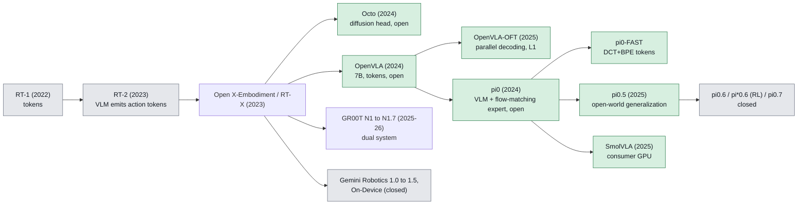

# Vision-Language-Action (VLA) models: state of the field, September 2026

Verification convention for this note: every number has a link in **Sources** or is marked
"(unverified)". "Open weights" means downloadable checkpoints, regardless of license terms.
Licenses matter for customer work, so they are stated per model where verified.

## What it is

A VLA is a policy that takes camera images + a language instruction (+ usually proprioception)
and outputs robot actions, built by starting from a pretrained vision-language model (VLM) and
teaching it to emit actions. The lineage started with RT-1 (a from-scratch 35M-parameter
transformer emitting 256-bin discretized actions at 3 Hz, trained on 130k episodes from 13
robots over 17 months, [RT-1]) and became "VLA" with RT-2, which co-fine-tuned a web-scale VLM so
that actions are just text tokens ([RT-2]). Three design axes define every model since:

1. **Backbone**: which VLM (PaliGemma, Llama-2 Prismatic, Eagle/Cosmos, Qwen-VL, Gemma, SmolVLM).
2. **Action head**: discrete tokens (autoregressive), diffusion, or flow matching, usually
   predicting an *action chunk* (a short horizon of future actions) rather than one step.
3. **Data**: Open X-Embodiment style public mixtures vs. proprietary teleop at 10k+ hours,
   plus web VQA co-training to keep language grounding.

## Why it matters in the field

- **Fewer demos per new task.** Gemini Robotics On-Device advertises adaptation with 50-100
  demonstrations ([GR-OnDevice]); SmolVLA reports pretraining lifts SO-100 success from 51.7%
  (task-only training) to 78.3% ([SmolVLA-blog]). Pretraining is what a small team cannot afford
  to replicate; fine-tuning is what they will actually do.
- **Language becomes the task interface.** A customer can re-task a cell by changing a prompt,
  *if* the model actually listens (see gotchas: LIBERO-Plus found models "largely ignore
  language instructions" [LIBERO-Plus]).
- **Cross-embodiment is starting to be real.** RT-X showed positive transfer across 22 robots
  ([OXE]); Gemini Robotics 1.5 reports tasks trained only on ALOHA 2 working on Apollo and
  bi-arm Franka ([GR-1.5]); π0.7 reports laundry folding on a bimanual UR5e with no UR5e laundry
  data ([pi07]). Evidence is still mostly from the labs that own the models.
- **The open/closed split is the practical question.** The strongest models (π0.6/π0.7, Gemini
  Robotics 1.5, Helix 02) are closed. The open ones (OpenVLA, π0/π0.5, GR00T N1.x, SmolVLA,
  LingBot-VLA) are what you can fine-tune and ship.

## Model lineage table

Abbreviations: AR = autoregressive discrete tokens; FM = flow matching; Diff = diffusion.
"Infer HW" is the smallest hardware the primary source names for inference.

| Model (date) | Backbone | Action head | Data | Open weights / license | Infer HW |
|---|---|---|---|---|---|
| RT-1 (Dec 2022) | EfficientNet + FiLM + TokenLearner + Transformer, 35M | AR, 256 bins/dim, 3 Hz | 130k episodes, 13 robots, 17 months, 700+ tasks | Code + weights released by Google (Apache-2.0 code; weights (unverified)) | Cloud/workstation GPU |
| RT-2 (Jul 2023) | PaLI-X 55B / PaLM-E 12B (from paper) | AR text tokens, co-fine-tuned with web VQA | RT-1 data + web vision-language | Closed | Multi-TPU cloud; 1-3 Hz (unverified) |
| Open X-Embodiment / RT-X (Oct 2023) | RT-1-X, RT-2-X on OXE | AR | 22 robots, 21 institutions, 527 skills, 160k tasks | Dataset open (per-dataset licenses); RT-1-X weights open, RT-2-X closed | -- |
| Octo (May 2024) | Transformer from scratch, 27M / 93M (paper) | Diff head, chunked | 800k OXE trajectories | Open, MIT (unverified) | Consumer GPU; fine-tunes "within a few hours" on consumer GPU |
| OpenVLA (Jun 2024) | Prismatic VLM: DINOv2+SigLIP fused, Llama-2 7B | AR, 256 bins/dim, 1 action/step | 970k OXE trajectories ("Magic Soup++") | Open; code MIT, weights under Llama-2 Community License | ~15 GB bf16 GPU; beat RT-2-X 55B by 16.5% abs. over 29 tasks |
| OpenVLA-OFT (Feb 2025) | OpenVLA 7B, + FiLM | Parallel decoding, chunk (8 sim / 25 ALOHA), L1 regression (diffusion variant equal) | LIBERO; ALOHA fine-tunes | Open (same as OpenVLA) | ~18 GB bf16 with 3 cams + FiLM; 26x throughput vs OpenVLA |
| π0 (Oct 2024; weights Feb 2025) | PaliGemma 3B + ~300M action expert | FM, chunked, up to 50 Hz | Proprietary teleop across 8 platforms + OXE; 10k+ hours (unverified) | Open in openpi, Apache-2.0 (+ Gemma terms) | >8 GB (RTX 4090) |
| π0-FAST (Jan 2025) | Same as π0 | AR over FAST tokens (DCT + BPE) | Same as π0 | Open in openpi | Same; slower decode than FM |
| π0.5 (Apr 2025; weights Sep 2025) | π0 base, larger data mix | AR subtask tokens (high level) + FM (low level) | Multi-robot + web + verbal-instruction data; ~100 training environments | Open in openpi | >8 GB inference; LoRA >22.5 GB; full >70 GB |
| π0.6 / π*0.6 (Nov 2025) | 5B VLM + action expert | FM (unverified: head type not stated in blog) | π0.5 data + RECAP RL from corrections and autonomous trials | Closed | -- |
| π0.7 (Apr 2026) | Not disclosed | VLA + world-model visual subgoals | Multi-robot, human data, autonomous episodes | Closed | -- |
| GR00T N1 (Mar 2025) | Eagle-2 VLM, 2B total (SigLIP2 + T5 encoders per card) | FM DiT with AdaLN | Real teleop + synthetic + human video ("data pyramid") | Open; NVIDIA One-Way Noncommercial | Ampere+/Jetson; tested A6000 |
| GR00T N1.5 (Jun 2025) | Eagle 2.5, frozen VLM, 3B | FM DiT, 16 layers; FLARE aux. objective | Adds DreamGen synthetic; 1.02M-sample sim set on HF | Open; NVIDIA license, non-commercial | Ampere+/Jetson |
| GR00T N1.6 (Dec 2025) | Cosmos-2B internal variant, top 4 VLM layers unfrozen, 3B | FM DiT, 32 layers, state-relative chunks | YAM, AgiBot Genie-1, Unitree G1 teleop + BEHAVIOR sim | Open on HF; license (unverified) | Ampere+/Jetson |
| GR00T N1.7 (Apr 2026) | Cosmos-Reason2-2B, 3B total | FM DiT, "Action Cascade" | 21.6M samples / 13 datasets; 20,854 h egocentric human video (EgoScale) | Open; NVIDIA Open Model License (commercial use permitted); code Apache-2.0 | 16 GB+ GPU; 27.9 ms / 35.9 Hz full pipeline on H100 TensorRT |
| Gemini Robotics (Mar 2025) | Gemini 2.0 | Not disclosed | ALOHA 2 primary; Franka bi-arm, Apollo | Closed (trusted testers) | Cloud |
| Gemini Robotics 1.5 / ER 1.5 (Sep 2025) | Gemini | Thinking-before-acting; Motion Transfer | ALOHA 2, Apollo, bi-arm Franka | VLA closed (partners); ER 1.5 public via Gemini API | Cloud |
| Gemini Robotics On-Device (Jun 2025) / On-Device 2 (Jul 2026) | Gemini Robotics 1.5 tech + on-device Gemma | Continuous numeric actions | Adapt with 50-100 demos | Closed; free trusted-tester SDK (MuJoCo eval + fine-tune) | Local robot compute |
| Figure Helix (Feb 2025) | S2: 7B open-weight VLM at 7-9 Hz; S1: 80M transformer at 200 Hz | Continuous 35-DoF | ~500 h teleop | Closed | Two embedded GPUs onboard |
| Figure Helix 02 (Jan 2026) | S0 10M @ 1 kHz, S1 @ 200 Hz, S2 semantic | Full-body joint targets | 1,000+ h retargeted human motion; 200k parallel sim envs | Closed | Onboard Figure 03 |
| SmolVLA (Jun 2025) | SmolVLM2-500M, half the layers used; 64 visual tokens/frame | FM expert ~100M, chunked, async inference | 487 LeRobot community datasets, <30k episodes, ~10M frames (SO-100) | Open; license (unverified, Apache-2.0 expected) | Single consumer GPU or CPU/MacBook |
| LingBot-VLA (Jan 2026) | Qwen2.5-VL-3B, ~4B total | Diffusion-style denoising | ~20k h real dual-arm teleop, 9 configurations | Open; code Apache-2.0, weights on HF | Depth-free and depth-distilled variants |

Other verifiable 2025-2026 open releases (not evaluated here): Galaxea G0-VLA (Sep 2025) and
G0Plus (Jan 2026) [Galaxea]; Unitree UnifoLM-VLA-0 (Jan 2026) [UnifoLM]; X-VLA (ICLR 2026)
[awesome-vla]; InternVLA-M1 (reported 95.9% LIBERO) [Nova]. GR00T-H is a surgical
post-train of N1.6/N1.7 [GR00T-H].

### Diagram: VLA lineage at a glance

Green nodes have open weights as of September 2026; grey nodes are closed.
GR00T is mixed (N1/N1.5 non-commercial, N1.7 commercial licence). See the
lineage table below for sources.

## Architecture patterns explained

**Discrete tokens (RT-1, RT-2, OpenVLA, π0-FAST).** Each action dimension (or a compressed
representation) is quantized into vocabulary tokens and decoded autoregressively by the LLM.
Pros: zero architectural change to the VLM, so web knowledge transfers cleanly (RT-2's whole
point). Cons: slow (one forward pass per token; OpenVLA emits one 7-D action per ~7 decode
steps), and naive per-dimension binning fails at high control rates because adjacent tokens are
nearly identical. FAST fixes the second problem by DCT-transforming the action chunk and BPE
compressing it, giving ~10x compression to 30-60 tokens per chunk and up to 5x faster training
than diffusion π0, but inference is still "significantly slower than flow matching" ([FAST]).

**Diffusion / flow matching heads (Octo, π0, GR00T, SmolVLA, LingBot).** A separate "action
expert" (300M in π0, ~100M in SmolVLA, 32-layer DiT in GR00T N1.6/N1.7) denoises a continuous
action chunk conditioned on VLM features. Pros: multimodal action distributions, smooth
high-rate chunks (π0 up to 50 Hz), a handful of denoising steps instead of dozens of token
decodes. Cons: an extra module to train, more hyperparameters (noise schedule, steps), and the
VLM's language grounding can be bypassed. Flow matching is the dominant 2026 choice.

**Regression with parallel decoding (OpenVLA-OFT).** Emit the whole chunk in one pass and train
with L1 loss. OFT found L1 matched a diffusion head on LIBERO and ALOHA while being 26x faster
than AR OpenVLA, and argued L1 is more robust to noisy demonstrations ([OFT]). Lesson: for a
high-capacity backbone, the head matters less than chunking + parallel decoding.

**Hierarchical / dual-system (π0.5, Helix, GR00T N1.7 "Action Cascade", Gemini Robotics 1.5
"thinking").** A slow semantic level (language subtask tokens, or a 7B VLM at 7-9 Hz) drives a
fast motor level (flow expert, or 80M transformer at 200 Hz). This is how long-horizon tasks
(Helix 02's 4-minute dishwasher run [Helix02]; π0.5 cleaning unseen homes [pi05]) are built.

Why it matters to you: the head decides your control loop. Token heads force low Hz and need
chunking tricks; diffusion/flow heads give smooth chunks but need Real-Time Chunking or async
inference to hide latency (see Deployment).

## Fine-tuning a VLA on a new robot: practical recipe

1. **Pick the model by license and GPU, not by benchmark.**
   - Commercial deployment, NVIDIA hardware: GR00T N1.7 (Open Model License, 16 GB inference,
     40 GB+ recommended for fine-tuning; H100/L40 optimal, A6000 works slower) [GR00T-repo].
   - Commercial, non-NVIDIA-locked: π0 / π0.5 via openpi (Apache-2.0 + Gemma terms) [openpi],
     or LingBot-VLA (Apache-2.0 code, weights on HF) [LingBot-repo]. SmolVLA if you must run on
     an RTX 3060-class GPU or CPU [SmolVLA-blog].
   - Research only: OpenVLA (Llama-2 license), GR00T N1/N1.5 (non-commercial).
2. **Data.** Start with 50-100 demonstrations per task; that is the number Google publishes for
   On-Device adaptation ([GR-OnDevice]) and the order LingBot used for post-training (130
   episodes per task on GM-100, [LingBot-arxiv]). Record in LeRobotDataset format; openpi,
   GR00T and LeRobot all ingest it. Include wrist cameras: OFT's ALOHA setup used third-person +
   2 wrist views + proprio ([OFT]). Match control frequency to the base model's training rate.
   Filter idle frames (openpi added an idle filter for DROID in Sep 2025, [openpi]).
3. **LoRA first, full fine-tune only with a reason.**
   - openpi: LoRA needs >22.5 GB (RTX 4090 works); full needs >70 GB (A100/H100) [openpi].
   - OpenVLA: LoRA on one 80 GB A100, ~27 GB minimum with smaller batch; full FT needs 8xA100
     FSDP [OpenVLA-repo]. OFT-style fine-tuning used 8x A100/H100 for 1-2 days [OFT].
   - GR00T N1.7: `launch_finetune.py --num-gpus 1`, 40 GB+ recommended; the repo ships 3-5
     episode demo datasets for smoke tests [GR00T-repo]. Watch `--state_dropout_prob` (default
     0.8): high state dropout forces vision reliance.
   - SmolVLA: `lerobot-train` example uses 100k steps, batch 4, on a single consumer GPU
     [SmolVLA-HF].
4. **Apply the OFT lessons regardless of model** ([OFT]): predict chunks (8-25 steps), decode in
   parallel, prefer continuous actions, use L1 or flow rather than AR tokens, and add FiLM-style
   language injection if the policy ignores instructions. OFT's 300-demo "put X into pot"
   experiment showed more data alone did not fix language grounding; FiLM did.
5. **Evaluate before deploying.** Write the protocol first (see `sops/experiment-protocol.md`).
   Report success over >=20 trials per condition with perturbations (object positions, lighting,
   distractors, paraphrased instructions). Compare against ACT or Diffusion Policy trained on
   the same demos; SmolVLA and OFT both report this baseline, and it is the honest bar.

## Deployment constraints

- **Latency budget.** GR00T N1.7 reports 27.9 ms end-to-end / 35.9 Hz on H100 with TensorRT
  [GR00T-N1.7-HF]; that is the best-case number for a 3B model. Expect 50-150 ms on a 4090-class
  GPU for 3B flow models (unverified) and much worse for 7B AR OpenVLA without OFT.
- **Action chunking hides latency but creates seams.** Executing a chunk of 8-50 actions while
  the next inference runs is standard. Physical Intelligence's Real-Time Chunking (RTC) treats the
  new chunk as inpainting conditioned on actions already committed and keeps performance flat up
  to +200 ms injected latency (>300 ms total), where synchronous inference dropped from 1.0 to
  0.2 tasks/min [RTC]. LeRobot's async inference stack does the simpler decoupling for SmolVLA
  (~30% faster episodes, 2x throughput in a cube-stacking test) [SmolVLA-blog], [LeRobot-async].
- **Edge vs. cloud.** Gemini Robotics On-Device exists because the flagship runs in the cloud;
  Helix runs on two embedded GPUs onboard [Helix]; GR00T targets Jetson AGX Thor/Orin
  [GR00T-repo]. For a customer cell, plan for an onboard 16-24 GB GPU (Orin/Thor or a
  workstation card) and a wired camera path; network hops eat the RTC budget.
- **Camera and rate must match training.** π0 was trained to emit actions at up to 50 Hz [pi0];
  OpenVLA-OFT ran ALOHA with chunk 25 [OFT]. Feeding a 10 Hz arm a 50 Hz chunk (or vice versa)
  without resampling is a common failure.
- **Safety wrapper is yours.** No VLA ships joint limits, force limits, or workspace fences.
  Put them in the controller layer, not in the prompt.

## Practical gotchas

- **LIBERO numbers are not capability.** LIBERO-PRO shows models above 90% on standard LIBERO
  collapse to 0.0% under object/initial-state/instruction/environment perturbations [LIBERO-PRO];
  LIBERO-Plus reports drops from 95% to below 30% under modest camera and start-pose changes,
  and that models "largely ignore language instructions" [LIBERO-Plus]. Treat any LIBERO-only
  result as a smoke test.
- **Trust these evaluations more:** double-blind pairwise real-robot comparisons (RoboArena: 7
  institutions, 600+ episodes, 7 policies, and its finding that VLAs specialize to the
  environments in their training data [RoboArena]); multi-platform real benchmarks with stated
  post-training data (GM-100: 4 platforms x 100 tasks x 130 episodes, where even the best model
  scores 17.3% full success [LingBot-repo]); lab reports that give trial counts and throughput
  (π*0.6 reports successes/hour per task [pistar06]).
- **Treat as marketing until a protocol appears:** demo videos, "longest autonomous task" claims,
  success rates without trial counts, and cross-embodiment claims without a held-out robot.
- **Language grounding decays during fine-tuning.** GR00T N1.5 froze the VLM specifically to
  protect language following [GR00T-N1.5]; N1.6 then unfroze only the top 4 layers [GR00T-N1.6].
  If your fine-tuned policy does the same thing regardless of prompt, this is why.
- **License traps.** OpenVLA weights inherit Llama-2 terms; GR00T N1/N1.5 are non-commercial;
  N1.7 is the first GR00T with a commercial license. Community datasets (SmolVLA's 487) carry
  their own terms. Check before a customer pilot.
- **Version churn.** GR00T went N1 -> N1.5 -> N1.6 -> N1.7 in 13 months, each changing the
  backbone; π went 0 -> 0.5 -> 0.6 -> 0.7 in 18 months with only 0/0.5 open. Pin checkpoints
  (`<model>-<dataset>-<git-sha>-<step>.pt` per `CLAUDE.md`) and record the base checkpoint hash.
- **Relative vs. absolute actions.** N1.6 switched to state-relative chunks and reports smoother
  actions [GR00T-N1.6]; mixing conventions between dataset and model is a silent bug.

## What a forward-deployed engineer must be able to do

1. Convert a customer's teleop recordings into LeRobotDataset with correct frame rates, camera
   names, and action conventions, and write the `DATASET.md`.
2. Run LoRA fine-tuning of π0.5 or GR00T N1.7 on one 80 GB GPU end-to-end, including the
   normalization statistics step, and know the VRAM line for each model in the table above.
3. Stand up an inference server with action chunking and either RTC or LeRobot-style async
   execution, and measure end-to-end latency at the robot, not at the GPU.
4. Design and run a perturbation evaluation (>=20 trials/condition) and present it next to an
   ACT/Diffusion Policy baseline, with trial counts.
5. Explain to a customer, in one page, which models are legally deployable for them and what
   hardware each requires.
6. Diagnose the three classic failures: ignores language (grounding lost), jitters at chunk
   boundaries (latency/chunking), works only at the demo positions (memorization).

## Open questions to learn hands-on

- How many demos does the fine-tune curve actually need on *our* arm: 20, 50, 100? Run the sweep.
- Does state-relative action prediction (GR00T N1.6 style) help on a low-repeatability arm?
- LoRA vs. full fine-tune on π0.5 with 100 demos: is the gap measurable at 20 trials/condition?
- RTC vs. simple async execution on a 100-200 ms inference budget: which one a customer can feel.
- Whether FAST-tokenized AR heads are worth revisiting for tasks where multimodality matters less
  than training cost.
- How much of a 3B model's language following survives 10k fine-tuning steps on a single task,
  and whether co-training with a slice of the pretraining mix prevents the collapse.

## Related entries

- `library/topics/imitation-learning.md` (ACT, Diffusion Policy baselines to compare against)
- `library/topics/policy-evaluation.md` (perturbation protocols, trial counts, RoboArena)
- `library/topics/teleoperation-and-data-collection.md` (LeRobotDataset, camera placement)
- `library/topics/sim-to-real.md` (DreamGen and synthetic data in GR00T)
- `library/topics/real-world-rl.md` (RECAP in π*0.6)
- `sops/experiment-protocol.md`, `sops/data-collection-protocol.md`

## Sources

- [RT-1] Brohan et al., RT-1, arXiv 2212.06817: https://arxiv.org/abs/2212.06817
- [RT-2] Brohan et al., RT-2, arXiv 2307.15818: https://arxiv.org/abs/2307.15818
- [OXE] Open X-Embodiment Collaboration, arXiv 2310.08864: https://arxiv.org/abs/2310.08864
- [Octo] Octo Model Team, arXiv 2405.12213: https://arxiv.org/abs/2405.12213
- [OpenVLA] Kim et al., arXiv 2406.09246: https://arxiv.org/abs/2406.09246
- [OpenVLA-repo] https://github.com/openvla/openvla
- [OFT] Kim et al., OpenVLA-OFT, arXiv 2502.19645: https://arxiv.org/abs/2502.19645 and https://openvla-oft.github.io/
- [pi0] Physical Intelligence, π0 blog: https://www.pi.website/blog/pi0 ; paper https://arxiv.org/abs/2410.24164
- [FAST] Physical Intelligence, FAST tokenizer: https://www.pi.website/research/fast ; HF `physical-intelligence/fast`
- [pi05] Physical Intelligence, π0.5: https://www.pi.website/blog/pi05
- [openpi] https://github.com/Physical-Intelligence/openpi ; release post https://www.pi.website/blog/openpi
- [RTC] Physical Intelligence, Real-Time Chunking: https://www.pi.website/research/real_time_chunking
- [pistar06] Physical Intelligence, π*0.6 and RECAP: https://www.pi.website/blog/pistar06 ; model card https://website.pi-asset.com/pi06star/PI06_model_card.pdf
- [pi07] Physical Intelligence, π0.7: https://www.pi.website/blog/pi07
- [GR00T-N1-HF] https://huggingface.co/nvidia/GR00T-N1-2B ; paper https://arxiv.org/abs/2503.14734
- [GR00T-N1.5] https://research.nvidia.com/labs/gear/gr00t-n1_5/ ; https://huggingface.co/nvidia/GR00T-N1.5-3B
- [GR00T-N1.6] https://research.nvidia.com/labs/gear/gr00t-n1_6/
- [GR00T-N1.7-HF] https://huggingface.co/nvidia/GR00T-N1.7-3B ; blog https://huggingface.co/blog/nvidia/gr00t-n1-7
- [GR00T-repo] https://github.com/Nvidia/Isaac-GR00T
- [GR00T-H] https://huggingface.co/nvidia/GR00T-H
- [GR] Gemini Robotics (Mar 2025): https://deepmind.google/blog/gemini-robotics-brings-ai-into-the-physical-world/
- [GR-1.5] Gemini Robotics 1.5 paper, arXiv 2510.03342: https://arxiv.org/abs/2510.03342 ; ER 1.5 API https://developers.googleblog.com/building-the-next-generation-of-physical-agents-with-gemini-robotics-er-15/
- [GR-OnDevice] https://deepmind.google/blog/gemini-robotics-on-device-brings-ai-to-local-robotic-devices/ ; SDK https://github.com/google-deepmind/gemini-robotics-sdk
- [GR-OnDevice2] Model card: https://deepmind.google/models/model-cards/gemini-robotics-on-device-2/
- [Helix] Figure, Helix (Feb 2025): https://www.figure.ai/news/helix
- [Helix02] Figure, Helix 02 (Jan 2026): https://www.figure.ai/news/helix-02
- [SmolVLA-blog] https://huggingface.co/blog/smolvla ; paper https://arxiv.org/abs/2506.01844
- [SmolVLA-HF] https://huggingface.co/lerobot/smolvla_base
- [LeRobot-async] https://huggingface.co/docs/lerobot/async
- [LingBot-arxiv] Robbyant, LingBot-VLA, arXiv 2601.18692: https://arxiv.org/abs/2601.18692
- [LingBot-repo] https://github.com/Robbyant/lingbot-vla
- [Galaxea] https://github.com/OpenGalaxea/GalaxeaVLA
- [UnifoLM] https://github.com/unitreerobotics/unifolm-vla
- [awesome-vla] https://github.com/miracle-techlink/awesome-vla-2026
- [Nova] Secondary source for InternVLA-M1 numbers (not primary; treat as unverified): https://novaaiops.com/blog/robotics-foundation-models
- [RoboArena] Atreya et al., arXiv 2506.18123: https://arxiv.org/abs/2506.18123
- [LIBERO-PRO] arXiv 2510.03827: https://arxiv.org/abs/2510.03827
- [LIBERO-Plus] arXiv 2510.13626: https://arxiv.org/abs/2510.13626 ; https://github.com/sylvestf/LIBERO-plus
